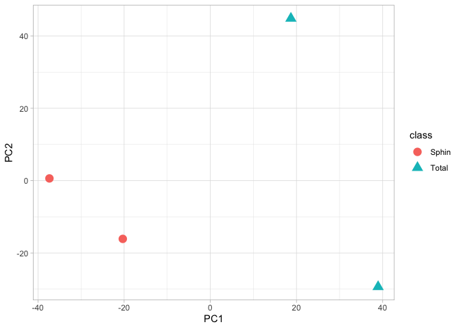
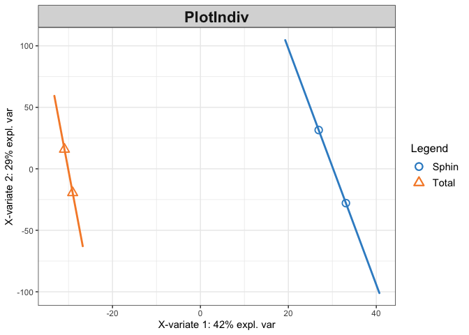

The Hitchhiker’s Guide to untargeted lipidomics analysis: Practical
guidelines
================
D. Smirnov, P. Mazin, M. Osetrova, E. Stekolshchikova, E. Khrameeva
8/18/2021

## Introduction

Here we present step-by-step guide to bioinformatic analysis of
untargeted LS-MS lipidomic data. This manual reproduces the key steps
described in the manuscript:

-   Data importing

-   Lipid signal quantification (peak peaking, peak alignment, peak
    grouping and abundance quantification)

-   Filtering and normalization

-   Visualization

## Package import

Loading the packages required for analysis

``` r
library(xcms)
library(ggplot2)
library(DT)
library(IPO)
library(mixOmics)
```

## Data import

We will demonstrate the key concepts of LC-MS untargeted lipidomic
analysis on the example of human fibroblasts dataset (ST001691 study
from <https://www.metabolomicsworkbench.org/>). The raw files converted
into the .mzXML format can be downloaded in the current directory using
the following code:

``` r
#url <- "http://arcuda.skoltech.ru/~d.smirnov/sampledata.tar.gz"
#download.file(url, destfile = 'sampledata.tar.gz')
#untar('sampledata.tar.gz')
```

For convenience, raw MS files located in the `sampledata/` are organized
into the two subfolders according the treatment groups.

``` r
mzfiles <- list.files('sampledata/', recursive = TRUE, full.names = TRUE, pattern = '.mzXML')
group <- unlist(lapply(strsplit(mzfiles,"/"), function (x) x[[3]]))
pd <- data.frame(sample_name = sub(basename(mzfiles), pattern = ".mzXML", replacement = "", fixed = TRUE), 
                 sample_group = group, 
                 stringsAsFactors = FALSE)

knitr::kable(pd)
```

| sample\_name       | sample\_group |
|:-------------------|:--------------|
| Fibroblast\_Sphin1 | Sphin         |
| Fibroblast\_Sphin2 | Sphin         |
| Fibroblast\_Total1 | Total         |
| Fibroblast\_Total2 | Total         |

Now .mzXML files can be imported via `readMSData` function

``` r
raw_data <- readMSData(files = mzfiles, 
                       pdata = new("NAnnotatedDataFrame", pd), 
                       mode = "onDisk", 
                       msLevel = 1, 
                       verbose = T, 
                       centroided = T)
```

    ## Reading 584 spectra from file Fibroblast_Sphin1.mzXML

    ## Reading 584 spectra from file Fibroblast_Sphin2.mzXML

    ## Reading 584 spectra from file Fibroblast_Total1.mzXML

    ## Reading 584 spectra from file Fibroblast_Total2.mzXML

## Peak picking

Feature detection `CentWave` algorithm based on continuous wavelet
transformation allows to distinguish lipid peaks from background noise.
To perform peak calling we need to set up CentWave parameters first.

``` r
cwp <- CentWaveParam(peakwidth = c(9.5, 36),
                     ppm = 11.5,
                     noise = 0, 
                     snthresh = 10, 
                     mzdiff = -0.001, 
                     prefilter = c(3, 100), 
                     mzCenterFun = "wMean", 
                     integrate = 1, 
                     fitgauss = FALSE)
```

Once the parameters are set one can proceed to chromatographic peak
detection using `findChromPeaks` function.

``` r
xset <- findChromPeaks(raw_data, param = cwp)
```

## Peak alignment

``` r
arp <- ObiwarpParam(distFun = "cor_opt", 
                    binSize = 1, 
                    response = 1, 
                    gapInit = 0.32, 
                    gapExtend = 2.688, 
                    factorDiag = 2, 
                    factorGap = 1,
                    localAlignment = FALSE)
```

``` r
xset <- adjustRtime(xset, param = arp)
```

## Peak grouping

``` r
pdp <- PeakDensityParam(sampleGroups = xset$sample_group, 
                        bw = 0.879999999999999, 
                        binSize = 0.02412, 
                        minFraction = 0.000001, 
                        minSamples = 1, 
                        maxFeatures = 50)
```

``` r
xset <- groupChromPeaks(xset, param = pdp)
```

    ## Processing 123943 mz slices ... OK

## Selection of parameters for peak picking, alignment, and grouping

In the code sections above we provide parameters optimized for

``` r
peakpickingParameters <- getDefaultXcmsSetStartingParams('centWave')
peakpickingParameters$min_peakwidth = c(0,10)
peakpickingParameters$max_peakwidth = c(10,30)
peakpickingParameters$ppm = c(0,10)
```

Please note that optimizing peak calling parameters with
`optimizeXcmsSet` function is a quite computationally intensive
operation. For simplicity and saving time, in the sections above we used
already optimized parameters but …

``` r
#resultPeakpicking <- optimizeXcmsSet(files = mzfiles, 
#                                     params = peakpickingParameters, 
#                                     nSlaves = 0, 
#                                     subdir = NULL)
```

``` r
#optimizedXcmsSetObject <- resultPeakpicking$best_settings$xset
```

``` r
#retcorGroupParameters <- getDefaultRetGroupStartingParams()
#resultRetcorGroup <- optimizeRetGroup(xset = optimizedXcmsSetObject, 
#                                      params = retcorGroupParameters,
#                                      nSlaves = 0,
#                                      subdir = NULL)

#writeRScript(resultPeakpicking$best_settings$parameters, 
#             resultRetcorGroup$best_settings, 1)
```

## Imputation of missing values

Unfortunately, peak peaking algorithm may produces a sufficient numbers
of NaNs for those samples in which it wasn’t able to identify MS peaks.
We will try to impute missing chromatographic peaks within samples using
`fillChromPeaks` function.

``` r
xset <- fillChromPeaks(xset)
```

    ## Defining peak areas for filling-in .... OK
    ## Start integrating peak areas from original files

## Data export

``` r
pks <- chromPeaks(xset)
grs <- featureDefinitions(xset)
mtx <- featureValues(xset, method="maxint", value="into", filled=T) 

knitr::kable(head(mtx))
```

|        | Fibroblast\_Sphin1.mzXML | Fibroblast\_Sphin2.mzXML | Fibroblast\_Total1.mzXML | Fibroblast\_Total2.mzXML |
|:-------|-------------------------:|-------------------------:|-------------------------:|-------------------------:|
| FT0001 |               1256154.43 |                913245.81 |                       NA |                       NA |
| FT0002 |                 58801.24 |                 86856.81 |                861224.11 |                 33162.95 |
| FT0003 |                410858.05 |                134526.55 |                 35017.65 |                       NA |
| FT0004 |               9202572.22 |              11043406.80 |              12731575.77 |               2247813.75 |
| FT0005 |                 93077.08 |                166715.26 |                       NA |                       NA |
| FT0006 |                113533.52 |                 59536.56 |                       NA |                       NA |

## Filtering of peaks

The code below removes all peaks that possess more than 30% of NaNs
across samples.

``` r
th <- 0.3
peaks.nas <- apply(mtx, 1, function (x) sum(is.na(x)))
mtx <- mtx[(peaks.nas/ncol(mtx)) < th, ]
```

## Normalization

## Annotation

We will load the

``` r
source("src/rt-mz.annotator.R")
```

``` r
grs <- as.data.frame(grs)
grs.short <- dplyr::select(grs, mzmed, rtmed)
grs.short$id <- paste(round(grs.short$mzmed, 3), round(grs.short$rtmed, 3), sep = '_')
grs.short <- grs.short[,c(3,1,2)]
colnames(grs.short) <- c('id', 'mz', 'rt')
knitr::kable(head(grs.short))
```

|        | id               |       mz |        rt |
|:-------|:-----------------|---------:|----------:|
| FT0001 | 200.151\_216.732 | 200.1507 | 216.73242 |
| FT0002 | 200.128\_66.129  | 200.1278 |  66.12939 |
| FT0003 | 200.146\_181.864 | 200.1455 | 181.86352 |
| FT0004 | 200.165\_58.722  | 200.1646 |  58.72220 |
| FT0005 | 200.176\_97.003  | 200.1758 |  97.00257 |
| FT0006 | 200.176\_254.191 | 200.1759 | 254.19108 |

    ##  H 1 6242       H 2 6242       H 3 6242       H 4 6242       H 5 6242       H 6 6242       H 7 6242       H 8 6242       H 9 6242       H 10 6242       H 11 6242       H 12 6242       H 13 6242       H 14 6242       H 15 6242       H 16 6242       H 17 6242       H 18 6242       H 19 6242       H 20 6242       H 21 6242       H 22 6242       H 23 6242       H 24 6242       H 25 6242       H 26 6242       H 27 6242       H 28 6242       H 29 6242       H 30 6242       H 31 6242       H 32 6242       H 33 6242       H 34 6242       H 35 6242       H 36 6242       H 37 6242       H 38 6242       H 39 6242       H 40 6242       H 41 6242       H 42 6242       H 43 6242       H 44 6242       H 45 6242       H 46 6242       H 47 6242       H 48 6242       H 49 6242       H 50 6242       H 51 6242       H 52 6242       H 53 6242       H 54 6242       H 55 6242       H 56 6242       H 57 6242       H 58 6242       H 59 6242       H 60 6242       H 61 6242       H 62 6242       H 63 6242       H 64 6242       H 65 6242       H 66 6242       H 67 6242       H 68 6242       H 69 6242       H 70 6242       H 71 6242       H 72 6242       H 73 6242       H 74 6242       H 75 6242       H 76 6242       H 77 6242       H 78 6242       H 79 6242       H 80 6242       H 81 6242       H 82 6242       H 83 6242       H 84 6242       H 85 6242       H 86 6242       H 87 6242       H 88 6242       H 89 6242       H 90 6242       H 91 6242       H 92 6242       H 93 6242       H 94 6242       H 95 6242       H 96 6242       H 97 6242       H 98 6242       H 99 6242       H 100 6242       H 101 6242       H 102 6242       H 103 6242       H 104 6242       H 105 6242       H 106 6242       H 107 6242       H 108 6242       H 109 6242       H 110 6242       H 111 6242       H 112 6242       H 113 6242       H 114 6242       H 115 6242       H 116 6242       H 117 6242       H 118 6242       H 119 6242       H 120 6242       H 121 6242       H 122 6242       H 123 6242       H 124 6242       H 125 6242       H 126 6242       H 127 6242       H 128 6242       H 129 6242       H 130 6242       H 131 6242       H 132 6242       H 133 6242       H 134 6242       H 135 6242       H 136 6242       H 137 6242       H 138 6242       H 139 6242       H 140 6242       H 141 6242       H 142 6242       H 143 6242       H 144 6242       H 145 6242       H 146 6242       H 147 6242       H 148 6242       H 149 6242       H 150 6242       H 151 6242       H 152 6242       H 153 6242       H 154 6242       H 155 6242       H 156 6242       H 157 6242       H 158 6242       H 159 6242       H 160 6242       H 161 6242       H 162 6242       H 163 6242       H 164 6242       H 165 6242       H 166 6242       H 167 6242       H 168 6242       H 169 6242       H 170 6242       H 171 6242       H 172 6242       H 173 6242       H 174 6242       H 175 6242       H 176 6242       H 177 6242       H 178 6242       H 179 6242       H 180 6242       H 181 6242       H 182 6242       H 183 6242       H 184 6242       H 185 6242       H 186 6242       H 187 6242       H 188 6242       H 189 6242       H 190 6242       H 191 6242       H 192 6242       H 193 6242       H 194 6242       H 195 6242       H 196 6242       H 197 6242       H 198 6242       H 199 6242       H 200 6242       H 201 6242       H 202 6242       H 203 6242       H 204 6242       H 205 6242       H 206 6242       H 207 6242       H 208 6242       H 209 6242       H 210 6242       H 211 6242       H 212 6242       H 213 6242       H 214 6242       H 215 6242       H 216 6242       H 217 6242       H 218 6242       H 219 6242       H 220 6242       H 221 6242       H 222 6242       H 223 6242       H 224 6242       H 225 6242       H 226 6242       H 227 6242       H 228 6242       H 229 6242       H 230 6242       H 231 6242       H 232 6242       H 233 6242       H 234 6242       H 235 6242       H 236 6242       H 237 6242       H 238 6242       H 239 6242       H 240 6242       H 241 6242       H 242 6242       H 243 6242       H 244 6242       H 245 6242       H 246 6242       H 247 6242       H 248 6242       H 249 6242       H 250 6242       H 251 6242       H 252 6242       H 253 6242       H 254 6242       H 255 6242       H 256 6242       H 257 6242       H 258 6242       H 259 6242       H 260 6242       H 261 6242       H 262 6242       H 263 6242       H 264 6242       H 265 6242       H 266 6242       H 267 6242       H 268 6242       H 269 6242       H 270 6242       H 271 6242       H 272 6242       H 273 6242       H 274 6242       H 275 6242       H 276 6242       H 277 6242       H 278 6242       H 279 6242       H 280 6242       H 281 6242       H 282 6242       H 283 6242       H 284 6242       H 285 6242       H 286 6242       H 287 6242       H 288 6242       H 289 6242       H 290 6242       H 291 6242       H 292 6242       H 293 6242       H 294 6242       H 295 6242       H 296 6242       H 297 6242       H 298 6242       H 299 6242       H 300 6242       H 301 6242       H 302 6242       H 303 6242       H 304 6242       H 305 6242       H 306 6242       H 307 6242       H 308 6242       H 309 6242       H 310 6242       H 311 6242       H 312 6242       H 313 6242       H 314 6242       H 315 6242       H 316 6242       H 317 6242       H 318 6242       H 319 6242       H 320 6242       H 321 6242       H 322 6242       H 323 6242       H 324 6242       H 325 6242       H 326 6242       H 327 6242       H 328 6242       H 329 6242       H 330 6242       H 331 6242       H 332 6242       H 333 6242       H 334 6242       H 335 6242       H 336 6242       H 337 6242       H 338 6242       H 339 6242       H 340 6242       H 341 6242       H 342 6242       H 343 6242       H 344 6242       H 345 6242       H 346 6242       H 347 6242       H 348 6242       H 349 6242       H 350 6242       H 351 6242       H 352 6242       H 353 6242       H 354 6242       H 355 6242       H 356 6242       H 357 6242       H 358 6242       H 359 6242       H 360 6242       H 361 6242       H 362 6242       H 363 6242       H 364 6242       H 365 6242       H 366 6242       H 367 6242       H 368 6242       H 369 6242       H 370 6242       H 371 6242       H 372 6242       H 373 6242       H 374 6242       H 375 6242       H 376 6242       H 377 6242       H 378 6242       H 379 6242       H 380 6242       H 381 6242       H 382 6242       H 383 6242       H 384 6242       H 385 6242       H 386 6242       H 387 6242       H 388 6242       H 389 6242       H 390 6242       H 391 6242       H 392 6242       H 393 6242       H 394 6242       H 395 6242       H 396 6242       H 397 6242       H 398 6242       H 399 6242       H 400 6242       H 401 6242       H 402 6242       H 403 6242       H 404 6242       H 405 6242       H 406 6242       H 407 6242       H 408 6242       H 409 6242       H 410 6242       H 411 6242       H 412 6242       H 413 6242       H 414 6242       H 415 6242       H 416 6242       H 417 6242       H 418 6242       H 419 6242       H 420 6242       H 421 6242       H 422 6242       H 423 6242       H 424 6242       H 425 6242       H 426 6242       H 427 6242       H 428 6242       H 429 6242       H 430 6242       H 431 6242       H 432 6242       H 433 6242       H 434 6242       H 435 6242       H 436 6242       H 437 6242       H 438 6242       H 439 6242       H 440 6242       H 441 6242       H 442 6242       H 443 6242       H 444 6242       H 445 6242       H 446 6242       H 447 6242       H 448 6242       H 449 6242       H 450 6242       H 451 6242       H 452 6242       H 453 6242       H 454 6242       H 455 6242       H 456 6242       H 457 6242       H 458 6242       H 459 6242       H 460 6242       H 461 6242       H 462 6242       H 463 6242       H 464 6242       H 465 6242       H 466 6242       H 467 6242       H 468 6242       H 469 6242       H 470 6242       H 471 6242       H 472 6242       H 473 6242       H 474 6242       H 475 6242       H 476 6242       H 477 6242       H 478 6242       H 479 6242       H 480 6242       H 481 6242       H 482 6242       H 483 6242       H 484 6242       H 485 6242       H 486 6242       H 487 6242       H 488 6242       H 489 6242       H 490 6242       H 491 6242       H 492 6242       H 493 6242       H 494 6242       H 495 6242       H 496 6242       H 497 6242       H 498 6242       H 499 6242       H 500 6242       H 501 6242       H 502 6242       H 503 6242       H 504 6242       H 505 6242       H 506 6242       H 507 6242       H 508 6242       H 509 6242       H 510 6242       H 511 6242       H 512 6242       H 513 6242       H 514 6242       H 515 6242       H 516 6242       H 517 6242       H 518 6242       H 519 6242       H 520 6242       H 521 6242       H 522 6242       H 523 6242       H 524 6242       H 525 6242       H 526 6242       H 527 6242       H 528 6242       H 529 6242       H 530 6242       H 531 6242       H 532 6242       H 533 6242       H 534 6242       H 535 6242       H 536 6242       H 537 6242       H 538 6242       H 539 6242       H 540 6242       H 541 6242       H 542 6242       H 543 6242       H 544 6242       H 545 6242       H 546 6242       H 547 6242       H 548 6242       H 549 6242       H 550 6242       H 551 6242       H 552 6242       H 553 6242       H 554 6242       H 555 6242       H 556 6242       H 557 6242       H 558 6242       H 559 6242       H 560 6242       H 561 6242       H 562 6242       H 563 6242       H 564 6242       H 565 6242       H 566 6242       H 567 6242       H 568 6242       H 569 6242       H 570 6242       H 571 6242       H 572 6242       H 573 6242       H 574 6242       H 575 6242       H 576 6242       H 577 6242       H 578 6242       H 579 6242       H 580 6242       H 581 6242       H 582 6242       H 583 6242       H 584 6242       H 585 6242       H 586 6242       H 587 6242       H 588 6242       H 589 6242       H 590 6242       H 591 6242       H 592 6242       H 593 6242       H 594 6242       H 595 6242       H 596 6242       H 597 6242       H 598 6242       H 599 6242       H 600 6242       H 601 6242       H 602 6242       H 603 6242       H 604 6242       H 605 6242       H 606 6242       H 607 6242       H 608 6242       H 609 6242       H 610 6242       H 611 6242       H 612 6242       H 613 6242       H 614 6242       H 615 6242       H 616 6242       H 617 6242       H 618 6242       H 619 6242       H 620 6242       H 621 6242       H 622 6242       H 623 6242       H 624 6242       H 625 6242       H 626 6242       H 627 6242       H 628 6242       H 629 6242       H 630 6242       H 631 6242       H 632 6242       H 633 6242       H 634 6242       H 635 6242       H 636 6242       H 637 6242       H 638 6242       H 639 6242       H 640 6242       H 641 6242       H 642 6242       H 643 6242       H 644 6242       H 645 6242       H 646 6242       H 647 6242       H 648 6242       H 649 6242       H 650 6242       H 651 6242       H 652 6242       H 653 6242       H 654 6242       H 655 6242       H 656 6242       H 657 6242       H 658 6242       H 659 6242       H 660 6242       H 661 6242       H 662 6242       H 663 6242       H 664 6242       H 665 6242       H 666 6242       H 667 6242       H 668 6242       H 669 6242       H 670 6242       H 671 6242       H 672 6242       H 673 6242       H 674 6242       H 675 6242       H 676 6242       H 677 6242       H 678 6242       H 679 6242       H 680 6242       H 681 6242       H 682 6242       H 683 6242       H 684 6242       H 685 6242       H 686 6242       H 687 6242       H 688 6242       H 689 6242       H 690 6242       H 691 6242       H 692 6242       H 693 6242       H 694 6242       H 695 6242       H 696 6242       H 697 6242       H 698 6242       H 699 6242       H 700 6242       H 701 6242       H 702 6242       H 703 6242       H 704 6242       H 705 6242       H 706 6242       H 707 6242       H 708 6242       H 709 6242       H 710 6242       H 711 6242       H 712 6242       H 713 6242       H 714 6242       H 715 6242       H 716 6242       H 717 6242       H 718 6242       H 719 6242       H 720 6242       H 721 6242       H 722 6242       H 723 6242       H 724 6242       H 725 6242       H 726 6242       H 727 6242       H 728 6242       H 729 6242       H 730 6242       H 731 6242       H 732 6242       H 733 6242       H 734 6242       H 735 6242       H 736 6242       H 737 6242       H 738 6242       H 739 6242       H 740 6242       H 741 6242       H 742 6242       H 743 6242       H 744 6242       H 745 6242       H 746 6242       H 747 6242       H 748 6242       H 749 6242       H 750 6242       H 751 6242       H 752 6242       H 753 6242       H 754 6242       H 755 6242       H 756 6242       H 757 6242       H 758 6242       H 759 6242       H 760 6242       H 761 6242       H 762 6242       H 763 6242       H 764 6242       H 765 6242       H 766 6242       H 767 6242       H 768 6242       H 769 6242       H 770 6242       H 771 6242       H 772 6242       H 773 6242       H 774 6242       H 775 6242       H 776 6242       H 777 6242       H 778 6242       H 779 6242       H 780 6242       H 781 6242       H 782 6242       H 783 6242       H 784 6242       H 785 6242       H 786 6242       H 787 6242       H 788 6242       H 789 6242       H 790 6242       H 791 6242       H 792 6242       H 793 6242       H 794 6242       H 795 6242       H 796 6242       H 797 6242       H 798 6242       H 799 6242       H 800 6242       H 801 6242       H 802 6242       H 803 6242       H 804 6242       H 805 6242       H 806 6242       H 807 6242       H 808 6242       H 809 6242       H 810 6242       H 811 6242       H 812 6242       H 813 6242       H 814 6242       H 815 6242       H 816 6242       H 817 6242       H 818 6242       H 819 6242       H 820 6242       H 821 6242       H 822 6242       H 823 6242       H 824 6242       H 825 6242       H 826 6242       H 827 6242       H 828 6242       H 829 6242       H 830 6242       H 831 6242       H 832 6242       H 833 6242       H 834 6242       H 835 6242       H 836 6242       H 837 6242       H 838 6242       H 839 6242       H 840 6242       H 841 6242       H 842 6242       H 843 6242       H 844 6242       H 845 6242       H 846 6242       H 847 6242       H 848 6242       H 849 6242       H 850 6242       H 851 6242       H 852 6242       H 853 6242       H 854 6242       H 855 6242       H 856 6242       H 857 6242       H 858 6242       H 859 6242       H 860 6242       H 861 6242       H 862 6242       H 863 6242       H 864 6242       H 865 6242       H 866 6242       H 867 6242       H 868 6242       H 869 6242       H 870 6242       H 871 6242       H 872 6242       H 873 6242       H 874 6242       H 875 6242       H 876 6242       H 877 6242       H 878 6242       H 879 6242       H 880 6242       H 881 6242       H 882 6242       H 883 6242       H 884 6242       H 885 6242       H 886 6242       H 887 6242       H 888 6242       H 889 6242       H 890 6242       H 891 6242       H 892 6242       H 893 6242       H 894 6242       H 895 6242       H 896 6242       H 897 6242       H 898 6242       H 899 6242       H 900 6242       H 901 6242       H 902 6242       H 903 6242       H 904 6242       H 905 6242       H 906 6242       H 907 6242       H 908 6242       H 909 6242       H 910 6242       H 911 6242       H 912 6242       H 913 6242       H 914 6242       H 915 6242       H 916 6242       H 917 6242       H 918 6242       H 919 6242       H 920 6242       H 921 6242       H 922 6242       H 923 6242       H 924 6242       H 925 6242       H 926 6242       H 927 6242       H 928 6242       H 929 6242       H 930 6242       H 931 6242       H 932 6242       H 933 6242       H 934 6242       H 935 6242       H 936 6242       H 937 6242       H 938 6242       H 939 6242       H 940 6242       H 941 6242       H 942 6242       H 943 6242       H 944 6242       H 945 6242       H 946 6242       H 947 6242       H 948 6242       H 949 6242       H 950 6242       H 951 6242       H 952 6242       H 953 6242       H 954 6242       H 955 6242       H 956 6242       H 957 6242       H 958 6242       H 959 6242       H 960 6242       H 961 6242       H 962 6242       H 963 6242       H 964 6242       H 965 6242       H 966 6242       H 967 6242       H 968 6242       H 969 6242       H 970 6242       H 971 6242       H 972 6242       H 973 6242       H 974 6242       H 975 6242       H 976 6242       H 977 6242       H 978 6242       H 979 6242       H 980 6242       H 981 6242       H 982 6242       H 983 6242       H 984 6242       H 985 6242       H 986 6242       H 987 6242       H 988 6242       H 989 6242       H 990 6242       H 991 6242       H 992 6242       H 993 6242       H 994 6242       H 995 6242       H 996 6242       H 997 6242       H 998 6242       H 999 6242       H 1000 6242       H 1001 6242       H 1002 6242       H 1003 6242       H 1004 6242       H 1005 6242       H 1006 6242       H 1007 6242       H 1008 6242       H 1009 6242       H 1010 6242       H 1011 6242       H 1012 6242       H 1013 6242       H 1014 6242       H 1015 6242       H 1016 6242       H 1017 6242       H 1018 6242       H 1019 6242       H 1020 6242       H 1021 6242       H 1022 6242       H 1023 6242       H 1024 6242       H 1025 6242       H 1026 6242       H 1027 6242       H 1028 6242       H 1029 6242       H 1030 6242       H 1031 6242       H 1032 6242       H 1033 6242       H 1034 6242       H 1035 6242       H 1036 6242       H 1037 6242       H 1038 6242       H 1039 6242       H 1040 6242       H 1041 6242       H 1042 6242       H 1043 6242       H 1044 6242       H 1045 6242       H 1046 6242       H 1047 6242       H 1048 6242       H 1049 6242       H 1050 6242       H 1051 6242       H 1052 6242       H 1053 6242       H 1054 6242       H 1055 6242       H 1056 6242       H 1057 6242       H 1058 6242       H 1059 6242       H 1060 6242       H 1061 6242       H 1062 6242       H 1063 6242       H 1064 6242       H 1065 6242       H 1066 6242       H 1067 6242       H 1068 6242       H 1069 6242       H 1070 6242       H 1071 6242       H 1072 6242       H 1073 6242       H 1074 6242       H 1075 6242       H 1076 6242       H 1077 6242       H 1078 6242       H 1079 6242       H 1080 6242       H 1081 6242       H 1082 6242       H 1083 6242       H 1084 6242       H 1085 6242       H 1086 6242       H 1087 6242       H 1088 6242       H 1089 6242       H 1090 6242       H 1091 6242       H 1092 6242       H 1093 6242       H 1094 6242       H 1095 6242       H 1096 6242       H 1097 6242       H 1098 6242       H 1099 6242       H 1100 6242       H 1101 6242       H 1102 6242       H 1103 6242       H 1104 6242       H 1105 6242       H 1106 6242       H 1107 6242       H 1108 6242       H 1109 6242       H 1110 6242       H 1111 6242       H 1112 6242       H 1113 6242       H 1114 6242       H 1115 6242       H 1116 6242       H 1117 6242       H 1118 6242       H 1119 6242       H 1120 6242       H 1121 6242       H 1122 6242       H 1123 6242       H 1124 6242       H 1125 6242       H 1126 6242       H 1127 6242       H 1128 6242       H 1129 6242       H 1130 6242       H 1131 6242       H 1132 6242       H 1133 6242       H 1134 6242       H 1135 6242       H 1136 6242       H 1137 6242       H 1138 6242       H 1139 6242       H 1140 6242       H 1141 6242       H 1142 6242       H 1143 6242       H 1144 6242       H 1145 6242       H 1146 6242       H 1147 6242       H 1148 6242       H 1149 6242       H 1150 6242       H 1151 6242       H 1152 6242       H 1153 6242       H 1154 6242       H 1155 6242       H 1156 6242       H 1157 6242       H 1158 6242       H 1159 6242       H 1160 6242       H 1161 6242       H 1162 6242       H 1163 6242       H 1164 6242       H 1165 6242       H 1166 6242       H 1167 6242       H 1168 6242       H 1169 6242       H 1170 6242       H 1171 6242       H 1172 6242       H 1173 6242       H 1174 6242       H 1175 6242       H 1176 6242       H 1177 6242       H 1178 6242       H 1179 6242       H 1180 6242       H 1181 6242       H 1182 6242       H 1183 6242       H 1184 6242       H 1185 6242       H 1186 6242       H 1187 6242       H 1188 6242       H 1189 6242       H 1190 6242       H 1191 6242       H 1192 6242       H 1193 6242       H 1194 6242       H 1195 6242       H 1196 6242       H 1197 6242       H 1198 6242       H 1199 6242       H 1200 6242       H 1201 6242       H 1202 6242       H 1203 6242       H 1204 6242       H 1205 6242       H 1206 6242       H 1207 6242       H 1208 6242       H 1209 6242       H 1210 6242       H 1211 6242       H 1212 6242       H 1213 6242       H 1214 6242       H 1215 6242       H 1216 6242       H 1217 6242       H 1218 6242       H 1219 6242       H 1220 6242       H 1221 6242       H 1222 6242       H 1223 6242       H 1224 6242       H 1225 6242       H 1226 6242       H 1227 6242       H 1228 6242       H 1229 6242       H 1230 6242       H 1231 6242       H 1232 6242       H 1233 6242       H 1234 6242       H 1235 6242       H 1236 6242       H 1237 6242       H 1238 6242       H 1239 6242       H 1240 6242       H 1241 6242       H 1242 6242       H 1243 6242       H 1244 6242       H 1245 6242       H 1246 6242       H 1247 6242       H 1248 6242       H 1249 6242       H 1250 6242       H 1251 6242       H 1252 6242       H 1253 6242       H 1254 6242       H 1255 6242       H 1256 6242       H 1257 6242       H 1258 6242       H 1259 6242       H 1260 6242       H 1261 6242       H 1262 6242       H 1263 6242       H 1264 6242       H 1265 6242       H 1266 6242       H 1267 6242       H 1268 6242       H 1269 6242       H 1270 6242       H 1271 6242       H 1272 6242       H 1273 6242       H 1274 6242       H 1275 6242       H 1276 6242       H 1277 6242       H 1278 6242       H 1279 6242       H 1280 6242       H 1281 6242       H 1282 6242       H 1283 6242       H 1284 6242       H 1285 6242       H 1286 6242       H 1287 6242       H 1288 6242       H 1289 6242       H 1290 6242       H 1291 6242       H 1292 6242       H 1293 6242       H 1294 6242       H 1295 6242       H 1296 6242       H 1297 6242       H 1298 6242       H 1299 6242       H 1300 6242       H 1301 6242       H 1302 6242       H 1303 6242       H 1304 6242       H 1305 6242       H 1306 6242       H 1307 6242       H 1308 6242       H 1309 6242       H 1310 6242       H 1311 6242       H 1312 6242       H 1313 6242       H 1314 6242       H 1315 6242       H 1316 6242       H 1317 6242       H 1318 6242       H 1319 6242       H 1320 6242       H 1321 6242       H 1322 6242       H 1323 6242       H 1324 6242       H 1325 6242       H 1326 6242       H 1327 6242       H 1328 6242       H 1329 6242       H 1330 6242       H 1331 6242       H 1332 6242       H 1333 6242       H 1334 6242       H 1335 6242       H 1336 6242       H 1337 6242       H 1338 6242       H 1339 6242       H 1340 6242       H 1341 6242       H 1342 6242       H 1343 6242       H 1344 6242       H 1345 6242       H 1346 6242       H 1347 6242       H 1348 6242       H 1349 6242       H 1350 6242       H 1351 6242       H 1352 6242       H 1353 6242       H 1354 6242       H 1355 6242       H 1356 6242       H 1357 6242       H 1358 6242       H 1359 6242       H 1360 6242       H 1361 6242       H 1362 6242       H 1363 6242       H 1364 6242       H 1365 6242       H 1366 6242       H 1367 6242       H 1368 6242       H 1369 6242       H 1370 6242       H 1371 6242       H 1372 6242       H 1373 6242       H 1374 6242       H 1375 6242       H 1376 6242       H 1377 6242       H 1378 6242       H 1379 6242       H 1380 6242       H 1381 6242       H 1382 6242       H 1383 6242       H 1384 6242       H 1385 6242       H 1386 6242       H 1387 6242       H 1388 6242       H 1389 6242       H 1390 6242       H 1391 6242       H 1392 6242       H 1393 6242       H 1394 6242       H 1395 6242       H 1396 6242       H 1397 6242       H 1398 6242       H 1399 6242       H 1400 6242       H 1401 6242       H 1402 6242       H 1403 6242       H 1404 6242       H 1405 6242       H 1406 6242       H 1407 6242       H 1408 6242       H 1409 6242       H 1410 6242       H 1411 6242       H 1412 6242       H 1413 6242       H 1414 6242       H 1415 6242       H 1416 6242       H 1417 6242       H 1418 6242       H 1419 6242       H 1420 6242       H 1421 6242       H 1422 6242       H 1423 6242       H 1424 6242       H 1425 6242       H 1426 6242       H 1427 6242       H 1428 6242       H 1429 6242       H 1430 6242       H 1431 6242       H 1432 6242       H 1433 6242       H 1434 6242       H 1435 6242       H 1436 6242       H 1437 6242       H 1438 6242       H 1439 6242       H 1440 6242       H 1441 6242       H 1442 6242       H 1443 6242       H 1444 6242       H 1445 6242       H 1446 6242       H 1447 6242       H 1448 6242       H 1449 6242       H 1450 6242       H 1451 6242       H 1452 6242       H 1453 6242       H 1454 6242       H 1455 6242       H 1456 6242       H 1457 6242       H 1458 6242       H 1459 6242       H 1460 6242       H 1461 6242       H 1462 6242       H 1463 6242       H 1464 6242       H 1465 6242       H 1466 6242       H 1467 6242       H 1468 6242       H 1469 6242       H 1470 6242       H 1471 6242       H 1472 6242       H 1473 6242       H 1474 6242       H 1475 6242       H 1476 6242       H 1477 6242       H 1478 6242       H 1479 6242       H 1480 6242       H 1481 6242       H 1482 6242       H 1483 6242       H 1484 6242       H 1485 6242       H 1486 6242       H 1487 6242       H 1488 6242       H 1489 6242       H 1490 6242       H 1491 6242       H 1492 6242       H 1493 6242       H 1494 6242       H 1495 6242       H 1496 6242       H 1497 6242       H 1498 6242       H 1499 6242       H 1500 6242       H 1501 6242       H 1502 6242       H 1503 6242       H 1504 6242       H 1505 6242       H 1506 6242       H 1507 6242       H 1508 6242       H 1509 6242       H 1510 6242       H 1511 6242       H 1512 6242       H 1513 6242       H 1514 6242       H 1515 6242       H 1516 6242       H 1517 6242       H 1518 6242       H 1519 6242       H 1520 6242       H 1521 6242       H 1522 6242       H 1523 6242       H 1524 6242       H 1525 6242       H 1526 6242       H 1527 6242       H 1528 6242       H 1529 6242       H 1530 6242       H 1531 6242       H 1532 6242       H 1533 6242       H 1534 6242       H 1535 6242       H 1536 6242       H 1537 6242       H 1538 6242       H 1539 6242       H 1540 6242       H 1541 6242       H 1542 6242       H 1543 6242       H 1544 6242       H 1545 6242       H 1546 6242       H 1547 6242       H 1548 6242       H 1549 6242       H 1550 6242       H 1551 6242       H 1552 6242       H 1553 6242       H 1554 6242       H 1555 6242       H 1556 6242       H 1557 6242       H 1558 6242       H 1559 6242       H 1560 6242       H 1561 6242       H 1562 6242       H 1563 6242       H 1564 6242       H 1565 6242       H 1566 6242       H 1567 6242       H 1568 6242       H 1569 6242       H 1570 6242       H 1571 6242       H 1572 6242       H 1573 6242       H 1574 6242       H 1575 6242       H 1576 6242       H 1577 6242       H 1578 6242       H 1579 6242       H 1580 6242       H 1581 6242       H 1582 6242       H 1583 6242       H 1584 6242       H 1585 6242       H 1586 6242       H 1587 6242       H 1588 6242       H 1589 6242       H 1590 6242       H 1591 6242       H 1592 6242       H 1593 6242       H 1594 6242       H 1595 6242       H 1596 6242       H 1597 6242       H 1598 6242       H 1599 6242       H 1600 6242       H 1601 6242       H 1602 6242       H 1603 6242       H 1604 6242       H 1605 6242       H 1606 6242       H 1607 6242       H 1608 6242       H 1609 6242       H 1610 6242       H 1611 6242       H 1612 6242       H 1613 6242       H 1614 6242       H 1615 6242       H 1616 6242       H 1617 6242       H 1618 6242       H 1619 6242       H 1620 6242       H 1621 6242       H 1622 6242       H 1623 6242       H 1624 6242       H 1625 6242       H 1626 6242       H 1627 6242       H 1628 6242       H 1629 6242       H 1630 6242       H 1631 6242       H 1632 6242       H 1633 6242       H 1634 6242       H 1635 6242       H 1636 6242       H 1637 6242       H 1638 6242       H 1639 6242       H 1640 6242       H 1641 6242       H 1642 6242       H 1643 6242       H 1644 6242       H 1645 6242       H 1646 6242       H 1647 6242       H 1648 6242       H 1649 6242       H 1650 6242       H 1651 6242       H 1652 6242       H 1653 6242       H 1654 6242       H 1655 6242       H 1656 6242       H 1657 6242       H 1658 6242       H 1659 6242       H 1660 6242       H 1661 6242       H 1662 6242       H 1663 6242       H 1664 6242       H 1665 6242       H 1666 6242       H 1667 6242       H 1668 6242       H 1669 6242       H 1670 6242       H 1671 6242       H 1672 6242       H 1673 6242       H 1674 6242       H 1675 6242       H 1676 6242       H 1677 6242       H 1678 6242       H 1679 6242       H 1680 6242       H 1681 6242       H 1682 6242       H 1683 6242       H 1684 6242       H 1685 6242       H 1686 6242       H 1687 6242       H 1688 6242       H 1689 6242       H 1690 6242       H 1691 6242       H 1692 6242       H 1693 6242       H 1694 6242       H 1695 6242       H 1696 6242       H 1697 6242       H 1698 6242       H 1699 6242       H 1700 6242       H 1701 6242       H 1702 6242       H 1703 6242       H 1704 6242       H 1705 6242       H 1706 6242       H 1707 6242       H 1708 6242       H 1709 6242       H 1710 6242       H 1711 6242       H 1712 6242       H 1713 6242       H 1714 6242       H 1715 6242       H 1716 6242       H 1717 6242       H 1718 6242       H 1719 6242       H 1720 6242       H 1721 6242       H 1722 6242       H 1723 6242       H 1724 6242       H 1725 6242       H 1726 6242       H 1727 6242       H 1728 6242       H 1729 6242       H 1730 6242       H 1731 6242       H 1732 6242       H 1733 6242       H 1734 6242       H 1735 6242       H 1736 6242       H 1737 6242       H 1738 6242       H 1739 6242       H 1740 6242       H 1741 6242       H 1742 6242       H 1743 6242       H 1744 6242       H 1745 6242       H 1746 6242       H 1747 6242       H 1748 6242       H 1749 6242       H 1750 6242       H 1751 6242       H 1752 6242       H 1753 6242       H 1754 6242       H 1755 6242       H 1756 6242       H 1757 6242       H 1758 6242       H 1759 6242       H 1760 6242       H 1761 6242       H 1762 6242       H 1763 6242       H 1764 6242       H 1765 6242       H 1766 6242       H 1767 6242       H 1768 6242       H 1769 6242       H 1770 6242       H 1771 6242       H 1772 6242       H 1773 6242       H 1774 6242       H 1775 6242       H 1776 6242       H 1777 6242       H 1778 6242       H 1779 6242       H 1780 6242       H 1781 6242       H 1782 6242       H 1783 6242       H 1784 6242       H 1785 6242       H 1786 6242       H 1787 6242       H 1788 6242       H 1789 6242       H 1790 6242       H 1791 6242       H 1792 6242       H 1793 6242       H 1794 6242       H 1795 6242       H 1796 6242       H 1797 6242       H 1798 6242       H 1799 6242       H 1800 6242       H 1801 6242       H 1802 6242       H 1803 6242       H 1804 6242       H 1805 6242       H 1806 6242       H 1807 6242       H 1808 6242       H 1809 6242       H 1810 6242       H 1811 6242       H 1812 6242       H 1813 6242       H 1814 6242       H 1815 6242       H 1816 6242       H 1817 6242       H 1818 6242       H 1819 6242       H 1820 6242       H 1821 6242       H 1822 6242       H 1823 6242       H 1824 6242       H 1825 6242       H 1826 6242       H 1827 6242       H 1828 6242       H 1829 6242       H 1830 6242       H 1831 6242       H 1832 6242       H 1833 6242       H 1834 6242       H 1835 6242       H 1836 6242       H 1837 6242       H 1838 6242       H 1839 6242       H 1840 6242       H 1841 6242       H 1842 6242       H 1843 6242       H 1844 6242       H 1845 6242       H 1846 6242       H 1847 6242       H 1848 6242       H 1849 6242       H 1850 6242       H 1851 6242       H 1852 6242       H 1853 6242       H 1854 6242       H 1855 6242       H 1856 6242       H 1857 6242       H 1858 6242       H 1859 6242       H 1860 6242       H 1861 6242       H 1862 6242       H 1863 6242       H 1864 6242       H 1865 6242       H 1866 6242       H 1867 6242       H 1868 6242       H 1869 6242       H 1870 6242       H 1871 6242       H 1872 6242       H 1873 6242       H 1874 6242       H 1875 6242       H 1876 6242       H 1877 6242       H 1878 6242       H 1879 6242       H 1880 6242       H 1881 6242       H 1882 6242       H 1883 6242       H 1884 6242       H 1885 6242       H 1886 6242       H 1887 6242       H 1888 6242       H 1889 6242       H 1890 6242       H 1891 6242       H 1892 6242       H 1893 6242       H 1894 6242       H 1895 6242       H 1896 6242       H 1897 6242       H 1898 6242       H 1899 6242       H 1900 6242       H 1901 6242       H 1902 6242       H 1903 6242       H 1904 6242       H 1905 6242       H 1906 6242       H 1907 6242       H 1908 6242       H 1909 6242       H 1910 6242       H 1911 6242       H 1912 6242       H 1913 6242       H 1914 6242       H 1915 6242       H 1916 6242       H 1917 6242       H 1918 6242       H 1919 6242       H 1920 6242       H 1921 6242       H 1922 6242       H 1923 6242       H 1924 6242       H 1925 6242       H 1926 6242       H 1927 6242       H 1928 6242       H 1929 6242       H 1930 6242       H 1931 6242       H 1932 6242       H 1933 6242       H 1934 6242       H 1935 6242       H 1936 6242       H 1937 6242       H 1938 6242       H 1939 6242       H 1940 6242       H 1941 6242       H 1942 6242       H 1943 6242       H 1944 6242       H 1945 6242       H 1946 6242       H 1947 6242       H 1948 6242       H 1949 6242       H 1950 6242       H 1951 6242       H 1952 6242       H 1953 6242       H 1954 6242       H 1955 6242       H 1956 6242       H 1957 6242       H 1958 6242       H 1959 6242       H 1960 6242       H 1961 6242       H 1962 6242       H 1963 6242       H 1964 6242       H 1965 6242       H 1966 6242       H 1967 6242       H 1968 6242       H 1969 6242       H 1970 6242       H 1971 6242       H 1972 6242       H 1973 6242       H 1974 6242       H 1975 6242       H 1976 6242       H 1977 6242       H 1978 6242       H 1979 6242       H 1980 6242       H 1981 6242       H 1982 6242       H 1983 6242       H 1984 6242       H 1985 6242       H 1986 6242       H 1987 6242       H 1988 6242       H 1989 6242       H 1990 6242       H 1991 6242       H 1992 6242       H 1993 6242       H 1994 6242       H 1995 6242       H 1996 6242       H 1997 6242       H 1998 6242       H 1999 6242       H 2000 6242       H 2001 6242       H 2002 6242       H 2003 6242       H 2004 6242       H 2005 6242       H 2006 6242       H 2007 6242       H 2008 6242       H 2009 6242       H 2010 6242       H 2011 6242       H 2012 6242       H 2013 6242       H 2014 6242       H 2015 6242       H 2016 6242       H 2017 6242       H 2018 6242       H 2019 6242       H 2020 6242       H 2021 6242       H 2022 6242       H 2023 6242       H 2024 6242       H 2025 6242       H 2026 6242       H 2027 6242       H 2028 6242       H 2029 6242       H 2030 6242       H 2031 6242       H 2032 6242       H 2033 6242       H 2034 6242       H 2035 6242       H 2036 6242       H 2037 6242       H 2038 6242       H 2039 6242       H 2040 6242       H 2041 6242       H 2042 6242       H 2043 6242       H 2044 6242       H 2045 6242       H 2046 6242       H 2047 6242       H 2048 6242       H 2049 6242       H 2050 6242       H 2051 6242       H 2052 6242       H 2053 6242       H 2054 6242       H 2055 6242       H 2056 6242       H 2057 6242       H 2058 6242       H 2059 6242       H 2060 6242       H 2061 6242       H 2062 6242       H 2063 6242       H 2064 6242       H 2065 6242       H 2066 6242       H 2067 6242       H 2068 6242       H 2069 6242       H 2070 6242       H 2071 6242       H 2072 6242       H 2073 6242       H 2074 6242       H 2075 6242       H 2076 6242       H 2077 6242       H 2078 6242       H 2079 6242       H 2080 6242       H 2081 6242       H 2082 6242       H 2083 6242       H 2084 6242       H 2085 6242       H 2086 6242       H 2087 6242       H 2088 6242       H 2089 6242       H 2090 6242       H 2091 6242       H 2092 6242       H 2093 6242       H 2094 6242       H 2095 6242       H 2096 6242       H 2097 6242       H 2098 6242       H 2099 6242       H 2100 6242       H 2101 6242       H 2102 6242       H 2103 6242       H 2104 6242       H 2105 6242       H 2106 6242       H 2107 6242       H 2108 6242       H 2109 6242       H 2110 6242       H 2111 6242       H 2112 6242       H 2113 6242       H 2114 6242       H 2115 6242       H 2116 6242       H 2117 6242       H 2118 6242       H 2119 6242       H 2120 6242       H 2121 6242       H 2122 6242       H 2123 6242       H 2124 6242       H 2125 6242       H 2126 6242       H 2127 6242       H 2128 6242       H 2129 6242       H 2130 6242       H 2131 6242       H 2132 6242       H 2133 6242       H 2134 6242       H 2135 6242       H 2136 6242       H 2137 6242       H 2138 6242       H 2139 6242       H 2140 6242       H 2141 6242       H 2142 6242       H 2143 6242       H 2144 6242       H 2145 6242       H 2146 6242       H 2147 6242       H 2148 6242       H 2149 6242       H 2150 6242       H 2151 6242       H 2152 6242       H 2153 6242       H 2154 6242       H 2155 6242       H 2156 6242       H 2157 6242       H 2158 6242       H 2159 6242       H 2160 6242       H 2161 6242       H 2162 6242       H 2163 6242       H 2164 6242       H 2165 6242       H 2166 6242       H 2167 6242       H 2168 6242       H 2169 6242       H 2170 6242       H 2171 6242       H 2172 6242       H 2173 6242       H 2174 6242       H 2175 6242       H 2176 6242       H 2177 6242       H 2178 6242       H 2179 6242       H 2180 6242       H 2181 6242       H 2182 6242       H 2183 6242       H 2184 6242       H 2185 6242       H 2186 6242       H 2187 6242       H 2188 6242       H 2189 6242       H 2190 6242       H 2191 6242       H 2192 6242       H 2193 6242       H 2194 6242       H 2195 6242       H 2196 6242       H 2197 6242       H 2198 6242       H 2199 6242       H 2200 6242       H 2201 6242       H 2202 6242       H 2203 6242       H 2204 6242       H 2205 6242       H 2206 6242       H 2207 6242       H 2208 6242       H 2209 6242       H 2210 6242       H 2211 6242       H 2212 6242       H 2213 6242       H 2214 6242       H 2215 6242       H 2216 6242       H 2217 6242       H 2218 6242       H 2219 6242       H 2220 6242       H 2221 6242       H 2222 6242       H 2223 6242       H 2224 6242       H 2225 6242       H 2226 6242       H 2227 6242       H 2228 6242       H 2229 6242       H 2230 6242       H 2231 6242       H 2232 6242       H 2233 6242       H 2234 6242       H 2235 6242       H 2236 6242       H 2237 6242       H 2238 6242       H 2239 6242       H 2240 6242       H 2241 6242       H 2242 6242       H 2243 6242       H 2244 6242       H 2245 6242       H 2246 6242       H 2247 6242       H 2248 6242       H 2249 6242       H 2250 6242       H 2251 6242       H 2252 6242       H 2253 6242       H 2254 6242       H 2255 6242       H 2256 6242       H 2257 6242       H 2258 6242       H 2259 6242       H 2260 6242       H 2261 6242       H 2262 6242       H 2263 6242       H 2264 6242       H 2265 6242       H 2266 6242       H 2267 6242       H 2268 6242       H 2269 6242       H 2270 6242       H 2271 6242       H 2272 6242       H 2273 6242       H 2274 6242       H 2275 6242       H 2276 6242       H 2277 6242       H 2278 6242       H 2279 6242       H 2280 6242       H 2281 6242       H 2282 6242       H 2283 6242       H 2284 6242       H 2285 6242       H 2286 6242       H 2287 6242       H 2288 6242       H 2289 6242       H 2290 6242       H 2291 6242       H 2292 6242       H 2293 6242       H 2294 6242       H 2295 6242       H 2296 6242       H 2297 6242       H 2298 6242       H 2299 6242       H 2300 6242       H 2301 6242       H 2302 6242       H 2303 6242       H 2304 6242       H 2305 6242       H 2306 6242       H 2307 6242       H 2308 6242       H 2309 6242       H 2310 6242       H 2311 6242       H 2312 6242       H 2313 6242       H 2314 6242       H 2315 6242       H 2316 6242       H 2317 6242       H 2318 6242       H 2319 6242       H 2320 6242       H 2321 6242       H 2322 6242       H 2323 6242       H 2324 6242       H 2325 6242       H 2326 6242       H 2327 6242       H 2328 6242       H 2329 6242       H 2330 6242       H 2331 6242       H 2332 6242       H 2333 6242       H 2334 6242       H 2335 6242       H 2336 6242       H 2337 6242       H 2338 6242       H 2339 6242       H 2340 6242       H 2341 6242       H 2342 6242       H 2343 6242       H 2344 6242       H 2345 6242       H 2346 6242       H 2347 6242       H 2348 6242       H 2349 6242       H 2350 6242       H 2351 6242       H 2352 6242       H 2353 6242       H 2354 6242       H 2355 6242       H 2356 6242       H 2357 6242       H 2358 6242       H 2359 6242       H 2360 6242       H 2361 6242       H 2362 6242       H 2363 6242       H 2364 6242       H 2365 6242       H 2366 6242       H 2367 6242       H 2368 6242       H 2369 6242       H 2370 6242       H 2371 6242       H 2372 6242       H 2373 6242       H 2374 6242       H 2375 6242       H 2376 6242       H 2377 6242       H 2378 6242       H 2379 6242       H 2380 6242       H 2381 6242       H 2382 6242       H 2383 6242       H 2384 6242       H 2385 6242       H 2386 6242       H 2387 6242       H 2388 6242       H 2389 6242       H 2390 6242       H 2391 6242       H 2392 6242       H 2393 6242       H 2394 6242       H 2395 6242       H 2396 6242       H 2397 6242       H 2398 6242       H 2399 6242       H 2400 6242       H 2401 6242       H 2402 6242       H 2403 6242       H 2404 6242       H 2405 6242       H 2406 6242       H 2407 6242       H 2408 6242       H 2409 6242       H 2410 6242       H 2411 6242       H 2412 6242       H 2413 6242       H 2414 6242       H 2415 6242       H 2416 6242       H 2417 6242       H 2418 6242       H 2419 6242       H 2420 6242       H 2421 6242       H 2422 6242       H 2423 6242       H 2424 6242       H 2425 6242       H 2426 6242       H 2427 6242       H 2428 6242       H 2429 6242       H 2430 6242       H 2431 6242       H 2432 6242       H 2433 6242       H 2434 6242       H 2435 6242       H 2436 6242       H 2437 6242       H 2438 6242       H 2439 6242       H 2440 6242       H 2441 6242       H 2442 6242       H 2443 6242       H 2444 6242       H 2445 6242       H 2446 6242       H 2447 6242       H 2448 6242       H 2449 6242       H 2450 6242       H 2451 6242       H 2452 6242       H 2453 6242       H 2454 6242       H 2455 6242       H 2456 6242       H 2457 6242       H 2458 6242       H 2459 6242       H 2460 6242       H 2461 6242       H 2462 6242       H 2463 6242       H 2464 6242       H 2465 6242       H 2466 6242       H 2467 6242       H 2468 6242       H 2469 6242       H 2470 6242       H 2471 6242       H 2472 6242       H 2473 6242       H 2474 6242       H 2475 6242       H 2476 6242       H 2477 6242       H 2478 6242       H 2479 6242       H 2480 6242       H 2481 6242       H 2482 6242       H 2483 6242       H 2484 6242       H 2485 6242       H 2486 6242       H 2487 6242       H 2488 6242       H 2489 6242       H 2490 6242       H 2491 6242       H 2492 6242       H 2493 6242       H 2494 6242       H 2495 6242       H 2496 6242       H 2497 6242       H 2498 6242       H 2499 6242       H 2500 6242       H 2501 6242       H 2502 6242       H 2503 6242       H 2504 6242       H 2505 6242       H 2506 6242       H 2507 6242       H 2508 6242       H 2509 6242       H 2510 6242       H 2511 6242       H 2512 6242       H 2513 6242       H 2514 6242       H 2515 6242       H 2516 6242       H 2517 6242       H 2518 6242       H 2519 6242       H 2520 6242       H 2521 6242       H 2522 6242       H 2523 6242       H 2524 6242       H 2525 6242       H 2526 6242       H 2527 6242       H 2528 6242       H 2529 6242       H 2530 6242       H 2531 6242       H 2532 6242       H 2533 6242       H 2534 6242       H 2535 6242       H 2536 6242       H 2537 6242       H 2538 6242       H 2539 6242       H 2540 6242       H 2541 6242       H 2542 6242       H 2543 6242       H 2544 6242       H 2545 6242       H 2546 6242       H 2547 6242       H 2548 6242       H 2549 6242       H 2550 6242       H 2551 6242       H 2552 6242       H 2553 6242       H 2554 6242       H 2555 6242       H 2556 6242       H 2557 6242       H 2558 6242       H 2559 6242       H 2560 6242       H 2561 6242       H 2562 6242       H 2563 6242       H 2564 6242       H 2565 6242       H 2566 6242       H 2567 6242       H 2568 6242       H 2569 6242       H 2570 6242       H 2571 6242       H 2572 6242       H 2573 6242       H 2574 6242       H 2575 6242       H 2576 6242       H 2577 6242       H 2578 6242       H 2579 6242       H 2580 6242       H 2581 6242       H 2582 6242       H 2583 6242       H 2584 6242       H 2585 6242       H 2586 6242       H 2587 6242       H 2588 6242       H 2589 6242       H 2590 6242       H 2591 6242       H 2592 6242       H 2593 6242       H 2594 6242       H 2595 6242       H 2596 6242       H 2597 6242       H 2598 6242       H 2599 6242       H 2600 6242       H 2601 6242       H 2602 6242       H 2603 6242       H 2604 6242       H 2605 6242       H 2606 6242       H 2607 6242       H 2608 6242       H 2609 6242       H 2610 6242       H 2611 6242       H 2612 6242       H 2613 6242       H 2614 6242       H 2615 6242       H 2616 6242       H 2617 6242       H 2618 6242       H 2619 6242       H 2620 6242       H 2621 6242       H 2622 6242       H 2623 6242       H 2624 6242       H 2625 6242       H 2626 6242       H 2627 6242       H 2628 6242       H 2629 6242       H 2630 6242       H 2631 6242       H 2632 6242       H 2633 6242       H 2634 6242       H 2635 6242       H 2636 6242       H 2637 6242       H 2638 6242       H 2639 6242       H 2640 6242       H 2641 6242       H 2642 6242       H 2643 6242       H 2644 6242       H 2645 6242       H 2646 6242       H 2647 6242       H 2648 6242       H 2649 6242       H 2650 6242       H 2651 6242       H 2652 6242       H 2653 6242       H 2654 6242       H 2655 6242       H 2656 6242       H 2657 6242       H 2658 6242       H 2659 6242       H 2660 6242       H 2661 6242       H 2662 6242       H 2663 6242       H 2664 6242       H 2665 6242       H 2666 6242       H 2667 6242       H 2668 6242       H 2669 6242       H 2670 6242       H 2671 6242       H 2672 6242       H 2673 6242       H 2674 6242       H 2675 6242       H 2676 6242       H 2677 6242       H 2678 6242       H 2679 6242       H 2680 6242       H 2681 6242       H 2682 6242       H 2683 6242       H 2684 6242       H 2685 6242       H 2686 6242       H 2687 6242       H 2688 6242       H 2689 6242       H 2690 6242       H 2691 6242       H 2692 6242       H 2693 6242       H 2694 6242       H 2695 6242       H 2696 6242       H 2697 6242       H 2698 6242       H 2699 6242       H 2700 6242       H 2701 6242       H 2702 6242       H 2703 6242       H 2704 6242       H 2705 6242       H 2706 6242       H 2707 6242       H 2708 6242       H 2709 6242       H 2710 6242       H 2711 6242       H 2712 6242       H 2713 6242       H 2714 6242       H 2715 6242       H 2716 6242       H 2717 6242       H 2718 6242       H 2719 6242       H 2720 6242       H 2721 6242       H 2722 6242       H 2723 6242       H 2724 6242       H 2725 6242       H 2726 6242       H 2727 6242       H 2728 6242       H 2729 6242       H 2730 6242       H 2731 6242       H 2732 6242       H 2733 6242       H 2734 6242       H 2735 6242       H 2736 6242       H 2737 6242       H 2738 6242       H 2739 6242       H 2740 6242       H 2741 6242       H 2742 6242       H 2743 6242       H 2744 6242       H 2745 6242       H 2746 6242       H 2747 6242       H 2748 6242       H 2749 6242       H 2750 6242       H 2751 6242       H 2752 6242       H 2753 6242       H 2754 6242       H 2755 6242       H 2756 6242       H 2757 6242       H 2758 6242       H 2759 6242       H 2760 6242       H 2761 6242       H 2762 6242       H 2763 6242       H 2764 6242       H 2765 6242       H 2766 6242       H 2767 6242       H 2768 6242       H 2769 6242       H 2770 6242       H 2771 6242       H 2772 6242       H 2773 6242       H 2774 6242       H 2775 6242       H 2776 6242       H 2777 6242       H 2778 6242       H 2779 6242       H 2780 6242       H 2781 6242       H 2782 6242       H 2783 6242       H 2784 6242       H 2785 6242       H 2786 6242       H 2787 6242       H 2788 6242       H 2789 6242       H 2790 6242       H 2791 6242       H 2792 6242       H 2793 6242       H 2794 6242       H 2795 6242       H 2796 6242       H 2797 6242       H 2798 6242       H 2799 6242       H 2800 6242       H 2801 6242       H 2802 6242       H 2803 6242       H 2804 6242       H 2805 6242       H 2806 6242       H 2807 6242       H 2808 6242       H 2809 6242       H 2810 6242       H 2811 6242       H 2812 6242       H 2813 6242       H 2814 6242       H 2815 6242       H 2816 6242       H 2817 6242       H 2818 6242       H 2819 6242       H 2820 6242       H 2821 6242       H 2822 6242       H 2823 6242       H 2824 6242       H 2825 6242       H 2826 6242       H 2827 6242       H 2828 6242       H 2829 6242       H 2830 6242       H 2831 6242       H 2832 6242       H 2833 6242       H 2834 6242       H 2835 6242       H 2836 6242       H 2837 6242       H 2838 6242       H 2839 6242       H 2840 6242       H 2841 6242       H 2842 6242       H 2843 6242       H 2844 6242       H 2845 6242       H 2846 6242       H 2847 6242       H 2848 6242       H 2849 6242       H 2850 6242       H 2851 6242       H 2852 6242       H 2853 6242       H 2854 6242       H 2855 6242       H 2856 6242       H 2857 6242       H 2858 6242       H 2859 6242       H 2860 6242       H 2861 6242       H 2862 6242       H 2863 6242       H 2864 6242       H 2865 6242       H 2866 6242       H 2867 6242       H 2868 6242       H 2869 6242       H 2870 6242       H 2871 6242       H 2872 6242       H 2873 6242       H 2874 6242       H 2875 6242       H 2876 6242       H 2877 6242       H 2878 6242       H 2879 6242       H 2880 6242       H 2881 6242       H 2882 6242       H 2883 6242       H 2884 6242       H 2885 6242       H 2886 6242       H 2887 6242       H 2888 6242       H 2889 6242       H 2890 6242       H 2891 6242       H 2892 6242       H 2893 6242       H 2894 6242       H 2895 6242       H 2896 6242       H 2897 6242       H 2898 6242       H 2899 6242       H 2900 6242       H 2901 6242       H 2902 6242       H 2903 6242       H 2904 6242       H 2905 6242       H 2906 6242       H 2907 6242       H 2908 6242       H 2909 6242       H 2910 6242       H 2911 6242       H 2912 6242       H 2913 6242       H 2914 6242       H 2915 6242       H 2916 6242       H 2917 6242       H 2918 6242       H 2919 6242       H 2920 6242       H 2921 6242       H 2922 6242       H 2923 6242       H 2924 6242       H 2925 6242       H 2926 6242       H 2927 6242       H 2928 6242       H 2929 6242       H 2930 6242       H 2931 6242       H 2932 6242       H 2933 6242       H 2934 6242       H 2935 6242       H 2936 6242       H 2937 6242       H 2938 6242       H 2939 6242       H 2940 6242       H 2941 6242       H 2942 6242       H 2943 6242       H 2944 6242       H 2945 6242       H 2946 6242       H 2947 6242       H 2948 6242       H 2949 6242       H 2950 6242       H 2951 6242       H 2952 6242       H 2953 6242       H 2954 6242       H 2955 6242       H 2956 6242       H 2957 6242       H 2958 6242       H 2959 6242       H 2960 6242       H 2961 6242       H 2962 6242       H 2963 6242       H 2964 6242       H 2965 6242       H 2966 6242       H 2967 6242       H 2968 6242       H 2969 6242       H 2970 6242       H 2971 6242       H 2972 6242       H 2973 6242       H 2974 6242       H 2975 6242       H 2976 6242       H 2977 6242       H 2978 6242       H 2979 6242       H 2980 6242       H 2981 6242       H 2982 6242       H 2983 6242       H 2984 6242       H 2985 6242       H 2986 6242       H 2987 6242       H 2988 6242       H 2989 6242       H 2990 6242       H 2991 6242       H 2992 6242       H 2993 6242       H 2994 6242       H 2995 6242       H 2996 6242       H 2997 6242       H 2998 6242       H 2999 6242       H 3000 6242       H 3001 6242       H 3002 6242       H 3003 6242       H 3004 6242       H 3005 6242       H 3006 6242       H 3007 6242       H 3008 6242       H 3009 6242       H 3010 6242       H 3011 6242       H 3012 6242       H 3013 6242       H 3014 6242       H 3015 6242       H 3016 6242       H 3017 6242       H 3018 6242       H 3019 6242       H 3020 6242       H 3021 6242       H 3022 6242       H 3023 6242       H 3024 6242       H 3025 6242       H 3026 6242       H 3027 6242       H 3028 6242       H 3029 6242       H 3030 6242       H 3031 6242       H 3032 6242       H 3033 6242       H 3034 6242       H 3035 6242       H 3036 6242       H 3037 6242       H 3038 6242       H 3039 6242       H 3040 6242       H 3041 6242       H 3042 6242       H 3043 6242       H 3044 6242       H 3045 6242       H 3046 6242       H 3047 6242       H 3048 6242       H 3049 6242       H 3050 6242       H 3051 6242       H 3052 6242       H 3053 6242       H 3054 6242       H 3055 6242       H 3056 6242       H 3057 6242       H 3058 6242       H 3059 6242       H 3060 6242       H 3061 6242       H 3062 6242       H 3063 6242       H 3064 6242       H 3065 6242       H 3066 6242       H 3067 6242       H 3068 6242       H 3069 6242       H 3070 6242       H 3071 6242       H 3072 6242       H 3073 6242       H 3074 6242       H 3075 6242       H 3076 6242       H 3077 6242       H 3078 6242       H 3079 6242       H 3080 6242       H 3081 6242       H 3082 6242       H 3083 6242       H 3084 6242       H 3085 6242       H 3086 6242       H 3087 6242       H 3088 6242       H 3089 6242       H 3090 6242       H 3091 6242       H 3092 6242       H 3093 6242       H 3094 6242       H 3095 6242       H 3096 6242       H 3097 6242       H 3098 6242       H 3099 6242       H 3100 6242       H 3101 6242       H 3102 6242       H 3103 6242       H 3104 6242       H 3105 6242       H 3106 6242       H 3107 6242       H 3108 6242       H 3109 6242       H 3110 6242       H 3111 6242       H 3112 6242       H 3113 6242       H 3114 6242       H 3115 6242       H 3116 6242       H 3117 6242       H 3118 6242       H 3119 6242       H 3120 6242       H 3121 6242       H 3122 6242       H 3123 6242       H 3124 6242       H 3125 6242       H 3126 6242       H 3127 6242       H 3128 6242       H 3129 6242       H 3130 6242       H 3131 6242       H 3132 6242       H 3133 6242       H 3134 6242       H 3135 6242       H 3136 6242       H 3137 6242       H 3138 6242       H 3139 6242       H 3140 6242       H 3141 6242       H 3142 6242       H 3143 6242       H 3144 6242       H 3145 6242       H 3146 6242       H 3147 6242       H 3148 6242       H 3149 6242       H 3150 6242       H 3151 6242       H 3152 6242       H 3153 6242       H 3154 6242       H 3155 6242       H 3156 6242       H 3157 6242       H 3158 6242       H 3159 6242       H 3160 6242       H 3161 6242       H 3162 6242       H 3163 6242       H 3164 6242       H 3165 6242       H 3166 6242       H 3167 6242       H 3168 6242       H 3169 6242       H 3170 6242       H 3171 6242       H 3172 6242       H 3173 6242       H 3174 6242       H 3175 6242       H 3176 6242       H 3177 6242       H 3178 6242       H 3179 6242       H 3180 6242       H 3181 6242       H 3182 6242       H 3183 6242       H 3184 6242       H 3185 6242       H 3186 6242       H 3187 6242       H 3188 6242       H 3189 6242       H 3190 6242       H 3191 6242       H 3192 6242       H 3193 6242       H 3194 6242       H 3195 6242       H 3196 6242       H 3197 6242       H 3198 6242       H 3199 6242       H 3200 6242       H 3201 6242       H 3202 6242       H 3203 6242       H 3204 6242       H 3205 6242       H 3206 6242       H 3207 6242       H 3208 6242       H 3209 6242       H 3210 6242       H 3211 6242       H 3212 6242       H 3213 6242       H 3214 6242       H 3215 6242       H 3216 6242       H 3217 6242       H 3218 6242       H 3219 6242       H 3220 6242       H 3221 6242       H 3222 6242       H 3223 6242       H 3224 6242       H 3225 6242       H 3226 6242       H 3227 6242       H 3228 6242       H 3229 6242       H 3230 6242       H 3231 6242       H 3232 6242       H 3233 6242       H 3234 6242       H 3235 6242       H 3236 6242       H 3237 6242       H 3238 6242       H 3239 6242       H 3240 6242       H 3241 6242       H 3242 6242       H 3243 6242       H 3244 6242       H 3245 6242       H 3246 6242       H 3247 6242       H 3248 6242       H 3249 6242       H 3250 6242       H 3251 6242       H 3252 6242       H 3253 6242       H 3254 6242       H 3255 6242       H 3256 6242       H 3257 6242       H 3258 6242       H 3259 6242       H 3260 6242       H 3261 6242       H 3262 6242       H 3263 6242       H 3264 6242       H 3265 6242       H 3266 6242       H 3267 6242       H 3268 6242       H 3269 6242       H 3270 6242       H 3271 6242       H 3272 6242       H 3273 6242       H 3274 6242       H 3275 6242       H 3276 6242       H 3277 6242       H 3278 6242       H 3279 6242       H 3280 6242       H 3281 6242       H 3282 6242       H 3283 6242       H 3284 6242       H 3285 6242       H 3286 6242       H 3287 6242       H 3288 6242       H 3289 6242       H 3290 6242       H 3291 6242       H 3292 6242       H 3293 6242       H 3294 6242       H 3295 6242       H 3296 6242       H 3297 6242       H 3298 6242       H 3299 6242       H 3300 6242       H 3301 6242       H 3302 6242       H 3303 6242       H 3304 6242       H 3305 6242       H 3306 6242       H 3307 6242       H 3308 6242       H 3309 6242       H 3310 6242       H 3311 6242       H 3312 6242       H 3313 6242       H 3314 6242       H 3315 6242       H 3316 6242       H 3317 6242       H 3318 6242       H 3319 6242       H 3320 6242       H 3321 6242       H 3322 6242       H 3323 6242       H 3324 6242       H 3325 6242       H 3326 6242       H 3327 6242       H 3328 6242       H 3329 6242       H 3330 6242       H 3331 6242       H 3332 6242       H 3333 6242       H 3334 6242       H 3335 6242       H 3336 6242       H 3337 6242       H 3338 6242       H 3339 6242       H 3340 6242       H 3341 6242       H 3342 6242       H 3343 6242       H 3344 6242       H 3345 6242       H 3346 6242       H 3347 6242       H 3348 6242       H 3349 6242       H 3350 6242       H 3351 6242       H 3352 6242       H 3353 6242       H 3354 6242       H 3355 6242       H 3356 6242       H 3357 6242       H 3358 6242       H 3359 6242       H 3360 6242       H 3361 6242       H 3362 6242       H 3363 6242       H 3364 6242       H 3365 6242       H 3366 6242       H 3367 6242       H 3368 6242       H 3369 6242       H 3370 6242       H 3371 6242       H 3372 6242       H 3373 6242       H 3374 6242       H 3375 6242       H 3376 6242       H 3377 6242       H 3378 6242       H 3379 6242       H 3380 6242       H 3381 6242       H 3382 6242       H 3383 6242       H 3384 6242       H 3385 6242       H 3386 6242       H 3387 6242       H 3388 6242       H 3389 6242       H 3390 6242       H 3391 6242       H 3392 6242       H 3393 6242       H 3394 6242       H 3395 6242       H 3396 6242       H 3397 6242       H 3398 6242       H 3399 6242       H 3400 6242       H 3401 6242       H 3402 6242       H 3403 6242       H 3404 6242       H 3405 6242       H 3406 6242       H 3407 6242       H 3408 6242       H 3409 6242       H 3410 6242       H 3411 6242       H 3412 6242       H 3413 6242       H 3414 6242       H 3415 6242       H 3416 6242       H 3417 6242       H 3418 6242       H 3419 6242       H 3420 6242       H 3421 6242       H 3422 6242       H 3423 6242       H 3424 6242       H 3425 6242       H 3426 6242       H 3427 6242       H 3428 6242       H 3429 6242       H 3430 6242       H 3431 6242       H 3432 6242       H 3433 6242       H 3434 6242       H 3435 6242       H 3436 6242       H 3437 6242       H 3438 6242       H 3439 6242       H 3440 6242       H 3441 6242       H 3442 6242       H 3443 6242       H 3444 6242       H 3445 6242       H 3446 6242       H 3447 6242       H 3448 6242       H 3449 6242       H 3450 6242       H 3451 6242       H 3452 6242       H 3453 6242       H 3454 6242       H 3455 6242       H 3456 6242       H 3457 6242       H 3458 6242       H 3459 6242       H 3460 6242       H 3461 6242       H 3462 6242       H 3463 6242       H 3464 6242       H 3465 6242       H 3466 6242       H 3467 6242       H 3468 6242       H 3469 6242       H 3470 6242       H 3471 6242       H 3472 6242       H 3473 6242       H 3474 6242       H 3475 6242       H 3476 6242       H 3477 6242       H 3478 6242       H 3479 6242       H 3480 6242       H 3481 6242       H 3482 6242       H 3483 6242       H 3484 6242       H 3485 6242       H 3486 6242       H 3487 6242       H 3488 6242       H 3489 6242       H 3490 6242       H 3491 6242       H 3492 6242       H 3493 6242       H 3494 6242       H 3495 6242       H 3496 6242       H 3497 6242       H 3498 6242       H 3499 6242       H 3500 6242       H 3501 6242       H 3502 6242       H 3503 6242       H 3504 6242       H 3505 6242       H 3506 6242       H 3507 6242       H 3508 6242       H 3509 6242       H 3510 6242       H 3511 6242       H 3512 6242       H 3513 6242       H 3514 6242       H 3515 6242       H 3516 6242       H 3517 6242       H 3518 6242       H 3519 6242       H 3520 6242       H 3521 6242       H 3522 6242       H 3523 6242       H 3524 6242       H 3525 6242       H 3526 6242       H 3527 6242       H 3528 6242       H 3529 6242       H 3530 6242       H 3531 6242       H 3532 6242       H 3533 6242       H 3534 6242       H 3535 6242       H 3536 6242       H 3537 6242       H 3538 6242       H 3539 6242       H 3540 6242       H 3541 6242       H 3542 6242       H 3543 6242       H 3544 6242       H 3545 6242       H 3546 6242       H 3547 6242       H 3548 6242       H 3549 6242       H 3550 6242       H 3551 6242       H 3552 6242       H 3553 6242       H 3554 6242       H 3555 6242       H 3556 6242       H 3557 6242       H 3558 6242       H 3559 6242       H 3560 6242       H 3561 6242       H 3562 6242       H 3563 6242       H 3564 6242       H 3565 6242       H 3566 6242       H 3567 6242       H 3568 6242       H 3569 6242       H 3570 6242       H 3571 6242       H 3572 6242       H 3573 6242       H 3574 6242       H 3575 6242       H 3576 6242       H 3577 6242       H 3578 6242       H 3579 6242       H 3580 6242       H 3581 6242       H 3582 6242       H 3583 6242       H 3584 6242       H 3585 6242       H 3586 6242       H 3587 6242       H 3588 6242       H 3589 6242       H 3590 6242       H 3591 6242       H 3592 6242       H 3593 6242       H 3594 6242       H 3595 6242       H 3596 6242       H 3597 6242       H 3598 6242       H 3599 6242       H 3600 6242       H 3601 6242       H 3602 6242       H 3603 6242       H 3604 6242       H 3605 6242       H 3606 6242       H 3607 6242       H 3608 6242       H 3609 6242       H 3610 6242       H 3611 6242       H 3612 6242       H 3613 6242       H 3614 6242       H 3615 6242       H 3616 6242       H 3617 6242       H 3618 6242       H 3619 6242       H 3620 6242       H 3621 6242       H 3622 6242       H 3623 6242       H 3624 6242       H 3625 6242       H 3626 6242       H 3627 6242       H 3628 6242       H 3629 6242       H 3630 6242       H 3631 6242       H 3632 6242       H 3633 6242       H 3634 6242       H 3635 6242       H 3636 6242       H 3637 6242       H 3638 6242       H 3639 6242       H 3640 6242       H 3641 6242       H 3642 6242       H 3643 6242       H 3644 6242       H 3645 6242       H 3646 6242       H 3647 6242       H 3648 6242       H 3649 6242       H 3650 6242       H 3651 6242       H 3652 6242       H 3653 6242       H 3654 6242       H 3655 6242       H 3656 6242       H 3657 6242       H 3658 6242       H 3659 6242       H 3660 6242       H 3661 6242       H 3662 6242       H 3663 6242       H 3664 6242       H 3665 6242       H 3666 6242       H 3667 6242       H 3668 6242       H 3669 6242       H 3670 6242       H 3671 6242       H 3672 6242       H 3673 6242       H 3674 6242       H 3675 6242       H 3676 6242       H 3677 6242       H 3678 6242       H 3679 6242       H 3680 6242       H 3681 6242       H 3682 6242       H 3683 6242       H 3684 6242       H 3685 6242       H 3686 6242       H 3687 6242       H 3688 6242       H 3689 6242       H 3690 6242       H 3691 6242       H 3692 6242       H 3693 6242       H 3694 6242       H 3695 6242       H 3696 6242       H 3697 6242       H 3698 6242       H 3699 6242       H 3700 6242       H 3701 6242       H 3702 6242       H 3703 6242       H 3704 6242       H 3705 6242       H 3706 6242       H 3707 6242       H 3708 6242       H 3709 6242       H 3710 6242       H 3711 6242       H 3712 6242       H 3713 6242       H 3714 6242       H 3715 6242       H 3716 6242       H 3717 6242       H 3718 6242       H 3719 6242       H 3720 6242       H 3721 6242       H 3722 6242       H 3723 6242       H 3724 6242       H 3725 6242       H 3726 6242       H 3727 6242       H 3728 6242       H 3729 6242       H 3730 6242       H 3731 6242       H 3732 6242       H 3733 6242       H 3734 6242       H 3735 6242       H 3736 6242       H 3737 6242       H 3738 6242       H 3739 6242       H 3740 6242       H 3741 6242       H 3742 6242       H 3743 6242       H 3744 6242       H 3745 6242       H 3746 6242       H 3747 6242       H 3748 6242       H 3749 6242       H 3750 6242       H 3751 6242       H 3752 6242       H 3753 6242       H 3754 6242       H 3755 6242       H 3756 6242       H 3757 6242       H 3758 6242       H 3759 6242       H 3760 6242       H 3761 6242       H 3762 6242       H 3763 6242       H 3764 6242       H 3765 6242       H 3766 6242       H 3767 6242       H 3768 6242       H 3769 6242       H 3770 6242       H 3771 6242       H 3772 6242       H 3773 6242       H 3774 6242       H 3775 6242       H 3776 6242       H 3777 6242       H 3778 6242       H 3779 6242       H 3780 6242       H 3781 6242       H 3782 6242       H 3783 6242       H 3784 6242       H 3785 6242       H 3786 6242       H 3787 6242       H 3788 6242       H 3789 6242       H 3790 6242       H 3791 6242       H 3792 6242       H 3793 6242       H 3794 6242       H 3795 6242       H 3796 6242       H 3797 6242       H 3798 6242       H 3799 6242       H 3800 6242       H 3801 6242       H 3802 6242       H 3803 6242       H 3804 6242       H 3805 6242       H 3806 6242       H 3807 6242       H 3808 6242       H 3809 6242       H 3810 6242       H 3811 6242       H 3812 6242       H 3813 6242       H 3814 6242       H 3815 6242       H 3816 6242       H 3817 6242       H 3818 6242       H 3819 6242       H 3820 6242       H 3821 6242       H 3822 6242       H 3823 6242       H 3824 6242       H 3825 6242       H 3826 6242       H 3827 6242       H 3828 6242       H 3829 6242       H 3830 6242       H 3831 6242       H 3832 6242       H 3833 6242       H 3834 6242       H 3835 6242       H 3836 6242       H 3837 6242       H 3838 6242       H 3839 6242       H 3840 6242       H 3841 6242       H 3842 6242       H 3843 6242       H 3844 6242       H 3845 6242       H 3846 6242       H 3847 6242       H 3848 6242       H 3849 6242       H 3850 6242       H 3851 6242       H 3852 6242       H 3853 6242       H 3854 6242       H 3855 6242       H 3856 6242       H 3857 6242       H 3858 6242       H 3859 6242       H 3860 6242       H 3861 6242       H 3862 6242       H 3863 6242       H 3864 6242       H 3865 6242       H 3866 6242       H 3867 6242       H 3868 6242       H 3869 6242       H 3870 6242       H 3871 6242       H 3872 6242       H 3873 6242       H 3874 6242       H 3875 6242       H 3876 6242       H 3877 6242       H 3878 6242       H 3879 6242       H 3880 6242       H 3881 6242       H 3882 6242       H 3883 6242       H 3884 6242       H 3885 6242       H 3886 6242       H 3887 6242       H 3888 6242       H 3889 6242       H 3890 6242       H 3891 6242       H 3892 6242       H 3893 6242       H 3894 6242       H 3895 6242       H 3896 6242       H 3897 6242       H 3898 6242       H 3899 6242       H 3900 6242       H 3901 6242       H 3902 6242       H 3903 6242       H 3904 6242       H 3905 6242       H 3906 6242       H 3907 6242       H 3908 6242       H 3909 6242       H 3910 6242       H 3911 6242       H 3912 6242       H 3913 6242       H 3914 6242       H 3915 6242       H 3916 6242       H 3917 6242       H 3918 6242       H 3919 6242       H 3920 6242       H 3921 6242       H 3922 6242       H 3923 6242       H 3924 6242       H 3925 6242       H 3926 6242       H 3927 6242       H 3928 6242       H 3929 6242       H 3930 6242       H 3931 6242       H 3932 6242       H 3933 6242       H 3934 6242       H 3935 6242       H 3936 6242       H 3937 6242       H 3938 6242       H 3939 6242       H 3940 6242       H 3941 6242       H 3942 6242       H 3943 6242       H 3944 6242       H 3945 6242       H 3946 6242       H 3947 6242       H 3948 6242       H 3949 6242       H 3950 6242       H 3951 6242       H 3952 6242       H 3953 6242       H 3954 6242       H 3955 6242       H 3956 6242       H 3957 6242       H 3958 6242       H 3959 6242       H 3960 6242       H 3961 6242       H 3962 6242       H 3963 6242       H 3964 6242       H 3965 6242       H 3966 6242       H 3967 6242       H 3968 6242       H 3969 6242       H 3970 6242       H 3971 6242       H 3972 6242       H 3973 6242       H 3974 6242       H 3975 6242       H 3976 6242       H 3977 6242       H 3978 6242       H 3979 6242       H 3980 6242       H 3981 6242       H 3982 6242       H 3983 6242       H 3984 6242       H 3985 6242       H 3986 6242       H 3987 6242       H 3988 6242       H 3989 6242       H 3990 6242       H 3991 6242       H 3992 6242       H 3993 6242       H 3994 6242       H 3995 6242       H 3996 6242       H 3997 6242       H 3998 6242       H 3999 6242       H 4000 6242       H 4001 6242       H 4002 6242       H 4003 6242       H 4004 6242       H 4005 6242       H 4006 6242       H 4007 6242       H 4008 6242       H 4009 6242       H 4010 6242       H 4011 6242       H 4012 6242       H 4013 6242       H 4014 6242       H 4015 6242       H 4016 6242       H 4017 6242       H 4018 6242       H 4019 6242       H 4020 6242       H 4021 6242       H 4022 6242       H 4023 6242       H 4024 6242       H 4025 6242       H 4026 6242       H 4027 6242       H 4028 6242       H 4029 6242       H 4030 6242       H 4031 6242       H 4032 6242       H 4033 6242       H 4034 6242       H 4035 6242       H 4036 6242       H 4037 6242       H 4038 6242       H 4039 6242       H 4040 6242       H 4041 6242       H 4042 6242       H 4043 6242       H 4044 6242       H 4045 6242       H 4046 6242       H 4047 6242       H 4048 6242       H 4049 6242       H 4050 6242       H 4051 6242       H 4052 6242       H 4053 6242       H 4054 6242       H 4055 6242       H 4056 6242       H 4057 6242       H 4058 6242       H 4059 6242       H 4060 6242       H 4061 6242       H 4062 6242       H 4063 6242       H 4064 6242       H 4065 6242       H 4066 6242       H 4067 6242       H 4068 6242       H 4069 6242       H 4070 6242       H 4071 6242       H 4072 6242       H 4073 6242       H 4074 6242       H 4075 6242       H 4076 6242       H 4077 6242       H 4078 6242       H 4079 6242       H 4080 6242       H 4081 6242       H 4082 6242       H 4083 6242       H 4084 6242       H 4085 6242       H 4086 6242       H 4087 6242       H 4088 6242       H 4089 6242       H 4090 6242       H 4091 6242       H 4092 6242       H 4093 6242       H 4094 6242       H 4095 6242       H 4096 6242       H 4097 6242       H 4098 6242       H 4099 6242       H 4100 6242       H 4101 6242       H 4102 6242       H 4103 6242       H 4104 6242       H 4105 6242       H 4106 6242       H 4107 6242       H 4108 6242       H 4109 6242       H 4110 6242       H 4111 6242       H 4112 6242       H 4113 6242       H 4114 6242       H 4115 6242       H 4116 6242       H 4117 6242       H 4118 6242       H 4119 6242       H 4120 6242       H 4121 6242       H 4122 6242       H 4123 6242       H 4124 6242       H 4125 6242       H 4126 6242       H 4127 6242       H 4128 6242       H 4129 6242       H 4130 6242       H 4131 6242       H 4132 6242       H 4133 6242       H 4134 6242       H 4135 6242       H 4136 6242       H 4137 6242       H 4138 6242       H 4139 6242       H 4140 6242       H 4141 6242       H 4142 6242       H 4143 6242       H 4144 6242       H 4145 6242       H 4146 6242       H 4147 6242       H 4148 6242       H 4149 6242       H 4150 6242       H 4151 6242       H 4152 6242       H 4153 6242       H 4154 6242       H 4155 6242       H 4156 6242       H 4157 6242       H 4158 6242       H 4159 6242       H 4160 6242       H 4161 6242       H 4162 6242       H 4163 6242       H 4164 6242       H 4165 6242       H 4166 6242       H 4167 6242       H 4168 6242       H 4169 6242       H 4170 6242       H 4171 6242       H 4172 6242       H 4173 6242       H 4174 6242       H 4175 6242       H 4176 6242       H 4177 6242       H 4178 6242       H 4179 6242       H 4180 6242       H 4181 6242       H 4182 6242       H 4183 6242       H 4184 6242       H 4185 6242       H 4186 6242       H 4187 6242       H 4188 6242       H 4189 6242       H 4190 6242       H 4191 6242       H 4192 6242       H 4193 6242       H 4194 6242       H 4195 6242       H 4196 6242       H 4197 6242       H 4198 6242       H 4199 6242       H 4200 6242       H 4201 6242       H 4202 6242       H 4203 6242       H 4204 6242       H 4205 6242       H 4206 6242       H 4207 6242       H 4208 6242       H 4209 6242       H 4210 6242       H 4211 6242       H 4212 6242       H 4213 6242       H 4214 6242       H 4215 6242       H 4216 6242       H 4217 6242       H 4218 6242       H 4219 6242       H 4220 6242       H 4221 6242       H 4222 6242       H 4223 6242       H 4224 6242       H 4225 6242       H 4226 6242       H 4227 6242       H 4228 6242       H 4229 6242       H 4230 6242       H 4231 6242       H 4232 6242       H 4233 6242       H 4234 6242       H 4235 6242       H 4236 6242       H 4237 6242       H 4238 6242       H 4239 6242       H 4240 6242       H 4241 6242       H 4242 6242       H 4243 6242       H 4244 6242       H 4245 6242       H 4246 6242       H 4247 6242       H 4248 6242       H 4249 6242       H 4250 6242       H 4251 6242       H 4252 6242       H 4253 6242       H 4254 6242       H 4255 6242       H 4256 6242       H 4257 6242       H 4258 6242       H 4259 6242       H 4260 6242       H 4261 6242       H 4262 6242       H 4263 6242       H 4264 6242       H 4265 6242       H 4266 6242       H 4267 6242       H 4268 6242       H 4269 6242       H 4270 6242       H 4271 6242       H 4272 6242       H 4273 6242       H 4274 6242       H 4275 6242       H 4276 6242       H 4277 6242       H 4278 6242       H 4279 6242       H 4280 6242       H 4281 6242       H 4282 6242       H 4283 6242       H 4284 6242       H 4285 6242       H 4286 6242       H 4287 6242       H 4288 6242       H 4289 6242       H 4290 6242       H 4291 6242       H 4292 6242       H 4293 6242       H 4294 6242       H 4295 6242       H 4296 6242       H 4297 6242       H 4298 6242       H 4299 6242       H 4300 6242       H 4301 6242       H 4302 6242       H 4303 6242       H 4304 6242       H 4305 6242       H 4306 6242       H 4307 6242       H 4308 6242       H 4309 6242       H 4310 6242       H 4311 6242       H 4312 6242       H 4313 6242       H 4314 6242       H 4315 6242       H 4316 6242       H 4317 6242       H 4318 6242       H 4319 6242       H 4320 6242       H 4321 6242       H 4322 6242       H 4323 6242       H 4324 6242       H 4325 6242       H 4326 6242       H 4327 6242       H 4328 6242       H 4329 6242       H 4330 6242       H 4331 6242       H 4332 6242       H 4333 6242       H 4334 6242       H 4335 6242       H 4336 6242       H 4337 6242       H 4338 6242       H 4339 6242       H 4340 6242       H 4341 6242       H 4342 6242       H 4343 6242       H 4344 6242       H 4345 6242       H 4346 6242       H 4347 6242       H 4348 6242       H 4349 6242       H 4350 6242       H 4351 6242       H 4352 6242       H 4353 6242       H 4354 6242       H 4355 6242       H 4356 6242       H 4357 6242       H 4358 6242       H 4359 6242       H 4360 6242       H 4361 6242       H 4362 6242       H 4363 6242       H 4364 6242       H 4365 6242       H 4366 6242       H 4367 6242       H 4368 6242       H 4369 6242       H 4370 6242       H 4371 6242       H 4372 6242       H 4373 6242       H 4374 6242       H 4375 6242       H 4376 6242       H 4377 6242       H 4378 6242       H 4379 6242       H 4380 6242       H 4381 6242       H 4382 6242       H 4383 6242       H 4384 6242       H 4385 6242       H 4386 6242       H 4387 6242       H 4388 6242       H 4389 6242       H 4390 6242       H 4391 6242       H 4392 6242       H 4393 6242       H 4394 6242       H 4395 6242       H 4396 6242       H 4397 6242       H 4398 6242       H 4399 6242       H 4400 6242       H 4401 6242       H 4402 6242       H 4403 6242       H 4404 6242       H 4405 6242       H 4406 6242       H 4407 6242       H 4408 6242       H 4409 6242       H 4410 6242       H 4411 6242       H 4412 6242       H 4413 6242       H 4414 6242       H 4415 6242       H 4416 6242       H 4417 6242       H 4418 6242       H 4419 6242       H 4420 6242       H 4421 6242       H 4422 6242       H 4423 6242       H 4424 6242       H 4425 6242       H 4426 6242       H 4427 6242       H 4428 6242       H 4429 6242       H 4430 6242       H 4431 6242       H 4432 6242       H 4433 6242       H 4434 6242       H 4435 6242       H 4436 6242       H 4437 6242       H 4438 6242       H 4439 6242       H 4440 6242       H 4441 6242       H 4442 6242       H 4443 6242       H 4444 6242       H 4445 6242       H 4446 6242       H 4447 6242       H 4448 6242       H 4449 6242       H 4450 6242       H 4451 6242       H 4452 6242       H 4453 6242       H 4454 6242       H 4455 6242       H 4456 6242       H 4457 6242       H 4458 6242       H 4459 6242       H 4460 6242       H 4461 6242       H 4462 6242       H 4463 6242       H 4464 6242       H 4465 6242       H 4466 6242       H 4467 6242       H 4468 6242       H 4469 6242       H 4470 6242       H 4471 6242       H 4472 6242       H 4473 6242       H 4474 6242       H 4475 6242       H 4476 6242       H 4477 6242       H 4478 6242       H 4479 6242       H 4480 6242       H 4481 6242       H 4482 6242       H 4483 6242       H 4484 6242       H 4485 6242       H 4486 6242       H 4487 6242       H 4488 6242       H 4489 6242       H 4490 6242       H 4491 6242       H 4492 6242       H 4493 6242       H 4494 6242       H 4495 6242       H 4496 6242       H 4497 6242       H 4498 6242       H 4499 6242       H 4500 6242       H 4501 6242       H 4502 6242       H 4503 6242       H 4504 6242       H 4505 6242       H 4506 6242       H 4507 6242       H 4508 6242       H 4509 6242       H 4510 6242       H 4511 6242       H 4512 6242       H 4513 6242       H 4514 6242       H 4515 6242       H 4516 6242       H 4517 6242       H 4518 6242       H 4519 6242       H 4520 6242       H 4521 6242       H 4522 6242       H 4523 6242       H 4524 6242       H 4525 6242       H 4526 6242       H 4527 6242       H 4528 6242       H 4529 6242       H 4530 6242       H 4531 6242       H 4532 6242       H 4533 6242       H 4534 6242       H 4535 6242       H 4536 6242       H 4537 6242       H 4538 6242       H 4539 6242       H 4540 6242       H 4541 6242       H 4542 6242       H 4543 6242       H 4544 6242       H 4545 6242       H 4546 6242       H 4547 6242       H 4548 6242       H 4549 6242       H 4550 6242       H 4551 6242       H 4552 6242       H 4553 6242       H 4554 6242       H 4555 6242       H 4556 6242       H 4557 6242       H 4558 6242       H 4559 6242       H 4560 6242       H 4561 6242       H 4562 6242       H 4563 6242       H 4564 6242       H 4565 6242       H 4566 6242       H 4567 6242       H 4568 6242       H 4569 6242       H 4570 6242       H 4571 6242       H 4572 6242       H 4573 6242       H 4574 6242       H 4575 6242       H 4576 6242       H 4577 6242       H 4578 6242       H 4579 6242       H 4580 6242       H 4581 6242       H 4582 6242       H 4583 6242       H 4584 6242       H 4585 6242       H 4586 6242       H 4587 6242       H 4588 6242       H 4589 6242       H 4590 6242       H 4591 6242       H 4592 6242       H 4593 6242       H 4594 6242       H 4595 6242       H 4596 6242       H 4597 6242       H 4598 6242       H 4599 6242       H 4600 6242       H 4601 6242       H 4602 6242       H 4603 6242       H 4604 6242       H 4605 6242       H 4606 6242       H 4607 6242       H 4608 6242       H 4609 6242       H 4610 6242       H 4611 6242       H 4612 6242       H 4613 6242       H 4614 6242       H 4615 6242       H 4616 6242       H 4617 6242       H 4618 6242       H 4619 6242       H 4620 6242       H 4621 6242       H 4622 6242       H 4623 6242       H 4624 6242       H 4625 6242       H 4626 6242       H 4627 6242       H 4628 6242       H 4629 6242       H 4630 6242       H 4631 6242       H 4632 6242       H 4633 6242       H 4634 6242       H 4635 6242       H 4636 6242       H 4637 6242       H 4638 6242       H 4639 6242       H 4640 6242       H 4641 6242       H 4642 6242       H 4643 6242       H 4644 6242       H 4645 6242       H 4646 6242       H 4647 6242       H 4648 6242       H 4649 6242       H 4650 6242       H 4651 6242       H 4652 6242       H 4653 6242       H 4654 6242       H 4655 6242       H 4656 6242       H 4657 6242       H 4658 6242       H 4659 6242       H 4660 6242       H 4661 6242       H 4662 6242       H 4663 6242       H 4664 6242       H 4665 6242       H 4666 6242       H 4667 6242       H 4668 6242       H 4669 6242       H 4670 6242       H 4671 6242       H 4672 6242       H 4673 6242       H 4674 6242       H 4675 6242       H 4676 6242       H 4677 6242       H 4678 6242       H 4679 6242       H 4680 6242       H 4681 6242       H 4682 6242       H 4683 6242       H 4684 6242       H 4685 6242       H 4686 6242       H 4687 6242       H 4688 6242       H 4689 6242       H 4690 6242       H 4691 6242       H 4692 6242       H 4693 6242       H 4694 6242       H 4695 6242       H 4696 6242       H 4697 6242       H 4698 6242       H 4699 6242       H 4700 6242       H 4701 6242       H 4702 6242       H 4703 6242       H 4704 6242       H 4705 6242       H 4706 6242       H 4707 6242       H 4708 6242       H 4709 6242       H 4710 6242       H 4711 6242       H 4712 6242       H 4713 6242       H 4714 6242       H 4715 6242       H 4716 6242       H 4717 6242       H 4718 6242       H 4719 6242       H 4720 6242       H 4721 6242       H 4722 6242       H 4723 6242       H 4724 6242       H 4725 6242       H 4726 6242       H 4727 6242       H 4728 6242       H 4729 6242       H 4730 6242       H 4731 6242       H 4732 6242       H 4733 6242       H 4734 6242       H 4735 6242       H 4736 6242       H 4737 6242       H 4738 6242       H 4739 6242       H 4740 6242       H 4741 6242       H 4742 6242       H 4743 6242       H 4744 6242       H 4745 6242       H 4746 6242       H 4747 6242       H 4748 6242       H 4749 6242       H 4750 6242       H 4751 6242       H 4752 6242       H 4753 6242       H 4754 6242       H 4755 6242       H 4756 6242       H 4757 6242       H 4758 6242       H 4759 6242       H 4760 6242       H 4761 6242       H 4762 6242       H 4763 6242       H 4764 6242       H 4765 6242       H 4766 6242       H 4767 6242       H 4768 6242       H 4769 6242       H 4770 6242       H 4771 6242       H 4772 6242       H 4773 6242       H 4774 6242       H 4775 6242       H 4776 6242       H 4777 6242       H 4778 6242       H 4779 6242       H 4780 6242       H 4781 6242       H 4782 6242       H 4783 6242       H 4784 6242       H 4785 6242       H 4786 6242       H 4787 6242       H 4788 6242       H 4789 6242       H 4790 6242       H 4791 6242       H 4792 6242       H 4793 6242       H 4794 6242       H 4795 6242       H 4796 6242       H 4797 6242       H 4798 6242       H 4799 6242       H 4800 6242       H 4801 6242       H 4802 6242       H 4803 6242       H 4804 6242       H 4805 6242       H 4806 6242       H 4807 6242       H 4808 6242       H 4809 6242       H 4810 6242       H 4811 6242       H 4812 6242       H 4813 6242       H 4814 6242       H 4815 6242       H 4816 6242       H 4817 6242       H 4818 6242       H 4819 6242       H 4820 6242       H 4821 6242       H 4822 6242       H 4823 6242       H 4824 6242       H 4825 6242       H 4826 6242       H 4827 6242       H 4828 6242       H 4829 6242       H 4830 6242       H 4831 6242       H 4832 6242       H 4833 6242       H 4834 6242       H 4835 6242       H 4836 6242       H 4837 6242       H 4838 6242       H 4839 6242       H 4840 6242       H 4841 6242       H 4842 6242       H 4843 6242       H 4844 6242       H 4845 6242       H 4846 6242       H 4847 6242       H 4848 6242       H 4849 6242       H 4850 6242       H 4851 6242       H 4852 6242       H 4853 6242       H 4854 6242       H 4855 6242       H 4856 6242       H 4857 6242       H 4858 6242       H 4859 6242       H 4860 6242       H 4861 6242       H 4862 6242       H 4863 6242       H 4864 6242       H 4865 6242       H 4866 6242       H 4867 6242       H 4868 6242       H 4869 6242       H 4870 6242       H 4871 6242       H 4872 6242       H 4873 6242       H 4874 6242       H 4875 6242       H 4876 6242       H 4877 6242       H 4878 6242       H 4879 6242       H 4880 6242       H 4881 6242       H 4882 6242       H 4883 6242       H 4884 6242       H 4885 6242       H 4886 6242       H 4887 6242       H 4888 6242       H 4889 6242       H 4890 6242       H 4891 6242       H 4892 6242       H 4893 6242       H 4894 6242       H 4895 6242       H 4896 6242       H 4897 6242       H 4898 6242       H 4899 6242       H 4900 6242       H 4901 6242       H 4902 6242       H 4903 6242       H 4904 6242       H 4905 6242       H 4906 6242       H 4907 6242       H 4908 6242       H 4909 6242       H 4910 6242       H 4911 6242       H 4912 6242       H 4913 6242       H 4914 6242       H 4915 6242       H 4916 6242       H 4917 6242       H 4918 6242       H 4919 6242       H 4920 6242       H 4921 6242       H 4922 6242       H 4923 6242       H 4924 6242       H 4925 6242       H 4926 6242       H 4927 6242       H 4928 6242       H 4929 6242       H 4930 6242       H 4931 6242       H 4932 6242       H 4933 6242       H 4934 6242       H 4935 6242       H 4936 6242       H 4937 6242       H 4938 6242       H 4939 6242       H 4940 6242       H 4941 6242       H 4942 6242       H 4943 6242       H 4944 6242       H 4945 6242       H 4946 6242       H 4947 6242       H 4948 6242       H 4949 6242       H 4950 6242       H 4951 6242       H 4952 6242       H 4953 6242       H 4954 6242       H 4955 6242       H 4956 6242       H 4957 6242       H 4958 6242       H 4959 6242       H 4960 6242       H 4961 6242       H 4962 6242       H 4963 6242       H 4964 6242       H 4965 6242       H 4966 6242       H 4967 6242       H 4968 6242       H 4969 6242       H 4970 6242       H 4971 6242       H 4972 6242       H 4973 6242       H 4974 6242       H 4975 6242       H 4976 6242       H 4977 6242       H 4978 6242       H 4979 6242       H 4980 6242       H 4981 6242       H 4982 6242       H 4983 6242       H 4984 6242       H 4985 6242       H 4986 6242       H 4987 6242       H 4988 6242       H 4989 6242       H 4990 6242       H 4991 6242       H 4992 6242       H 4993 6242       H 4994 6242       H 4995 6242       H 4996 6242       H 4997 6242       H 4998 6242       H 4999 6242       H 5000 6242       H 5001 6242       H 5002 6242       H 5003 6242       H 5004 6242       H 5005 6242       H 5006 6242       H 5007 6242       H 5008 6242       H 5009 6242       H 5010 6242       H 5011 6242       H 5012 6242       H 5013 6242       H 5014 6242       H 5015 6242       H 5016 6242       H 5017 6242       H 5018 6242       H 5019 6242       H 5020 6242       H 5021 6242       H 5022 6242       H 5023 6242       H 5024 6242       H 5025 6242       H 5026 6242       H 5027 6242       H 5028 6242       H 5029 6242       H 5030 6242       H 5031 6242       H 5032 6242       H 5033 6242       H 5034 6242       H 5035 6242       H 5036 6242       H 5037 6242       H 5038 6242       H 5039 6242       H 5040 6242       H 5041 6242       H 5042 6242       H 5043 6242       H 5044 6242       H 5045 6242       H 5046 6242       H 5047 6242       H 5048 6242       H 5049 6242       H 5050 6242       H 5051 6242       H 5052 6242       H 5053 6242       H 5054 6242       H 5055 6242       H 5056 6242       H 5057 6242       H 5058 6242       H 5059 6242       H 5060 6242       H 5061 6242       H 5062 6242       H 5063 6242       H 5064 6242       H 5065 6242       H 5066 6242       H 5067 6242       H 5068 6242       H 5069 6242       H 5070 6242       H 5071 6242       H 5072 6242       H 5073 6242       H 5074 6242       H 5075 6242       H 5076 6242       H 5077 6242       H 5078 6242       H 5079 6242       H 5080 6242       H 5081 6242       H 5082 6242       H 5083 6242       H 5084 6242       H 5085 6242       H 5086 6242       H 5087 6242       H 5088 6242       H 5089 6242       H 5090 6242       H 5091 6242       H 5092 6242       H 5093 6242       H 5094 6242       H 5095 6242       H 5096 6242       H 5097 6242       H 5098 6242       H 5099 6242       H 5100 6242       H 5101 6242       H 5102 6242       H 5103 6242       H 5104 6242       H 5105 6242       H 5106 6242       H 5107 6242       H 5108 6242       H 5109 6242       H 5110 6242       H 5111 6242       H 5112 6242       H 5113 6242       H 5114 6242       H 5115 6242       H 5116 6242       H 5117 6242       H 5118 6242       H 5119 6242       H 5120 6242       H 5121 6242       H 5122 6242       H 5123 6242       H 5124 6242       H 5125 6242       H 5126 6242       H 5127 6242       H 5128 6242       H 5129 6242       H 5130 6242       H 5131 6242       H 5132 6242       H 5133 6242       H 5134 6242       H 5135 6242       H 5136 6242       H 5137 6242       H 5138 6242       H 5139 6242       H 5140 6242       H 5141 6242       H 5142 6242       H 5143 6242       H 5144 6242       H 5145 6242       H 5146 6242       H 5147 6242       H 5148 6242       H 5149 6242       H 5150 6242       H 5151 6242       H 5152 6242       H 5153 6242       H 5154 6242       H 5155 6242       H 5156 6242       H 5157 6242       H 5158 6242       H 5159 6242       H 5160 6242       H 5161 6242       H 5162 6242       H 5163 6242       H 5164 6242       H 5165 6242       H 5166 6242       H 5167 6242       H 5168 6242       H 5169 6242       H 5170 6242       H 5171 6242       H 5172 6242       H 5173 6242       H 5174 6242       H 5175 6242       H 5176 6242       H 5177 6242       H 5178 6242       H 5179 6242       H 5180 6242       H 5181 6242       H 5182 6242       H 5183 6242       H 5184 6242       H 5185 6242       H 5186 6242       H 5187 6242       H 5188 6242       H 5189 6242       H 5190 6242       H 5191 6242       H 5192 6242       H 5193 6242       H 5194 6242       H 5195 6242       H 5196 6242       H 5197 6242       H 5198 6242       H 5199 6242       H 5200 6242       H 5201 6242       H 5202 6242       H 5203 6242       H 5204 6242       H 5205 6242       H 5206 6242       H 5207 6242       H 5208 6242       H 5209 6242       H 5210 6242       H 5211 6242       H 5212 6242       H 5213 6242       H 5214 6242       H 5215 6242       H 5216 6242       H 5217 6242       H 5218 6242       H 5219 6242       H 5220 6242       H 5221 6242       H 5222 6242       H 5223 6242       H 5224 6242       H 5225 6242       H 5226 6242       H 5227 6242       H 5228 6242       H 5229 6242       H 5230 6242       H 5231 6242       H 5232 6242       H 5233 6242       H 5234 6242       H 5235 6242       H 5236 6242       H 5237 6242       H 5238 6242       H 5239 6242       H 5240 6242       H 5241 6242       H 5242 6242       H 5243 6242       H 5244 6242       H 5245 6242       H 5246 6242       H 5247 6242       H 5248 6242       H 5249 6242       H 5250 6242       H 5251 6242       H 5252 6242       H 5253 6242       H 5254 6242       H 5255 6242       H 5256 6242       H 5257 6242       H 5258 6242       H 5259 6242       H 5260 6242       H 5261 6242       H 5262 6242       H 5263 6242       H 5264 6242       H 5265 6242       H 5266 6242       H 5267 6242       H 5268 6242       H 5269 6242       H 5270 6242       H 5271 6242       H 5272 6242       H 5273 6242       H 5274 6242       H 5275 6242       H 5276 6242       H 5277 6242       H 5278 6242       H 5279 6242       H 5280 6242       H 5281 6242       H 5282 6242       H 5283 6242       H 5284 6242       H 5285 6242       H 5286 6242       H 5287 6242       H 5288 6242       H 5289 6242       H 5290 6242       H 5291 6242       H 5292 6242       H 5293 6242       H 5294 6242       H 5295 6242       H 5296 6242       H 5297 6242       H 5298 6242       H 5299 6242       H 5300 6242       H 5301 6242       H 5302 6242       H 5303 6242       H 5304 6242       H 5305 6242       H 5306 6242       H 5307 6242       H 5308 6242       H 5309 6242       H 5310 6242       H 5311 6242       H 5312 6242       H 5313 6242       H 5314 6242       H 5315 6242       H 5316 6242       H 5317 6242       H 5318 6242       H 5319 6242       H 5320 6242       H 5321 6242       H 5322 6242       H 5323 6242       H 5324 6242       H 5325 6242       H 5326 6242       H 5327 6242       H 5328 6242       H 5329 6242       H 5330 6242       H 5331 6242       H 5332 6242       H 5333 6242       H 5334 6242       H 5335 6242       H 5336 6242       H 5337 6242       H 5338 6242       H 5339 6242       H 5340 6242       H 5341 6242       H 5342 6242       H 5343 6242       H 5344 6242       H 5345 6242       H 5346 6242       H 5347 6242       H 5348 6242       H 5349 6242       H 5350 6242       H 5351 6242       H 5352 6242       H 5353 6242       H 5354 6242       H 5355 6242       H 5356 6242       H 5357 6242       H 5358 6242       H 5359 6242       H 5360 6242       H 5361 6242       H 5362 6242       H 5363 6242       H 5364 6242       H 5365 6242       H 5366 6242       H 5367 6242       H 5368 6242       H 5369 6242       H 5370 6242       H 5371 6242       H 5372 6242       H 5373 6242       H 5374 6242       H 5375 6242       H 5376 6242       H 5377 6242       H 5378 6242       H 5379 6242       H 5380 6242       H 5381 6242       H 5382 6242       H 5383 6242       H 5384 6242       H 5385 6242       H 5386 6242       H 5387 6242       H 5388 6242       H 5389 6242       H 5390 6242       H 5391 6242       H 5392 6242       H 5393 6242       H 5394 6242       H 5395 6242       H 5396 6242       H 5397 6242       H 5398 6242       H 5399 6242       H 5400 6242       H 5401 6242       H 5402 6242       H 5403 6242       H 5404 6242       H 5405 6242       H 5406 6242       H 5407 6242       H 5408 6242       H 5409 6242       H 5410 6242       H 5411 6242       H 5412 6242       H 5413 6242       H 5414 6242       H 5415 6242       H 5416 6242       H 5417 6242       H 5418 6242       H 5419 6242       H 5420 6242       H 5421 6242       H 5422 6242       H 5423 6242       H 5424 6242       H 5425 6242       H 5426 6242       H 5427 6242       H 5428 6242       H 5429 6242       H 5430 6242       H 5431 6242       H 5432 6242       H 5433 6242       H 5434 6242       H 5435 6242       H 5436 6242       H 5437 6242       H 5438 6242       H 5439 6242       H 5440 6242       H 5441 6242       H 5442 6242       H 5443 6242       H 5444 6242       H 5445 6242       H 5446 6242       H 5447 6242       H 5448 6242       H 5449 6242       H 5450 6242       H 5451 6242       H 5452 6242       H 5453 6242       H 5454 6242       H 5455 6242       H 5456 6242       H 5457 6242       H 5458 6242       H 5459 6242       H 5460 6242       H 5461 6242       H 5462 6242       H 5463 6242       H 5464 6242       H 5465 6242       H 5466 6242       H 5467 6242       H 5468 6242       H 5469 6242       H 5470 6242       H 5471 6242       H 5472 6242       H 5473 6242       H 5474 6242       H 5475 6242       H 5476 6242       H 5477 6242       H 5478 6242       H 5479 6242       H 5480 6242       H 5481 6242       H 5482 6242       H 5483 6242       H 5484 6242       H 5485 6242       H 5486 6242       H 5487 6242       H 5488 6242       H 5489 6242       H 5490 6242       H 5491 6242       H 5492 6242       H 5493 6242       H 5494 6242       H 5495 6242       H 5496 6242       H 5497 6242       H 5498 6242       H 5499 6242       H 5500 6242       H 5501 6242       H 5502 6242       H 5503 6242       H 5504 6242       H 5505 6242       H 5506 6242       H 5507 6242       H 5508 6242       H 5509 6242       H 5510 6242       H 5511 6242       H 5512 6242       H 5513 6242       H 5514 6242       H 5515 6242       H 5516 6242       H 5517 6242       H 5518 6242       H 5519 6242       H 5520 6242       H 5521 6242       H 5522 6242       H 5523 6242       H 5524 6242       H 5525 6242       H 5526 6242       H 5527 6242       H 5528 6242       H 5529 6242       H 5530 6242       H 5531 6242       H 5532 6242       H 5533 6242       H 5534 6242       H 5535 6242       H 5536 6242       H 5537 6242       H 5538 6242       H 5539 6242       H 5540 6242       H 5541 6242       H 5542 6242       H 5543 6242       H 5544 6242       H 5545 6242       H 5546 6242       H 5547 6242       H 5548 6242       H 5549 6242       H 5550 6242       H 5551 6242       H 5552 6242       H 5553 6242       H 5554 6242       H 5555 6242       H 5556 6242       H 5557 6242       H 5558 6242       H 5559 6242       H 5560 6242       H 5561 6242       H 5562 6242       H 5563 6242       H 5564 6242       H 5565 6242       H 5566 6242       H 5567 6242       H 5568 6242       H 5569 6242       H 5570 6242       H 5571 6242       H 5572 6242       H 5573 6242       H 5574 6242       H 5575 6242       H 5576 6242       H 5577 6242       H 5578 6242       H 5579 6242       H 5580 6242       H 5581 6242       H 5582 6242       H 5583 6242       H 5584 6242       H 5585 6242       H 5586 6242       H 5587 6242       H 5588 6242       H 5589 6242       H 5590 6242       H 5591 6242       H 5592 6242       H 5593 6242       H 5594 6242       H 5595 6242       H 5596 6242       H 5597 6242       H 5598 6242       H 5599 6242       H 5600 6242       H 5601 6242       H 5602 6242       H 5603 6242       H 5604 6242       H 5605 6242       H 5606 6242       H 5607 6242       H 5608 6242       H 5609 6242       H 5610 6242       H 5611 6242       H 5612 6242       H 5613 6242       H 5614 6242       H 5615 6242       H 5616 6242       H 5617 6242       H 5618 6242       H 5619 6242       H 5620 6242       H 5621 6242       H 5622 6242       H 5623 6242       H 5624 6242       H 5625 6242       H 5626 6242       H 5627 6242       H 5628 6242       H 5629 6242       H 5630 6242       H 5631 6242       H 5632 6242       H 5633 6242       H 5634 6242       H 5635 6242       H 5636 6242       H 5637 6242       H 5638 6242       H 5639 6242       H 5640 6242       H 5641 6242       H 5642 6242       H 5643 6242       H 5644 6242       H 5645 6242       H 5646 6242       H 5647 6242       H 5648 6242       H 5649 6242       H 5650 6242       H 5651 6242       H 5652 6242       H 5653 6242       H 5654 6242       H 5655 6242       H 5656 6242       H 5657 6242       H 5658 6242       H 5659 6242       H 5660 6242       H 5661 6242       H 5662 6242       H 5663 6242       H 5664 6242       H 5665 6242       H 5666 6242       H 5667 6242       H 5668 6242       H 5669 6242       H 5670 6242       H 5671 6242       H 5672 6242       H 5673 6242       H 5674 6242       H 5675 6242       H 5676 6242       H 5677 6242       H 5678 6242       H 5679 6242       H 5680 6242       H 5681 6242       H 5682 6242       H 5683 6242       H 5684 6242       H 5685 6242       H 5686 6242       H 5687 6242       H 5688 6242       H 5689 6242       H 5690 6242       H 5691 6242       H 5692 6242       H 5693 6242       H 5694 6242       H 5695 6242       H 5696 6242       H 5697 6242       H 5698 6242       H 5699 6242       H 5700 6242       H 5701 6242       H 5702 6242       H 5703 6242       H 5704 6242       H 5705 6242       H 5706 6242       H 5707 6242       H 5708 6242       H 5709 6242       H 5710 6242       H 5711 6242       H 5712 6242       H 5713 6242       H 5714 6242       H 5715 6242       H 5716 6242       H 5717 6242       H 5718 6242       H 5719 6242       H 5720 6242       H 5721 6242       H 5722 6242       H 5723 6242       H 5724 6242       H 5725 6242       H 5726 6242       H 5727 6242       H 5728 6242       H 5729 6242       H 5730 6242       H 5731 6242       H 5732 6242       H 5733 6242       H 5734 6242       H 5735 6242       H 5736 6242       H 5737 6242       H 5738 6242       H 5739 6242       H 5740 6242       H 5741 6242       H 5742 6242       H 5743 6242       H 5744 6242       H 5745 6242       H 5746 6242       H 5747 6242       H 5748 6242       H 5749 6242       H 5750 6242       H 5751 6242       H 5752 6242       H 5753 6242       H 5754 6242       H 5755 6242       H 5756 6242       H 5757 6242       H 5758 6242       H 5759 6242       H 5760 6242       H 5761 6242       H 5762 6242       H 5763 6242       H 5764 6242       H 5765 6242       H 5766 6242       H 5767 6242       H 5768 6242       H 5769 6242       H 5770 6242       H 5771 6242       H 5772 6242       H 5773 6242       H 5774 6242       H 5775 6242       H 5776 6242       H 5777 6242       H 5778 6242       H 5779 6242       H 5780 6242       H 5781 6242       H 5782 6242       H 5783 6242       H 5784 6242       H 5785 6242       H 5786 6242       H 5787 6242       H 5788 6242       H 5789 6242       H 5790 6242       H 5791 6242       H 5792 6242       H 5793 6242       H 5794 6242       H 5795 6242       H 5796 6242       H 5797 6242       H 5798 6242       H 5799 6242       H 5800 6242       H 5801 6242       H 5802 6242       H 5803 6242       H 5804 6242       H 5805 6242       H 5806 6242       H 5807 6242       H 5808 6242       H 5809 6242       H 5810 6242       H 5811 6242       H 5812 6242       H 5813 6242       H 5814 6242       H 5815 6242       H 5816 6242       H 5817 6242       H 5818 6242       H 5819 6242       H 5820 6242       H 5821 6242       H 5822 6242       H 5823 6242       H 5824 6242       H 5825 6242       H 5826 6242       H 5827 6242       H 5828 6242       H 5829 6242       H 5830 6242       H 5831 6242       H 5832 6242       H 5833 6242       H 5834 6242       H 5835 6242       H 5836 6242       H 5837 6242       H 5838 6242       H 5839 6242       H 5840 6242       H 5841 6242       H 5842 6242       H 5843 6242       H 5844 6242       H 5845 6242       H 5846 6242       H 5847 6242       H 5848 6242       H 5849 6242       H 5850 6242       H 5851 6242       H 5852 6242       H 5853 6242       H 5854 6242       H 5855 6242       H 5856 6242       H 5857 6242       H 5858 6242       H 5859 6242       H 5860 6242       H 5861 6242       H 5862 6242       H 5863 6242       H 5864 6242       H 5865 6242       H 5866 6242       H 5867 6242       H 5868 6242       H 5869 6242       H 5870 6242       H 5871 6242       H 5872 6242       H 5873 6242       H 5874 6242       H 5875 6242       H 5876 6242       H 5877 6242       H 5878 6242       H 5879 6242       H 5880 6242       H 5881 6242       H 5882 6242       H 5883 6242       H 5884 6242       H 5885 6242       H 5886 6242       H 5887 6242       H 5888 6242       H 5889 6242       H 5890 6242       H 5891 6242       H 5892 6242       H 5893 6242       H 5894 6242       H 5895 6242       H 5896 6242       H 5897 6242       H 5898 6242       H 5899 6242       H 5900 6242       H 5901 6242       H 5902 6242       H 5903 6242       H 5904 6242       H 5905 6242       H 5906 6242       H 5907 6242       H 5908 6242       H 5909 6242       H 5910 6242       H 5911 6242       H 5912 6242       H 5913 6242       H 5914 6242       H 5915 6242       H 5916 6242       H 5917 6242       H 5918 6242       H 5919 6242       H 5920 6242       H 5921 6242       H 5922 6242       H 5923 6242       H 5924 6242       H 5925 6242       H 5926 6242       H 5927 6242       H 5928 6242       H 5929 6242       H 5930 6242       H 5931 6242       H 5932 6242       H 5933 6242       H 5934 6242       H 5935 6242       H 5936 6242       H 5937 6242       H 5938 6242       H 5939 6242       H 5940 6242       H 5941 6242       H 5942 6242       H 5943 6242       H 5944 6242       H 5945 6242       H 5946 6242       H 5947 6242       H 5948 6242       H 5949 6242       H 5950 6242       H 5951 6242       H 5952 6242       H 5953 6242       H 5954 6242       H 5955 6242       H 5956 6242       H 5957 6242       H 5958 6242       H 5959 6242       H 5960 6242       H 5961 6242       H 5962 6242       H 5963 6242       H 5964 6242       H 5965 6242       H 5966 6242       H 5967 6242       H 5968 6242       H 5969 6242       H 5970 6242       H 5971 6242       H 5972 6242       H 5973 6242       H 5974 6242       H 5975 6242       H 5976 6242       H 5977 6242       H 5978 6242       H 5979 6242       H 5980 6242       H 5981 6242       H 5982 6242       H 5983 6242       H 5984 6242       H 5985 6242       H 5986 6242       H 5987 6242       H 5988 6242       H 5989 6242       H 5990 6242       H 5991 6242       H 5992 6242       H 5993 6242       H 5994 6242       H 5995 6242       H 5996 6242       H 5997 6242       H 5998 6242       H 5999 6242       H 6000 6242       H 6001 6242       H 6002 6242       H 6003 6242       H 6004 6242       H 6005 6242       H 6006 6242       H 6007 6242       H 6008 6242       H 6009 6242       H 6010 6242       H 6011 6242       H 6012 6242       H 6013 6242       H 6014 6242       H 6015 6242       H 6016 6242       H 6017 6242       H 6018 6242       H 6019 6242       H 6020 6242       H 6021 6242       H 6022 6242       H 6023 6242       H 6024 6242       H 6025 6242       H 6026 6242       H 6027 6242       H 6028 6242       H 6029 6242       H 6030 6242       H 6031 6242       H 6032 6242       H 6033 6242       H 6034 6242       H 6035 6242       H 6036 6242       H 6037 6242       H 6038 6242       H 6039 6242       H 6040 6242       H 6041 6242       H 6042 6242       H 6043 6242       H 6044 6242       H 6045 6242       H 6046 6242       H 6047 6242       H 6048 6242       H 6049 6242       H 6050 6242       H 6051 6242       H 6052 6242       H 6053 6242       H 6054 6242       H 6055 6242       H 6056 6242       H 6057 6242       H 6058 6242       H 6059 6242       H 6060 6242       H 6061 6242       H 6062 6242       H 6063 6242       H 6064 6242       H 6065 6242       H 6066 6242       H 6067 6242       H 6068 6242       H 6069 6242       H 6070 6242       H 6071 6242       H 6072 6242       H 6073 6242       H 6074 6242       H 6075 6242       H 6076 6242       H 6077 6242       H 6078 6242       H 6079 6242       H 6080 6242       H 6081 6242       H 6082 6242       H 6083 6242       H 6084 6242       H 6085 6242       H 6086 6242       H 6087 6242       H 6088 6242       H 6089 6242       H 6090 6242       H 6091 6242       H 6092 6242       H 6093 6242       H 6094 6242       H 6095 6242       H 6096 6242       H 6097 6242       H 6098 6242       H 6099 6242       H 6100 6242       H 6101 6242       H 6102 6242       H 6103 6242       H 6104 6242       H 6105 6242       H 6106 6242       H 6107 6242       H 6108 6242       H 6109 6242       H 6110 6242       H 6111 6242       H 6112 6242       H 6113 6242       H 6114 6242       H 6115 6242       H 6116 6242       H 6117 6242       H 6118 6242       H 6119 6242       H 6120 6242       H 6121 6242       H 6122 6242       H 6123 6242       H 6124 6242       H 6125 6242       H 6126 6242       H 6127 6242       H 6128 6242       H 6129 6242       H 6130 6242       H 6131 6242       H 6132 6242       H 6133 6242       H 6134 6242       H 6135 6242       H 6136 6242       H 6137 6242       H 6138 6242       H 6139 6242       H 6140 6242       H 6141 6242       H 6142 6242       H 6143 6242       H 6144 6242       H 6145 6242       H 6146 6242       H 6147 6242       H 6148 6242       H 6149 6242       H 6150 6242       H 6151 6242       H 6152 6242       H 6153 6242       H 6154 6242       H 6155 6242       H 6156 6242       H 6157 6242       H 6158 6242       H 6159 6242       H 6160 6242       H 6161 6242       H 6162 6242       H 6163 6242       H 6164 6242       H 6165 6242       H 6166 6242       H 6167 6242       H 6168 6242       H 6169 6242       H 6170 6242       H 6171 6242       H 6172 6242       H 6173 6242       H 6174 6242       H 6175 6242       H 6176 6242       H 6177 6242       H 6178 6242       H 6179 6242       H 6180 6242       H 6181 6242       H 6182 6242       H 6183 6242       H 6184 6242       H 6185 6242       H 6186 6242       H 6187 6242       H 6188 6242       H 6189 6242       H 6190 6242       H 6191 6242       H 6192 6242       H 6193 6242       H 6194 6242       H 6195 6242       H 6196 6242       H 6197 6242       H 6198 6242       H 6199 6242       H 6200 6242       H 6201 6242       H 6202 6242       H 6203 6242       H 6204 6242       H 6205 6242       H 6206 6242       H 6207 6242       H 6208 6242       H 6209 6242       H 6210 6242       H 6211 6242       H 6212 6242       H 6213 6242       H 6214 6242       H 6215 6242       H 6216 6242       H 6217 6242       H 6218 6242       H 6219 6242       H 6220 6242       H 6221 6242       H 6222 6242       H 6223 6242       H 6224 6242       H 6225 6242       H 6226 6242       H 6227 6242       H 6228 6242       H 6229 6242       H 6230 6242       H 6231 6242       H 6232 6242       H 6233 6242       H 6234 6242       H 6235 6242       H 6236 6242       H 6237 6242       H 6238 6242       H 6239 6242       H 6240 6242       H 6241 6242       H 6242 6242       NH4 1 6242       NH4 2 6242       NH4 3 6242       NH4 4 6242       NH4 5 6242       NH4 6 6242       NH4 7 6242       NH4 8 6242       NH4 9 6242       NH4 10 6242       NH4 11 6242       NH4 12 6242       NH4 13 6242       NH4 14 6242       NH4 15 6242       NH4 16 6242       NH4 17 6242       NH4 18 6242       NH4 19 6242       NH4 20 6242       NH4 21 6242       NH4 22 6242       NH4 23 6242       NH4 24 6242       NH4 25 6242       NH4 26 6242       NH4 27 6242       NH4 28 6242       NH4 29 6242       NH4 30 6242       NH4 31 6242       NH4 32 6242       NH4 33 6242       NH4 34 6242       NH4 35 6242       NH4 36 6242       NH4 37 6242       NH4 38 6242       NH4 39 6242       NH4 40 6242       NH4 41 6242       NH4 42 6242       NH4 43 6242       NH4 44 6242       NH4 45 6242       NH4 46 6242       NH4 47 6242       NH4 48 6242       NH4 49 6242       NH4 50 6242       NH4 51 6242       NH4 52 6242       NH4 53 6242       NH4 54 6242       NH4 55 6242       NH4 56 6242       NH4 57 6242       NH4 58 6242       NH4 59 6242       NH4 60 6242       NH4 61 6242       NH4 62 6242       NH4 63 6242       NH4 64 6242       NH4 65 6242       NH4 66 6242       NH4 67 6242       NH4 68 6242       NH4 69 6242       NH4 70 6242       NH4 71 6242       NH4 72 6242       NH4 73 6242       NH4 74 6242       NH4 75 6242       NH4 76 6242       NH4 77 6242       NH4 78 6242       NH4 79 6242       NH4 80 6242       NH4 81 6242       NH4 82 6242       NH4 83 6242       NH4 84 6242       NH4 85 6242       NH4 86 6242       NH4 87 6242       NH4 88 6242       NH4 89 6242       NH4 90 6242       NH4 91 6242       NH4 92 6242       NH4 93 6242       NH4 94 6242       NH4 95 6242       NH4 96 6242       NH4 97 6242       NH4 98 6242       NH4 99 6242       NH4 100 6242       NH4 101 6242       NH4 102 6242       NH4 103 6242       NH4 104 6242       NH4 105 6242       NH4 106 6242       NH4 107 6242       NH4 108 6242       NH4 109 6242       NH4 110 6242       NH4 111 6242       NH4 112 6242       NH4 113 6242       NH4 114 6242       NH4 115 6242       NH4 116 6242       NH4 117 6242       NH4 118 6242       NH4 119 6242       NH4 120 6242       NH4 121 6242       NH4 122 6242       NH4 123 6242       NH4 124 6242       NH4 125 6242       NH4 126 6242       NH4 127 6242       NH4 128 6242       NH4 129 6242       NH4 130 6242       NH4 131 6242       NH4 132 6242       NH4 133 6242       NH4 134 6242       NH4 135 6242       NH4 136 6242       NH4 137 6242       NH4 138 6242       NH4 139 6242       NH4 140 6242       NH4 141 6242       NH4 142 6242       NH4 143 6242       NH4 144 6242       NH4 145 6242       NH4 146 6242       NH4 147 6242       NH4 148 6242       NH4 149 6242       NH4 150 6242       NH4 151 6242       NH4 152 6242       NH4 153 6242       NH4 154 6242       NH4 155 6242       NH4 156 6242       NH4 157 6242       NH4 158 6242       NH4 159 6242       NH4 160 6242       NH4 161 6242       NH4 162 6242       NH4 163 6242       NH4 164 6242       NH4 165 6242       NH4 166 6242       NH4 167 6242       NH4 168 6242       NH4 169 6242       NH4 170 6242       NH4 171 6242       NH4 172 6242       NH4 173 6242       NH4 174 6242       NH4 175 6242       NH4 176 6242       NH4 177 6242       NH4 178 6242       NH4 179 6242       NH4 180 6242       NH4 181 6242       NH4 182 6242       NH4 183 6242       NH4 184 6242       NH4 185 6242       NH4 186 6242       NH4 187 6242       NH4 188 6242       NH4 189 6242       NH4 190 6242       NH4 191 6242       NH4 192 6242       NH4 193 6242       NH4 194 6242       NH4 195 6242       NH4 196 6242       NH4 197 6242       NH4 198 6242       NH4 199 6242       NH4 200 6242       NH4 201 6242       NH4 202 6242       NH4 203 6242       NH4 204 6242       NH4 205 6242       NH4 206 6242       NH4 207 6242       NH4 208 6242       NH4 209 6242       NH4 210 6242       NH4 211 6242       NH4 212 6242       NH4 213 6242       NH4 214 6242       NH4 215 6242       NH4 216 6242       NH4 217 6242       NH4 218 6242       NH4 219 6242       NH4 220 6242       NH4 221 6242       NH4 222 6242       NH4 223 6242       NH4 224 6242       NH4 225 6242       NH4 226 6242       NH4 227 6242       NH4 228 6242       NH4 229 6242       NH4 230 6242       NH4 231 6242       NH4 232 6242       NH4 233 6242       NH4 234 6242       NH4 235 6242       NH4 236 6242       NH4 237 6242       NH4 238 6242       NH4 239 6242       NH4 240 6242       NH4 241 6242       NH4 242 6242       NH4 243 6242       NH4 244 6242       NH4 245 6242       NH4 246 6242       NH4 247 6242       NH4 248 6242       NH4 249 6242       NH4 250 6242       NH4 251 6242       NH4 252 6242       NH4 253 6242       NH4 254 6242       NH4 255 6242       NH4 256 6242       NH4 257 6242       NH4 258 6242       NH4 259 6242       NH4 260 6242       NH4 261 6242       NH4 262 6242       NH4 263 6242       NH4 264 6242       NH4 265 6242       NH4 266 6242       NH4 267 6242       NH4 268 6242       NH4 269 6242       NH4 270 6242       NH4 271 6242       NH4 272 6242       NH4 273 6242       NH4 274 6242       NH4 275 6242       NH4 276 6242       NH4 277 6242       NH4 278 6242       NH4 279 6242       NH4 280 6242       NH4 281 6242       NH4 282 6242       NH4 283 6242       NH4 284 6242       NH4 285 6242       NH4 286 6242       NH4 287 6242       NH4 288 6242       NH4 289 6242       NH4 290 6242       NH4 291 6242       NH4 292 6242       NH4 293 6242       NH4 294 6242       NH4 295 6242       NH4 296 6242       NH4 297 6242       NH4 298 6242       NH4 299 6242       NH4 300 6242       NH4 301 6242       NH4 302 6242       NH4 303 6242       NH4 304 6242       NH4 305 6242       NH4 306 6242       NH4 307 6242       NH4 308 6242       NH4 309 6242       NH4 310 6242       NH4 311 6242       NH4 312 6242       NH4 313 6242       NH4 314 6242       NH4 315 6242       NH4 316 6242       NH4 317 6242       NH4 318 6242       NH4 319 6242       NH4 320 6242       NH4 321 6242       NH4 322 6242       NH4 323 6242       NH4 324 6242       NH4 325 6242       NH4 326 6242       NH4 327 6242       NH4 328 6242       NH4 329 6242       NH4 330 6242       NH4 331 6242       NH4 332 6242       NH4 333 6242       NH4 334 6242       NH4 335 6242       NH4 336 6242       NH4 337 6242       NH4 338 6242       NH4 339 6242       NH4 340 6242       NH4 341 6242       NH4 342 6242       NH4 343 6242       NH4 344 6242       NH4 345 6242       NH4 346 6242       NH4 347 6242       NH4 348 6242       NH4 349 6242       NH4 350 6242       NH4 351 6242       NH4 352 6242       NH4 353 6242       NH4 354 6242       NH4 355 6242       NH4 356 6242       NH4 357 6242       NH4 358 6242       NH4 359 6242       NH4 360 6242       NH4 361 6242       NH4 362 6242       NH4 363 6242       NH4 364 6242       NH4 365 6242       NH4 366 6242       NH4 367 6242       NH4 368 6242       NH4 369 6242       NH4 370 6242       NH4 371 6242       NH4 372 6242       NH4 373 6242       NH4 374 6242       NH4 375 6242       NH4 376 6242       NH4 377 6242       NH4 378 6242       NH4 379 6242       NH4 380 6242       NH4 381 6242       NH4 382 6242       NH4 383 6242       NH4 384 6242       NH4 385 6242       NH4 386 6242       NH4 387 6242       NH4 388 6242       NH4 389 6242       NH4 390 6242       NH4 391 6242       NH4 392 6242       NH4 393 6242       NH4 394 6242       NH4 395 6242       NH4 396 6242       NH4 397 6242       NH4 398 6242       NH4 399 6242       NH4 400 6242       NH4 401 6242       NH4 402 6242       NH4 403 6242       NH4 404 6242       NH4 405 6242       NH4 406 6242       NH4 407 6242       NH4 408 6242       NH4 409 6242       NH4 410 6242       NH4 411 6242       NH4 412 6242       NH4 413 6242       NH4 414 6242       NH4 415 6242       NH4 416 6242       NH4 417 6242       NH4 418 6242       NH4 419 6242       NH4 420 6242       NH4 421 6242       NH4 422 6242       NH4 423 6242       NH4 424 6242       NH4 425 6242       NH4 426 6242       NH4 427 6242       NH4 428 6242       NH4 429 6242       NH4 430 6242       NH4 431 6242       NH4 432 6242       NH4 433 6242       NH4 434 6242       NH4 435 6242       NH4 436 6242       NH4 437 6242       NH4 438 6242       NH4 439 6242       NH4 440 6242       NH4 441 6242       NH4 442 6242       NH4 443 6242       NH4 444 6242       NH4 445 6242       NH4 446 6242       NH4 447 6242       NH4 448 6242       NH4 449 6242       NH4 450 6242       NH4 451 6242       NH4 452 6242       NH4 453 6242       NH4 454 6242       NH4 455 6242       NH4 456 6242       NH4 457 6242       NH4 458 6242       NH4 459 6242       NH4 460 6242       NH4 461 6242       NH4 462 6242       NH4 463 6242       NH4 464 6242       NH4 465 6242       NH4 466 6242       NH4 467 6242       NH4 468 6242       NH4 469 6242       NH4 470 6242       NH4 471 6242       NH4 472 6242       NH4 473 6242       NH4 474 6242       NH4 475 6242       NH4 476 6242       NH4 477 6242       NH4 478 6242       NH4 479 6242       NH4 480 6242       NH4 481 6242       NH4 482 6242       NH4 483 6242       NH4 484 6242       NH4 485 6242       NH4 486 6242       NH4 487 6242       NH4 488 6242       NH4 489 6242       NH4 490 6242       NH4 491 6242       NH4 492 6242       NH4 493 6242       NH4 494 6242       NH4 495 6242       NH4 496 6242       NH4 497 6242       NH4 498 6242       NH4 499 6242       NH4 500 6242       NH4 501 6242       NH4 502 6242       NH4 503 6242       NH4 504 6242       NH4 505 6242       NH4 506 6242       NH4 507 6242       NH4 508 6242       NH4 509 6242       NH4 510 6242       NH4 511 6242       NH4 512 6242       NH4 513 6242       NH4 514 6242       NH4 515 6242       NH4 516 6242       NH4 517 6242       NH4 518 6242       NH4 519 6242       NH4 520 6242       NH4 521 6242       NH4 522 6242       NH4 523 6242       NH4 524 6242       NH4 525 6242       NH4 526 6242       NH4 527 6242       NH4 528 6242       NH4 529 6242       NH4 530 6242       NH4 531 6242       NH4 532 6242       NH4 533 6242       NH4 534 6242       NH4 535 6242       NH4 536 6242       NH4 537 6242       NH4 538 6242       NH4 539 6242       NH4 540 6242       NH4 541 6242       NH4 542 6242       NH4 543 6242       NH4 544 6242       NH4 545 6242       NH4 546 6242       NH4 547 6242       NH4 548 6242       NH4 549 6242       NH4 550 6242       NH4 551 6242       NH4 552 6242       NH4 553 6242       NH4 554 6242       NH4 555 6242       NH4 556 6242       NH4 557 6242       NH4 558 6242       NH4 559 6242       NH4 560 6242       NH4 561 6242       NH4 562 6242       NH4 563 6242       NH4 564 6242       NH4 565 6242       NH4 566 6242       NH4 567 6242       NH4 568 6242       NH4 569 6242       NH4 570 6242       NH4 571 6242       NH4 572 6242       NH4 573 6242       NH4 574 6242       NH4 575 6242       NH4 576 6242       NH4 577 6242       NH4 578 6242       NH4 579 6242       NH4 580 6242       NH4 581 6242       NH4 582 6242       NH4 583 6242       NH4 584 6242       NH4 585 6242       NH4 586 6242       NH4 587 6242       NH4 588 6242       NH4 589 6242       NH4 590 6242       NH4 591 6242       NH4 592 6242       NH4 593 6242       NH4 594 6242       NH4 595 6242       NH4 596 6242       NH4 597 6242       NH4 598 6242       NH4 599 6242       NH4 600 6242       NH4 601 6242       NH4 602 6242       NH4 603 6242       NH4 604 6242       NH4 605 6242       NH4 606 6242       NH4 607 6242       NH4 608 6242       NH4 609 6242       NH4 610 6242       NH4 611 6242       NH4 612 6242       NH4 613 6242       NH4 614 6242       NH4 615 6242       NH4 616 6242       NH4 617 6242       NH4 618 6242       NH4 619 6242       NH4 620 6242       NH4 621 6242       NH4 622 6242       NH4 623 6242       NH4 624 6242       NH4 625 6242       NH4 626 6242       NH4 627 6242       NH4 628 6242       NH4 629 6242       NH4 630 6242       NH4 631 6242       NH4 632 6242       NH4 633 6242       NH4 634 6242       NH4 635 6242       NH4 636 6242       NH4 637 6242       NH4 638 6242       NH4 639 6242       NH4 640 6242       NH4 641 6242       NH4 642 6242       NH4 643 6242       NH4 644 6242       NH4 645 6242       NH4 646 6242       NH4 647 6242       NH4 648 6242       NH4 649 6242       NH4 650 6242       NH4 651 6242       NH4 652 6242       NH4 653 6242       NH4 654 6242       NH4 655 6242       NH4 656 6242       NH4 657 6242       NH4 658 6242       NH4 659 6242       NH4 660 6242       NH4 661 6242       NH4 662 6242       NH4 663 6242       NH4 664 6242       NH4 665 6242       NH4 666 6242       NH4 667 6242       NH4 668 6242       NH4 669 6242       NH4 670 6242       NH4 671 6242       NH4 672 6242       NH4 673 6242       NH4 674 6242       NH4 675 6242       NH4 676 6242       NH4 677 6242       NH4 678 6242       NH4 679 6242       NH4 680 6242       NH4 681 6242       NH4 682 6242       NH4 683 6242       NH4 684 6242       NH4 685 6242       NH4 686 6242       NH4 687 6242       NH4 688 6242       NH4 689 6242       NH4 690 6242       NH4 691 6242       NH4 692 6242       NH4 693 6242       NH4 694 6242       NH4 695 6242       NH4 696 6242       NH4 697 6242       NH4 698 6242       NH4 699 6242       NH4 700 6242       NH4 701 6242       NH4 702 6242       NH4 703 6242       NH4 704 6242       NH4 705 6242       NH4 706 6242       NH4 707 6242       NH4 708 6242       NH4 709 6242       NH4 710 6242       NH4 711 6242       NH4 712 6242       NH4 713 6242       NH4 714 6242       NH4 715 6242       NH4 716 6242       NH4 717 6242       NH4 718 6242       NH4 719 6242       NH4 720 6242       NH4 721 6242       NH4 722 6242       NH4 723 6242       NH4 724 6242       NH4 725 6242       NH4 726 6242       NH4 727 6242       NH4 728 6242       NH4 729 6242       NH4 730 6242       NH4 731 6242       NH4 732 6242       NH4 733 6242       NH4 734 6242       NH4 735 6242       NH4 736 6242       NH4 737 6242       NH4 738 6242       NH4 739 6242       NH4 740 6242       NH4 741 6242       NH4 742 6242       NH4 743 6242       NH4 744 6242       NH4 745 6242       NH4 746 6242       NH4 747 6242       NH4 748 6242       NH4 749 6242       NH4 750 6242       NH4 751 6242       NH4 752 6242       NH4 753 6242       NH4 754 6242       NH4 755 6242       NH4 756 6242       NH4 757 6242       NH4 758 6242       NH4 759 6242       NH4 760 6242       NH4 761 6242       NH4 762 6242       NH4 763 6242       NH4 764 6242       NH4 765 6242       NH4 766 6242       NH4 767 6242       NH4 768 6242       NH4 769 6242       NH4 770 6242       NH4 771 6242       NH4 772 6242       NH4 773 6242       NH4 774 6242       NH4 775 6242       NH4 776 6242       NH4 777 6242       NH4 778 6242       NH4 779 6242       NH4 780 6242       NH4 781 6242       NH4 782 6242       NH4 783 6242       NH4 784 6242       NH4 785 6242       NH4 786 6242       NH4 787 6242       NH4 788 6242       NH4 789 6242       NH4 790 6242       NH4 791 6242       NH4 792 6242       NH4 793 6242       NH4 794 6242       NH4 795 6242       NH4 796 6242       NH4 797 6242       NH4 798 6242       NH4 799 6242       NH4 800 6242       NH4 801 6242       NH4 802 6242       NH4 803 6242       NH4 804 6242       NH4 805 6242       NH4 806 6242       NH4 807 6242       NH4 808 6242       NH4 809 6242       NH4 810 6242       NH4 811 6242       NH4 812 6242       NH4 813 6242       NH4 814 6242       NH4 815 6242       NH4 816 6242       NH4 817 6242       NH4 818 6242       NH4 819 6242       NH4 820 6242       NH4 821 6242       NH4 822 6242       NH4 823 6242       NH4 824 6242       NH4 825 6242       NH4 826 6242       NH4 827 6242       NH4 828 6242       NH4 829 6242       NH4 830 6242       NH4 831 6242       NH4 832 6242       NH4 833 6242       NH4 834 6242       NH4 835 6242       NH4 836 6242       NH4 837 6242       NH4 838 6242       NH4 839 6242       NH4 840 6242       NH4 841 6242       NH4 842 6242       NH4 843 6242       NH4 844 6242       NH4 845 6242       NH4 846 6242       NH4 847 6242       NH4 848 6242       NH4 849 6242       NH4 850 6242       NH4 851 6242       NH4 852 6242       NH4 853 6242       NH4 854 6242       NH4 855 6242       NH4 856 6242       NH4 857 6242       NH4 858 6242       NH4 859 6242       NH4 860 6242       NH4 861 6242       NH4 862 6242       NH4 863 6242       NH4 864 6242       NH4 865 6242       NH4 866 6242       NH4 867 6242       NH4 868 6242       NH4 869 6242       NH4 870 6242       NH4 871 6242       NH4 872 6242       NH4 873 6242       NH4 874 6242       NH4 875 6242       NH4 876 6242       NH4 877 6242       NH4 878 6242       NH4 879 6242       NH4 880 6242       NH4 881 6242       NH4 882 6242       NH4 883 6242       NH4 884 6242       NH4 885 6242       NH4 886 6242       NH4 887 6242       NH4 888 6242       NH4 889 6242       NH4 890 6242       NH4 891 6242       NH4 892 6242       NH4 893 6242       NH4 894 6242       NH4 895 6242       NH4 896 6242       NH4 897 6242       NH4 898 6242       NH4 899 6242       NH4 900 6242       NH4 901 6242       NH4 902 6242       NH4 903 6242       NH4 904 6242       NH4 905 6242       NH4 906 6242       NH4 907 6242       NH4 908 6242       NH4 909 6242       NH4 910 6242       NH4 911 6242       NH4 912 6242       NH4 913 6242       NH4 914 6242       NH4 915 6242       NH4 916 6242       NH4 917 6242       NH4 918 6242       NH4 919 6242       NH4 920 6242       NH4 921 6242       NH4 922 6242       NH4 923 6242       NH4 924 6242       NH4 925 6242       NH4 926 6242       NH4 927 6242       NH4 928 6242       NH4 929 6242       NH4 930 6242       NH4 931 6242       NH4 932 6242       NH4 933 6242       NH4 934 6242       NH4 935 6242       NH4 936 6242       NH4 937 6242       NH4 938 6242       NH4 939 6242       NH4 940 6242       NH4 941 6242       NH4 942 6242       NH4 943 6242       NH4 944 6242       NH4 945 6242       NH4 946 6242       NH4 947 6242       NH4 948 6242       NH4 949 6242       NH4 950 6242       NH4 951 6242       NH4 952 6242       NH4 953 6242       NH4 954 6242       NH4 955 6242       NH4 956 6242       NH4 957 6242       NH4 958 6242       NH4 959 6242       NH4 960 6242       NH4 961 6242       NH4 962 6242       NH4 963 6242       NH4 964 6242       NH4 965 6242       NH4 966 6242       NH4 967 6242       NH4 968 6242       NH4 969 6242       NH4 970 6242       NH4 971 6242       NH4 972 6242       NH4 973 6242       NH4 974 6242       NH4 975 6242       NH4 976 6242       NH4 977 6242       NH4 978 6242       NH4 979 6242       NH4 980 6242       NH4 981 6242       NH4 982 6242       NH4 983 6242       NH4 984 6242       NH4 985 6242       NH4 986 6242       NH4 987 6242       NH4 988 6242       NH4 989 6242       NH4 990 6242       NH4 991 6242       NH4 992 6242       NH4 993 6242       NH4 994 6242       NH4 995 6242       NH4 996 6242       NH4 997 6242       NH4 998 6242       NH4 999 6242       NH4 1000 6242       NH4 1001 6242       NH4 1002 6242       NH4 1003 6242       NH4 1004 6242       NH4 1005 6242       NH4 1006 6242       NH4 1007 6242       NH4 1008 6242       NH4 1009 6242       NH4 1010 6242       NH4 1011 6242       NH4 1012 6242       NH4 1013 6242       NH4 1014 6242       NH4 1015 6242       NH4 1016 6242       NH4 1017 6242       NH4 1018 6242       NH4 1019 6242       NH4 1020 6242       NH4 1021 6242       NH4 1022 6242       NH4 1023 6242       NH4 1024 6242       NH4 1025 6242       NH4 1026 6242       NH4 1027 6242       NH4 1028 6242       NH4 1029 6242       NH4 1030 6242       NH4 1031 6242       NH4 1032 6242       NH4 1033 6242       NH4 1034 6242       NH4 1035 6242       NH4 1036 6242       NH4 1037 6242       NH4 1038 6242       NH4 1039 6242       NH4 1040 6242       NH4 1041 6242       NH4 1042 6242       NH4 1043 6242       NH4 1044 6242       NH4 1045 6242       NH4 1046 6242       NH4 1047 6242       NH4 1048 6242       NH4 1049 6242       NH4 1050 6242       NH4 1051 6242       NH4 1052 6242       NH4 1053 6242       NH4 1054 6242       NH4 1055 6242       NH4 1056 6242       NH4 1057 6242       NH4 1058 6242       NH4 1059 6242       NH4 1060 6242       NH4 1061 6242       NH4 1062 6242       NH4 1063 6242       NH4 1064 6242       NH4 1065 6242       NH4 1066 6242       NH4 1067 6242       NH4 1068 6242       NH4 1069 6242       NH4 1070 6242       NH4 1071 6242       NH4 1072 6242       NH4 1073 6242       NH4 1074 6242       NH4 1075 6242       NH4 1076 6242       NH4 1077 6242       NH4 1078 6242       NH4 1079 6242       NH4 1080 6242       NH4 1081 6242       NH4 1082 6242       NH4 1083 6242       NH4 1084 6242       NH4 1085 6242       NH4 1086 6242       NH4 1087 6242       NH4 1088 6242       NH4 1089 6242       NH4 1090 6242       NH4 1091 6242       NH4 1092 6242       NH4 1093 6242       NH4 1094 6242       NH4 1095 6242       NH4 1096 6242       NH4 1097 6242       NH4 1098 6242       NH4 1099 6242       NH4 1100 6242       NH4 1101 6242       NH4 1102 6242       NH4 1103 6242       NH4 1104 6242       NH4 1105 6242       NH4 1106 6242       NH4 1107 6242       NH4 1108 6242       NH4 1109 6242       NH4 1110 6242       NH4 1111 6242       NH4 1112 6242       NH4 1113 6242       NH4 1114 6242       NH4 1115 6242       NH4 1116 6242       NH4 1117 6242       NH4 1118 6242       NH4 1119 6242       NH4 1120 6242       NH4 1121 6242       NH4 1122 6242       NH4 1123 6242       NH4 1124 6242       NH4 1125 6242       NH4 1126 6242       NH4 1127 6242       NH4 1128 6242       NH4 1129 6242       NH4 1130 6242       NH4 1131 6242       NH4 1132 6242       NH4 1133 6242       NH4 1134 6242       NH4 1135 6242       NH4 1136 6242       NH4 1137 6242       NH4 1138 6242       NH4 1139 6242       NH4 1140 6242       NH4 1141 6242       NH4 1142 6242       NH4 1143 6242       NH4 1144 6242       NH4 1145 6242       NH4 1146 6242       NH4 1147 6242       NH4 1148 6242       NH4 1149 6242       NH4 1150 6242       NH4 1151 6242       NH4 1152 6242       NH4 1153 6242       NH4 1154 6242       NH4 1155 6242       NH4 1156 6242       NH4 1157 6242       NH4 1158 6242       NH4 1159 6242       NH4 1160 6242       NH4 1161 6242       NH4 1162 6242       NH4 1163 6242       NH4 1164 6242       NH4 1165 6242       NH4 1166 6242       NH4 1167 6242       NH4 1168 6242       NH4 1169 6242       NH4 1170 6242       NH4 1171 6242       NH4 1172 6242       NH4 1173 6242       NH4 1174 6242       NH4 1175 6242       NH4 1176 6242       NH4 1177 6242       NH4 1178 6242       NH4 1179 6242       NH4 1180 6242       NH4 1181 6242       NH4 1182 6242       NH4 1183 6242       NH4 1184 6242       NH4 1185 6242       NH4 1186 6242       NH4 1187 6242       NH4 1188 6242       NH4 1189 6242       NH4 1190 6242       NH4 1191 6242       NH4 1192 6242       NH4 1193 6242       NH4 1194 6242       NH4 1195 6242       NH4 1196 6242       NH4 1197 6242       NH4 1198 6242       NH4 1199 6242       NH4 1200 6242       NH4 1201 6242       NH4 1202 6242       NH4 1203 6242       NH4 1204 6242       NH4 1205 6242       NH4 1206 6242       NH4 1207 6242       NH4 1208 6242       NH4 1209 6242       NH4 1210 6242       NH4 1211 6242       NH4 1212 6242       NH4 1213 6242       NH4 1214 6242       NH4 1215 6242       NH4 1216 6242       NH4 1217 6242       NH4 1218 6242       NH4 1219 6242       NH4 1220 6242       NH4 1221 6242       NH4 1222 6242       NH4 1223 6242       NH4 1224 6242       NH4 1225 6242       NH4 1226 6242       NH4 1227 6242       NH4 1228 6242       NH4 1229 6242       NH4 1230 6242       NH4 1231 6242       NH4 1232 6242       NH4 1233 6242       NH4 1234 6242       NH4 1235 6242       NH4 1236 6242       NH4 1237 6242       NH4 1238 6242       NH4 1239 6242       NH4 1240 6242       NH4 1241 6242       NH4 1242 6242       NH4 1243 6242       NH4 1244 6242       NH4 1245 6242       NH4 1246 6242       NH4 1247 6242       NH4 1248 6242       NH4 1249 6242       NH4 1250 6242       NH4 1251 6242       NH4 1252 6242       NH4 1253 6242       NH4 1254 6242       NH4 1255 6242       NH4 1256 6242       NH4 1257 6242       NH4 1258 6242       NH4 1259 6242       NH4 1260 6242       NH4 1261 6242       NH4 1262 6242       NH4 1263 6242       NH4 1264 6242       NH4 1265 6242       NH4 1266 6242       NH4 1267 6242       NH4 1268 6242       NH4 1269 6242       NH4 1270 6242       NH4 1271 6242       NH4 1272 6242       NH4 1273 6242       NH4 1274 6242       NH4 1275 6242       NH4 1276 6242       NH4 1277 6242       NH4 1278 6242       NH4 1279 6242       NH4 1280 6242       NH4 1281 6242       NH4 1282 6242       NH4 1283 6242       NH4 1284 6242       NH4 1285 6242       NH4 1286 6242       NH4 1287 6242       NH4 1288 6242       NH4 1289 6242       NH4 1290 6242       NH4 1291 6242       NH4 1292 6242       NH4 1293 6242       NH4 1294 6242       NH4 1295 6242       NH4 1296 6242       NH4 1297 6242       NH4 1298 6242       NH4 1299 6242       NH4 1300 6242       NH4 1301 6242       NH4 1302 6242       NH4 1303 6242       NH4 1304 6242       NH4 1305 6242       NH4 1306 6242       NH4 1307 6242       NH4 1308 6242       NH4 1309 6242       NH4 1310 6242       NH4 1311 6242       NH4 1312 6242       NH4 1313 6242       NH4 1314 6242       NH4 1315 6242       NH4 1316 6242       NH4 1317 6242       NH4 1318 6242       NH4 1319 6242       NH4 1320 6242       NH4 1321 6242       NH4 1322 6242       NH4 1323 6242       NH4 1324 6242       NH4 1325 6242       NH4 1326 6242       NH4 1327 6242       NH4 1328 6242       NH4 1329 6242       NH4 1330 6242       NH4 1331 6242       NH4 1332 6242       NH4 1333 6242       NH4 1334 6242       NH4 1335 6242       NH4 1336 6242       NH4 1337 6242       NH4 1338 6242       NH4 1339 6242       NH4 1340 6242       NH4 1341 6242       NH4 1342 6242       NH4 1343 6242       NH4 1344 6242       NH4 1345 6242       NH4 1346 6242       NH4 1347 6242       NH4 1348 6242       NH4 1349 6242       NH4 1350 6242       NH4 1351 6242       NH4 1352 6242       NH4 1353 6242       NH4 1354 6242       NH4 1355 6242       NH4 1356 6242       NH4 1357 6242       NH4 1358 6242       NH4 1359 6242       NH4 1360 6242       NH4 1361 6242       NH4 1362 6242       NH4 1363 6242       NH4 1364 6242       NH4 1365 6242       NH4 1366 6242       NH4 1367 6242       NH4 1368 6242       NH4 1369 6242       NH4 1370 6242       NH4 1371 6242       NH4 1372 6242       NH4 1373 6242       NH4 1374 6242       NH4 1375 6242       NH4 1376 6242       NH4 1377 6242       NH4 1378 6242       NH4 1379 6242       NH4 1380 6242       NH4 1381 6242       NH4 1382 6242       NH4 1383 6242       NH4 1384 6242       NH4 1385 6242       NH4 1386 6242       NH4 1387 6242       NH4 1388 6242       NH4 1389 6242       NH4 1390 6242       NH4 1391 6242       NH4 1392 6242       NH4 1393 6242       NH4 1394 6242       NH4 1395 6242       NH4 1396 6242       NH4 1397 6242       NH4 1398 6242       NH4 1399 6242       NH4 1400 6242       NH4 1401 6242       NH4 1402 6242       NH4 1403 6242       NH4 1404 6242       NH4 1405 6242       NH4 1406 6242       NH4 1407 6242       NH4 1408 6242       NH4 1409 6242       NH4 1410 6242       NH4 1411 6242       NH4 1412 6242       NH4 1413 6242       NH4 1414 6242       NH4 1415 6242       NH4 1416 6242       NH4 1417 6242       NH4 1418 6242       NH4 1419 6242       NH4 1420 6242       NH4 1421 6242       NH4 1422 6242       NH4 1423 6242       NH4 1424 6242       NH4 1425 6242       NH4 1426 6242       NH4 1427 6242       NH4 1428 6242       NH4 1429 6242       NH4 1430 6242       NH4 1431 6242       NH4 1432 6242       NH4 1433 6242       NH4 1434 6242       NH4 1435 6242       NH4 1436 6242       NH4 1437 6242       NH4 1438 6242       NH4 1439 6242       NH4 1440 6242       NH4 1441 6242       NH4 1442 6242       NH4 1443 6242       NH4 1444 6242       NH4 1445 6242       NH4 1446 6242       NH4 1447 6242       NH4 1448 6242       NH4 1449 6242       NH4 1450 6242       NH4 1451 6242       NH4 1452 6242       NH4 1453 6242       NH4 1454 6242       NH4 1455 6242       NH4 1456 6242       NH4 1457 6242       NH4 1458 6242       NH4 1459 6242       NH4 1460 6242       NH4 1461 6242       NH4 1462 6242       NH4 1463 6242       NH4 1464 6242       NH4 1465 6242       NH4 1466 6242       NH4 1467 6242       NH4 1468 6242       NH4 1469 6242       NH4 1470 6242       NH4 1471 6242       NH4 1472 6242       NH4 1473 6242       NH4 1474 6242       NH4 1475 6242       NH4 1476 6242       NH4 1477 6242       NH4 1478 6242       NH4 1479 6242       NH4 1480 6242       NH4 1481 6242       NH4 1482 6242       NH4 1483 6242       NH4 1484 6242       NH4 1485 6242       NH4 1486 6242       NH4 1487 6242       NH4 1488 6242       NH4 1489 6242       NH4 1490 6242       NH4 1491 6242       NH4 1492 6242       NH4 1493 6242       NH4 1494 6242       NH4 1495 6242       NH4 1496 6242       NH4 1497 6242       NH4 1498 6242       NH4 1499 6242       NH4 1500 6242       NH4 1501 6242       NH4 1502 6242       NH4 1503 6242       NH4 1504 6242       NH4 1505 6242       NH4 1506 6242       NH4 1507 6242       NH4 1508 6242       NH4 1509 6242       NH4 1510 6242       NH4 1511 6242       NH4 1512 6242       NH4 1513 6242       NH4 1514 6242       NH4 1515 6242       NH4 1516 6242       NH4 1517 6242       NH4 1518 6242       NH4 1519 6242       NH4 1520 6242       NH4 1521 6242       NH4 1522 6242       NH4 1523 6242       NH4 1524 6242       NH4 1525 6242       NH4 1526 6242       NH4 1527 6242       NH4 1528 6242       NH4 1529 6242       NH4 1530 6242       NH4 1531 6242       NH4 1532 6242       NH4 1533 6242       NH4 1534 6242       NH4 1535 6242       NH4 1536 6242       NH4 1537 6242       NH4 1538 6242       NH4 1539 6242       NH4 1540 6242       NH4 1541 6242       NH4 1542 6242       NH4 1543 6242       NH4 1544 6242       NH4 1545 6242       NH4 1546 6242       NH4 1547 6242       NH4 1548 6242       NH4 1549 6242       NH4 1550 6242       NH4 1551 6242       NH4 1552 6242       NH4 1553 6242       NH4 1554 6242       NH4 1555 6242       NH4 1556 6242       NH4 1557 6242       NH4 1558 6242       NH4 1559 6242       NH4 1560 6242       NH4 1561 6242       NH4 1562 6242       NH4 1563 6242       NH4 1564 6242       NH4 1565 6242       NH4 1566 6242       NH4 1567 6242       NH4 1568 6242       NH4 1569 6242       NH4 1570 6242       NH4 1571 6242       NH4 1572 6242       NH4 1573 6242       NH4 1574 6242       NH4 1575 6242       NH4 1576 6242       NH4 1577 6242       NH4 1578 6242       NH4 1579 6242       NH4 1580 6242       NH4 1581 6242       NH4 1582 6242       NH4 1583 6242       NH4 1584 6242       NH4 1585 6242       NH4 1586 6242       NH4 1587 6242       NH4 1588 6242       NH4 1589 6242       NH4 1590 6242       NH4 1591 6242       NH4 1592 6242       NH4 1593 6242       NH4 1594 6242       NH4 1595 6242       NH4 1596 6242       NH4 1597 6242       NH4 1598 6242       NH4 1599 6242       NH4 1600 6242       NH4 1601 6242       NH4 1602 6242       NH4 1603 6242       NH4 1604 6242       NH4 1605 6242       NH4 1606 6242       NH4 1607 6242       NH4 1608 6242       NH4 1609 6242       NH4 1610 6242       NH4 1611 6242       NH4 1612 6242       NH4 1613 6242       NH4 1614 6242       NH4 1615 6242       NH4 1616 6242       NH4 1617 6242       NH4 1618 6242       NH4 1619 6242       NH4 1620 6242       NH4 1621 6242       NH4 1622 6242       NH4 1623 6242       NH4 1624 6242       NH4 1625 6242       NH4 1626 6242       NH4 1627 6242       NH4 1628 6242       NH4 1629 6242       NH4 1630 6242       NH4 1631 6242       NH4 1632 6242       NH4 1633 6242       NH4 1634 6242       NH4 1635 6242       NH4 1636 6242       NH4 1637 6242       NH4 1638 6242       NH4 1639 6242       NH4 1640 6242       NH4 1641 6242       NH4 1642 6242       NH4 1643 6242       NH4 1644 6242       NH4 1645 6242       NH4 1646 6242       NH4 1647 6242       NH4 1648 6242       NH4 1649 6242       NH4 1650 6242       NH4 1651 6242       NH4 1652 6242       NH4 1653 6242       NH4 1654 6242       NH4 1655 6242       NH4 1656 6242       NH4 1657 6242       NH4 1658 6242       NH4 1659 6242       NH4 1660 6242       NH4 1661 6242       NH4 1662 6242       NH4 1663 6242       NH4 1664 6242       NH4 1665 6242       NH4 1666 6242       NH4 1667 6242       NH4 1668 6242       NH4 1669 6242       NH4 1670 6242       NH4 1671 6242       NH4 1672 6242       NH4 1673 6242       NH4 1674 6242       NH4 1675 6242       NH4 1676 6242       NH4 1677 6242       NH4 1678 6242       NH4 1679 6242       NH4 1680 6242       NH4 1681 6242       NH4 1682 6242       NH4 1683 6242       NH4 1684 6242       NH4 1685 6242       NH4 1686 6242       NH4 1687 6242       NH4 1688 6242       NH4 1689 6242       NH4 1690 6242       NH4 1691 6242       NH4 1692 6242       NH4 1693 6242       NH4 1694 6242       NH4 1695 6242       NH4 1696 6242       NH4 1697 6242       NH4 1698 6242       NH4 1699 6242       NH4 1700 6242       NH4 1701 6242       NH4 1702 6242       NH4 1703 6242       NH4 1704 6242       NH4 1705 6242       NH4 1706 6242       NH4 1707 6242       NH4 1708 6242       NH4 1709 6242       NH4 1710 6242       NH4 1711 6242       NH4 1712 6242       NH4 1713 6242       NH4 1714 6242       NH4 1715 6242       NH4 1716 6242       NH4 1717 6242       NH4 1718 6242       NH4 1719 6242       NH4 1720 6242       NH4 1721 6242       NH4 1722 6242       NH4 1723 6242       NH4 1724 6242       NH4 1725 6242       NH4 1726 6242       NH4 1727 6242       NH4 1728 6242       NH4 1729 6242       NH4 1730 6242       NH4 1731 6242       NH4 1732 6242       NH4 1733 6242       NH4 1734 6242       NH4 1735 6242       NH4 1736 6242       NH4 1737 6242       NH4 1738 6242       NH4 1739 6242       NH4 1740 6242       NH4 1741 6242       NH4 1742 6242       NH4 1743 6242       NH4 1744 6242       NH4 1745 6242       NH4 1746 6242       NH4 1747 6242       NH4 1748 6242       NH4 1749 6242       NH4 1750 6242       NH4 1751 6242       NH4 1752 6242       NH4 1753 6242       NH4 1754 6242       NH4 1755 6242       NH4 1756 6242       NH4 1757 6242       NH4 1758 6242       NH4 1759 6242       NH4 1760 6242       NH4 1761 6242       NH4 1762 6242       NH4 1763 6242       NH4 1764 6242       NH4 1765 6242       NH4 1766 6242       NH4 1767 6242       NH4 1768 6242       NH4 1769 6242       NH4 1770 6242       NH4 1771 6242       NH4 1772 6242       NH4 1773 6242       NH4 1774 6242       NH4 1775 6242       NH4 1776 6242       NH4 1777 6242       NH4 1778 6242       NH4 1779 6242       NH4 1780 6242       NH4 1781 6242       NH4 1782 6242       NH4 1783 6242       NH4 1784 6242       NH4 1785 6242       NH4 1786 6242       NH4 1787 6242       NH4 1788 6242       NH4 1789 6242       NH4 1790 6242       NH4 1791 6242       NH4 1792 6242       NH4 1793 6242       NH4 1794 6242       NH4 1795 6242       NH4 1796 6242       NH4 1797 6242       NH4 1798 6242       NH4 1799 6242       NH4 1800 6242       NH4 1801 6242       NH4 1802 6242       NH4 1803 6242       NH4 1804 6242       NH4 1805 6242       NH4 1806 6242       NH4 1807 6242       NH4 1808 6242       NH4 1809 6242       NH4 1810 6242       NH4 1811 6242       NH4 1812 6242       NH4 1813 6242       NH4 1814 6242       NH4 1815 6242       NH4 1816 6242       NH4 1817 6242       NH4 1818 6242       NH4 1819 6242       NH4 1820 6242       NH4 1821 6242       NH4 1822 6242       NH4 1823 6242       NH4 1824 6242       NH4 1825 6242       NH4 1826 6242       NH4 1827 6242       NH4 1828 6242       NH4 1829 6242       NH4 1830 6242       NH4 1831 6242       NH4 1832 6242       NH4 1833 6242       NH4 1834 6242       NH4 1835 6242       NH4 1836 6242       NH4 1837 6242       NH4 1838 6242       NH4 1839 6242       NH4 1840 6242       NH4 1841 6242       NH4 1842 6242       NH4 1843 6242       NH4 1844 6242       NH4 1845 6242       NH4 1846 6242       NH4 1847 6242       NH4 1848 6242       NH4 1849 6242       NH4 1850 6242       NH4 1851 6242       NH4 1852 6242       NH4 1853 6242       NH4 1854 6242       NH4 1855 6242       NH4 1856 6242       NH4 1857 6242       NH4 1858 6242       NH4 1859 6242       NH4 1860 6242       NH4 1861 6242       NH4 1862 6242       NH4 1863 6242       NH4 1864 6242       NH4 1865 6242       NH4 1866 6242       NH4 1867 6242       NH4 1868 6242       NH4 1869 6242       NH4 1870 6242       NH4 1871 6242       NH4 1872 6242       NH4 1873 6242       NH4 1874 6242       NH4 1875 6242       NH4 1876 6242       NH4 1877 6242       NH4 1878 6242       NH4 1879 6242       NH4 1880 6242       NH4 1881 6242       NH4 1882 6242       NH4 1883 6242       NH4 1884 6242       NH4 1885 6242       NH4 1886 6242       NH4 1887 6242       NH4 1888 6242       NH4 1889 6242       NH4 1890 6242       NH4 1891 6242       NH4 1892 6242       NH4 1893 6242       NH4 1894 6242       NH4 1895 6242       NH4 1896 6242       NH4 1897 6242       NH4 1898 6242       NH4 1899 6242       NH4 1900 6242       NH4 1901 6242       NH4 1902 6242       NH4 1903 6242       NH4 1904 6242       NH4 1905 6242       NH4 1906 6242       NH4 1907 6242       NH4 1908 6242       NH4 1909 6242       NH4 1910 6242       NH4 1911 6242       NH4 1912 6242       NH4 1913 6242       NH4 1914 6242       NH4 1915 6242       NH4 1916 6242       NH4 1917 6242       NH4 1918 6242       NH4 1919 6242       NH4 1920 6242       NH4 1921 6242       NH4 1922 6242       NH4 1923 6242       NH4 1924 6242       NH4 1925 6242       NH4 1926 6242       NH4 1927 6242       NH4 1928 6242       NH4 1929 6242       NH4 1930 6242       NH4 1931 6242       NH4 1932 6242       NH4 1933 6242       NH4 1934 6242       NH4 1935 6242       NH4 1936 6242       NH4 1937 6242       NH4 1938 6242       NH4 1939 6242       NH4 1940 6242       NH4 1941 6242       NH4 1942 6242       NH4 1943 6242       NH4 1944 6242       NH4 1945 6242       NH4 1946 6242       NH4 1947 6242       NH4 1948 6242       NH4 1949 6242       NH4 1950 6242       NH4 1951 6242       NH4 1952 6242       NH4 1953 6242       NH4 1954 6242       NH4 1955 6242       NH4 1956 6242       NH4 1957 6242       NH4 1958 6242       NH4 1959 6242       NH4 1960 6242       NH4 1961 6242       NH4 1962 6242       NH4 1963 6242       NH4 1964 6242       NH4 1965 6242       NH4 1966 6242       NH4 1967 6242       NH4 1968 6242       NH4 1969 6242       NH4 1970 6242       NH4 1971 6242       NH4 1972 6242       NH4 1973 6242       NH4 1974 6242       NH4 1975 6242       NH4 1976 6242       NH4 1977 6242       NH4 1978 6242       NH4 1979 6242       NH4 1980 6242       NH4 1981 6242       NH4 1982 6242       NH4 1983 6242       NH4 1984 6242       NH4 1985 6242       NH4 1986 6242       NH4 1987 6242       NH4 1988 6242       NH4 1989 6242       NH4 1990 6242       NH4 1991 6242       NH4 1992 6242       NH4 1993 6242       NH4 1994 6242       NH4 1995 6242       NH4 1996 6242       NH4 1997 6242       NH4 1998 6242       NH4 1999 6242       NH4 2000 6242       NH4 2001 6242       NH4 2002 6242       NH4 2003 6242       NH4 2004 6242       NH4 2005 6242       NH4 2006 6242       NH4 2007 6242       NH4 2008 6242       NH4 2009 6242       NH4 2010 6242       NH4 2011 6242       NH4 2012 6242       NH4 2013 6242       NH4 2014 6242       NH4 2015 6242       NH4 2016 6242       NH4 2017 6242       NH4 2018 6242       NH4 2019 6242       NH4 2020 6242       NH4 2021 6242       NH4 2022 6242       NH4 2023 6242       NH4 2024 6242       NH4 2025 6242       NH4 2026 6242       NH4 2027 6242       NH4 2028 6242       NH4 2029 6242       NH4 2030 6242       NH4 2031 6242       NH4 2032 6242       NH4 2033 6242       NH4 2034 6242       NH4 2035 6242       NH4 2036 6242       NH4 2037 6242       NH4 2038 6242       NH4 2039 6242       NH4 2040 6242       NH4 2041 6242       NH4 2042 6242       NH4 2043 6242       NH4 2044 6242       NH4 2045 6242       NH4 2046 6242       NH4 2047 6242       NH4 2048 6242       NH4 2049 6242       NH4 2050 6242       NH4 2051 6242       NH4 2052 6242       NH4 2053 6242       NH4 2054 6242       NH4 2055 6242       NH4 2056 6242       NH4 2057 6242       NH4 2058 6242       NH4 2059 6242       NH4 2060 6242       NH4 2061 6242       NH4 2062 6242       NH4 2063 6242       NH4 2064 6242       NH4 2065 6242       NH4 2066 6242       NH4 2067 6242       NH4 2068 6242       NH4 2069 6242       NH4 2070 6242       NH4 2071 6242       NH4 2072 6242       NH4 2073 6242       NH4 2074 6242       NH4 2075 6242       NH4 2076 6242       NH4 2077 6242       NH4 2078 6242       NH4 2079 6242       NH4 2080 6242       NH4 2081 6242       NH4 2082 6242       NH4 2083 6242       NH4 2084 6242       NH4 2085 6242       NH4 2086 6242       NH4 2087 6242       NH4 2088 6242       NH4 2089 6242       NH4 2090 6242       NH4 2091 6242       NH4 2092 6242       NH4 2093 6242       NH4 2094 6242       NH4 2095 6242       NH4 2096 6242       NH4 2097 6242       NH4 2098 6242       NH4 2099 6242       NH4 2100 6242       NH4 2101 6242       NH4 2102 6242       NH4 2103 6242       NH4 2104 6242       NH4 2105 6242       NH4 2106 6242       NH4 2107 6242       NH4 2108 6242       NH4 2109 6242       NH4 2110 6242       NH4 2111 6242       NH4 2112 6242       NH4 2113 6242       NH4 2114 6242       NH4 2115 6242       NH4 2116 6242       NH4 2117 6242       NH4 2118 6242       NH4 2119 6242       NH4 2120 6242       NH4 2121 6242       NH4 2122 6242       NH4 2123 6242       NH4 2124 6242       NH4 2125 6242       NH4 2126 6242       NH4 2127 6242       NH4 2128 6242       NH4 2129 6242       NH4 2130 6242       NH4 2131 6242       NH4 2132 6242       NH4 2133 6242       NH4 2134 6242       NH4 2135 6242       NH4 2136 6242       NH4 2137 6242       NH4 2138 6242       NH4 2139 6242       NH4 2140 6242       NH4 2141 6242       NH4 2142 6242       NH4 2143 6242       NH4 2144 6242       NH4 2145 6242       NH4 2146 6242       NH4 2147 6242       NH4 2148 6242       NH4 2149 6242       NH4 2150 6242       NH4 2151 6242       NH4 2152 6242       NH4 2153 6242       NH4 2154 6242       NH4 2155 6242       NH4 2156 6242       NH4 2157 6242       NH4 2158 6242       NH4 2159 6242       NH4 2160 6242       NH4 2161 6242       NH4 2162 6242       NH4 2163 6242       NH4 2164 6242       NH4 2165 6242       NH4 2166 6242       NH4 2167 6242       NH4 2168 6242       NH4 2169 6242       NH4 2170 6242       NH4 2171 6242       NH4 2172 6242       NH4 2173 6242       NH4 2174 6242       NH4 2175 6242       NH4 2176 6242       NH4 2177 6242       NH4 2178 6242       NH4 2179 6242       NH4 2180 6242       NH4 2181 6242       NH4 2182 6242       NH4 2183 6242       NH4 2184 6242       NH4 2185 6242       NH4 2186 6242       NH4 2187 6242       NH4 2188 6242       NH4 2189 6242       NH4 2190 6242       NH4 2191 6242       NH4 2192 6242       NH4 2193 6242       NH4 2194 6242       NH4 2195 6242       NH4 2196 6242       NH4 2197 6242       NH4 2198 6242       NH4 2199 6242       NH4 2200 6242       NH4 2201 6242       NH4 2202 6242       NH4 2203 6242       NH4 2204 6242       NH4 2205 6242       NH4 2206 6242       NH4 2207 6242       NH4 2208 6242       NH4 2209 6242       NH4 2210 6242       NH4 2211 6242       NH4 2212 6242       NH4 2213 6242       NH4 2214 6242       NH4 2215 6242       NH4 2216 6242       NH4 2217 6242       NH4 2218 6242       NH4 2219 6242       NH4 2220 6242       NH4 2221 6242       NH4 2222 6242       NH4 2223 6242       NH4 2224 6242       NH4 2225 6242       NH4 2226 6242       NH4 2227 6242       NH4 2228 6242       NH4 2229 6242       NH4 2230 6242       NH4 2231 6242       NH4 2232 6242       NH4 2233 6242       NH4 2234 6242       NH4 2235 6242       NH4 2236 6242       NH4 2237 6242       NH4 2238 6242       NH4 2239 6242       NH4 2240 6242       NH4 2241 6242       NH4 2242 6242       NH4 2243 6242       NH4 2244 6242       NH4 2245 6242       NH4 2246 6242       NH4 2247 6242       NH4 2248 6242       NH4 2249 6242       NH4 2250 6242       NH4 2251 6242       NH4 2252 6242       NH4 2253 6242       NH4 2254 6242       NH4 2255 6242       NH4 2256 6242       NH4 2257 6242       NH4 2258 6242       NH4 2259 6242       NH4 2260 6242       NH4 2261 6242       NH4 2262 6242       NH4 2263 6242       NH4 2264 6242       NH4 2265 6242       NH4 2266 6242       NH4 2267 6242       NH4 2268 6242       NH4 2269 6242       NH4 2270 6242       NH4 2271 6242       NH4 2272 6242       NH4 2273 6242       NH4 2274 6242       NH4 2275 6242       NH4 2276 6242       NH4 2277 6242       NH4 2278 6242       NH4 2279 6242       NH4 2280 6242       NH4 2281 6242       NH4 2282 6242       NH4 2283 6242       NH4 2284 6242       NH4 2285 6242       NH4 2286 6242       NH4 2287 6242       NH4 2288 6242       NH4 2289 6242       NH4 2290 6242       NH4 2291 6242       NH4 2292 6242       NH4 2293 6242       NH4 2294 6242       NH4 2295 6242       NH4 2296 6242       NH4 2297 6242       NH4 2298 6242       NH4 2299 6242       NH4 2300 6242       NH4 2301 6242       NH4 2302 6242       NH4 2303 6242       NH4 2304 6242       NH4 2305 6242       NH4 2306 6242       NH4 2307 6242       NH4 2308 6242       NH4 2309 6242       NH4 2310 6242       NH4 2311 6242       NH4 2312 6242       NH4 2313 6242       NH4 2314 6242       NH4 2315 6242       NH4 2316 6242       NH4 2317 6242       NH4 2318 6242       NH4 2319 6242       NH4 2320 6242       NH4 2321 6242       NH4 2322 6242       NH4 2323 6242       NH4 2324 6242       NH4 2325 6242       NH4 2326 6242       NH4 2327 6242       NH4 2328 6242       NH4 2329 6242       NH4 2330 6242       NH4 2331 6242       NH4 2332 6242       NH4 2333 6242       NH4 2334 6242       NH4 2335 6242       NH4 2336 6242       NH4 2337 6242       NH4 2338 6242       NH4 2339 6242       NH4 2340 6242       NH4 2341 6242       NH4 2342 6242       NH4 2343 6242       NH4 2344 6242       NH4 2345 6242       NH4 2346 6242       NH4 2347 6242       NH4 2348 6242       NH4 2349 6242       NH4 2350 6242       NH4 2351 6242       NH4 2352 6242       NH4 2353 6242       NH4 2354 6242       NH4 2355 6242       NH4 2356 6242       NH4 2357 6242       NH4 2358 6242       NH4 2359 6242       NH4 2360 6242       NH4 2361 6242       NH4 2362 6242       NH4 2363 6242       NH4 2364 6242       NH4 2365 6242       NH4 2366 6242       NH4 2367 6242       NH4 2368 6242       NH4 2369 6242       NH4 2370 6242       NH4 2371 6242       NH4 2372 6242       NH4 2373 6242       NH4 2374 6242       NH4 2375 6242       NH4 2376 6242       NH4 2377 6242       NH4 2378 6242       NH4 2379 6242       NH4 2380 6242       NH4 2381 6242       NH4 2382 6242       NH4 2383 6242       NH4 2384 6242       NH4 2385 6242       NH4 2386 6242       NH4 2387 6242       NH4 2388 6242       NH4 2389 6242       NH4 2390 6242       NH4 2391 6242       NH4 2392 6242       NH4 2393 6242       NH4 2394 6242       NH4 2395 6242       NH4 2396 6242       NH4 2397 6242       NH4 2398 6242       NH4 2399 6242       NH4 2400 6242       NH4 2401 6242       NH4 2402 6242       NH4 2403 6242       NH4 2404 6242       NH4 2405 6242       NH4 2406 6242       NH4 2407 6242       NH4 2408 6242       NH4 2409 6242       NH4 2410 6242       NH4 2411 6242       NH4 2412 6242       NH4 2413 6242       NH4 2414 6242       NH4 2415 6242       NH4 2416 6242       NH4 2417 6242       NH4 2418 6242       NH4 2419 6242       NH4 2420 6242       NH4 2421 6242       NH4 2422 6242       NH4 2423 6242       NH4 2424 6242       NH4 2425 6242       NH4 2426 6242       NH4 2427 6242       NH4 2428 6242       NH4 2429 6242       NH4 2430 6242       NH4 2431 6242       NH4 2432 6242       NH4 2433 6242       NH4 2434 6242       NH4 2435 6242       NH4 2436 6242       NH4 2437 6242       NH4 2438 6242       NH4 2439 6242       NH4 2440 6242       NH4 2441 6242       NH4 2442 6242       NH4 2443 6242       NH4 2444 6242       NH4 2445 6242       NH4 2446 6242       NH4 2447 6242       NH4 2448 6242       NH4 2449 6242       NH4 2450 6242       NH4 2451 6242       NH4 2452 6242       NH4 2453 6242       NH4 2454 6242       NH4 2455 6242       NH4 2456 6242       NH4 2457 6242       NH4 2458 6242       NH4 2459 6242       NH4 2460 6242       NH4 2461 6242       NH4 2462 6242       NH4 2463 6242       NH4 2464 6242       NH4 2465 6242       NH4 2466 6242       NH4 2467 6242       NH4 2468 6242       NH4 2469 6242       NH4 2470 6242       NH4 2471 6242       NH4 2472 6242       NH4 2473 6242       NH4 2474 6242       NH4 2475 6242       NH4 2476 6242       NH4 2477 6242       NH4 2478 6242       NH4 2479 6242       NH4 2480 6242       NH4 2481 6242       NH4 2482 6242       NH4 2483 6242       NH4 2484 6242       NH4 2485 6242       NH4 2486 6242       NH4 2487 6242       NH4 2488 6242       NH4 2489 6242       NH4 2490 6242       NH4 2491 6242       NH4 2492 6242       NH4 2493 6242       NH4 2494 6242       NH4 2495 6242       NH4 2496 6242       NH4 2497 6242       NH4 2498 6242       NH4 2499 6242       NH4 2500 6242       NH4 2501 6242       NH4 2502 6242       NH4 2503 6242       NH4 2504 6242       NH4 2505 6242       NH4 2506 6242       NH4 2507 6242       NH4 2508 6242       NH4 2509 6242       NH4 2510 6242       NH4 2511 6242       NH4 2512 6242       NH4 2513 6242       NH4 2514 6242       NH4 2515 6242       NH4 2516 6242       NH4 2517 6242       NH4 2518 6242       NH4 2519 6242       NH4 2520 6242       NH4 2521 6242       NH4 2522 6242       NH4 2523 6242       NH4 2524 6242       NH4 2525 6242       NH4 2526 6242       NH4 2527 6242       NH4 2528 6242       NH4 2529 6242       NH4 2530 6242       NH4 2531 6242       NH4 2532 6242       NH4 2533 6242       NH4 2534 6242       NH4 2535 6242       NH4 2536 6242       NH4 2537 6242       NH4 2538 6242       NH4 2539 6242       NH4 2540 6242       NH4 2541 6242       NH4 2542 6242       NH4 2543 6242       NH4 2544 6242       NH4 2545 6242       NH4 2546 6242       NH4 2547 6242       NH4 2548 6242       NH4 2549 6242       NH4 2550 6242       NH4 2551 6242       NH4 2552 6242       NH4 2553 6242       NH4 2554 6242       NH4 2555 6242       NH4 2556 6242       NH4 2557 6242       NH4 2558 6242       NH4 2559 6242       NH4 2560 6242       NH4 2561 6242       NH4 2562 6242       NH4 2563 6242       NH4 2564 6242       NH4 2565 6242       NH4 2566 6242       NH4 2567 6242       NH4 2568 6242       NH4 2569 6242       NH4 2570 6242       NH4 2571 6242       NH4 2572 6242       NH4 2573 6242       NH4 2574 6242       NH4 2575 6242       NH4 2576 6242       NH4 2577 6242       NH4 2578 6242       NH4 2579 6242       NH4 2580 6242       NH4 2581 6242       NH4 2582 6242       NH4 2583 6242       NH4 2584 6242       NH4 2585 6242       NH4 2586 6242       NH4 2587 6242       NH4 2588 6242       NH4 2589 6242       NH4 2590 6242       NH4 2591 6242       NH4 2592 6242       NH4 2593 6242       NH4 2594 6242       NH4 2595 6242       NH4 2596 6242       NH4 2597 6242       NH4 2598 6242       NH4 2599 6242       NH4 2600 6242       NH4 2601 6242       NH4 2602 6242       NH4 2603 6242       NH4 2604 6242       NH4 2605 6242       NH4 2606 6242       NH4 2607 6242       NH4 2608 6242       NH4 2609 6242       NH4 2610 6242       NH4 2611 6242       NH4 2612 6242       NH4 2613 6242       NH4 2614 6242       NH4 2615 6242       NH4 2616 6242       NH4 2617 6242       NH4 2618 6242       NH4 2619 6242       NH4 2620 6242       NH4 2621 6242       NH4 2622 6242       NH4 2623 6242       NH4 2624 6242       NH4 2625 6242       NH4 2626 6242       NH4 2627 6242       NH4 2628 6242       NH4 2629 6242       NH4 2630 6242       NH4 2631 6242       NH4 2632 6242       NH4 2633 6242       NH4 2634 6242       NH4 2635 6242       NH4 2636 6242       NH4 2637 6242       NH4 2638 6242       NH4 2639 6242       NH4 2640 6242       NH4 2641 6242       NH4 2642 6242       NH4 2643 6242       NH4 2644 6242       NH4 2645 6242       NH4 2646 6242       NH4 2647 6242       NH4 2648 6242       NH4 2649 6242       NH4 2650 6242       NH4 2651 6242       NH4 2652 6242       NH4 2653 6242       NH4 2654 6242       NH4 2655 6242       NH4 2656 6242       NH4 2657 6242       NH4 2658 6242       NH4 2659 6242       NH4 2660 6242       NH4 2661 6242       NH4 2662 6242       NH4 2663 6242       NH4 2664 6242       NH4 2665 6242       NH4 2666 6242       NH4 2667 6242       NH4 2668 6242       NH4 2669 6242       NH4 2670 6242       NH4 2671 6242       NH4 2672 6242       NH4 2673 6242       NH4 2674 6242       NH4 2675 6242       NH4 2676 6242       NH4 2677 6242       NH4 2678 6242       NH4 2679 6242       NH4 2680 6242       NH4 2681 6242       NH4 2682 6242       NH4 2683 6242       NH4 2684 6242       NH4 2685 6242       NH4 2686 6242       NH4 2687 6242       NH4 2688 6242       NH4 2689 6242       NH4 2690 6242       NH4 2691 6242       NH4 2692 6242       NH4 2693 6242       NH4 2694 6242       NH4 2695 6242       NH4 2696 6242       NH4 2697 6242       NH4 2698 6242       NH4 2699 6242       NH4 2700 6242       NH4 2701 6242       NH4 2702 6242       NH4 2703 6242       NH4 2704 6242       NH4 2705 6242       NH4 2706 6242       NH4 2707 6242       NH4 2708 6242       NH4 2709 6242       NH4 2710 6242       NH4 2711 6242       NH4 2712 6242       NH4 2713 6242       NH4 2714 6242       NH4 2715 6242       NH4 2716 6242       NH4 2717 6242       NH4 2718 6242       NH4 2719 6242       NH4 2720 6242       NH4 2721 6242       NH4 2722 6242       NH4 2723 6242       NH4 2724 6242       NH4 2725 6242       NH4 2726 6242       NH4 2727 6242       NH4 2728 6242       NH4 2729 6242       NH4 2730 6242       NH4 2731 6242       NH4 2732 6242       NH4 2733 6242       NH4 2734 6242       NH4 2735 6242       NH4 2736 6242       NH4 2737 6242       NH4 2738 6242       NH4 2739 6242       NH4 2740 6242       NH4 2741 6242       NH4 2742 6242       NH4 2743 6242       NH4 2744 6242       NH4 2745 6242       NH4 2746 6242       NH4 2747 6242       NH4 2748 6242       NH4 2749 6242       NH4 2750 6242       NH4 2751 6242       NH4 2752 6242       NH4 2753 6242       NH4 2754 6242       NH4 2755 6242       NH4 2756 6242       NH4 2757 6242       NH4 2758 6242       NH4 2759 6242       NH4 2760 6242       NH4 2761 6242       NH4 2762 6242       NH4 2763 6242       NH4 2764 6242       NH4 2765 6242       NH4 2766 6242       NH4 2767 6242       NH4 2768 6242       NH4 2769 6242       NH4 2770 6242       NH4 2771 6242       NH4 2772 6242       NH4 2773 6242       NH4 2774 6242       NH4 2775 6242       NH4 2776 6242       NH4 2777 6242       NH4 2778 6242       NH4 2779 6242       NH4 2780 6242       NH4 2781 6242       NH4 2782 6242       NH4 2783 6242       NH4 2784 6242       NH4 2785 6242       NH4 2786 6242       NH4 2787 6242       NH4 2788 6242       NH4 2789 6242       NH4 2790 6242       NH4 2791 6242       NH4 2792 6242       NH4 2793 6242       NH4 2794 6242       NH4 2795 6242       NH4 2796 6242       NH4 2797 6242       NH4 2798 6242       NH4 2799 6242       NH4 2800 6242       NH4 2801 6242       NH4 2802 6242       NH4 2803 6242       NH4 2804 6242       NH4 2805 6242       NH4 2806 6242       NH4 2807 6242       NH4 2808 6242       NH4 2809 6242       NH4 2810 6242       NH4 2811 6242       NH4 2812 6242       NH4 2813 6242       NH4 2814 6242       NH4 2815 6242       NH4 2816 6242       NH4 2817 6242       NH4 2818 6242       NH4 2819 6242       NH4 2820 6242       NH4 2821 6242       NH4 2822 6242       NH4 2823 6242       NH4 2824 6242       NH4 2825 6242       NH4 2826 6242       NH4 2827 6242       NH4 2828 6242       NH4 2829 6242       NH4 2830 6242       NH4 2831 6242       NH4 2832 6242       NH4 2833 6242       NH4 2834 6242       NH4 2835 6242       NH4 2836 6242       NH4 2837 6242       NH4 2838 6242       NH4 2839 6242       NH4 2840 6242       NH4 2841 6242       NH4 2842 6242       NH4 2843 6242       NH4 2844 6242       NH4 2845 6242       NH4 2846 6242       NH4 2847 6242       NH4 2848 6242       NH4 2849 6242       NH4 2850 6242       NH4 2851 6242       NH4 2852 6242       NH4 2853 6242       NH4 2854 6242       NH4 2855 6242       NH4 2856 6242       NH4 2857 6242       NH4 2858 6242       NH4 2859 6242       NH4 2860 6242       NH4 2861 6242       NH4 2862 6242       NH4 2863 6242       NH4 2864 6242       NH4 2865 6242       NH4 2866 6242       NH4 2867 6242       NH4 2868 6242       NH4 2869 6242       NH4 2870 6242       NH4 2871 6242       NH4 2872 6242       NH4 2873 6242       NH4 2874 6242       NH4 2875 6242       NH4 2876 6242       NH4 2877 6242       NH4 2878 6242       NH4 2879 6242       NH4 2880 6242       NH4 2881 6242       NH4 2882 6242       NH4 2883 6242       NH4 2884 6242       NH4 2885 6242       NH4 2886 6242       NH4 2887 6242       NH4 2888 6242       NH4 2889 6242       NH4 2890 6242       NH4 2891 6242       NH4 2892 6242       NH4 2893 6242       NH4 2894 6242       NH4 2895 6242       NH4 2896 6242       NH4 2897 6242       NH4 2898 6242       NH4 2899 6242       NH4 2900 6242       NH4 2901 6242       NH4 2902 6242       NH4 2903 6242       NH4 2904 6242       NH4 2905 6242       NH4 2906 6242       NH4 2907 6242       NH4 2908 6242       NH4 2909 6242       NH4 2910 6242       NH4 2911 6242       NH4 2912 6242       NH4 2913 6242       NH4 2914 6242       NH4 2915 6242       NH4 2916 6242       NH4 2917 6242       NH4 2918 6242       NH4 2919 6242       NH4 2920 6242       NH4 2921 6242       NH4 2922 6242       NH4 2923 6242       NH4 2924 6242       NH4 2925 6242       NH4 2926 6242       NH4 2927 6242       NH4 2928 6242       NH4 2929 6242       NH4 2930 6242       NH4 2931 6242       NH4 2932 6242       NH4 2933 6242       NH4 2934 6242       NH4 2935 6242       NH4 2936 6242       NH4 2937 6242       NH4 2938 6242       NH4 2939 6242       NH4 2940 6242       NH4 2941 6242       NH4 2942 6242       NH4 2943 6242       NH4 2944 6242       NH4 2945 6242       NH4 2946 6242       NH4 2947 6242       NH4 2948 6242       NH4 2949 6242       NH4 2950 6242       NH4 2951 6242       NH4 2952 6242       NH4 2953 6242       NH4 2954 6242       NH4 2955 6242       NH4 2956 6242       NH4 2957 6242       NH4 2958 6242       NH4 2959 6242       NH4 2960 6242       NH4 2961 6242       NH4 2962 6242       NH4 2963 6242       NH4 2964 6242       NH4 2965 6242       NH4 2966 6242       NH4 2967 6242       NH4 2968 6242       NH4 2969 6242       NH4 2970 6242       NH4 2971 6242       NH4 2972 6242       NH4 2973 6242       NH4 2974 6242       NH4 2975 6242       NH4 2976 6242       NH4 2977 6242       NH4 2978 6242       NH4 2979 6242       NH4 2980 6242       NH4 2981 6242       NH4 2982 6242       NH4 2983 6242       NH4 2984 6242       NH4 2985 6242       NH4 2986 6242       NH4 2987 6242       NH4 2988 6242       NH4 2989 6242       NH4 2990 6242       NH4 2991 6242       NH4 2992 6242       NH4 2993 6242       NH4 2994 6242       NH4 2995 6242       NH4 2996 6242       NH4 2997 6242       NH4 2998 6242       NH4 2999 6242       NH4 3000 6242       NH4 3001 6242       NH4 3002 6242       NH4 3003 6242       NH4 3004 6242       NH4 3005 6242       NH4 3006 6242       NH4 3007 6242       NH4 3008 6242       NH4 3009 6242       NH4 3010 6242       NH4 3011 6242       NH4 3012 6242       NH4 3013 6242       NH4 3014 6242       NH4 3015 6242       NH4 3016 6242       NH4 3017 6242       NH4 3018 6242       NH4 3019 6242       NH4 3020 6242       NH4 3021 6242       NH4 3022 6242       NH4 3023 6242       NH4 3024 6242       NH4 3025 6242       NH4 3026 6242       NH4 3027 6242       NH4 3028 6242       NH4 3029 6242       NH4 3030 6242       NH4 3031 6242       NH4 3032 6242       NH4 3033 6242       NH4 3034 6242       NH4 3035 6242       NH4 3036 6242       NH4 3037 6242       NH4 3038 6242       NH4 3039 6242       NH4 3040 6242       NH4 3041 6242       NH4 3042 6242       NH4 3043 6242       NH4 3044 6242       NH4 3045 6242       NH4 3046 6242       NH4 3047 6242       NH4 3048 6242       NH4 3049 6242       NH4 3050 6242       NH4 3051 6242       NH4 3052 6242       NH4 3053 6242       NH4 3054 6242       NH4 3055 6242       NH4 3056 6242       NH4 3057 6242       NH4 3058 6242       NH4 3059 6242       NH4 3060 6242       NH4 3061 6242       NH4 3062 6242       NH4 3063 6242       NH4 3064 6242       NH4 3065 6242       NH4 3066 6242       NH4 3067 6242       NH4 3068 6242       NH4 3069 6242       NH4 3070 6242       NH4 3071 6242       NH4 3072 6242       NH4 3073 6242       NH4 3074 6242       NH4 3075 6242       NH4 3076 6242       NH4 3077 6242       NH4 3078 6242       NH4 3079 6242       NH4 3080 6242       NH4 3081 6242       NH4 3082 6242       NH4 3083 6242       NH4 3084 6242       NH4 3085 6242       NH4 3086 6242       NH4 3087 6242       NH4 3088 6242       NH4 3089 6242       NH4 3090 6242       NH4 3091 6242       NH4 3092 6242       NH4 3093 6242       NH4 3094 6242       NH4 3095 6242       NH4 3096 6242       NH4 3097 6242       NH4 3098 6242       NH4 3099 6242       NH4 3100 6242       NH4 3101 6242       NH4 3102 6242       NH4 3103 6242       NH4 3104 6242       NH4 3105 6242       NH4 3106 6242       NH4 3107 6242       NH4 3108 6242       NH4 3109 6242       NH4 3110 6242       NH4 3111 6242       NH4 3112 6242       NH4 3113 6242       NH4 3114 6242       NH4 3115 6242       NH4 3116 6242       NH4 3117 6242       NH4 3118 6242       NH4 3119 6242       NH4 3120 6242       NH4 3121 6242       NH4 3122 6242       NH4 3123 6242       NH4 3124 6242       NH4 3125 6242       NH4 3126 6242       NH4 3127 6242       NH4 3128 6242       NH4 3129 6242       NH4 3130 6242       NH4 3131 6242       NH4 3132 6242       NH4 3133 6242       NH4 3134 6242       NH4 3135 6242       NH4 3136 6242       NH4 3137 6242       NH4 3138 6242       NH4 3139 6242       NH4 3140 6242       NH4 3141 6242       NH4 3142 6242       NH4 3143 6242       NH4 3144 6242       NH4 3145 6242       NH4 3146 6242       NH4 3147 6242       NH4 3148 6242       NH4 3149 6242       NH4 3150 6242       NH4 3151 6242       NH4 3152 6242       NH4 3153 6242       NH4 3154 6242       NH4 3155 6242       NH4 3156 6242       NH4 3157 6242       NH4 3158 6242       NH4 3159 6242       NH4 3160 6242       NH4 3161 6242       NH4 3162 6242       NH4 3163 6242       NH4 3164 6242       NH4 3165 6242       NH4 3166 6242       NH4 3167 6242       NH4 3168 6242       NH4 3169 6242       NH4 3170 6242       NH4 3171 6242       NH4 3172 6242       NH4 3173 6242       NH4 3174 6242       NH4 3175 6242       NH4 3176 6242       NH4 3177 6242       NH4 3178 6242       NH4 3179 6242       NH4 3180 6242       NH4 3181 6242       NH4 3182 6242       NH4 3183 6242       NH4 3184 6242       NH4 3185 6242       NH4 3186 6242       NH4 3187 6242       NH4 3188 6242       NH4 3189 6242       NH4 3190 6242       NH4 3191 6242       NH4 3192 6242       NH4 3193 6242       NH4 3194 6242       NH4 3195 6242       NH4 3196 6242       NH4 3197 6242       NH4 3198 6242       NH4 3199 6242       NH4 3200 6242       NH4 3201 6242       NH4 3202 6242       NH4 3203 6242       NH4 3204 6242       NH4 3205 6242       NH4 3206 6242       NH4 3207 6242       NH4 3208 6242       NH4 3209 6242       NH4 3210 6242       NH4 3211 6242       NH4 3212 6242       NH4 3213 6242       NH4 3214 6242       NH4 3215 6242       NH4 3216 6242       NH4 3217 6242       NH4 3218 6242       NH4 3219 6242       NH4 3220 6242       NH4 3221 6242       NH4 3222 6242       NH4 3223 6242       NH4 3224 6242       NH4 3225 6242       NH4 3226 6242       NH4 3227 6242       NH4 3228 6242       NH4 3229 6242       NH4 3230 6242       NH4 3231 6242       NH4 3232 6242       NH4 3233 6242       NH4 3234 6242       NH4 3235 6242       NH4 3236 6242       NH4 3237 6242       NH4 3238 6242       NH4 3239 6242       NH4 3240 6242       NH4 3241 6242       NH4 3242 6242       NH4 3243 6242       NH4 3244 6242       NH4 3245 6242       NH4 3246 6242       NH4 3247 6242       NH4 3248 6242       NH4 3249 6242       NH4 3250 6242       NH4 3251 6242       NH4 3252 6242       NH4 3253 6242       NH4 3254 6242       NH4 3255 6242       NH4 3256 6242       NH4 3257 6242       NH4 3258 6242       NH4 3259 6242       NH4 3260 6242       NH4 3261 6242       NH4 3262 6242       NH4 3263 6242       NH4 3264 6242       NH4 3265 6242       NH4 3266 6242       NH4 3267 6242       NH4 3268 6242       NH4 3269 6242       NH4 3270 6242       NH4 3271 6242       NH4 3272 6242       NH4 3273 6242       NH4 3274 6242       NH4 3275 6242       NH4 3276 6242       NH4 3277 6242       NH4 3278 6242       NH4 3279 6242       NH4 3280 6242       NH4 3281 6242       NH4 3282 6242       NH4 3283 6242       NH4 3284 6242       NH4 3285 6242       NH4 3286 6242       NH4 3287 6242       NH4 3288 6242       NH4 3289 6242       NH4 3290 6242       NH4 3291 6242       NH4 3292 6242       NH4 3293 6242       NH4 3294 6242       NH4 3295 6242       NH4 3296 6242       NH4 3297 6242       NH4 3298 6242       NH4 3299 6242       NH4 3300 6242       NH4 3301 6242       NH4 3302 6242       NH4 3303 6242       NH4 3304 6242       NH4 3305 6242       NH4 3306 6242       NH4 3307 6242       NH4 3308 6242       NH4 3309 6242       NH4 3310 6242       NH4 3311 6242       NH4 3312 6242       NH4 3313 6242       NH4 3314 6242       NH4 3315 6242       NH4 3316 6242       NH4 3317 6242       NH4 3318 6242       NH4 3319 6242       NH4 3320 6242       NH4 3321 6242       NH4 3322 6242       NH4 3323 6242       NH4 3324 6242       NH4 3325 6242       NH4 3326 6242       NH4 3327 6242       NH4 3328 6242       NH4 3329 6242       NH4 3330 6242       NH4 3331 6242       NH4 3332 6242       NH4 3333 6242       NH4 3334 6242       NH4 3335 6242       NH4 3336 6242       NH4 3337 6242       NH4 3338 6242       NH4 3339 6242       NH4 3340 6242       NH4 3341 6242       NH4 3342 6242       NH4 3343 6242       NH4 3344 6242       NH4 3345 6242       NH4 3346 6242       NH4 3347 6242       NH4 3348 6242       NH4 3349 6242       NH4 3350 6242       NH4 3351 6242       NH4 3352 6242       NH4 3353 6242       NH4 3354 6242       NH4 3355 6242       NH4 3356 6242       NH4 3357 6242       NH4 3358 6242       NH4 3359 6242       NH4 3360 6242       NH4 3361 6242       NH4 3362 6242       NH4 3363 6242       NH4 3364 6242       NH4 3365 6242       NH4 3366 6242       NH4 3367 6242       NH4 3368 6242       NH4 3369 6242       NH4 3370 6242       NH4 3371 6242       NH4 3372 6242       NH4 3373 6242       NH4 3374 6242       NH4 3375 6242       NH4 3376 6242       NH4 3377 6242       NH4 3378 6242       NH4 3379 6242       NH4 3380 6242       NH4 3381 6242       NH4 3382 6242       NH4 3383 6242       NH4 3384 6242       NH4 3385 6242       NH4 3386 6242       NH4 3387 6242       NH4 3388 6242       NH4 3389 6242       NH4 3390 6242       NH4 3391 6242       NH4 3392 6242       NH4 3393 6242       NH4 3394 6242       NH4 3395 6242       NH4 3396 6242       NH4 3397 6242       NH4 3398 6242       NH4 3399 6242       NH4 3400 6242       NH4 3401 6242       NH4 3402 6242       NH4 3403 6242       NH4 3404 6242       NH4 3405 6242       NH4 3406 6242       NH4 3407 6242       NH4 3408 6242       NH4 3409 6242       NH4 3410 6242       NH4 3411 6242       NH4 3412 6242       NH4 3413 6242       NH4 3414 6242       NH4 3415 6242       NH4 3416 6242       NH4 3417 6242       NH4 3418 6242       NH4 3419 6242       NH4 3420 6242       NH4 3421 6242       NH4 3422 6242       NH4 3423 6242       NH4 3424 6242       NH4 3425 6242       NH4 3426 6242       NH4 3427 6242       NH4 3428 6242       NH4 3429 6242       NH4 3430 6242       NH4 3431 6242       NH4 3432 6242       NH4 3433 6242       NH4 3434 6242       NH4 3435 6242       NH4 3436 6242       NH4 3437 6242       NH4 3438 6242       NH4 3439 6242       NH4 3440 6242       NH4 3441 6242       NH4 3442 6242       NH4 3443 6242       NH4 3444 6242       NH4 3445 6242       NH4 3446 6242       NH4 3447 6242       NH4 3448 6242       NH4 3449 6242       NH4 3450 6242       NH4 3451 6242       NH4 3452 6242       NH4 3453 6242       NH4 3454 6242       NH4 3455 6242       NH4 3456 6242       NH4 3457 6242       NH4 3458 6242       NH4 3459 6242       NH4 3460 6242       NH4 3461 6242       NH4 3462 6242       NH4 3463 6242       NH4 3464 6242       NH4 3465 6242       NH4 3466 6242       NH4 3467 6242       NH4 3468 6242       NH4 3469 6242       NH4 3470 6242       NH4 3471 6242       NH4 3472 6242       NH4 3473 6242       NH4 3474 6242       NH4 3475 6242       NH4 3476 6242       NH4 3477 6242       NH4 3478 6242       NH4 3479 6242       NH4 3480 6242       NH4 3481 6242       NH4 3482 6242       NH4 3483 6242       NH4 3484 6242       NH4 3485 6242       NH4 3486 6242       NH4 3487 6242       NH4 3488 6242       NH4 3489 6242       NH4 3490 6242       NH4 3491 6242       NH4 3492 6242       NH4 3493 6242       NH4 3494 6242       NH4 3495 6242       NH4 3496 6242       NH4 3497 6242       NH4 3498 6242       NH4 3499 6242       NH4 3500 6242       NH4 3501 6242       NH4 3502 6242       NH4 3503 6242       NH4 3504 6242       NH4 3505 6242       NH4 3506 6242       NH4 3507 6242       NH4 3508 6242       NH4 3509 6242       NH4 3510 6242       NH4 3511 6242       NH4 3512 6242       NH4 3513 6242       NH4 3514 6242       NH4 3515 6242       NH4 3516 6242       NH4 3517 6242       NH4 3518 6242       NH4 3519 6242       NH4 3520 6242       NH4 3521 6242       NH4 3522 6242       NH4 3523 6242       NH4 3524 6242       NH4 3525 6242       NH4 3526 6242       NH4 3527 6242       NH4 3528 6242       NH4 3529 6242       NH4 3530 6242       NH4 3531 6242       NH4 3532 6242       NH4 3533 6242       NH4 3534 6242       NH4 3535 6242       NH4 3536 6242       NH4 3537 6242       NH4 3538 6242       NH4 3539 6242       NH4 3540 6242       NH4 3541 6242       NH4 3542 6242       NH4 3543 6242       NH4 3544 6242       NH4 3545 6242       NH4 3546 6242       NH4 3547 6242       NH4 3548 6242       NH4 3549 6242       NH4 3550 6242       NH4 3551 6242       NH4 3552 6242       NH4 3553 6242       NH4 3554 6242       NH4 3555 6242       NH4 3556 6242       NH4 3557 6242       NH4 3558 6242       NH4 3559 6242       NH4 3560 6242       NH4 3561 6242       NH4 3562 6242       NH4 3563 6242       NH4 3564 6242       NH4 3565 6242       NH4 3566 6242       NH4 3567 6242       NH4 3568 6242       NH4 3569 6242       NH4 3570 6242       NH4 3571 6242       NH4 3572 6242       NH4 3573 6242       NH4 3574 6242       NH4 3575 6242       NH4 3576 6242       NH4 3577 6242       NH4 3578 6242       NH4 3579 6242       NH4 3580 6242       NH4 3581 6242       NH4 3582 6242       NH4 3583 6242       NH4 3584 6242       NH4 3585 6242       NH4 3586 6242       NH4 3587 6242       NH4 3588 6242       NH4 3589 6242       NH4 3590 6242       NH4 3591 6242       NH4 3592 6242       NH4 3593 6242       NH4 3594 6242       NH4 3595 6242       NH4 3596 6242       NH4 3597 6242       NH4 3598 6242       NH4 3599 6242       NH4 3600 6242       NH4 3601 6242       NH4 3602 6242       NH4 3603 6242       NH4 3604 6242       NH4 3605 6242       NH4 3606 6242       NH4 3607 6242       NH4 3608 6242       NH4 3609 6242       NH4 3610 6242       NH4 3611 6242       NH4 3612 6242       NH4 3613 6242       NH4 3614 6242       NH4 3615 6242       NH4 3616 6242       NH4 3617 6242       NH4 3618 6242       NH4 3619 6242       NH4 3620 6242       NH4 3621 6242       NH4 3622 6242       NH4 3623 6242       NH4 3624 6242       NH4 3625 6242       NH4 3626 6242       NH4 3627 6242       NH4 3628 6242       NH4 3629 6242       NH4 3630 6242       NH4 3631 6242       NH4 3632 6242       NH4 3633 6242       NH4 3634 6242       NH4 3635 6242       NH4 3636 6242       NH4 3637 6242       NH4 3638 6242       NH4 3639 6242       NH4 3640 6242       NH4 3641 6242       NH4 3642 6242       NH4 3643 6242       NH4 3644 6242       NH4 3645 6242       NH4 3646 6242       NH4 3647 6242       NH4 3648 6242       NH4 3649 6242       NH4 3650 6242       NH4 3651 6242       NH4 3652 6242       NH4 3653 6242       NH4 3654 6242       NH4 3655 6242       NH4 3656 6242       NH4 3657 6242       NH4 3658 6242       NH4 3659 6242       NH4 3660 6242       NH4 3661 6242       NH4 3662 6242       NH4 3663 6242       NH4 3664 6242       NH4 3665 6242       NH4 3666 6242       NH4 3667 6242       NH4 3668 6242       NH4 3669 6242       NH4 3670 6242       NH4 3671 6242       NH4 3672 6242       NH4 3673 6242       NH4 3674 6242       NH4 3675 6242       NH4 3676 6242       NH4 3677 6242       NH4 3678 6242       NH4 3679 6242       NH4 3680 6242       NH4 3681 6242       NH4 3682 6242       NH4 3683 6242       NH4 3684 6242       NH4 3685 6242       NH4 3686 6242       NH4 3687 6242       NH4 3688 6242       NH4 3689 6242       NH4 3690 6242       NH4 3691 6242       NH4 3692 6242       NH4 3693 6242       NH4 3694 6242       NH4 3695 6242       NH4 3696 6242       NH4 3697 6242       NH4 3698 6242       NH4 3699 6242       NH4 3700 6242       NH4 3701 6242       NH4 3702 6242       NH4 3703 6242       NH4 3704 6242       NH4 3705 6242       NH4 3706 6242       NH4 3707 6242       NH4 3708 6242       NH4 3709 6242       NH4 3710 6242       NH4 3711 6242       NH4 3712 6242       NH4 3713 6242       NH4 3714 6242       NH4 3715 6242       NH4 3716 6242       NH4 3717 6242       NH4 3718 6242       NH4 3719 6242       NH4 3720 6242       NH4 3721 6242       NH4 3722 6242       NH4 3723 6242       NH4 3724 6242       NH4 3725 6242       NH4 3726 6242       NH4 3727 6242       NH4 3728 6242       NH4 3729 6242       NH4 3730 6242       NH4 3731 6242       NH4 3732 6242       NH4 3733 6242       NH4 3734 6242       NH4 3735 6242       NH4 3736 6242       NH4 3737 6242       NH4 3738 6242       NH4 3739 6242       NH4 3740 6242       NH4 3741 6242       NH4 3742 6242       NH4 3743 6242       NH4 3744 6242       NH4 3745 6242       NH4 3746 6242       NH4 3747 6242       NH4 3748 6242       NH4 3749 6242       NH4 3750 6242       NH4 3751 6242       NH4 3752 6242       NH4 3753 6242       NH4 3754 6242       NH4 3755 6242       NH4 3756 6242       NH4 3757 6242       NH4 3758 6242       NH4 3759 6242       NH4 3760 6242       NH4 3761 6242       NH4 3762 6242       NH4 3763 6242       NH4 3764 6242       NH4 3765 6242       NH4 3766 6242       NH4 3767 6242       NH4 3768 6242       NH4 3769 6242       NH4 3770 6242       NH4 3771 6242       NH4 3772 6242       NH4 3773 6242       NH4 3774 6242       NH4 3775 6242       NH4 3776 6242       NH4 3777 6242       NH4 3778 6242       NH4 3779 6242       NH4 3780 6242       NH4 3781 6242       NH4 3782 6242       NH4 3783 6242       NH4 3784 6242       NH4 3785 6242       NH4 3786 6242       NH4 3787 6242       NH4 3788 6242       NH4 3789 6242       NH4 3790 6242       NH4 3791 6242       NH4 3792 6242       NH4 3793 6242       NH4 3794 6242       NH4 3795 6242       NH4 3796 6242       NH4 3797 6242       NH4 3798 6242       NH4 3799 6242       NH4 3800 6242       NH4 3801 6242       NH4 3802 6242       NH4 3803 6242       NH4 3804 6242       NH4 3805 6242       NH4 3806 6242       NH4 3807 6242       NH4 3808 6242       NH4 3809 6242       NH4 3810 6242       NH4 3811 6242       NH4 3812 6242       NH4 3813 6242       NH4 3814 6242       NH4 3815 6242       NH4 3816 6242       NH4 3817 6242       NH4 3818 6242       NH4 3819 6242       NH4 3820 6242       NH4 3821 6242       NH4 3822 6242       NH4 3823 6242       NH4 3824 6242       NH4 3825 6242       NH4 3826 6242       NH4 3827 6242       NH4 3828 6242       NH4 3829 6242       NH4 3830 6242       NH4 3831 6242       NH4 3832 6242       NH4 3833 6242       NH4 3834 6242       NH4 3835 6242       NH4 3836 6242       NH4 3837 6242       NH4 3838 6242       NH4 3839 6242       NH4 3840 6242       NH4 3841 6242       NH4 3842 6242       NH4 3843 6242       NH4 3844 6242       NH4 3845 6242       NH4 3846 6242       NH4 3847 6242       NH4 3848 6242       NH4 3849 6242       NH4 3850 6242       NH4 3851 6242       NH4 3852 6242       NH4 3853 6242       NH4 3854 6242       NH4 3855 6242       NH4 3856 6242       NH4 3857 6242       NH4 3858 6242       NH4 3859 6242       NH4 3860 6242       NH4 3861 6242       NH4 3862 6242       NH4 3863 6242       NH4 3864 6242       NH4 3865 6242       NH4 3866 6242       NH4 3867 6242       NH4 3868 6242       NH4 3869 6242       NH4 3870 6242       NH4 3871 6242       NH4 3872 6242       NH4 3873 6242       NH4 3874 6242       NH4 3875 6242       NH4 3876 6242       NH4 3877 6242       NH4 3878 6242       NH4 3879 6242       NH4 3880 6242       NH4 3881 6242       NH4 3882 6242       NH4 3883 6242       NH4 3884 6242       NH4 3885 6242       NH4 3886 6242       NH4 3887 6242       NH4 3888 6242       NH4 3889 6242       NH4 3890 6242       NH4 3891 6242       NH4 3892 6242       NH4 3893 6242       NH4 3894 6242       NH4 3895 6242       NH4 3896 6242       NH4 3897 6242       NH4 3898 6242       NH4 3899 6242       NH4 3900 6242       NH4 3901 6242       NH4 3902 6242       NH4 3903 6242       NH4 3904 6242       NH4 3905 6242       NH4 3906 6242       NH4 3907 6242       NH4 3908 6242       NH4 3909 6242       NH4 3910 6242       NH4 3911 6242       NH4 3912 6242       NH4 3913 6242       NH4 3914 6242       NH4 3915 6242       NH4 3916 6242       NH4 3917 6242       NH4 3918 6242       NH4 3919 6242       NH4 3920 6242       NH4 3921 6242       NH4 3922 6242       NH4 3923 6242       NH4 3924 6242       NH4 3925 6242       NH4 3926 6242       NH4 3927 6242       NH4 3928 6242       NH4 3929 6242       NH4 3930 6242       NH4 3931 6242       NH4 3932 6242       NH4 3933 6242       NH4 3934 6242       NH4 3935 6242       NH4 3936 6242       NH4 3937 6242       NH4 3938 6242       NH4 3939 6242       NH4 3940 6242       NH4 3941 6242       NH4 3942 6242       NH4 3943 6242       NH4 3944 6242       NH4 3945 6242       NH4 3946 6242       NH4 3947 6242       NH4 3948 6242       NH4 3949 6242       NH4 3950 6242       NH4 3951 6242       NH4 3952 6242       NH4 3953 6242       NH4 3954 6242       NH4 3955 6242       NH4 3956 6242       NH4 3957 6242       NH4 3958 6242       NH4 3959 6242       NH4 3960 6242       NH4 3961 6242       NH4 3962 6242       NH4 3963 6242       NH4 3964 6242       NH4 3965 6242       NH4 3966 6242       NH4 3967 6242       NH4 3968 6242       NH4 3969 6242       NH4 3970 6242       NH4 3971 6242       NH4 3972 6242       NH4 3973 6242       NH4 3974 6242       NH4 3975 6242       NH4 3976 6242       NH4 3977 6242       NH4 3978 6242       NH4 3979 6242       NH4 3980 6242       NH4 3981 6242       NH4 3982 6242       NH4 3983 6242       NH4 3984 6242       NH4 3985 6242       NH4 3986 6242       NH4 3987 6242       NH4 3988 6242       NH4 3989 6242       NH4 3990 6242       NH4 3991 6242       NH4 3992 6242       NH4 3993 6242       NH4 3994 6242       NH4 3995 6242       NH4 3996 6242       NH4 3997 6242       NH4 3998 6242       NH4 3999 6242       NH4 4000 6242       NH4 4001 6242       NH4 4002 6242       NH4 4003 6242       NH4 4004 6242       NH4 4005 6242       NH4 4006 6242       NH4 4007 6242       NH4 4008 6242       NH4 4009 6242       NH4 4010 6242       NH4 4011 6242       NH4 4012 6242       NH4 4013 6242       NH4 4014 6242       NH4 4015 6242       NH4 4016 6242       NH4 4017 6242       NH4 4018 6242       NH4 4019 6242       NH4 4020 6242       NH4 4021 6242       NH4 4022 6242       NH4 4023 6242       NH4 4024 6242       NH4 4025 6242       NH4 4026 6242       NH4 4027 6242       NH4 4028 6242       NH4 4029 6242       NH4 4030 6242       NH4 4031 6242       NH4 4032 6242       NH4 4033 6242       NH4 4034 6242       NH4 4035 6242       NH4 4036 6242       NH4 4037 6242       NH4 4038 6242       NH4 4039 6242       NH4 4040 6242       NH4 4041 6242       NH4 4042 6242       NH4 4043 6242       NH4 4044 6242       NH4 4045 6242       NH4 4046 6242       NH4 4047 6242       NH4 4048 6242       NH4 4049 6242       NH4 4050 6242       NH4 4051 6242       NH4 4052 6242       NH4 4053 6242       NH4 4054 6242       NH4 4055 6242       NH4 4056 6242       NH4 4057 6242       NH4 4058 6242       NH4 4059 6242       NH4 4060 6242       NH4 4061 6242       NH4 4062 6242       NH4 4063 6242       NH4 4064 6242       NH4 4065 6242       NH4 4066 6242       NH4 4067 6242       NH4 4068 6242       NH4 4069 6242       NH4 4070 6242       NH4 4071 6242       NH4 4072 6242       NH4 4073 6242       NH4 4074 6242       NH4 4075 6242       NH4 4076 6242       NH4 4077 6242       NH4 4078 6242       NH4 4079 6242       NH4 4080 6242       NH4 4081 6242       NH4 4082 6242       NH4 4083 6242       NH4 4084 6242       NH4 4085 6242       NH4 4086 6242       NH4 4087 6242       NH4 4088 6242       NH4 4089 6242       NH4 4090 6242       NH4 4091 6242       NH4 4092 6242       NH4 4093 6242       NH4 4094 6242       NH4 4095 6242       NH4 4096 6242       NH4 4097 6242       NH4 4098 6242       NH4 4099 6242       NH4 4100 6242       NH4 4101 6242       NH4 4102 6242       NH4 4103 6242       NH4 4104 6242       NH4 4105 6242       NH4 4106 6242       NH4 4107 6242       NH4 4108 6242       NH4 4109 6242       NH4 4110 6242       NH4 4111 6242       NH4 4112 6242       NH4 4113 6242       NH4 4114 6242       NH4 4115 6242       NH4 4116 6242       NH4 4117 6242       NH4 4118 6242       NH4 4119 6242       NH4 4120 6242       NH4 4121 6242       NH4 4122 6242       NH4 4123 6242       NH4 4124 6242       NH4 4125 6242       NH4 4126 6242       NH4 4127 6242       NH4 4128 6242       NH4 4129 6242       NH4 4130 6242       NH4 4131 6242       NH4 4132 6242       NH4 4133 6242       NH4 4134 6242       NH4 4135 6242       NH4 4136 6242       NH4 4137 6242       NH4 4138 6242       NH4 4139 6242       NH4 4140 6242       NH4 4141 6242       NH4 4142 6242       NH4 4143 6242       NH4 4144 6242       NH4 4145 6242       NH4 4146 6242       NH4 4147 6242       NH4 4148 6242       NH4 4149 6242       NH4 4150 6242       NH4 4151 6242       NH4 4152 6242       NH4 4153 6242       NH4 4154 6242       NH4 4155 6242       NH4 4156 6242       NH4 4157 6242       NH4 4158 6242       NH4 4159 6242       NH4 4160 6242       NH4 4161 6242       NH4 4162 6242       NH4 4163 6242       NH4 4164 6242       NH4 4165 6242       NH4 4166 6242       NH4 4167 6242       NH4 4168 6242       NH4 4169 6242       NH4 4170 6242       NH4 4171 6242       NH4 4172 6242       NH4 4173 6242       NH4 4174 6242       NH4 4175 6242       NH4 4176 6242       NH4 4177 6242       NH4 4178 6242       NH4 4179 6242       NH4 4180 6242       NH4 4181 6242       NH4 4182 6242       NH4 4183 6242       NH4 4184 6242       NH4 4185 6242       NH4 4186 6242       NH4 4187 6242       NH4 4188 6242       NH4 4189 6242       NH4 4190 6242       NH4 4191 6242       NH4 4192 6242       NH4 4193 6242       NH4 4194 6242       NH4 4195 6242       NH4 4196 6242       NH4 4197 6242       NH4 4198 6242       NH4 4199 6242       NH4 4200 6242       NH4 4201 6242       NH4 4202 6242       NH4 4203 6242       NH4 4204 6242       NH4 4205 6242       NH4 4206 6242       NH4 4207 6242       NH4 4208 6242       NH4 4209 6242       NH4 4210 6242       NH4 4211 6242       NH4 4212 6242       NH4 4213 6242       NH4 4214 6242       NH4 4215 6242       NH4 4216 6242       NH4 4217 6242       NH4 4218 6242       NH4 4219 6242       NH4 4220 6242       NH4 4221 6242       NH4 4222 6242       NH4 4223 6242       NH4 4224 6242       NH4 4225 6242       NH4 4226 6242       NH4 4227 6242       NH4 4228 6242       NH4 4229 6242       NH4 4230 6242       NH4 4231 6242       NH4 4232 6242       NH4 4233 6242       NH4 4234 6242       NH4 4235 6242       NH4 4236 6242       NH4 4237 6242       NH4 4238 6242       NH4 4239 6242       NH4 4240 6242       NH4 4241 6242       NH4 4242 6242       NH4 4243 6242       NH4 4244 6242       NH4 4245 6242       NH4 4246 6242       NH4 4247 6242       NH4 4248 6242       NH4 4249 6242       NH4 4250 6242       NH4 4251 6242       NH4 4252 6242       NH4 4253 6242       NH4 4254 6242       NH4 4255 6242       NH4 4256 6242       NH4 4257 6242       NH4 4258 6242       NH4 4259 6242       NH4 4260 6242       NH4 4261 6242       NH4 4262 6242       NH4 4263 6242       NH4 4264 6242       NH4 4265 6242       NH4 4266 6242       NH4 4267 6242       NH4 4268 6242       NH4 4269 6242       NH4 4270 6242       NH4 4271 6242       NH4 4272 6242       NH4 4273 6242       NH4 4274 6242       NH4 4275 6242       NH4 4276 6242       NH4 4277 6242       NH4 4278 6242       NH4 4279 6242       NH4 4280 6242       NH4 4281 6242       NH4 4282 6242       NH4 4283 6242       NH4 4284 6242       NH4 4285 6242       NH4 4286 6242       NH4 4287 6242       NH4 4288 6242       NH4 4289 6242       NH4 4290 6242       NH4 4291 6242       NH4 4292 6242       NH4 4293 6242       NH4 4294 6242       NH4 4295 6242       NH4 4296 6242       NH4 4297 6242       NH4 4298 6242       NH4 4299 6242       NH4 4300 6242       NH4 4301 6242       NH4 4302 6242       NH4 4303 6242       NH4 4304 6242       NH4 4305 6242       NH4 4306 6242       NH4 4307 6242       NH4 4308 6242       NH4 4309 6242       NH4 4310 6242       NH4 4311 6242       NH4 4312 6242       NH4 4313 6242       NH4 4314 6242       NH4 4315 6242       NH4 4316 6242       NH4 4317 6242       NH4 4318 6242       NH4 4319 6242       NH4 4320 6242       NH4 4321 6242       NH4 4322 6242       NH4 4323 6242       NH4 4324 6242       NH4 4325 6242       NH4 4326 6242       NH4 4327 6242       NH4 4328 6242       NH4 4329 6242       NH4 4330 6242       NH4 4331 6242       NH4 4332 6242       NH4 4333 6242       NH4 4334 6242       NH4 4335 6242       NH4 4336 6242       NH4 4337 6242       NH4 4338 6242       NH4 4339 6242       NH4 4340 6242       NH4 4341 6242       NH4 4342 6242       NH4 4343 6242       NH4 4344 6242       NH4 4345 6242       NH4 4346 6242       NH4 4347 6242       NH4 4348 6242       NH4 4349 6242       NH4 4350 6242       NH4 4351 6242       NH4 4352 6242       NH4 4353 6242       NH4 4354 6242       NH4 4355 6242       NH4 4356 6242       NH4 4357 6242       NH4 4358 6242       NH4 4359 6242       NH4 4360 6242       NH4 4361 6242       NH4 4362 6242       NH4 4363 6242       NH4 4364 6242       NH4 4365 6242       NH4 4366 6242       NH4 4367 6242       NH4 4368 6242       NH4 4369 6242       NH4 4370 6242       NH4 4371 6242       NH4 4372 6242       NH4 4373 6242       NH4 4374 6242       NH4 4375 6242       NH4 4376 6242       NH4 4377 6242       NH4 4378 6242       NH4 4379 6242       NH4 4380 6242       NH4 4381 6242       NH4 4382 6242       NH4 4383 6242       NH4 4384 6242       NH4 4385 6242       NH4 4386 6242       NH4 4387 6242       NH4 4388 6242       NH4 4389 6242       NH4 4390 6242       NH4 4391 6242       NH4 4392 6242       NH4 4393 6242       NH4 4394 6242       NH4 4395 6242       NH4 4396 6242       NH4 4397 6242       NH4 4398 6242       NH4 4399 6242       NH4 4400 6242       NH4 4401 6242       NH4 4402 6242       NH4 4403 6242       NH4 4404 6242       NH4 4405 6242       NH4 4406 6242       NH4 4407 6242       NH4 4408 6242       NH4 4409 6242       NH4 4410 6242       NH4 4411 6242       NH4 4412 6242       NH4 4413 6242       NH4 4414 6242       NH4 4415 6242       NH4 4416 6242       NH4 4417 6242       NH4 4418 6242       NH4 4419 6242       NH4 4420 6242       NH4 4421 6242       NH4 4422 6242       NH4 4423 6242       NH4 4424 6242       NH4 4425 6242       NH4 4426 6242       NH4 4427 6242       NH4 4428 6242       NH4 4429 6242       NH4 4430 6242       NH4 4431 6242       NH4 4432 6242       NH4 4433 6242       NH4 4434 6242       NH4 4435 6242       NH4 4436 6242       NH4 4437 6242       NH4 4438 6242       NH4 4439 6242       NH4 4440 6242       NH4 4441 6242       NH4 4442 6242       NH4 4443 6242       NH4 4444 6242       NH4 4445 6242       NH4 4446 6242       NH4 4447 6242       NH4 4448 6242       NH4 4449 6242       NH4 4450 6242       NH4 4451 6242       NH4 4452 6242       NH4 4453 6242       NH4 4454 6242       NH4 4455 6242       NH4 4456 6242       NH4 4457 6242       NH4 4458 6242       NH4 4459 6242       NH4 4460 6242       NH4 4461 6242       NH4 4462 6242       NH4 4463 6242       NH4 4464 6242       NH4 4465 6242       NH4 4466 6242       NH4 4467 6242       NH4 4468 6242       NH4 4469 6242       NH4 4470 6242       NH4 4471 6242       NH4 4472 6242       NH4 4473 6242       NH4 4474 6242       NH4 4475 6242       NH4 4476 6242       NH4 4477 6242       NH4 4478 6242       NH4 4479 6242       NH4 4480 6242       NH4 4481 6242       NH4 4482 6242       NH4 4483 6242       NH4 4484 6242       NH4 4485 6242       NH4 4486 6242       NH4 4487 6242       NH4 4488 6242       NH4 4489 6242       NH4 4490 6242       NH4 4491 6242       NH4 4492 6242       NH4 4493 6242       NH4 4494 6242       NH4 4495 6242       NH4 4496 6242       NH4 4497 6242       NH4 4498 6242       NH4 4499 6242       NH4 4500 6242       NH4 4501 6242       NH4 4502 6242       NH4 4503 6242       NH4 4504 6242       NH4 4505 6242       NH4 4506 6242       NH4 4507 6242       NH4 4508 6242       NH4 4509 6242       NH4 4510 6242       NH4 4511 6242       NH4 4512 6242       NH4 4513 6242       NH4 4514 6242       NH4 4515 6242       NH4 4516 6242       NH4 4517 6242       NH4 4518 6242       NH4 4519 6242       NH4 4520 6242       NH4 4521 6242       NH4 4522 6242       NH4 4523 6242       NH4 4524 6242       NH4 4525 6242       NH4 4526 6242       NH4 4527 6242       NH4 4528 6242       NH4 4529 6242       NH4 4530 6242       NH4 4531 6242       NH4 4532 6242       NH4 4533 6242       NH4 4534 6242       NH4 4535 6242       NH4 4536 6242       NH4 4537 6242       NH4 4538 6242       NH4 4539 6242       NH4 4540 6242       NH4 4541 6242       NH4 4542 6242       NH4 4543 6242       NH4 4544 6242       NH4 4545 6242       NH4 4546 6242       NH4 4547 6242       NH4 4548 6242       NH4 4549 6242       NH4 4550 6242       NH4 4551 6242       NH4 4552 6242       NH4 4553 6242       NH4 4554 6242       NH4 4555 6242       NH4 4556 6242       NH4 4557 6242       NH4 4558 6242       NH4 4559 6242       NH4 4560 6242       NH4 4561 6242       NH4 4562 6242       NH4 4563 6242       NH4 4564 6242       NH4 4565 6242       NH4 4566 6242       NH4 4567 6242       NH4 4568 6242       NH4 4569 6242       NH4 4570 6242       NH4 4571 6242       NH4 4572 6242       NH4 4573 6242       NH4 4574 6242       NH4 4575 6242       NH4 4576 6242       NH4 4577 6242       NH4 4578 6242       NH4 4579 6242       NH4 4580 6242       NH4 4581 6242       NH4 4582 6242       NH4 4583 6242       NH4 4584 6242       NH4 4585 6242       NH4 4586 6242       NH4 4587 6242       NH4 4588 6242       NH4 4589 6242       NH4 4590 6242       NH4 4591 6242       NH4 4592 6242       NH4 4593 6242       NH4 4594 6242       NH4 4595 6242       NH4 4596 6242       NH4 4597 6242       NH4 4598 6242       NH4 4599 6242       NH4 4600 6242       NH4 4601 6242       NH4 4602 6242       NH4 4603 6242       NH4 4604 6242       NH4 4605 6242       NH4 4606 6242       NH4 4607 6242       NH4 4608 6242       NH4 4609 6242       NH4 4610 6242       NH4 4611 6242       NH4 4612 6242       NH4 4613 6242       NH4 4614 6242       NH4 4615 6242       NH4 4616 6242       NH4 4617 6242       NH4 4618 6242       NH4 4619 6242       NH4 4620 6242       NH4 4621 6242       NH4 4622 6242       NH4 4623 6242       NH4 4624 6242       NH4 4625 6242       NH4 4626 6242       NH4 4627 6242       NH4 4628 6242       NH4 4629 6242       NH4 4630 6242       NH4 4631 6242       NH4 4632 6242       NH4 4633 6242       NH4 4634 6242       NH4 4635 6242       NH4 4636 6242       NH4 4637 6242       NH4 4638 6242       NH4 4639 6242       NH4 4640 6242       NH4 4641 6242       NH4 4642 6242       NH4 4643 6242       NH4 4644 6242       NH4 4645 6242       NH4 4646 6242       NH4 4647 6242       NH4 4648 6242       NH4 4649 6242       NH4 4650 6242       NH4 4651 6242       NH4 4652 6242       NH4 4653 6242       NH4 4654 6242       NH4 4655 6242       NH4 4656 6242       NH4 4657 6242       NH4 4658 6242       NH4 4659 6242       NH4 4660 6242       NH4 4661 6242       NH4 4662 6242       NH4 4663 6242       NH4 4664 6242       NH4 4665 6242       NH4 4666 6242       NH4 4667 6242       NH4 4668 6242       NH4 4669 6242       NH4 4670 6242       NH4 4671 6242       NH4 4672 6242       NH4 4673 6242       NH4 4674 6242       NH4 4675 6242       NH4 4676 6242       NH4 4677 6242       NH4 4678 6242       NH4 4679 6242       NH4 4680 6242       NH4 4681 6242       NH4 4682 6242       NH4 4683 6242       NH4 4684 6242       NH4 4685 6242       NH4 4686 6242       NH4 4687 6242       NH4 4688 6242       NH4 4689 6242       NH4 4690 6242       NH4 4691 6242       NH4 4692 6242       NH4 4693 6242       NH4 4694 6242       NH4 4695 6242       NH4 4696 6242       NH4 4697 6242       NH4 4698 6242       NH4 4699 6242       NH4 4700 6242       NH4 4701 6242       NH4 4702 6242       NH4 4703 6242       NH4 4704 6242       NH4 4705 6242       NH4 4706 6242       NH4 4707 6242       NH4 4708 6242       NH4 4709 6242       NH4 4710 6242       NH4 4711 6242       NH4 4712 6242       NH4 4713 6242       NH4 4714 6242       NH4 4715 6242       NH4 4716 6242       NH4 4717 6242       NH4 4718 6242       NH4 4719 6242       NH4 4720 6242       NH4 4721 6242       NH4 4722 6242       NH4 4723 6242       NH4 4724 6242       NH4 4725 6242       NH4 4726 6242       NH4 4727 6242       NH4 4728 6242       NH4 4729 6242       NH4 4730 6242       NH4 4731 6242       NH4 4732 6242       NH4 4733 6242       NH4 4734 6242       NH4 4735 6242       NH4 4736 6242       NH4 4737 6242       NH4 4738 6242       NH4 4739 6242       NH4 4740 6242       NH4 4741 6242       NH4 4742 6242       NH4 4743 6242       NH4 4744 6242       NH4 4745 6242       NH4 4746 6242       NH4 4747 6242       NH4 4748 6242       NH4 4749 6242       NH4 4750 6242       NH4 4751 6242       NH4 4752 6242       NH4 4753 6242       NH4 4754 6242       NH4 4755 6242       NH4 4756 6242       NH4 4757 6242       NH4 4758 6242       NH4 4759 6242       NH4 4760 6242       NH4 4761 6242       NH4 4762 6242       NH4 4763 6242       NH4 4764 6242       NH4 4765 6242       NH4 4766 6242       NH4 4767 6242       NH4 4768 6242       NH4 4769 6242       NH4 4770 6242       NH4 4771 6242       NH4 4772 6242       NH4 4773 6242       NH4 4774 6242       NH4 4775 6242       NH4 4776 6242       NH4 4777 6242       NH4 4778 6242       NH4 4779 6242       NH4 4780 6242       NH4 4781 6242       NH4 4782 6242       NH4 4783 6242       NH4 4784 6242       NH4 4785 6242       NH4 4786 6242       NH4 4787 6242       NH4 4788 6242       NH4 4789 6242       NH4 4790 6242       NH4 4791 6242       NH4 4792 6242       NH4 4793 6242       NH4 4794 6242       NH4 4795 6242       NH4 4796 6242       NH4 4797 6242       NH4 4798 6242       NH4 4799 6242       NH4 4800 6242       NH4 4801 6242       NH4 4802 6242       NH4 4803 6242       NH4 4804 6242       NH4 4805 6242       NH4 4806 6242       NH4 4807 6242       NH4 4808 6242       NH4 4809 6242       NH4 4810 6242       NH4 4811 6242       NH4 4812 6242       NH4 4813 6242       NH4 4814 6242       NH4 4815 6242       NH4 4816 6242       NH4 4817 6242       NH4 4818 6242       NH4 4819 6242       NH4 4820 6242       NH4 4821 6242       NH4 4822 6242       NH4 4823 6242       NH4 4824 6242       NH4 4825 6242       NH4 4826 6242       NH4 4827 6242       NH4 4828 6242       NH4 4829 6242       NH4 4830 6242       NH4 4831 6242       NH4 4832 6242       NH4 4833 6242       NH4 4834 6242       NH4 4835 6242       NH4 4836 6242       NH4 4837 6242       NH4 4838 6242       NH4 4839 6242       NH4 4840 6242       NH4 4841 6242       NH4 4842 6242       NH4 4843 6242       NH4 4844 6242       NH4 4845 6242       NH4 4846 6242       NH4 4847 6242       NH4 4848 6242       NH4 4849 6242       NH4 4850 6242       NH4 4851 6242       NH4 4852 6242       NH4 4853 6242       NH4 4854 6242       NH4 4855 6242       NH4 4856 6242       NH4 4857 6242       NH4 4858 6242       NH4 4859 6242       NH4 4860 6242       NH4 4861 6242       NH4 4862 6242       NH4 4863 6242       NH4 4864 6242       NH4 4865 6242       NH4 4866 6242       NH4 4867 6242       NH4 4868 6242       NH4 4869 6242       NH4 4870 6242       NH4 4871 6242       NH4 4872 6242       NH4 4873 6242       NH4 4874 6242       NH4 4875 6242       NH4 4876 6242       NH4 4877 6242       NH4 4878 6242       NH4 4879 6242       NH4 4880 6242       NH4 4881 6242       NH4 4882 6242       NH4 4883 6242       NH4 4884 6242       NH4 4885 6242       NH4 4886 6242       NH4 4887 6242       NH4 4888 6242       NH4 4889 6242       NH4 4890 6242       NH4 4891 6242       NH4 4892 6242       NH4 4893 6242       NH4 4894 6242       NH4 4895 6242       NH4 4896 6242       NH4 4897 6242       NH4 4898 6242       NH4 4899 6242       NH4 4900 6242       NH4 4901 6242       NH4 4902 6242       NH4 4903 6242       NH4 4904 6242       NH4 4905 6242       NH4 4906 6242       NH4 4907 6242       NH4 4908 6242       NH4 4909 6242       NH4 4910 6242       NH4 4911 6242       NH4 4912 6242       NH4 4913 6242       NH4 4914 6242       NH4 4915 6242       NH4 4916 6242       NH4 4917 6242       NH4 4918 6242       NH4 4919 6242       NH4 4920 6242       NH4 4921 6242       NH4 4922 6242       NH4 4923 6242       NH4 4924 6242       NH4 4925 6242       NH4 4926 6242       NH4 4927 6242       NH4 4928 6242       NH4 4929 6242       NH4 4930 6242       NH4 4931 6242       NH4 4932 6242       NH4 4933 6242       NH4 4934 6242       NH4 4935 6242       NH4 4936 6242       NH4 4937 6242       NH4 4938 6242       NH4 4939 6242       NH4 4940 6242       NH4 4941 6242       NH4 4942 6242       NH4 4943 6242       NH4 4944 6242       NH4 4945 6242       NH4 4946 6242       NH4 4947 6242       NH4 4948 6242       NH4 4949 6242       NH4 4950 6242       NH4 4951 6242       NH4 4952 6242       NH4 4953 6242       NH4 4954 6242       NH4 4955 6242       NH4 4956 6242       NH4 4957 6242       NH4 4958 6242       NH4 4959 6242       NH4 4960 6242       NH4 4961 6242       NH4 4962 6242       NH4 4963 6242       NH4 4964 6242       NH4 4965 6242       NH4 4966 6242       NH4 4967 6242       NH4 4968 6242       NH4 4969 6242       NH4 4970 6242       NH4 4971 6242       NH4 4972 6242       NH4 4973 6242       NH4 4974 6242       NH4 4975 6242       NH4 4976 6242       NH4 4977 6242       NH4 4978 6242       NH4 4979 6242       NH4 4980 6242       NH4 4981 6242       NH4 4982 6242       NH4 4983 6242       NH4 4984 6242       NH4 4985 6242       NH4 4986 6242       NH4 4987 6242       NH4 4988 6242       NH4 4989 6242       NH4 4990 6242       NH4 4991 6242       NH4 4992 6242       NH4 4993 6242       NH4 4994 6242       NH4 4995 6242       NH4 4996 6242       NH4 4997 6242       NH4 4998 6242       NH4 4999 6242       NH4 5000 6242       NH4 5001 6242       NH4 5002 6242       NH4 5003 6242       NH4 5004 6242       NH4 5005 6242       NH4 5006 6242       NH4 5007 6242       NH4 5008 6242       NH4 5009 6242       NH4 5010 6242       NH4 5011 6242       NH4 5012 6242       NH4 5013 6242       NH4 5014 6242       NH4 5015 6242       NH4 5016 6242       NH4 5017 6242       NH4 5018 6242       NH4 5019 6242       NH4 5020 6242       NH4 5021 6242       NH4 5022 6242       NH4 5023 6242       NH4 5024 6242       NH4 5025 6242       NH4 5026 6242       NH4 5027 6242       NH4 5028 6242       NH4 5029 6242       NH4 5030 6242       NH4 5031 6242       NH4 5032 6242       NH4 5033 6242       NH4 5034 6242       NH4 5035 6242       NH4 5036 6242       NH4 5037 6242       NH4 5038 6242       NH4 5039 6242       NH4 5040 6242       NH4 5041 6242       NH4 5042 6242       NH4 5043 6242       NH4 5044 6242       NH4 5045 6242       NH4 5046 6242       NH4 5047 6242       NH4 5048 6242       NH4 5049 6242       NH4 5050 6242       NH4 5051 6242       NH4 5052 6242       NH4 5053 6242       NH4 5054 6242       NH4 5055 6242       NH4 5056 6242       NH4 5057 6242       NH4 5058 6242       NH4 5059 6242       NH4 5060 6242       NH4 5061 6242       NH4 5062 6242       NH4 5063 6242       NH4 5064 6242       NH4 5065 6242       NH4 5066 6242       NH4 5067 6242       NH4 5068 6242       NH4 5069 6242       NH4 5070 6242       NH4 5071 6242       NH4 5072 6242       NH4 5073 6242       NH4 5074 6242       NH4 5075 6242       NH4 5076 6242       NH4 5077 6242       NH4 5078 6242       NH4 5079 6242       NH4 5080 6242       NH4 5081 6242       NH4 5082 6242       NH4 5083 6242       NH4 5084 6242       NH4 5085 6242       NH4 5086 6242       NH4 5087 6242       NH4 5088 6242       NH4 5089 6242       NH4 5090 6242       NH4 5091 6242       NH4 5092 6242       NH4 5093 6242       NH4 5094 6242       NH4 5095 6242       NH4 5096 6242       NH4 5097 6242       NH4 5098 6242       NH4 5099 6242       NH4 5100 6242       NH4 5101 6242       NH4 5102 6242       NH4 5103 6242       NH4 5104 6242       NH4 5105 6242       NH4 5106 6242       NH4 5107 6242       NH4 5108 6242       NH4 5109 6242       NH4 5110 6242       NH4 5111 6242       NH4 5112 6242       NH4 5113 6242       NH4 5114 6242       NH4 5115 6242       NH4 5116 6242       NH4 5117 6242       NH4 5118 6242       NH4 5119 6242       NH4 5120 6242       NH4 5121 6242       NH4 5122 6242       NH4 5123 6242       NH4 5124 6242       NH4 5125 6242       NH4 5126 6242       NH4 5127 6242       NH4 5128 6242       NH4 5129 6242       NH4 5130 6242       NH4 5131 6242       NH4 5132 6242       NH4 5133 6242       NH4 5134 6242       NH4 5135 6242       NH4 5136 6242       NH4 5137 6242       NH4 5138 6242       NH4 5139 6242       NH4 5140 6242       NH4 5141 6242       NH4 5142 6242       NH4 5143 6242       NH4 5144 6242       NH4 5145 6242       NH4 5146 6242       NH4 5147 6242       NH4 5148 6242       NH4 5149 6242       NH4 5150 6242       NH4 5151 6242       NH4 5152 6242       NH4 5153 6242       NH4 5154 6242       NH4 5155 6242       NH4 5156 6242       NH4 5157 6242       NH4 5158 6242       NH4 5159 6242       NH4 5160 6242       NH4 5161 6242       NH4 5162 6242       NH4 5163 6242       NH4 5164 6242       NH4 5165 6242       NH4 5166 6242       NH4 5167 6242       NH4 5168 6242       NH4 5169 6242       NH4 5170 6242       NH4 5171 6242       NH4 5172 6242       NH4 5173 6242       NH4 5174 6242       NH4 5175 6242       NH4 5176 6242       NH4 5177 6242       NH4 5178 6242       NH4 5179 6242       NH4 5180 6242       NH4 5181 6242       NH4 5182 6242       NH4 5183 6242       NH4 5184 6242       NH4 5185 6242       NH4 5186 6242       NH4 5187 6242       NH4 5188 6242       NH4 5189 6242       NH4 5190 6242       NH4 5191 6242       NH4 5192 6242       NH4 5193 6242       NH4 5194 6242       NH4 5195 6242       NH4 5196 6242       NH4 5197 6242       NH4 5198 6242       NH4 5199 6242       NH4 5200 6242       NH4 5201 6242       NH4 5202 6242       NH4 5203 6242       NH4 5204 6242       NH4 5205 6242       NH4 5206 6242       NH4 5207 6242       NH4 5208 6242       NH4 5209 6242       NH4 5210 6242       NH4 5211 6242       NH4 5212 6242       NH4 5213 6242       NH4 5214 6242       NH4 5215 6242       NH4 5216 6242       NH4 5217 6242       NH4 5218 6242       NH4 5219 6242       NH4 5220 6242       NH4 5221 6242       NH4 5222 6242       NH4 5223 6242       NH4 5224 6242       NH4 5225 6242       NH4 5226 6242       NH4 5227 6242       NH4 5228 6242       NH4 5229 6242       NH4 5230 6242       NH4 5231 6242       NH4 5232 6242       NH4 5233 6242       NH4 5234 6242       NH4 5235 6242       NH4 5236 6242       NH4 5237 6242       NH4 5238 6242       NH4 5239 6242       NH4 5240 6242       NH4 5241 6242       NH4 5242 6242       NH4 5243 6242       NH4 5244 6242       NH4 5245 6242       NH4 5246 6242       NH4 5247 6242       NH4 5248 6242       NH4 5249 6242       NH4 5250 6242       NH4 5251 6242       NH4 5252 6242       NH4 5253 6242       NH4 5254 6242       NH4 5255 6242       NH4 5256 6242       NH4 5257 6242       NH4 5258 6242       NH4 5259 6242       NH4 5260 6242       NH4 5261 6242       NH4 5262 6242       NH4 5263 6242       NH4 5264 6242       NH4 5265 6242       NH4 5266 6242       NH4 5267 6242       NH4 5268 6242       NH4 5269 6242       NH4 5270 6242       NH4 5271 6242       NH4 5272 6242       NH4 5273 6242       NH4 5274 6242       NH4 5275 6242       NH4 5276 6242       NH4 5277 6242       NH4 5278 6242       NH4 5279 6242       NH4 5280 6242       NH4 5281 6242       NH4 5282 6242       NH4 5283 6242       NH4 5284 6242       NH4 5285 6242       NH4 5286 6242       NH4 5287 6242       NH4 5288 6242       NH4 5289 6242       NH4 5290 6242       NH4 5291 6242       NH4 5292 6242       NH4 5293 6242       NH4 5294 6242       NH4 5295 6242       NH4 5296 6242       NH4 5297 6242       NH4 5298 6242       NH4 5299 6242       NH4 5300 6242       NH4 5301 6242       NH4 5302 6242       NH4 5303 6242       NH4 5304 6242       NH4 5305 6242       NH4 5306 6242       NH4 5307 6242       NH4 5308 6242       NH4 5309 6242       NH4 5310 6242       NH4 5311 6242       NH4 5312 6242       NH4 5313 6242       NH4 5314 6242       NH4 5315 6242       NH4 5316 6242       NH4 5317 6242       NH4 5318 6242       NH4 5319 6242       NH4 5320 6242       NH4 5321 6242       NH4 5322 6242       NH4 5323 6242       NH4 5324 6242       NH4 5325 6242       NH4 5326 6242       NH4 5327 6242       NH4 5328 6242       NH4 5329 6242       NH4 5330 6242       NH4 5331 6242       NH4 5332 6242       NH4 5333 6242       NH4 5334 6242       NH4 5335 6242       NH4 5336 6242       NH4 5337 6242       NH4 5338 6242       NH4 5339 6242       NH4 5340 6242       NH4 5341 6242       NH4 5342 6242       NH4 5343 6242       NH4 5344 6242       NH4 5345 6242       NH4 5346 6242       NH4 5347 6242       NH4 5348 6242       NH4 5349 6242       NH4 5350 6242       NH4 5351 6242       NH4 5352 6242       NH4 5353 6242       NH4 5354 6242       NH4 5355 6242       NH4 5356 6242       NH4 5357 6242       NH4 5358 6242       NH4 5359 6242       NH4 5360 6242       NH4 5361 6242       NH4 5362 6242       NH4 5363 6242       NH4 5364 6242       NH4 5365 6242       NH4 5366 6242       NH4 5367 6242       NH4 5368 6242       NH4 5369 6242       NH4 5370 6242       NH4 5371 6242       NH4 5372 6242       NH4 5373 6242       NH4 5374 6242       NH4 5375 6242       NH4 5376 6242       NH4 5377 6242       NH4 5378 6242       NH4 5379 6242       NH4 5380 6242       NH4 5381 6242       NH4 5382 6242       NH4 5383 6242       NH4 5384 6242       NH4 5385 6242       NH4 5386 6242       NH4 5387 6242       NH4 5388 6242       NH4 5389 6242       NH4 5390 6242       NH4 5391 6242       NH4 5392 6242       NH4 5393 6242       NH4 5394 6242       NH4 5395 6242       NH4 5396 6242       NH4 5397 6242       NH4 5398 6242       NH4 5399 6242       NH4 5400 6242       NH4 5401 6242       NH4 5402 6242       NH4 5403 6242       NH4 5404 6242       NH4 5405 6242       NH4 5406 6242       NH4 5407 6242       NH4 5408 6242       NH4 5409 6242       NH4 5410 6242       NH4 5411 6242       NH4 5412 6242       NH4 5413 6242       NH4 5414 6242       NH4 5415 6242       NH4 5416 6242       NH4 5417 6242       NH4 5418 6242       NH4 5419 6242       NH4 5420 6242       NH4 5421 6242       NH4 5422 6242       NH4 5423 6242       NH4 5424 6242       NH4 5425 6242       NH4 5426 6242       NH4 5427 6242       NH4 5428 6242       NH4 5429 6242       NH4 5430 6242       NH4 5431 6242       NH4 5432 6242       NH4 5433 6242       NH4 5434 6242       NH4 5435 6242       NH4 5436 6242       NH4 5437 6242       NH4 5438 6242       NH4 5439 6242       NH4 5440 6242       NH4 5441 6242       NH4 5442 6242       NH4 5443 6242       NH4 5444 6242       NH4 5445 6242       NH4 5446 6242       NH4 5447 6242       NH4 5448 6242       NH4 5449 6242       NH4 5450 6242       NH4 5451 6242       NH4 5452 6242       NH4 5453 6242       NH4 5454 6242       NH4 5455 6242       NH4 5456 6242       NH4 5457 6242       NH4 5458 6242       NH4 5459 6242       NH4 5460 6242       NH4 5461 6242       NH4 5462 6242       NH4 5463 6242       NH4 5464 6242       NH4 5465 6242       NH4 5466 6242       NH4 5467 6242       NH4 5468 6242       NH4 5469 6242       NH4 5470 6242       NH4 5471 6242       NH4 5472 6242       NH4 5473 6242       NH4 5474 6242       NH4 5475 6242       NH4 5476 6242       NH4 5477 6242       NH4 5478 6242       NH4 5479 6242       NH4 5480 6242       NH4 5481 6242       NH4 5482 6242       NH4 5483 6242       NH4 5484 6242       NH4 5485 6242       NH4 5486 6242       NH4 5487 6242       NH4 5488 6242       NH4 5489 6242       NH4 5490 6242       NH4 5491 6242       NH4 5492 6242       NH4 5493 6242       NH4 5494 6242       NH4 5495 6242       NH4 5496 6242       NH4 5497 6242       NH4 5498 6242       NH4 5499 6242       NH4 5500 6242       NH4 5501 6242       NH4 5502 6242       NH4 5503 6242       NH4 5504 6242       NH4 5505 6242       NH4 5506 6242       NH4 5507 6242       NH4 5508 6242       NH4 5509 6242       NH4 5510 6242       NH4 5511 6242       NH4 5512 6242       NH4 5513 6242       NH4 5514 6242       NH4 5515 6242       NH4 5516 6242       NH4 5517 6242       NH4 5518 6242       NH4 5519 6242       NH4 5520 6242       NH4 5521 6242       NH4 5522 6242       NH4 5523 6242       NH4 5524 6242       NH4 5525 6242       NH4 5526 6242       NH4 5527 6242       NH4 5528 6242       NH4 5529 6242       NH4 5530 6242       NH4 5531 6242       NH4 5532 6242       NH4 5533 6242       NH4 5534 6242       NH4 5535 6242       NH4 5536 6242       NH4 5537 6242       NH4 5538 6242       NH4 5539 6242       NH4 5540 6242       NH4 5541 6242       NH4 5542 6242       NH4 5543 6242       NH4 5544 6242       NH4 5545 6242       NH4 5546 6242       NH4 5547 6242       NH4 5548 6242       NH4 5549 6242       NH4 5550 6242       NH4 5551 6242       NH4 5552 6242       NH4 5553 6242       NH4 5554 6242       NH4 5555 6242       NH4 5556 6242       NH4 5557 6242       NH4 5558 6242       NH4 5559 6242       NH4 5560 6242       NH4 5561 6242       NH4 5562 6242       NH4 5563 6242       NH4 5564 6242       NH4 5565 6242       NH4 5566 6242       NH4 5567 6242       NH4 5568 6242       NH4 5569 6242       NH4 5570 6242       NH4 5571 6242       NH4 5572 6242       NH4 5573 6242       NH4 5574 6242       NH4 5575 6242       NH4 5576 6242       NH4 5577 6242       NH4 5578 6242       NH4 5579 6242       NH4 5580 6242       NH4 5581 6242       NH4 5582 6242       NH4 5583 6242       NH4 5584 6242       NH4 5585 6242       NH4 5586 6242       NH4 5587 6242       NH4 5588 6242       NH4 5589 6242       NH4 5590 6242       NH4 5591 6242       NH4 5592 6242       NH4 5593 6242       NH4 5594 6242       NH4 5595 6242       NH4 5596 6242       NH4 5597 6242       NH4 5598 6242       NH4 5599 6242       NH4 5600 6242       NH4 5601 6242       NH4 5602 6242       NH4 5603 6242       NH4 5604 6242       NH4 5605 6242       NH4 5606 6242       NH4 5607 6242       NH4 5608 6242       NH4 5609 6242       NH4 5610 6242       NH4 5611 6242       NH4 5612 6242       NH4 5613 6242       NH4 5614 6242       NH4 5615 6242       NH4 5616 6242       NH4 5617 6242       NH4 5618 6242       NH4 5619 6242       NH4 5620 6242       NH4 5621 6242       NH4 5622 6242       NH4 5623 6242       NH4 5624 6242       NH4 5625 6242       NH4 5626 6242       NH4 5627 6242       NH4 5628 6242       NH4 5629 6242       NH4 5630 6242       NH4 5631 6242       NH4 5632 6242       NH4 5633 6242       NH4 5634 6242       NH4 5635 6242       NH4 5636 6242       NH4 5637 6242       NH4 5638 6242       NH4 5639 6242       NH4 5640 6242       NH4 5641 6242       NH4 5642 6242       NH4 5643 6242       NH4 5644 6242       NH4 5645 6242       NH4 5646 6242       NH4 5647 6242       NH4 5648 6242       NH4 5649 6242       NH4 5650 6242       NH4 5651 6242       NH4 5652 6242       NH4 5653 6242       NH4 5654 6242       NH4 5655 6242       NH4 5656 6242       NH4 5657 6242       NH4 5658 6242       NH4 5659 6242       NH4 5660 6242       NH4 5661 6242       NH4 5662 6242       NH4 5663 6242       NH4 5664 6242       NH4 5665 6242       NH4 5666 6242       NH4 5667 6242       NH4 5668 6242       NH4 5669 6242       NH4 5670 6242       NH4 5671 6242       NH4 5672 6242       NH4 5673 6242       NH4 5674 6242       NH4 5675 6242       NH4 5676 6242       NH4 5677 6242       NH4 5678 6242       NH4 5679 6242       NH4 5680 6242       NH4 5681 6242       NH4 5682 6242       NH4 5683 6242       NH4 5684 6242       NH4 5685 6242       NH4 5686 6242       NH4 5687 6242       NH4 5688 6242       NH4 5689 6242       NH4 5690 6242       NH4 5691 6242       NH4 5692 6242       NH4 5693 6242       NH4 5694 6242       NH4 5695 6242       NH4 5696 6242       NH4 5697 6242       NH4 5698 6242       NH4 5699 6242       NH4 5700 6242       NH4 5701 6242       NH4 5702 6242       NH4 5703 6242       NH4 5704 6242       NH4 5705 6242       NH4 5706 6242       NH4 5707 6242       NH4 5708 6242       NH4 5709 6242       NH4 5710 6242       NH4 5711 6242       NH4 5712 6242       NH4 5713 6242       NH4 5714 6242       NH4 5715 6242       NH4 5716 6242       NH4 5717 6242       NH4 5718 6242       NH4 5719 6242       NH4 5720 6242       NH4 5721 6242       NH4 5722 6242       NH4 5723 6242       NH4 5724 6242       NH4 5725 6242       NH4 5726 6242       NH4 5727 6242       NH4 5728 6242       NH4 5729 6242       NH4 5730 6242       NH4 5731 6242       NH4 5732 6242       NH4 5733 6242       NH4 5734 6242       NH4 5735 6242       NH4 5736 6242       NH4 5737 6242       NH4 5738 6242       NH4 5739 6242       NH4 5740 6242       NH4 5741 6242       NH4 5742 6242       NH4 5743 6242       NH4 5744 6242       NH4 5745 6242       NH4 5746 6242       NH4 5747 6242       NH4 5748 6242       NH4 5749 6242       NH4 5750 6242       NH4 5751 6242       NH4 5752 6242       NH4 5753 6242       NH4 5754 6242       NH4 5755 6242       NH4 5756 6242       NH4 5757 6242       NH4 5758 6242       NH4 5759 6242       NH4 5760 6242       NH4 5761 6242       NH4 5762 6242       NH4 5763 6242       NH4 5764 6242       NH4 5765 6242       NH4 5766 6242       NH4 5767 6242       NH4 5768 6242       NH4 5769 6242       NH4 5770 6242       NH4 5771 6242       NH4 5772 6242       NH4 5773 6242       NH4 5774 6242       NH4 5775 6242       NH4 5776 6242       NH4 5777 6242       NH4 5778 6242       NH4 5779 6242       NH4 5780 6242       NH4 5781 6242       NH4 5782 6242       NH4 5783 6242       NH4 5784 6242       NH4 5785 6242       NH4 5786 6242       NH4 5787 6242       NH4 5788 6242       NH4 5789 6242       NH4 5790 6242       NH4 5791 6242       NH4 5792 6242       NH4 5793 6242       NH4 5794 6242       NH4 5795 6242       NH4 5796 6242       NH4 5797 6242       NH4 5798 6242       NH4 5799 6242       NH4 5800 6242       NH4 5801 6242       NH4 5802 6242       NH4 5803 6242       NH4 5804 6242       NH4 5805 6242       NH4 5806 6242       NH4 5807 6242       NH4 5808 6242       NH4 5809 6242       NH4 5810 6242       NH4 5811 6242       NH4 5812 6242       NH4 5813 6242       NH4 5814 6242       NH4 5815 6242       NH4 5816 6242       NH4 5817 6242       NH4 5818 6242       NH4 5819 6242       NH4 5820 6242       NH4 5821 6242       NH4 5822 6242       NH4 5823 6242       NH4 5824 6242       NH4 5825 6242       NH4 5826 6242       NH4 5827 6242       NH4 5828 6242       NH4 5829 6242       NH4 5830 6242       NH4 5831 6242       NH4 5832 6242       NH4 5833 6242       NH4 5834 6242       NH4 5835 6242       NH4 5836 6242       NH4 5837 6242       NH4 5838 6242       NH4 5839 6242       NH4 5840 6242       NH4 5841 6242       NH4 5842 6242       NH4 5843 6242       NH4 5844 6242       NH4 5845 6242       NH4 5846 6242       NH4 5847 6242       NH4 5848 6242       NH4 5849 6242       NH4 5850 6242       NH4 5851 6242       NH4 5852 6242       NH4 5853 6242       NH4 5854 6242       NH4 5855 6242       NH4 5856 6242       NH4 5857 6242       NH4 5858 6242       NH4 5859 6242       NH4 5860 6242       NH4 5861 6242       NH4 5862 6242       NH4 5863 6242       NH4 5864 6242       NH4 5865 6242       NH4 5866 6242       NH4 5867 6242       NH4 5868 6242       NH4 5869 6242       NH4 5870 6242       NH4 5871 6242       NH4 5872 6242       NH4 5873 6242       NH4 5874 6242       NH4 5875 6242       NH4 5876 6242       NH4 5877 6242       NH4 5878 6242       NH4 5879 6242       NH4 5880 6242       NH4 5881 6242       NH4 5882 6242       NH4 5883 6242       NH4 5884 6242       NH4 5885 6242       NH4 5886 6242       NH4 5887 6242       NH4 5888 6242       NH4 5889 6242       NH4 5890 6242       NH4 5891 6242       NH4 5892 6242       NH4 5893 6242       NH4 5894 6242       NH4 5895 6242       NH4 5896 6242       NH4 5897 6242       NH4 5898 6242       NH4 5899 6242       NH4 5900 6242       NH4 5901 6242       NH4 5902 6242       NH4 5903 6242       NH4 5904 6242       NH4 5905 6242       NH4 5906 6242       NH4 5907 6242       NH4 5908 6242       NH4 5909 6242       NH4 5910 6242       NH4 5911 6242       NH4 5912 6242       NH4 5913 6242       NH4 5914 6242       NH4 5915 6242       NH4 5916 6242       NH4 5917 6242       NH4 5918 6242       NH4 5919 6242       NH4 5920 6242       NH4 5921 6242       NH4 5922 6242       NH4 5923 6242       NH4 5924 6242       NH4 5925 6242       NH4 5926 6242       NH4 5927 6242       NH4 5928 6242       NH4 5929 6242       NH4 5930 6242       NH4 5931 6242       NH4 5932 6242       NH4 5933 6242       NH4 5934 6242       NH4 5935 6242       NH4 5936 6242       NH4 5937 6242       NH4 5938 6242       NH4 5939 6242       NH4 5940 6242       NH4 5941 6242       NH4 5942 6242       NH4 5943 6242       NH4 5944 6242       NH4 5945 6242       NH4 5946 6242       NH4 5947 6242       NH4 5948 6242       NH4 5949 6242       NH4 5950 6242       NH4 5951 6242       NH4 5952 6242       NH4 5953 6242       NH4 5954 6242       NH4 5955 6242       NH4 5956 6242       NH4 5957 6242       NH4 5958 6242       NH4 5959 6242       NH4 5960 6242       NH4 5961 6242       NH4 5962 6242       NH4 5963 6242       NH4 5964 6242       NH4 5965 6242       NH4 5966 6242       NH4 5967 6242       NH4 5968 6242       NH4 5969 6242       NH4 5970 6242       NH4 5971 6242       NH4 5972 6242       NH4 5973 6242       NH4 5974 6242       NH4 5975 6242       NH4 5976 6242       NH4 5977 6242       NH4 5978 6242       NH4 5979 6242       NH4 5980 6242       NH4 5981 6242       NH4 5982 6242       NH4 5983 6242       NH4 5984 6242       NH4 5985 6242       NH4 5986 6242       NH4 5987 6242       NH4 5988 6242       NH4 5989 6242       NH4 5990 6242       NH4 5991 6242       NH4 5992 6242       NH4 5993 6242       NH4 5994 6242       NH4 5995 6242       NH4 5996 6242       NH4 5997 6242       NH4 5998 6242       NH4 5999 6242       NH4 6000 6242       NH4 6001 6242       NH4 6002 6242       NH4 6003 6242       NH4 6004 6242       NH4 6005 6242       NH4 6006 6242       NH4 6007 6242       NH4 6008 6242       NH4 6009 6242       NH4 6010 6242       NH4 6011 6242       NH4 6012 6242       NH4 6013 6242       NH4 6014 6242       NH4 6015 6242       NH4 6016 6242       NH4 6017 6242       NH4 6018 6242       NH4 6019 6242       NH4 6020 6242       NH4 6021 6242       NH4 6022 6242       NH4 6023 6242       NH4 6024 6242       NH4 6025 6242       NH4 6026 6242       NH4 6027 6242       NH4 6028 6242       NH4 6029 6242       NH4 6030 6242       NH4 6031 6242       NH4 6032 6242       NH4 6033 6242       NH4 6034 6242       NH4 6035 6242       NH4 6036 6242       NH4 6037 6242       NH4 6038 6242       NH4 6039 6242       NH4 6040 6242       NH4 6041 6242       NH4 6042 6242       NH4 6043 6242       NH4 6044 6242       NH4 6045 6242       NH4 6046 6242       NH4 6047 6242       NH4 6048 6242       NH4 6049 6242       NH4 6050 6242       NH4 6051 6242       NH4 6052 6242       NH4 6053 6242       NH4 6054 6242       NH4 6055 6242       NH4 6056 6242       NH4 6057 6242       NH4 6058 6242       NH4 6059 6242       NH4 6060 6242       NH4 6061 6242       NH4 6062 6242       NH4 6063 6242       NH4 6064 6242       NH4 6065 6242       NH4 6066 6242       NH4 6067 6242       NH4 6068 6242       NH4 6069 6242       NH4 6070 6242       NH4 6071 6242       NH4 6072 6242       NH4 6073 6242       NH4 6074 6242       NH4 6075 6242       NH4 6076 6242       NH4 6077 6242       NH4 6078 6242       NH4 6079 6242       NH4 6080 6242       NH4 6081 6242       NH4 6082 6242       NH4 6083 6242       NH4 6084 6242       NH4 6085 6242       NH4 6086 6242       NH4 6087 6242       NH4 6088 6242       NH4 6089 6242       NH4 6090 6242       NH4 6091 6242       NH4 6092 6242       NH4 6093 6242       NH4 6094 6242       NH4 6095 6242       NH4 6096 6242       NH4 6097 6242       NH4 6098 6242       NH4 6099 6242       NH4 6100 6242       NH4 6101 6242       NH4 6102 6242       NH4 6103 6242       NH4 6104 6242       NH4 6105 6242       NH4 6106 6242       NH4 6107 6242       NH4 6108 6242       NH4 6109 6242       NH4 6110 6242       NH4 6111 6242       NH4 6112 6242       NH4 6113 6242       NH4 6114 6242       NH4 6115 6242       NH4 6116 6242       NH4 6117 6242       NH4 6118 6242       NH4 6119 6242       NH4 6120 6242       NH4 6121 6242       NH4 6122 6242       NH4 6123 6242       NH4 6124 6242       NH4 6125 6242       NH4 6126 6242       NH4 6127 6242       NH4 6128 6242       NH4 6129 6242       NH4 6130 6242       NH4 6131 6242       NH4 6132 6242       NH4 6133 6242       NH4 6134 6242       NH4 6135 6242       NH4 6136 6242       NH4 6137 6242       NH4 6138 6242       NH4 6139 6242       NH4 6140 6242       NH4 6141 6242       NH4 6142 6242       NH4 6143 6242       NH4 6144 6242       NH4 6145 6242       NH4 6146 6242       NH4 6147 6242       NH4 6148 6242       NH4 6149 6242       NH4 6150 6242       NH4 6151 6242       NH4 6152 6242       NH4 6153 6242       NH4 6154 6242       NH4 6155 6242       NH4 6156 6242       NH4 6157 6242       NH4 6158 6242       NH4 6159 6242       NH4 6160 6242       NH4 6161 6242       NH4 6162 6242       NH4 6163 6242       NH4 6164 6242       NH4 6165 6242       NH4 6166 6242       NH4 6167 6242       NH4 6168 6242       NH4 6169 6242       NH4 6170 6242       NH4 6171 6242       NH4 6172 6242       NH4 6173 6242       NH4 6174 6242       NH4 6175 6242       NH4 6176 6242       NH4 6177 6242       NH4 6178 6242       NH4 6179 6242       NH4 6180 6242       NH4 6181 6242       NH4 6182 6242       NH4 6183 6242       NH4 6184 6242       NH4 6185 6242       NH4 6186 6242       NH4 6187 6242       NH4 6188 6242       NH4 6189 6242       NH4 6190 6242       NH4 6191 6242       NH4 6192 6242       NH4 6193 6242       NH4 6194 6242       NH4 6195 6242       NH4 6196 6242       NH4 6197 6242       NH4 6198 6242       NH4 6199 6242       NH4 6200 6242       NH4 6201 6242       NH4 6202 6242       NH4 6203 6242       NH4 6204 6242       NH4 6205 6242       NH4 6206 6242       NH4 6207 6242       NH4 6208 6242       NH4 6209 6242       NH4 6210 6242       NH4 6211 6242       NH4 6212 6242       NH4 6213 6242       NH4 6214 6242       NH4 6215 6242       NH4 6216 6242       NH4 6217 6242       NH4 6218 6242       NH4 6219 6242       NH4 6220 6242       NH4 6221 6242       NH4 6222 6242       NH4 6223 6242       NH4 6224 6242       NH4 6225 6242       NH4 6226 6242       NH4 6227 6242       NH4 6228 6242       NH4 6229 6242       NH4 6230 6242       NH4 6231 6242       NH4 6232 6242       NH4 6233 6242       NH4 6234 6242       NH4 6235 6242       NH4 6236 6242       NH4 6237 6242       NH4 6238 6242       NH4 6239 6242       NH4 6240 6242       NH4 6241 6242       NH4 6242 6242       Na 1 6242       Na 2 6242       Na 3 6242       Na 4 6242       Na 5 6242       Na 6 6242       Na 7 6242       Na 8 6242       Na 9 6242       Na 10 6242       Na 11 6242       Na 12 6242       Na 13 6242       Na 14 6242       Na 15 6242       Na 16 6242       Na 17 6242       Na 18 6242       Na 19 6242       Na 20 6242       Na 21 6242       Na 22 6242       Na 23 6242       Na 24 6242       Na 25 6242       Na 26 6242       Na 27 6242       Na 28 6242       Na 29 6242       Na 30 6242       Na 31 6242       Na 32 6242       Na 33 6242       Na 34 6242       Na 35 6242       Na 36 6242       Na 37 6242       Na 38 6242       Na 39 6242       Na 40 6242       Na 41 6242       Na 42 6242       Na 43 6242       Na 44 6242       Na 45 6242       Na 46 6242       Na 47 6242       Na 48 6242       Na 49 6242       Na 50 6242       Na 51 6242       Na 52 6242       Na 53 6242       Na 54 6242       Na 55 6242       Na 56 6242       Na 57 6242       Na 58 6242       Na 59 6242       Na 60 6242       Na 61 6242       Na 62 6242       Na 63 6242       Na 64 6242       Na 65 6242       Na 66 6242       Na 67 6242       Na 68 6242       Na 69 6242       Na 70 6242       Na 71 6242       Na 72 6242       Na 73 6242       Na 74 6242       Na 75 6242       Na 76 6242       Na 77 6242       Na 78 6242       Na 79 6242       Na 80 6242       Na 81 6242       Na 82 6242       Na 83 6242       Na 84 6242       Na 85 6242       Na 86 6242       Na 87 6242       Na 88 6242       Na 89 6242       Na 90 6242       Na 91 6242       Na 92 6242       Na 93 6242       Na 94 6242       Na 95 6242       Na 96 6242       Na 97 6242       Na 98 6242       Na 99 6242       Na 100 6242       Na 101 6242       Na 102 6242       Na 103 6242       Na 104 6242       Na 105 6242       Na 106 6242       Na 107 6242       Na 108 6242       Na 109 6242       Na 110 6242       Na 111 6242       Na 112 6242       Na 113 6242       Na 114 6242       Na 115 6242       Na 116 6242       Na 117 6242       Na 118 6242       Na 119 6242       Na 120 6242       Na 121 6242       Na 122 6242       Na 123 6242       Na 124 6242       Na 125 6242       Na 126 6242       Na 127 6242       Na 128 6242       Na 129 6242       Na 130 6242       Na 131 6242       Na 132 6242       Na 133 6242       Na 134 6242       Na 135 6242       Na 136 6242       Na 137 6242       Na 138 6242       Na 139 6242       Na 140 6242       Na 141 6242       Na 142 6242       Na 143 6242       Na 144 6242       Na 145 6242       Na 146 6242       Na 147 6242       Na 148 6242       Na 149 6242       Na 150 6242       Na 151 6242       Na 152 6242       Na 153 6242       Na 154 6242       Na 155 6242       Na 156 6242       Na 157 6242       Na 158 6242       Na 159 6242       Na 160 6242       Na 161 6242       Na 162 6242       Na 163 6242       Na 164 6242       Na 165 6242       Na 166 6242       Na 167 6242       Na 168 6242       Na 169 6242       Na 170 6242       Na 171 6242       Na 172 6242       Na 173 6242       Na 174 6242       Na 175 6242       Na 176 6242       Na 177 6242       Na 178 6242       Na 179 6242       Na 180 6242       Na 181 6242       Na 182 6242       Na 183 6242       Na 184 6242       Na 185 6242       Na 186 6242       Na 187 6242       Na 188 6242       Na 189 6242       Na 190 6242       Na 191 6242       Na 192 6242       Na 193 6242       Na 194 6242       Na 195 6242       Na 196 6242       Na 197 6242       Na 198 6242       Na 199 6242       Na 200 6242       Na 201 6242       Na 202 6242       Na 203 6242       Na 204 6242       Na 205 6242       Na 206 6242       Na 207 6242       Na 208 6242       Na 209 6242       Na 210 6242       Na 211 6242       Na 212 6242       Na 213 6242       Na 214 6242       Na 215 6242       Na 216 6242       Na 217 6242       Na 218 6242       Na 219 6242       Na 220 6242       Na 221 6242       Na 222 6242       Na 223 6242       Na 224 6242       Na 225 6242       Na 226 6242       Na 227 6242       Na 228 6242       Na 229 6242       Na 230 6242       Na 231 6242       Na 232 6242       Na 233 6242       Na 234 6242       Na 235 6242       Na 236 6242       Na 237 6242       Na 238 6242       Na 239 6242       Na 240 6242       Na 241 6242       Na 242 6242       Na 243 6242       Na 244 6242       Na 245 6242       Na 246 6242       Na 247 6242       Na 248 6242       Na 249 6242       Na 250 6242       Na 251 6242       Na 252 6242       Na 253 6242       Na 254 6242       Na 255 6242       Na 256 6242       Na 257 6242       Na 258 6242       Na 259 6242       Na 260 6242       Na 261 6242       Na 262 6242       Na 263 6242       Na 264 6242       Na 265 6242       Na 266 6242       Na 267 6242       Na 268 6242       Na 269 6242       Na 270 6242       Na 271 6242       Na 272 6242       Na 273 6242       Na 274 6242       Na 275 6242       Na 276 6242       Na 277 6242       Na 278 6242       Na 279 6242       Na 280 6242       Na 281 6242       Na 282 6242       Na 283 6242       Na 284 6242       Na 285 6242       Na 286 6242       Na 287 6242       Na 288 6242       Na 289 6242       Na 290 6242       Na 291 6242       Na 292 6242       Na 293 6242       Na 294 6242       Na 295 6242       Na 296 6242       Na 297 6242       Na 298 6242       Na 299 6242       Na 300 6242       Na 301 6242       Na 302 6242       Na 303 6242       Na 304 6242       Na 305 6242       Na 306 6242       Na 307 6242       Na 308 6242       Na 309 6242       Na 310 6242       Na 311 6242       Na 312 6242       Na 313 6242       Na 314 6242       Na 315 6242       Na 316 6242       Na 317 6242       Na 318 6242       Na 319 6242       Na 320 6242       Na 321 6242       Na 322 6242       Na 323 6242       Na 324 6242       Na 325 6242       Na 326 6242       Na 327 6242       Na 328 6242       Na 329 6242       Na 330 6242       Na 331 6242       Na 332 6242       Na 333 6242       Na 334 6242       Na 335 6242       Na 336 6242       Na 337 6242       Na 338 6242       Na 339 6242       Na 340 6242       Na 341 6242       Na 342 6242       Na 343 6242       Na 344 6242       Na 345 6242       Na 346 6242       Na 347 6242       Na 348 6242       Na 349 6242       Na 350 6242       Na 351 6242       Na 352 6242       Na 353 6242       Na 354 6242       Na 355 6242       Na 356 6242       Na 357 6242       Na 358 6242       Na 359 6242       Na 360 6242       Na 361 6242       Na 362 6242       Na 363 6242       Na 364 6242       Na 365 6242       Na 366 6242       Na 367 6242       Na 368 6242       Na 369 6242       Na 370 6242       Na 371 6242       Na 372 6242       Na 373 6242       Na 374 6242       Na 375 6242       Na 376 6242       Na 377 6242       Na 378 6242       Na 379 6242       Na 380 6242       Na 381 6242       Na 382 6242       Na 383 6242       Na 384 6242       Na 385 6242       Na 386 6242       Na 387 6242       Na 388 6242       Na 389 6242       Na 390 6242       Na 391 6242       Na 392 6242       Na 393 6242       Na 394 6242       Na 395 6242       Na 396 6242       Na 397 6242       Na 398 6242       Na 399 6242       Na 400 6242       Na 401 6242       Na 402 6242       Na 403 6242       Na 404 6242       Na 405 6242       Na 406 6242       Na 407 6242       Na 408 6242       Na 409 6242       Na 410 6242       Na 411 6242       Na 412 6242       Na 413 6242       Na 414 6242       Na 415 6242       Na 416 6242       Na 417 6242       Na 418 6242       Na 419 6242       Na 420 6242       Na 421 6242       Na 422 6242       Na 423 6242       Na 424 6242       Na 425 6242       Na 426 6242       Na 427 6242       Na 428 6242       Na 429 6242       Na 430 6242       Na 431 6242       Na 432 6242       Na 433 6242       Na 434 6242       Na 435 6242       Na 436 6242       Na 437 6242       Na 438 6242       Na 439 6242       Na 440 6242       Na 441 6242       Na 442 6242       Na 443 6242       Na 444 6242       Na 445 6242       Na 446 6242       Na 447 6242       Na 448 6242       Na 449 6242       Na 450 6242       Na 451 6242       Na 452 6242       Na 453 6242       Na 454 6242       Na 455 6242       Na 456 6242       Na 457 6242       Na 458 6242       Na 459 6242       Na 460 6242       Na 461 6242       Na 462 6242       Na 463 6242       Na 464 6242       Na 465 6242       Na 466 6242       Na 467 6242       Na 468 6242       Na 469 6242       Na 470 6242       Na 471 6242       Na 472 6242       Na 473 6242       Na 474 6242       Na 475 6242       Na 476 6242       Na 477 6242       Na 478 6242       Na 479 6242       Na 480 6242       Na 481 6242       Na 482 6242       Na 483 6242       Na 484 6242       Na 485 6242       Na 486 6242       Na 487 6242       Na 488 6242       Na 489 6242       Na 490 6242       Na 491 6242       Na 492 6242       Na 493 6242       Na 494 6242       Na 495 6242       Na 496 6242       Na 497 6242       Na 498 6242       Na 499 6242       Na 500 6242       Na 501 6242       Na 502 6242       Na 503 6242       Na 504 6242       Na 505 6242       Na 506 6242       Na 507 6242       Na 508 6242       Na 509 6242       Na 510 6242       Na 511 6242       Na 512 6242       Na 513 6242       Na 514 6242       Na 515 6242       Na 516 6242       Na 517 6242       Na 518 6242       Na 519 6242       Na 520 6242       Na 521 6242       Na 522 6242       Na 523 6242       Na 524 6242       Na 525 6242       Na 526 6242       Na 527 6242       Na 528 6242       Na 529 6242       Na 530 6242       Na 531 6242       Na 532 6242       Na 533 6242       Na 534 6242       Na 535 6242       Na 536 6242       Na 537 6242       Na 538 6242       Na 539 6242       Na 540 6242       Na 541 6242       Na 542 6242       Na 543 6242       Na 544 6242       Na 545 6242       Na 546 6242       Na 547 6242       Na 548 6242       Na 549 6242       Na 550 6242       Na 551 6242       Na 552 6242       Na 553 6242       Na 554 6242       Na 555 6242       Na 556 6242       Na 557 6242       Na 558 6242       Na 559 6242       Na 560 6242       Na 561 6242       Na 562 6242       Na 563 6242       Na 564 6242       Na 565 6242       Na 566 6242       Na 567 6242       Na 568 6242       Na 569 6242       Na 570 6242       Na 571 6242       Na 572 6242       Na 573 6242       Na 574 6242       Na 575 6242       Na 576 6242       Na 577 6242       Na 578 6242       Na 579 6242       Na 580 6242       Na 581 6242       Na 582 6242       Na 583 6242       Na 584 6242       Na 585 6242       Na 586 6242       Na 587 6242       Na 588 6242       Na 589 6242       Na 590 6242       Na 591 6242       Na 592 6242       Na 593 6242       Na 594 6242       Na 595 6242       Na 596 6242       Na 597 6242       Na 598 6242       Na 599 6242       Na 600 6242       Na 601 6242       Na 602 6242       Na 603 6242       Na 604 6242       Na 605 6242       Na 606 6242       Na 607 6242       Na 608 6242       Na 609 6242       Na 610 6242       Na 611 6242       Na 612 6242       Na 613 6242       Na 614 6242       Na 615 6242       Na 616 6242       Na 617 6242       Na 618 6242       Na 619 6242       Na 620 6242       Na 621 6242       Na 622 6242       Na 623 6242       Na 624 6242       Na 625 6242       Na 626 6242       Na 627 6242       Na 628 6242       Na 629 6242       Na 630 6242       Na 631 6242       Na 632 6242       Na 633 6242       Na 634 6242       Na 635 6242       Na 636 6242       Na 637 6242       Na 638 6242       Na 639 6242       Na 640 6242       Na 641 6242       Na 642 6242       Na 643 6242       Na 644 6242       Na 645 6242       Na 646 6242       Na 647 6242       Na 648 6242       Na 649 6242       Na 650 6242       Na 651 6242       Na 652 6242       Na 653 6242       Na 654 6242       Na 655 6242       Na 656 6242       Na 657 6242       Na 658 6242       Na 659 6242       Na 660 6242       Na 661 6242       Na 662 6242       Na 663 6242       Na 664 6242       Na 665 6242       Na 666 6242       Na 667 6242       Na 668 6242       Na 669 6242       Na 670 6242       Na 671 6242       Na 672 6242       Na 673 6242       Na 674 6242       Na 675 6242       Na 676 6242       Na 677 6242       Na 678 6242       Na 679 6242       Na 680 6242       Na 681 6242       Na 682 6242       Na 683 6242       Na 684 6242       Na 685 6242       Na 686 6242       Na 687 6242       Na 688 6242       Na 689 6242       Na 690 6242       Na 691 6242       Na 692 6242       Na 693 6242       Na 694 6242       Na 695 6242       Na 696 6242       Na 697 6242       Na 698 6242       Na 699 6242       Na 700 6242       Na 701 6242       Na 702 6242       Na 703 6242       Na 704 6242       Na 705 6242       Na 706 6242       Na 707 6242       Na 708 6242       Na 709 6242       Na 710 6242       Na 711 6242       Na 712 6242       Na 713 6242       Na 714 6242       Na 715 6242       Na 716 6242       Na 717 6242       Na 718 6242       Na 719 6242       Na 720 6242       Na 721 6242       Na 722 6242       Na 723 6242       Na 724 6242       Na 725 6242       Na 726 6242       Na 727 6242       Na 728 6242       Na 729 6242       Na 730 6242       Na 731 6242       Na 732 6242       Na 733 6242       Na 734 6242       Na 735 6242       Na 736 6242       Na 737 6242       Na 738 6242       Na 739 6242       Na 740 6242       Na 741 6242       Na 742 6242       Na 743 6242       Na 744 6242       Na 745 6242       Na 746 6242       Na 747 6242       Na 748 6242       Na 749 6242       Na 750 6242       Na 751 6242       Na 752 6242       Na 753 6242       Na 754 6242       Na 755 6242       Na 756 6242       Na 757 6242       Na 758 6242       Na 759 6242       Na 760 6242       Na 761 6242       Na 762 6242       Na 763 6242       Na 764 6242       Na 765 6242       Na 766 6242       Na 767 6242       Na 768 6242       Na 769 6242       Na 770 6242       Na 771 6242       Na 772 6242       Na 773 6242       Na 774 6242       Na 775 6242       Na 776 6242       Na 777 6242       Na 778 6242       Na 779 6242       Na 780 6242       Na 781 6242       Na 782 6242       Na 783 6242       Na 784 6242       Na 785 6242       Na 786 6242       Na 787 6242       Na 788 6242       Na 789 6242       Na 790 6242       Na 791 6242       Na 792 6242       Na 793 6242       Na 794 6242       Na 795 6242       Na 796 6242       Na 797 6242       Na 798 6242       Na 799 6242       Na 800 6242       Na 801 6242       Na 802 6242       Na 803 6242       Na 804 6242       Na 805 6242       Na 806 6242       Na 807 6242       Na 808 6242       Na 809 6242       Na 810 6242       Na 811 6242       Na 812 6242       Na 813 6242       Na 814 6242       Na 815 6242       Na 816 6242       Na 817 6242       Na 818 6242       Na 819 6242       Na 820 6242       Na 821 6242       Na 822 6242       Na 823 6242       Na 824 6242       Na 825 6242       Na 826 6242       Na 827 6242       Na 828 6242       Na 829 6242       Na 830 6242       Na 831 6242       Na 832 6242       Na 833 6242       Na 834 6242       Na 835 6242       Na 836 6242       Na 837 6242       Na 838 6242       Na 839 6242       Na 840 6242       Na 841 6242       Na 842 6242       Na 843 6242       Na 844 6242       Na 845 6242       Na 846 6242       Na 847 6242       Na 848 6242       Na 849 6242       Na 850 6242       Na 851 6242       Na 852 6242       Na 853 6242       Na 854 6242       Na 855 6242       Na 856 6242       Na 857 6242       Na 858 6242       Na 859 6242       Na 860 6242       Na 861 6242       Na 862 6242       Na 863 6242       Na 864 6242       Na 865 6242       Na 866 6242       Na 867 6242       Na 868 6242       Na 869 6242       Na 870 6242       Na 871 6242       Na 872 6242       Na 873 6242       Na 874 6242       Na 875 6242       Na 876 6242       Na 877 6242       Na 878 6242       Na 879 6242       Na 880 6242       Na 881 6242       Na 882 6242       Na 883 6242       Na 884 6242       Na 885 6242       Na 886 6242       Na 887 6242       Na 888 6242       Na 889 6242       Na 890 6242       Na 891 6242       Na 892 6242       Na 893 6242       Na 894 6242       Na 895 6242       Na 896 6242       Na 897 6242       Na 898 6242       Na 899 6242       Na 900 6242       Na 901 6242       Na 902 6242       Na 903 6242       Na 904 6242       Na 905 6242       Na 906 6242       Na 907 6242       Na 908 6242       Na 909 6242       Na 910 6242       Na 911 6242       Na 912 6242       Na 913 6242       Na 914 6242       Na 915 6242       Na 916 6242       Na 917 6242       Na 918 6242       Na 919 6242       Na 920 6242       Na 921 6242       Na 922 6242       Na 923 6242       Na 924 6242       Na 925 6242       Na 926 6242       Na 927 6242       Na 928 6242       Na 929 6242       Na 930 6242       Na 931 6242       Na 932 6242       Na 933 6242       Na 934 6242       Na 935 6242       Na 936 6242       Na 937 6242       Na 938 6242       Na 939 6242       Na 940 6242       Na 941 6242       Na 942 6242       Na 943 6242       Na 944 6242       Na 945 6242       Na 946 6242       Na 947 6242       Na 948 6242       Na 949 6242       Na 950 6242       Na 951 6242       Na 952 6242       Na 953 6242       Na 954 6242       Na 955 6242       Na 956 6242       Na 957 6242       Na 958 6242       Na 959 6242       Na 960 6242       Na 961 6242       Na 962 6242       Na 963 6242       Na 964 6242       Na 965 6242       Na 966 6242       Na 967 6242       Na 968 6242       Na 969 6242       Na 970 6242       Na 971 6242       Na 972 6242       Na 973 6242       Na 974 6242       Na 975 6242       Na 976 6242       Na 977 6242       Na 978 6242       Na 979 6242       Na 980 6242       Na 981 6242       Na 982 6242       Na 983 6242       Na 984 6242       Na 985 6242       Na 986 6242       Na 987 6242       Na 988 6242       Na 989 6242       Na 990 6242       Na 991 6242       Na 992 6242       Na 993 6242       Na 994 6242       Na 995 6242       Na 996 6242       Na 997 6242       Na 998 6242       Na 999 6242       Na 1000 6242       Na 1001 6242       Na 1002 6242       Na 1003 6242       Na 1004 6242       Na 1005 6242       Na 1006 6242       Na 1007 6242       Na 1008 6242       Na 1009 6242       Na 1010 6242       Na 1011 6242       Na 1012 6242       Na 1013 6242       Na 1014 6242       Na 1015 6242       Na 1016 6242       Na 1017 6242       Na 1018 6242       Na 1019 6242       Na 1020 6242       Na 1021 6242       Na 1022 6242       Na 1023 6242       Na 1024 6242       Na 1025 6242       Na 1026 6242       Na 1027 6242       Na 1028 6242       Na 1029 6242       Na 1030 6242       Na 1031 6242       Na 1032 6242       Na 1033 6242       Na 1034 6242       Na 1035 6242       Na 1036 6242       Na 1037 6242       Na 1038 6242       Na 1039 6242       Na 1040 6242       Na 1041 6242       Na 1042 6242       Na 1043 6242       Na 1044 6242       Na 1045 6242       Na 1046 6242       Na 1047 6242       Na 1048 6242       Na 1049 6242       Na 1050 6242       Na 1051 6242       Na 1052 6242       Na 1053 6242       Na 1054 6242       Na 1055 6242       Na 1056 6242       Na 1057 6242       Na 1058 6242       Na 1059 6242       Na 1060 6242       Na 1061 6242       Na 1062 6242       Na 1063 6242       Na 1064 6242       Na 1065 6242       Na 1066 6242       Na 1067 6242       Na 1068 6242       Na 1069 6242       Na 1070 6242       Na 1071 6242       Na 1072 6242       Na 1073 6242       Na 1074 6242       Na 1075 6242       Na 1076 6242       Na 1077 6242       Na 1078 6242       Na 1079 6242       Na 1080 6242       Na 1081 6242       Na 1082 6242       Na 1083 6242       Na 1084 6242       Na 1085 6242       Na 1086 6242       Na 1087 6242       Na 1088 6242       Na 1089 6242       Na 1090 6242       Na 1091 6242       Na 1092 6242       Na 1093 6242       Na 1094 6242       Na 1095 6242       Na 1096 6242       Na 1097 6242       Na 1098 6242       Na 1099 6242       Na 1100 6242       Na 1101 6242       Na 1102 6242       Na 1103 6242       Na 1104 6242       Na 1105 6242       Na 1106 6242       Na 1107 6242       Na 1108 6242       Na 1109 6242       Na 1110 6242       Na 1111 6242       Na 1112 6242       Na 1113 6242       Na 1114 6242       Na 1115 6242       Na 1116 6242       Na 1117 6242       Na 1118 6242       Na 1119 6242       Na 1120 6242       Na 1121 6242       Na 1122 6242       Na 1123 6242       Na 1124 6242       Na 1125 6242       Na 1126 6242       Na 1127 6242       Na 1128 6242       Na 1129 6242       Na 1130 6242       Na 1131 6242       Na 1132 6242       Na 1133 6242       Na 1134 6242       Na 1135 6242       Na 1136 6242       Na 1137 6242       Na 1138 6242       Na 1139 6242       Na 1140 6242       Na 1141 6242       Na 1142 6242       Na 1143 6242       Na 1144 6242       Na 1145 6242       Na 1146 6242       Na 1147 6242       Na 1148 6242       Na 1149 6242       Na 1150 6242       Na 1151 6242       Na 1152 6242       Na 1153 6242       Na 1154 6242       Na 1155 6242       Na 1156 6242       Na 1157 6242       Na 1158 6242       Na 1159 6242       Na 1160 6242       Na 1161 6242       Na 1162 6242       Na 1163 6242       Na 1164 6242       Na 1165 6242       Na 1166 6242       Na 1167 6242       Na 1168 6242       Na 1169 6242       Na 1170 6242       Na 1171 6242       Na 1172 6242       Na 1173 6242       Na 1174 6242       Na 1175 6242       Na 1176 6242       Na 1177 6242       Na 1178 6242       Na 1179 6242       Na 1180 6242       Na 1181 6242       Na 1182 6242       Na 1183 6242       Na 1184 6242       Na 1185 6242       Na 1186 6242       Na 1187 6242       Na 1188 6242       Na 1189 6242       Na 1190 6242       Na 1191 6242       Na 1192 6242       Na 1193 6242       Na 1194 6242       Na 1195 6242       Na 1196 6242       Na 1197 6242       Na 1198 6242       Na 1199 6242       Na 1200 6242       Na 1201 6242       Na 1202 6242       Na 1203 6242       Na 1204 6242       Na 1205 6242       Na 1206 6242       Na 1207 6242       Na 1208 6242       Na 1209 6242       Na 1210 6242       Na 1211 6242       Na 1212 6242       Na 1213 6242       Na 1214 6242       Na 1215 6242       Na 1216 6242       Na 1217 6242       Na 1218 6242       Na 1219 6242       Na 1220 6242       Na 1221 6242       Na 1222 6242       Na 1223 6242       Na 1224 6242       Na 1225 6242       Na 1226 6242       Na 1227 6242       Na 1228 6242       Na 1229 6242       Na 1230 6242       Na 1231 6242       Na 1232 6242       Na 1233 6242       Na 1234 6242       Na 1235 6242       Na 1236 6242       Na 1237 6242       Na 1238 6242       Na 1239 6242       Na 1240 6242       Na 1241 6242       Na 1242 6242       Na 1243 6242       Na 1244 6242       Na 1245 6242       Na 1246 6242       Na 1247 6242       Na 1248 6242       Na 1249 6242       Na 1250 6242       Na 1251 6242       Na 1252 6242       Na 1253 6242       Na 1254 6242       Na 1255 6242       Na 1256 6242       Na 1257 6242       Na 1258 6242       Na 1259 6242       Na 1260 6242       Na 1261 6242       Na 1262 6242       Na 1263 6242       Na 1264 6242       Na 1265 6242       Na 1266 6242       Na 1267 6242       Na 1268 6242       Na 1269 6242       Na 1270 6242       Na 1271 6242       Na 1272 6242       Na 1273 6242       Na 1274 6242       Na 1275 6242       Na 1276 6242       Na 1277 6242       Na 1278 6242       Na 1279 6242       Na 1280 6242       Na 1281 6242       Na 1282 6242       Na 1283 6242       Na 1284 6242       Na 1285 6242       Na 1286 6242       Na 1287 6242       Na 1288 6242       Na 1289 6242       Na 1290 6242       Na 1291 6242       Na 1292 6242       Na 1293 6242       Na 1294 6242       Na 1295 6242       Na 1296 6242       Na 1297 6242       Na 1298 6242       Na 1299 6242       Na 1300 6242       Na 1301 6242       Na 1302 6242       Na 1303 6242       Na 1304 6242       Na 1305 6242       Na 1306 6242       Na 1307 6242       Na 1308 6242       Na 1309 6242       Na 1310 6242       Na 1311 6242       Na 1312 6242       Na 1313 6242       Na 1314 6242       Na 1315 6242       Na 1316 6242       Na 1317 6242       Na 1318 6242       Na 1319 6242       Na 1320 6242       Na 1321 6242       Na 1322 6242       Na 1323 6242       Na 1324 6242       Na 1325 6242       Na 1326 6242       Na 1327 6242       Na 1328 6242       Na 1329 6242       Na 1330 6242       Na 1331 6242       Na 1332 6242       Na 1333 6242       Na 1334 6242       Na 1335 6242       Na 1336 6242       Na 1337 6242       Na 1338 6242       Na 1339 6242       Na 1340 6242       Na 1341 6242       Na 1342 6242       Na 1343 6242       Na 1344 6242       Na 1345 6242       Na 1346 6242       Na 1347 6242       Na 1348 6242       Na 1349 6242       Na 1350 6242       Na 1351 6242       Na 1352 6242       Na 1353 6242       Na 1354 6242       Na 1355 6242       Na 1356 6242       Na 1357 6242       Na 1358 6242       Na 1359 6242       Na 1360 6242       Na 1361 6242       Na 1362 6242       Na 1363 6242       Na 1364 6242       Na 1365 6242       Na 1366 6242       Na 1367 6242       Na 1368 6242       Na 1369 6242       Na 1370 6242       Na 1371 6242       Na 1372 6242       Na 1373 6242       Na 1374 6242       Na 1375 6242       Na 1376 6242       Na 1377 6242       Na 1378 6242       Na 1379 6242       Na 1380 6242       Na 1381 6242       Na 1382 6242       Na 1383 6242       Na 1384 6242       Na 1385 6242       Na 1386 6242       Na 1387 6242       Na 1388 6242       Na 1389 6242       Na 1390 6242       Na 1391 6242       Na 1392 6242       Na 1393 6242       Na 1394 6242       Na 1395 6242       Na 1396 6242       Na 1397 6242       Na 1398 6242       Na 1399 6242       Na 1400 6242       Na 1401 6242       Na 1402 6242       Na 1403 6242       Na 1404 6242       Na 1405 6242       Na 1406 6242       Na 1407 6242       Na 1408 6242       Na 1409 6242       Na 1410 6242       Na 1411 6242       Na 1412 6242       Na 1413 6242       Na 1414 6242       Na 1415 6242       Na 1416 6242       Na 1417 6242       Na 1418 6242       Na 1419 6242       Na 1420 6242       Na 1421 6242       Na 1422 6242       Na 1423 6242       Na 1424 6242       Na 1425 6242       Na 1426 6242       Na 1427 6242       Na 1428 6242       Na 1429 6242       Na 1430 6242       Na 1431 6242       Na 1432 6242       Na 1433 6242       Na 1434 6242       Na 1435 6242       Na 1436 6242       Na 1437 6242       Na 1438 6242       Na 1439 6242       Na 1440 6242       Na 1441 6242       Na 1442 6242       Na 1443 6242       Na 1444 6242       Na 1445 6242       Na 1446 6242       Na 1447 6242       Na 1448 6242       Na 1449 6242       Na 1450 6242       Na 1451 6242       Na 1452 6242       Na 1453 6242       Na 1454 6242       Na 1455 6242       Na 1456 6242       Na 1457 6242       Na 1458 6242       Na 1459 6242       Na 1460 6242       Na 1461 6242       Na 1462 6242       Na 1463 6242       Na 1464 6242       Na 1465 6242       Na 1466 6242       Na 1467 6242       Na 1468 6242       Na 1469 6242       Na 1470 6242       Na 1471 6242       Na 1472 6242       Na 1473 6242       Na 1474 6242       Na 1475 6242       Na 1476 6242       Na 1477 6242       Na 1478 6242       Na 1479 6242       Na 1480 6242       Na 1481 6242       Na 1482 6242       Na 1483 6242       Na 1484 6242       Na 1485 6242       Na 1486 6242       Na 1487 6242       Na 1488 6242       Na 1489 6242       Na 1490 6242       Na 1491 6242       Na 1492 6242       Na 1493 6242       Na 1494 6242       Na 1495 6242       Na 1496 6242       Na 1497 6242       Na 1498 6242       Na 1499 6242       Na 1500 6242       Na 1501 6242       Na 1502 6242       Na 1503 6242       Na 1504 6242       Na 1505 6242       Na 1506 6242       Na 1507 6242       Na 1508 6242       Na 1509 6242       Na 1510 6242       Na 1511 6242       Na 1512 6242       Na 1513 6242       Na 1514 6242       Na 1515 6242       Na 1516 6242       Na 1517 6242       Na 1518 6242       Na 1519 6242       Na 1520 6242       Na 1521 6242       Na 1522 6242       Na 1523 6242       Na 1524 6242       Na 1525 6242       Na 1526 6242       Na 1527 6242       Na 1528 6242       Na 1529 6242       Na 1530 6242       Na 1531 6242       Na 1532 6242       Na 1533 6242       Na 1534 6242       Na 1535 6242       Na 1536 6242       Na 1537 6242       Na 1538 6242       Na 1539 6242       Na 1540 6242       Na 1541 6242       Na 1542 6242       Na 1543 6242       Na 1544 6242       Na 1545 6242       Na 1546 6242       Na 1547 6242       Na 1548 6242       Na 1549 6242       Na 1550 6242       Na 1551 6242       Na 1552 6242       Na 1553 6242       Na 1554 6242       Na 1555 6242       Na 1556 6242       Na 1557 6242       Na 1558 6242       Na 1559 6242       Na 1560 6242       Na 1561 6242       Na 1562 6242       Na 1563 6242       Na 1564 6242       Na 1565 6242       Na 1566 6242       Na 1567 6242       Na 1568 6242       Na 1569 6242       Na 1570 6242       Na 1571 6242       Na 1572 6242       Na 1573 6242       Na 1574 6242       Na 1575 6242       Na 1576 6242       Na 1577 6242       Na 1578 6242       Na 1579 6242       Na 1580 6242       Na 1581 6242       Na 1582 6242       Na 1583 6242       Na 1584 6242       Na 1585 6242       Na 1586 6242       Na 1587 6242       Na 1588 6242       Na 1589 6242       Na 1590 6242       Na 1591 6242       Na 1592 6242       Na 1593 6242       Na 1594 6242       Na 1595 6242       Na 1596 6242       Na 1597 6242       Na 1598 6242       Na 1599 6242       Na 1600 6242       Na 1601 6242       Na 1602 6242       Na 1603 6242       Na 1604 6242       Na 1605 6242       Na 1606 6242       Na 1607 6242       Na 1608 6242       Na 1609 6242       Na 1610 6242       Na 1611 6242       Na 1612 6242       Na 1613 6242       Na 1614 6242       Na 1615 6242       Na 1616 6242       Na 1617 6242       Na 1618 6242       Na 1619 6242       Na 1620 6242       Na 1621 6242       Na 1622 6242       Na 1623 6242       Na 1624 6242       Na 1625 6242       Na 1626 6242       Na 1627 6242       Na 1628 6242       Na 1629 6242       Na 1630 6242       Na 1631 6242       Na 1632 6242       Na 1633 6242       Na 1634 6242       Na 1635 6242       Na 1636 6242       Na 1637 6242       Na 1638 6242       Na 1639 6242       Na 1640 6242       Na 1641 6242       Na 1642 6242       Na 1643 6242       Na 1644 6242       Na 1645 6242       Na 1646 6242       Na 1647 6242       Na 1648 6242       Na 1649 6242       Na 1650 6242       Na 1651 6242       Na 1652 6242       Na 1653 6242       Na 1654 6242       Na 1655 6242       Na 1656 6242       Na 1657 6242       Na 1658 6242       Na 1659 6242       Na 1660 6242       Na 1661 6242       Na 1662 6242       Na 1663 6242       Na 1664 6242       Na 1665 6242       Na 1666 6242       Na 1667 6242       Na 1668 6242       Na 1669 6242       Na 1670 6242       Na 1671 6242       Na 1672 6242       Na 1673 6242       Na 1674 6242       Na 1675 6242       Na 1676 6242       Na 1677 6242       Na 1678 6242       Na 1679 6242       Na 1680 6242       Na 1681 6242       Na 1682 6242       Na 1683 6242       Na 1684 6242       Na 1685 6242       Na 1686 6242       Na 1687 6242       Na 1688 6242       Na 1689 6242       Na 1690 6242       Na 1691 6242       Na 1692 6242       Na 1693 6242       Na 1694 6242       Na 1695 6242       Na 1696 6242       Na 1697 6242       Na 1698 6242       Na 1699 6242       Na 1700 6242       Na 1701 6242       Na 1702 6242       Na 1703 6242       Na 1704 6242       Na 1705 6242       Na 1706 6242       Na 1707 6242       Na 1708 6242       Na 1709 6242       Na 1710 6242       Na 1711 6242       Na 1712 6242       Na 1713 6242       Na 1714 6242       Na 1715 6242       Na 1716 6242       Na 1717 6242       Na 1718 6242       Na 1719 6242       Na 1720 6242       Na 1721 6242       Na 1722 6242       Na 1723 6242       Na 1724 6242       Na 1725 6242       Na 1726 6242       Na 1727 6242       Na 1728 6242       Na 1729 6242       Na 1730 6242       Na 1731 6242       Na 1732 6242       Na 1733 6242       Na 1734 6242       Na 1735 6242       Na 1736 6242       Na 1737 6242       Na 1738 6242       Na 1739 6242       Na 1740 6242       Na 1741 6242       Na 1742 6242       Na 1743 6242       Na 1744 6242       Na 1745 6242       Na 1746 6242       Na 1747 6242       Na 1748 6242       Na 1749 6242       Na 1750 6242       Na 1751 6242       Na 1752 6242       Na 1753 6242       Na 1754 6242       Na 1755 6242       Na 1756 6242       Na 1757 6242       Na 1758 6242       Na 1759 6242       Na 1760 6242       Na 1761 6242       Na 1762 6242       Na 1763 6242       Na 1764 6242       Na 1765 6242       Na 1766 6242       Na 1767 6242       Na 1768 6242       Na 1769 6242       Na 1770 6242       Na 1771 6242       Na 1772 6242       Na 1773 6242       Na 1774 6242       Na 1775 6242       Na 1776 6242       Na 1777 6242       Na 1778 6242       Na 1779 6242       Na 1780 6242       Na 1781 6242       Na 1782 6242       Na 1783 6242       Na 1784 6242       Na 1785 6242       Na 1786 6242       Na 1787 6242       Na 1788 6242       Na 1789 6242       Na 1790 6242       Na 1791 6242       Na 1792 6242       Na 1793 6242       Na 1794 6242       Na 1795 6242       Na 1796 6242       Na 1797 6242       Na 1798 6242       Na 1799 6242       Na 1800 6242       Na 1801 6242       Na 1802 6242       Na 1803 6242       Na 1804 6242       Na 1805 6242       Na 1806 6242       Na 1807 6242       Na 1808 6242       Na 1809 6242       Na 1810 6242       Na 1811 6242       Na 1812 6242       Na 1813 6242       Na 1814 6242       Na 1815 6242       Na 1816 6242       Na 1817 6242       Na 1818 6242       Na 1819 6242       Na 1820 6242       Na 1821 6242       Na 1822 6242       Na 1823 6242       Na 1824 6242       Na 1825 6242       Na 1826 6242       Na 1827 6242       Na 1828 6242       Na 1829 6242       Na 1830 6242       Na 1831 6242       Na 1832 6242       Na 1833 6242       Na 1834 6242       Na 1835 6242       Na 1836 6242       Na 1837 6242       Na 1838 6242       Na 1839 6242       Na 1840 6242       Na 1841 6242       Na 1842 6242       Na 1843 6242       Na 1844 6242       Na 1845 6242       Na 1846 6242       Na 1847 6242       Na 1848 6242       Na 1849 6242       Na 1850 6242       Na 1851 6242       Na 1852 6242       Na 1853 6242       Na 1854 6242       Na 1855 6242       Na 1856 6242       Na 1857 6242       Na 1858 6242       Na 1859 6242       Na 1860 6242       Na 1861 6242       Na 1862 6242       Na 1863 6242       Na 1864 6242       Na 1865 6242       Na 1866 6242       Na 1867 6242       Na 1868 6242       Na 1869 6242       Na 1870 6242       Na 1871 6242       Na 1872 6242       Na 1873 6242       Na 1874 6242       Na 1875 6242       Na 1876 6242       Na 1877 6242       Na 1878 6242       Na 1879 6242       Na 1880 6242       Na 1881 6242       Na 1882 6242       Na 1883 6242       Na 1884 6242       Na 1885 6242       Na 1886 6242       Na 1887 6242       Na 1888 6242       Na 1889 6242       Na 1890 6242       Na 1891 6242       Na 1892 6242       Na 1893 6242       Na 1894 6242       Na 1895 6242       Na 1896 6242       Na 1897 6242       Na 1898 6242       Na 1899 6242       Na 1900 6242       Na 1901 6242       Na 1902 6242       Na 1903 6242       Na 1904 6242       Na 1905 6242       Na 1906 6242       Na 1907 6242       Na 1908 6242       Na 1909 6242       Na 1910 6242       Na 1911 6242       Na 1912 6242       Na 1913 6242       Na 1914 6242       Na 1915 6242       Na 1916 6242       Na 1917 6242       Na 1918 6242       Na 1919 6242       Na 1920 6242       Na 1921 6242       Na 1922 6242       Na 1923 6242       Na 1924 6242       Na 1925 6242       Na 1926 6242       Na 1927 6242       Na 1928 6242       Na 1929 6242       Na 1930 6242       Na 1931 6242       Na 1932 6242       Na 1933 6242       Na 1934 6242       Na 1935 6242       Na 1936 6242       Na 1937 6242       Na 1938 6242       Na 1939 6242       Na 1940 6242       Na 1941 6242       Na 1942 6242       Na 1943 6242       Na 1944 6242       Na 1945 6242       Na 1946 6242       Na 1947 6242       Na 1948 6242       Na 1949 6242       Na 1950 6242       Na 1951 6242       Na 1952 6242       Na 1953 6242       Na 1954 6242       Na 1955 6242       Na 1956 6242       Na 1957 6242       Na 1958 6242       Na 1959 6242       Na 1960 6242       Na 1961 6242       Na 1962 6242       Na 1963 6242       Na 1964 6242       Na 1965 6242       Na 1966 6242       Na 1967 6242       Na 1968 6242       Na 1969 6242       Na 1970 6242       Na 1971 6242       Na 1972 6242       Na 1973 6242       Na 1974 6242       Na 1975 6242       Na 1976 6242       Na 1977 6242       Na 1978 6242       Na 1979 6242       Na 1980 6242       Na 1981 6242       Na 1982 6242       Na 1983 6242       Na 1984 6242       Na 1985 6242       Na 1986 6242       Na 1987 6242       Na 1988 6242       Na 1989 6242       Na 1990 6242       Na 1991 6242       Na 1992 6242       Na 1993 6242       Na 1994 6242       Na 1995 6242       Na 1996 6242       Na 1997 6242       Na 1998 6242       Na 1999 6242       Na 2000 6242       Na 2001 6242       Na 2002 6242       Na 2003 6242       Na 2004 6242       Na 2005 6242       Na 2006 6242       Na 2007 6242       Na 2008 6242       Na 2009 6242       Na 2010 6242       Na 2011 6242       Na 2012 6242       Na 2013 6242       Na 2014 6242       Na 2015 6242       Na 2016 6242       Na 2017 6242       Na 2018 6242       Na 2019 6242       Na 2020 6242       Na 2021 6242       Na 2022 6242       Na 2023 6242       Na 2024 6242       Na 2025 6242       Na 2026 6242       Na 2027 6242       Na 2028 6242       Na 2029 6242       Na 2030 6242       Na 2031 6242       Na 2032 6242       Na 2033 6242       Na 2034 6242       Na 2035 6242       Na 2036 6242       Na 2037 6242       Na 2038 6242       Na 2039 6242       Na 2040 6242       Na 2041 6242       Na 2042 6242       Na 2043 6242       Na 2044 6242       Na 2045 6242       Na 2046 6242       Na 2047 6242       Na 2048 6242       Na 2049 6242       Na 2050 6242       Na 2051 6242       Na 2052 6242       Na 2053 6242       Na 2054 6242       Na 2055 6242       Na 2056 6242       Na 2057 6242       Na 2058 6242       Na 2059 6242       Na 2060 6242       Na 2061 6242       Na 2062 6242       Na 2063 6242       Na 2064 6242       Na 2065 6242       Na 2066 6242       Na 2067 6242       Na 2068 6242       Na 2069 6242       Na 2070 6242       Na 2071 6242       Na 2072 6242       Na 2073 6242       Na 2074 6242       Na 2075 6242       Na 2076 6242       Na 2077 6242       Na 2078 6242       Na 2079 6242       Na 2080 6242       Na 2081 6242       Na 2082 6242       Na 2083 6242       Na 2084 6242       Na 2085 6242       Na 2086 6242       Na 2087 6242       Na 2088 6242       Na 2089 6242       Na 2090 6242       Na 2091 6242       Na 2092 6242       Na 2093 6242       Na 2094 6242       Na 2095 6242       Na 2096 6242       Na 2097 6242       Na 2098 6242       Na 2099 6242       Na 2100 6242       Na 2101 6242       Na 2102 6242       Na 2103 6242       Na 2104 6242       Na 2105 6242       Na 2106 6242       Na 2107 6242       Na 2108 6242       Na 2109 6242       Na 2110 6242       Na 2111 6242       Na 2112 6242       Na 2113 6242       Na 2114 6242       Na 2115 6242       Na 2116 6242       Na 2117 6242       Na 2118 6242       Na 2119 6242       Na 2120 6242       Na 2121 6242       Na 2122 6242       Na 2123 6242       Na 2124 6242       Na 2125 6242       Na 2126 6242       Na 2127 6242       Na 2128 6242       Na 2129 6242       Na 2130 6242       Na 2131 6242       Na 2132 6242       Na 2133 6242       Na 2134 6242       Na 2135 6242       Na 2136 6242       Na 2137 6242       Na 2138 6242       Na 2139 6242       Na 2140 6242       Na 2141 6242       Na 2142 6242       Na 2143 6242       Na 2144 6242       Na 2145 6242       Na 2146 6242       Na 2147 6242       Na 2148 6242       Na 2149 6242       Na 2150 6242       Na 2151 6242       Na 2152 6242       Na 2153 6242       Na 2154 6242       Na 2155 6242       Na 2156 6242       Na 2157 6242       Na 2158 6242       Na 2159 6242       Na 2160 6242       Na 2161 6242       Na 2162 6242       Na 2163 6242       Na 2164 6242       Na 2165 6242       Na 2166 6242       Na 2167 6242       Na 2168 6242       Na 2169 6242       Na 2170 6242       Na 2171 6242       Na 2172 6242       Na 2173 6242       Na 2174 6242       Na 2175 6242       Na 2176 6242       Na 2177 6242       Na 2178 6242       Na 2179 6242       Na 2180 6242       Na 2181 6242       Na 2182 6242       Na 2183 6242       Na 2184 6242       Na 2185 6242       Na 2186 6242       Na 2187 6242       Na 2188 6242       Na 2189 6242       Na 2190 6242       Na 2191 6242       Na 2192 6242       Na 2193 6242       Na 2194 6242       Na 2195 6242       Na 2196 6242       Na 2197 6242       Na 2198 6242       Na 2199 6242       Na 2200 6242       Na 2201 6242       Na 2202 6242       Na 2203 6242       Na 2204 6242       Na 2205 6242       Na 2206 6242       Na 2207 6242       Na 2208 6242       Na 2209 6242       Na 2210 6242       Na 2211 6242       Na 2212 6242       Na 2213 6242       Na 2214 6242       Na 2215 6242       Na 2216 6242       Na 2217 6242       Na 2218 6242       Na 2219 6242       Na 2220 6242       Na 2221 6242       Na 2222 6242       Na 2223 6242       Na 2224 6242       Na 2225 6242       Na 2226 6242       Na 2227 6242       Na 2228 6242       Na 2229 6242       Na 2230 6242       Na 2231 6242       Na 2232 6242       Na 2233 6242       Na 2234 6242       Na 2235 6242       Na 2236 6242       Na 2237 6242       Na 2238 6242       Na 2239 6242       Na 2240 6242       Na 2241 6242       Na 2242 6242       Na 2243 6242       Na 2244 6242       Na 2245 6242       Na 2246 6242       Na 2247 6242       Na 2248 6242       Na 2249 6242       Na 2250 6242       Na 2251 6242       Na 2252 6242       Na 2253 6242       Na 2254 6242       Na 2255 6242       Na 2256 6242       Na 2257 6242       Na 2258 6242       Na 2259 6242       Na 2260 6242       Na 2261 6242       Na 2262 6242       Na 2263 6242       Na 2264 6242       Na 2265 6242       Na 2266 6242       Na 2267 6242       Na 2268 6242       Na 2269 6242       Na 2270 6242       Na 2271 6242       Na 2272 6242       Na 2273 6242       Na 2274 6242       Na 2275 6242       Na 2276 6242       Na 2277 6242       Na 2278 6242       Na 2279 6242       Na 2280 6242       Na 2281 6242       Na 2282 6242       Na 2283 6242       Na 2284 6242       Na 2285 6242       Na 2286 6242       Na 2287 6242       Na 2288 6242       Na 2289 6242       Na 2290 6242       Na 2291 6242       Na 2292 6242       Na 2293 6242       Na 2294 6242       Na 2295 6242       Na 2296 6242       Na 2297 6242       Na 2298 6242       Na 2299 6242       Na 2300 6242       Na 2301 6242       Na 2302 6242       Na 2303 6242       Na 2304 6242       Na 2305 6242       Na 2306 6242       Na 2307 6242       Na 2308 6242       Na 2309 6242       Na 2310 6242       Na 2311 6242       Na 2312 6242       Na 2313 6242       Na 2314 6242       Na 2315 6242       Na 2316 6242       Na 2317 6242       Na 2318 6242       Na 2319 6242       Na 2320 6242       Na 2321 6242       Na 2322 6242       Na 2323 6242       Na 2324 6242       Na 2325 6242       Na 2326 6242       Na 2327 6242       Na 2328 6242       Na 2329 6242       Na 2330 6242       Na 2331 6242       Na 2332 6242       Na 2333 6242       Na 2334 6242       Na 2335 6242       Na 2336 6242       Na 2337 6242       Na 2338 6242       Na 2339 6242       Na 2340 6242       Na 2341 6242       Na 2342 6242       Na 2343 6242       Na 2344 6242       Na 2345 6242       Na 2346 6242       Na 2347 6242       Na 2348 6242       Na 2349 6242       Na 2350 6242       Na 2351 6242       Na 2352 6242       Na 2353 6242       Na 2354 6242       Na 2355 6242       Na 2356 6242       Na 2357 6242       Na 2358 6242       Na 2359 6242       Na 2360 6242       Na 2361 6242       Na 2362 6242       Na 2363 6242       Na 2364 6242       Na 2365 6242       Na 2366 6242       Na 2367 6242       Na 2368 6242       Na 2369 6242       Na 2370 6242       Na 2371 6242       Na 2372 6242       Na 2373 6242       Na 2374 6242       Na 2375 6242       Na 2376 6242       Na 2377 6242       Na 2378 6242       Na 2379 6242       Na 2380 6242       Na 2381 6242       Na 2382 6242       Na 2383 6242       Na 2384 6242       Na 2385 6242       Na 2386 6242       Na 2387 6242       Na 2388 6242       Na 2389 6242       Na 2390 6242       Na 2391 6242       Na 2392 6242       Na 2393 6242       Na 2394 6242       Na 2395 6242       Na 2396 6242       Na 2397 6242       Na 2398 6242       Na 2399 6242       Na 2400 6242       Na 2401 6242       Na 2402 6242       Na 2403 6242       Na 2404 6242       Na 2405 6242       Na 2406 6242       Na 2407 6242       Na 2408 6242       Na 2409 6242       Na 2410 6242       Na 2411 6242       Na 2412 6242       Na 2413 6242       Na 2414 6242       Na 2415 6242       Na 2416 6242       Na 2417 6242       Na 2418 6242       Na 2419 6242       Na 2420 6242       Na 2421 6242       Na 2422 6242       Na 2423 6242       Na 2424 6242       Na 2425 6242       Na 2426 6242       Na 2427 6242       Na 2428 6242       Na 2429 6242       Na 2430 6242       Na 2431 6242       Na 2432 6242       Na 2433 6242       Na 2434 6242       Na 2435 6242       Na 2436 6242       Na 2437 6242       Na 2438 6242       Na 2439 6242       Na 2440 6242       Na 2441 6242       Na 2442 6242       Na 2443 6242       Na 2444 6242       Na 2445 6242       Na 2446 6242       Na 2447 6242       Na 2448 6242       Na 2449 6242       Na 2450 6242       Na 2451 6242       Na 2452 6242       Na 2453 6242       Na 2454 6242       Na 2455 6242       Na 2456 6242       Na 2457 6242       Na 2458 6242       Na 2459 6242       Na 2460 6242       Na 2461 6242       Na 2462 6242       Na 2463 6242       Na 2464 6242       Na 2465 6242       Na 2466 6242       Na 2467 6242       Na 2468 6242       Na 2469 6242       Na 2470 6242       Na 2471 6242       Na 2472 6242       Na 2473 6242       Na 2474 6242       Na 2475 6242       Na 2476 6242       Na 2477 6242       Na 2478 6242       Na 2479 6242       Na 2480 6242       Na 2481 6242       Na 2482 6242       Na 2483 6242       Na 2484 6242       Na 2485 6242       Na 2486 6242       Na 2487 6242       Na 2488 6242       Na 2489 6242       Na 2490 6242       Na 2491 6242       Na 2492 6242       Na 2493 6242       Na 2494 6242       Na 2495 6242       Na 2496 6242       Na 2497 6242       Na 2498 6242       Na 2499 6242       Na 2500 6242       Na 2501 6242       Na 2502 6242       Na 2503 6242       Na 2504 6242       Na 2505 6242       Na 2506 6242       Na 2507 6242       Na 2508 6242       Na 2509 6242       Na 2510 6242       Na 2511 6242       Na 2512 6242       Na 2513 6242       Na 2514 6242       Na 2515 6242       Na 2516 6242       Na 2517 6242       Na 2518 6242       Na 2519 6242       Na 2520 6242       Na 2521 6242       Na 2522 6242       Na 2523 6242       Na 2524 6242       Na 2525 6242       Na 2526 6242       Na 2527 6242       Na 2528 6242       Na 2529 6242       Na 2530 6242       Na 2531 6242       Na 2532 6242       Na 2533 6242       Na 2534 6242       Na 2535 6242       Na 2536 6242       Na 2537 6242       Na 2538 6242       Na 2539 6242       Na 2540 6242       Na 2541 6242       Na 2542 6242       Na 2543 6242       Na 2544 6242       Na 2545 6242       Na 2546 6242       Na 2547 6242       Na 2548 6242       Na 2549 6242       Na 2550 6242       Na 2551 6242       Na 2552 6242       Na 2553 6242       Na 2554 6242       Na 2555 6242       Na 2556 6242       Na 2557 6242       Na 2558 6242       Na 2559 6242       Na 2560 6242       Na 2561 6242       Na 2562 6242       Na 2563 6242       Na 2564 6242       Na 2565 6242       Na 2566 6242       Na 2567 6242       Na 2568 6242       Na 2569 6242       Na 2570 6242       Na 2571 6242       Na 2572 6242       Na 2573 6242       Na 2574 6242       Na 2575 6242       Na 2576 6242       Na 2577 6242       Na 2578 6242       Na 2579 6242       Na 2580 6242       Na 2581 6242       Na 2582 6242       Na 2583 6242       Na 2584 6242       Na 2585 6242       Na 2586 6242       Na 2587 6242       Na 2588 6242       Na 2589 6242       Na 2590 6242       Na 2591 6242       Na 2592 6242       Na 2593 6242       Na 2594 6242       Na 2595 6242       Na 2596 6242       Na 2597 6242       Na 2598 6242       Na 2599 6242       Na 2600 6242       Na 2601 6242       Na 2602 6242       Na 2603 6242       Na 2604 6242       Na 2605 6242       Na 2606 6242       Na 2607 6242       Na 2608 6242       Na 2609 6242       Na 2610 6242       Na 2611 6242       Na 2612 6242       Na 2613 6242       Na 2614 6242       Na 2615 6242       Na 2616 6242       Na 2617 6242       Na 2618 6242       Na 2619 6242       Na 2620 6242       Na 2621 6242       Na 2622 6242       Na 2623 6242       Na 2624 6242       Na 2625 6242       Na 2626 6242       Na 2627 6242       Na 2628 6242       Na 2629 6242       Na 2630 6242       Na 2631 6242       Na 2632 6242       Na 2633 6242       Na 2634 6242       Na 2635 6242       Na 2636 6242       Na 2637 6242       Na 2638 6242       Na 2639 6242       Na 2640 6242       Na 2641 6242       Na 2642 6242       Na 2643 6242       Na 2644 6242       Na 2645 6242       Na 2646 6242       Na 2647 6242       Na 2648 6242       Na 2649 6242       Na 2650 6242       Na 2651 6242       Na 2652 6242       Na 2653 6242       Na 2654 6242       Na 2655 6242       Na 2656 6242       Na 2657 6242       Na 2658 6242       Na 2659 6242       Na 2660 6242       Na 2661 6242       Na 2662 6242       Na 2663 6242       Na 2664 6242       Na 2665 6242       Na 2666 6242       Na 2667 6242       Na 2668 6242       Na 2669 6242       Na 2670 6242       Na 2671 6242       Na 2672 6242       Na 2673 6242       Na 2674 6242       Na 2675 6242       Na 2676 6242       Na 2677 6242       Na 2678 6242       Na 2679 6242       Na 2680 6242       Na 2681 6242       Na 2682 6242       Na 2683 6242       Na 2684 6242       Na 2685 6242       Na 2686 6242       Na 2687 6242       Na 2688 6242       Na 2689 6242       Na 2690 6242       Na 2691 6242       Na 2692 6242       Na 2693 6242       Na 2694 6242       Na 2695 6242       Na 2696 6242       Na 2697 6242       Na 2698 6242       Na 2699 6242       Na 2700 6242       Na 2701 6242       Na 2702 6242       Na 2703 6242       Na 2704 6242       Na 2705 6242       Na 2706 6242       Na 2707 6242       Na 2708 6242       Na 2709 6242       Na 2710 6242       Na 2711 6242       Na 2712 6242       Na 2713 6242       Na 2714 6242       Na 2715 6242       Na 2716 6242       Na 2717 6242       Na 2718 6242       Na 2719 6242       Na 2720 6242       Na 2721 6242       Na 2722 6242       Na 2723 6242       Na 2724 6242       Na 2725 6242       Na 2726 6242       Na 2727 6242       Na 2728 6242       Na 2729 6242       Na 2730 6242       Na 2731 6242       Na 2732 6242       Na 2733 6242       Na 2734 6242       Na 2735 6242       Na 2736 6242       Na 2737 6242       Na 2738 6242       Na 2739 6242       Na 2740 6242       Na 2741 6242       Na 2742 6242       Na 2743 6242       Na 2744 6242       Na 2745 6242       Na 2746 6242       Na 2747 6242       Na 2748 6242       Na 2749 6242       Na 2750 6242       Na 2751 6242       Na 2752 6242       Na 2753 6242       Na 2754 6242       Na 2755 6242       Na 2756 6242       Na 2757 6242       Na 2758 6242       Na 2759 6242       Na 2760 6242       Na 2761 6242       Na 2762 6242       Na 2763 6242       Na 2764 6242       Na 2765 6242       Na 2766 6242       Na 2767 6242       Na 2768 6242       Na 2769 6242       Na 2770 6242       Na 2771 6242       Na 2772 6242       Na 2773 6242       Na 2774 6242       Na 2775 6242       Na 2776 6242       Na 2777 6242       Na 2778 6242       Na 2779 6242       Na 2780 6242       Na 2781 6242       Na 2782 6242       Na 2783 6242       Na 2784 6242       Na 2785 6242       Na 2786 6242       Na 2787 6242       Na 2788 6242       Na 2789 6242       Na 2790 6242       Na 2791 6242       Na 2792 6242       Na 2793 6242       Na 2794 6242       Na 2795 6242       Na 2796 6242       Na 2797 6242       Na 2798 6242       Na 2799 6242       Na 2800 6242       Na 2801 6242       Na 2802 6242       Na 2803 6242       Na 2804 6242       Na 2805 6242       Na 2806 6242       Na 2807 6242       Na 2808 6242       Na 2809 6242       Na 2810 6242       Na 2811 6242       Na 2812 6242       Na 2813 6242       Na 2814 6242       Na 2815 6242       Na 2816 6242       Na 2817 6242       Na 2818 6242       Na 2819 6242       Na 2820 6242       Na 2821 6242       Na 2822 6242       Na 2823 6242       Na 2824 6242       Na 2825 6242       Na 2826 6242       Na 2827 6242       Na 2828 6242       Na 2829 6242       Na 2830 6242       Na 2831 6242       Na 2832 6242       Na 2833 6242       Na 2834 6242       Na 2835 6242       Na 2836 6242       Na 2837 6242       Na 2838 6242       Na 2839 6242       Na 2840 6242       Na 2841 6242       Na 2842 6242       Na 2843 6242       Na 2844 6242       Na 2845 6242       Na 2846 6242       Na 2847 6242       Na 2848 6242       Na 2849 6242       Na 2850 6242       Na 2851 6242       Na 2852 6242       Na 2853 6242       Na 2854 6242       Na 2855 6242       Na 2856 6242       Na 2857 6242       Na 2858 6242       Na 2859 6242       Na 2860 6242       Na 2861 6242       Na 2862 6242       Na 2863 6242       Na 2864 6242       Na 2865 6242       Na 2866 6242       Na 2867 6242       Na 2868 6242       Na 2869 6242       Na 2870 6242       Na 2871 6242       Na 2872 6242       Na 2873 6242       Na 2874 6242       Na 2875 6242       Na 2876 6242       Na 2877 6242       Na 2878 6242       Na 2879 6242       Na 2880 6242       Na 2881 6242       Na 2882 6242       Na 2883 6242       Na 2884 6242       Na 2885 6242       Na 2886 6242       Na 2887 6242       Na 2888 6242       Na 2889 6242       Na 2890 6242       Na 2891 6242       Na 2892 6242       Na 2893 6242       Na 2894 6242       Na 2895 6242       Na 2896 6242       Na 2897 6242       Na 2898 6242       Na 2899 6242       Na 2900 6242       Na 2901 6242       Na 2902 6242       Na 2903 6242       Na 2904 6242       Na 2905 6242       Na 2906 6242       Na 2907 6242       Na 2908 6242       Na 2909 6242       Na 2910 6242       Na 2911 6242       Na 2912 6242       Na 2913 6242       Na 2914 6242       Na 2915 6242       Na 2916 6242       Na 2917 6242       Na 2918 6242       Na 2919 6242       Na 2920 6242       Na 2921 6242       Na 2922 6242       Na 2923 6242       Na 2924 6242       Na 2925 6242       Na 2926 6242       Na 2927 6242       Na 2928 6242       Na 2929 6242       Na 2930 6242       Na 2931 6242       Na 2932 6242       Na 2933 6242       Na 2934 6242       Na 2935 6242       Na 2936 6242       Na 2937 6242       Na 2938 6242       Na 2939 6242       Na 2940 6242       Na 2941 6242       Na 2942 6242       Na 2943 6242       Na 2944 6242       Na 2945 6242       Na 2946 6242       Na 2947 6242       Na 2948 6242       Na 2949 6242       Na 2950 6242       Na 2951 6242       Na 2952 6242       Na 2953 6242       Na 2954 6242       Na 2955 6242       Na 2956 6242       Na 2957 6242       Na 2958 6242       Na 2959 6242       Na 2960 6242       Na 2961 6242       Na 2962 6242       Na 2963 6242       Na 2964 6242       Na 2965 6242       Na 2966 6242       Na 2967 6242       Na 2968 6242       Na 2969 6242       Na 2970 6242       Na 2971 6242       Na 2972 6242       Na 2973 6242       Na 2974 6242       Na 2975 6242       Na 2976 6242       Na 2977 6242       Na 2978 6242       Na 2979 6242       Na 2980 6242       Na 2981 6242       Na 2982 6242       Na 2983 6242       Na 2984 6242       Na 2985 6242       Na 2986 6242       Na 2987 6242       Na 2988 6242       Na 2989 6242       Na 2990 6242       Na 2991 6242       Na 2992 6242       Na 2993 6242       Na 2994 6242       Na 2995 6242       Na 2996 6242       Na 2997 6242       Na 2998 6242       Na 2999 6242       Na 3000 6242       Na 3001 6242       Na 3002 6242       Na 3003 6242       Na 3004 6242       Na 3005 6242       Na 3006 6242       Na 3007 6242       Na 3008 6242       Na 3009 6242       Na 3010 6242       Na 3011 6242       Na 3012 6242       Na 3013 6242       Na 3014 6242       Na 3015 6242       Na 3016 6242       Na 3017 6242       Na 3018 6242       Na 3019 6242       Na 3020 6242       Na 3021 6242       Na 3022 6242       Na 3023 6242       Na 3024 6242       Na 3025 6242       Na 3026 6242       Na 3027 6242       Na 3028 6242       Na 3029 6242       Na 3030 6242       Na 3031 6242       Na 3032 6242       Na 3033 6242       Na 3034 6242       Na 3035 6242       Na 3036 6242       Na 3037 6242       Na 3038 6242       Na 3039 6242       Na 3040 6242       Na 3041 6242       Na 3042 6242       Na 3043 6242       Na 3044 6242       Na 3045 6242       Na 3046 6242       Na 3047 6242       Na 3048 6242       Na 3049 6242       Na 3050 6242       Na 3051 6242       Na 3052 6242       Na 3053 6242       Na 3054 6242       Na 3055 6242       Na 3056 6242       Na 3057 6242       Na 3058 6242       Na 3059 6242       Na 3060 6242       Na 3061 6242       Na 3062 6242       Na 3063 6242       Na 3064 6242       Na 3065 6242       Na 3066 6242       Na 3067 6242       Na 3068 6242       Na 3069 6242       Na 3070 6242       Na 3071 6242       Na 3072 6242       Na 3073 6242       Na 3074 6242       Na 3075 6242       Na 3076 6242       Na 3077 6242       Na 3078 6242       Na 3079 6242       Na 3080 6242       Na 3081 6242       Na 3082 6242       Na 3083 6242       Na 3084 6242       Na 3085 6242       Na 3086 6242       Na 3087 6242       Na 3088 6242       Na 3089 6242       Na 3090 6242       Na 3091 6242       Na 3092 6242       Na 3093 6242       Na 3094 6242       Na 3095 6242       Na 3096 6242       Na 3097 6242       Na 3098 6242       Na 3099 6242       Na 3100 6242       Na 3101 6242       Na 3102 6242       Na 3103 6242       Na 3104 6242       Na 3105 6242       Na 3106 6242       Na 3107 6242       Na 3108 6242       Na 3109 6242       Na 3110 6242       Na 3111 6242       Na 3112 6242       Na 3113 6242       Na 3114 6242       Na 3115 6242       Na 3116 6242       Na 3117 6242       Na 3118 6242       Na 3119 6242       Na 3120 6242       Na 3121 6242       Na 3122 6242       Na 3123 6242       Na 3124 6242       Na 3125 6242       Na 3126 6242       Na 3127 6242       Na 3128 6242       Na 3129 6242       Na 3130 6242       Na 3131 6242       Na 3132 6242       Na 3133 6242       Na 3134 6242       Na 3135 6242       Na 3136 6242       Na 3137 6242       Na 3138 6242       Na 3139 6242       Na 3140 6242       Na 3141 6242       Na 3142 6242       Na 3143 6242       Na 3144 6242       Na 3145 6242       Na 3146 6242       Na 3147 6242       Na 3148 6242       Na 3149 6242       Na 3150 6242       Na 3151 6242       Na 3152 6242       Na 3153 6242       Na 3154 6242       Na 3155 6242       Na 3156 6242       Na 3157 6242       Na 3158 6242       Na 3159 6242       Na 3160 6242       Na 3161 6242       Na 3162 6242       Na 3163 6242       Na 3164 6242       Na 3165 6242       Na 3166 6242       Na 3167 6242       Na 3168 6242       Na 3169 6242       Na 3170 6242       Na 3171 6242       Na 3172 6242       Na 3173 6242       Na 3174 6242       Na 3175 6242       Na 3176 6242       Na 3177 6242       Na 3178 6242       Na 3179 6242       Na 3180 6242       Na 3181 6242       Na 3182 6242       Na 3183 6242       Na 3184 6242       Na 3185 6242       Na 3186 6242       Na 3187 6242       Na 3188 6242       Na 3189 6242       Na 3190 6242       Na 3191 6242       Na 3192 6242       Na 3193 6242       Na 3194 6242       Na 3195 6242       Na 3196 6242       Na 3197 6242       Na 3198 6242       Na 3199 6242       Na 3200 6242       Na 3201 6242       Na 3202 6242       Na 3203 6242       Na 3204 6242       Na 3205 6242       Na 3206 6242       Na 3207 6242       Na 3208 6242       Na 3209 6242       Na 3210 6242       Na 3211 6242       Na 3212 6242       Na 3213 6242       Na 3214 6242       Na 3215 6242       Na 3216 6242       Na 3217 6242       Na 3218 6242       Na 3219 6242       Na 3220 6242       Na 3221 6242       Na 3222 6242       Na 3223 6242       Na 3224 6242       Na 3225 6242       Na 3226 6242       Na 3227 6242       Na 3228 6242       Na 3229 6242       Na 3230 6242       Na 3231 6242       Na 3232 6242       Na 3233 6242       Na 3234 6242       Na 3235 6242       Na 3236 6242       Na 3237 6242       Na 3238 6242       Na 3239 6242       Na 3240 6242       Na 3241 6242       Na 3242 6242       Na 3243 6242       Na 3244 6242       Na 3245 6242       Na 3246 6242       Na 3247 6242       Na 3248 6242       Na 3249 6242       Na 3250 6242       Na 3251 6242       Na 3252 6242       Na 3253 6242       Na 3254 6242       Na 3255 6242       Na 3256 6242       Na 3257 6242       Na 3258 6242       Na 3259 6242       Na 3260 6242       Na 3261 6242       Na 3262 6242       Na 3263 6242       Na 3264 6242       Na 3265 6242       Na 3266 6242       Na 3267 6242       Na 3268 6242       Na 3269 6242       Na 3270 6242       Na 3271 6242       Na 3272 6242       Na 3273 6242       Na 3274 6242       Na 3275 6242       Na 3276 6242       Na 3277 6242       Na 3278 6242       Na 3279 6242       Na 3280 6242       Na 3281 6242       Na 3282 6242       Na 3283 6242       Na 3284 6242       Na 3285 6242       Na 3286 6242       Na 3287 6242       Na 3288 6242       Na 3289 6242       Na 3290 6242       Na 3291 6242       Na 3292 6242       Na 3293 6242       Na 3294 6242       Na 3295 6242       Na 3296 6242       Na 3297 6242       Na 3298 6242       Na 3299 6242       Na 3300 6242       Na 3301 6242       Na 3302 6242       Na 3303 6242       Na 3304 6242       Na 3305 6242       Na 3306 6242       Na 3307 6242       Na 3308 6242       Na 3309 6242       Na 3310 6242       Na 3311 6242       Na 3312 6242       Na 3313 6242       Na 3314 6242       Na 3315 6242       Na 3316 6242       Na 3317 6242       Na 3318 6242       Na 3319 6242       Na 3320 6242       Na 3321 6242       Na 3322 6242       Na 3323 6242       Na 3324 6242       Na 3325 6242       Na 3326 6242       Na 3327 6242       Na 3328 6242       Na 3329 6242       Na 3330 6242       Na 3331 6242       Na 3332 6242       Na 3333 6242       Na 3334 6242       Na 3335 6242       Na 3336 6242       Na 3337 6242       Na 3338 6242       Na 3339 6242       Na 3340 6242       Na 3341 6242       Na 3342 6242       Na 3343 6242       Na 3344 6242       Na 3345 6242       Na 3346 6242       Na 3347 6242       Na 3348 6242       Na 3349 6242       Na 3350 6242       Na 3351 6242       Na 3352 6242       Na 3353 6242       Na 3354 6242       Na 3355 6242       Na 3356 6242       Na 3357 6242       Na 3358 6242       Na 3359 6242       Na 3360 6242       Na 3361 6242       Na 3362 6242       Na 3363 6242       Na 3364 6242       Na 3365 6242       Na 3366 6242       Na 3367 6242       Na 3368 6242       Na 3369 6242       Na 3370 6242       Na 3371 6242       Na 3372 6242       Na 3373 6242       Na 3374 6242       Na 3375 6242       Na 3376 6242       Na 3377 6242       Na 3378 6242       Na 3379 6242       Na 3380 6242       Na 3381 6242       Na 3382 6242       Na 3383 6242       Na 3384 6242       Na 3385 6242       Na 3386 6242       Na 3387 6242       Na 3388 6242       Na 3389 6242       Na 3390 6242       Na 3391 6242       Na 3392 6242       Na 3393 6242       Na 3394 6242       Na 3395 6242       Na 3396 6242       Na 3397 6242       Na 3398 6242       Na 3399 6242       Na 3400 6242       Na 3401 6242       Na 3402 6242       Na 3403 6242       Na 3404 6242       Na 3405 6242       Na 3406 6242       Na 3407 6242       Na 3408 6242       Na 3409 6242       Na 3410 6242       Na 3411 6242       Na 3412 6242       Na 3413 6242       Na 3414 6242       Na 3415 6242       Na 3416 6242       Na 3417 6242       Na 3418 6242       Na 3419 6242       Na 3420 6242       Na 3421 6242       Na 3422 6242       Na 3423 6242       Na 3424 6242       Na 3425 6242       Na 3426 6242       Na 3427 6242       Na 3428 6242       Na 3429 6242       Na 3430 6242       Na 3431 6242       Na 3432 6242       Na 3433 6242       Na 3434 6242       Na 3435 6242       Na 3436 6242       Na 3437 6242       Na 3438 6242       Na 3439 6242       Na 3440 6242       Na 3441 6242       Na 3442 6242       Na 3443 6242       Na 3444 6242       Na 3445 6242       Na 3446 6242       Na 3447 6242       Na 3448 6242       Na 3449 6242       Na 3450 6242       Na 3451 6242       Na 3452 6242       Na 3453 6242       Na 3454 6242       Na 3455 6242       Na 3456 6242       Na 3457 6242       Na 3458 6242       Na 3459 6242       Na 3460 6242       Na 3461 6242       Na 3462 6242       Na 3463 6242       Na 3464 6242       Na 3465 6242       Na 3466 6242       Na 3467 6242       Na 3468 6242       Na 3469 6242       Na 3470 6242       Na 3471 6242       Na 3472 6242       Na 3473 6242       Na 3474 6242       Na 3475 6242       Na 3476 6242       Na 3477 6242       Na 3478 6242       Na 3479 6242       Na 3480 6242       Na 3481 6242       Na 3482 6242       Na 3483 6242       Na 3484 6242       Na 3485 6242       Na 3486 6242       Na 3487 6242       Na 3488 6242       Na 3489 6242       Na 3490 6242       Na 3491 6242       Na 3492 6242       Na 3493 6242       Na 3494 6242       Na 3495 6242       Na 3496 6242       Na 3497 6242       Na 3498 6242       Na 3499 6242       Na 3500 6242       Na 3501 6242       Na 3502 6242       Na 3503 6242       Na 3504 6242       Na 3505 6242       Na 3506 6242       Na 3507 6242       Na 3508 6242       Na 3509 6242       Na 3510 6242       Na 3511 6242       Na 3512 6242       Na 3513 6242       Na 3514 6242       Na 3515 6242       Na 3516 6242       Na 3517 6242       Na 3518 6242       Na 3519 6242       Na 3520 6242       Na 3521 6242       Na 3522 6242       Na 3523 6242       Na 3524 6242       Na 3525 6242       Na 3526 6242       Na 3527 6242       Na 3528 6242       Na 3529 6242       Na 3530 6242       Na 3531 6242       Na 3532 6242       Na 3533 6242       Na 3534 6242       Na 3535 6242       Na 3536 6242       Na 3537 6242       Na 3538 6242       Na 3539 6242       Na 3540 6242       Na 3541 6242       Na 3542 6242       Na 3543 6242       Na 3544 6242       Na 3545 6242       Na 3546 6242       Na 3547 6242       Na 3548 6242       Na 3549 6242       Na 3550 6242       Na 3551 6242       Na 3552 6242       Na 3553 6242       Na 3554 6242       Na 3555 6242       Na 3556 6242       Na 3557 6242       Na 3558 6242       Na 3559 6242       Na 3560 6242       Na 3561 6242       Na 3562 6242       Na 3563 6242       Na 3564 6242       Na 3565 6242       Na 3566 6242       Na 3567 6242       Na 3568 6242       Na 3569 6242       Na 3570 6242       Na 3571 6242       Na 3572 6242       Na 3573 6242       Na 3574 6242       Na 3575 6242       Na 3576 6242       Na 3577 6242       Na 3578 6242       Na 3579 6242       Na 3580 6242       Na 3581 6242       Na 3582 6242       Na 3583 6242       Na 3584 6242       Na 3585 6242       Na 3586 6242       Na 3587 6242       Na 3588 6242       Na 3589 6242       Na 3590 6242       Na 3591 6242       Na 3592 6242       Na 3593 6242       Na 3594 6242       Na 3595 6242       Na 3596 6242       Na 3597 6242       Na 3598 6242       Na 3599 6242       Na 3600 6242       Na 3601 6242       Na 3602 6242       Na 3603 6242       Na 3604 6242       Na 3605 6242       Na 3606 6242       Na 3607 6242       Na 3608 6242       Na 3609 6242       Na 3610 6242       Na 3611 6242       Na 3612 6242       Na 3613 6242       Na 3614 6242       Na 3615 6242       Na 3616 6242       Na 3617 6242       Na 3618 6242       Na 3619 6242       Na 3620 6242       Na 3621 6242       Na 3622 6242       Na 3623 6242       Na 3624 6242       Na 3625 6242       Na 3626 6242       Na 3627 6242       Na 3628 6242       Na 3629 6242       Na 3630 6242       Na 3631 6242       Na 3632 6242       Na 3633 6242       Na 3634 6242       Na 3635 6242       Na 3636 6242       Na 3637 6242       Na 3638 6242       Na 3639 6242       Na 3640 6242       Na 3641 6242       Na 3642 6242       Na 3643 6242       Na 3644 6242       Na 3645 6242       Na 3646 6242       Na 3647 6242       Na 3648 6242       Na 3649 6242       Na 3650 6242       Na 3651 6242       Na 3652 6242       Na 3653 6242       Na 3654 6242       Na 3655 6242       Na 3656 6242       Na 3657 6242       Na 3658 6242       Na 3659 6242       Na 3660 6242       Na 3661 6242       Na 3662 6242       Na 3663 6242       Na 3664 6242       Na 3665 6242       Na 3666 6242       Na 3667 6242       Na 3668 6242       Na 3669 6242       Na 3670 6242       Na 3671 6242       Na 3672 6242       Na 3673 6242       Na 3674 6242       Na 3675 6242       Na 3676 6242       Na 3677 6242       Na 3678 6242       Na 3679 6242       Na 3680 6242       Na 3681 6242       Na 3682 6242       Na 3683 6242       Na 3684 6242       Na 3685 6242       Na 3686 6242       Na 3687 6242       Na 3688 6242       Na 3689 6242       Na 3690 6242       Na 3691 6242       Na 3692 6242       Na 3693 6242       Na 3694 6242       Na 3695 6242       Na 3696 6242       Na 3697 6242       Na 3698 6242       Na 3699 6242       Na 3700 6242       Na 3701 6242       Na 3702 6242       Na 3703 6242       Na 3704 6242       Na 3705 6242       Na 3706 6242       Na 3707 6242       Na 3708 6242       Na 3709 6242       Na 3710 6242       Na 3711 6242       Na 3712 6242       Na 3713 6242       Na 3714 6242       Na 3715 6242       Na 3716 6242       Na 3717 6242       Na 3718 6242       Na 3719 6242       Na 3720 6242       Na 3721 6242       Na 3722 6242       Na 3723 6242       Na 3724 6242       Na 3725 6242       Na 3726 6242       Na 3727 6242       Na 3728 6242       Na 3729 6242       Na 3730 6242       Na 3731 6242       Na 3732 6242       Na 3733 6242       Na 3734 6242       Na 3735 6242       Na 3736 6242       Na 3737 6242       Na 3738 6242       Na 3739 6242       Na 3740 6242       Na 3741 6242       Na 3742 6242       Na 3743 6242       Na 3744 6242       Na 3745 6242       Na 3746 6242       Na 3747 6242       Na 3748 6242       Na 3749 6242       Na 3750 6242       Na 3751 6242       Na 3752 6242       Na 3753 6242       Na 3754 6242       Na 3755 6242       Na 3756 6242       Na 3757 6242       Na 3758 6242       Na 3759 6242       Na 3760 6242       Na 3761 6242       Na 3762 6242       Na 3763 6242       Na 3764 6242       Na 3765 6242       Na 3766 6242       Na 3767 6242       Na 3768 6242       Na 3769 6242       Na 3770 6242       Na 3771 6242       Na 3772 6242       Na 3773 6242       Na 3774 6242       Na 3775 6242       Na 3776 6242       Na 3777 6242       Na 3778 6242       Na 3779 6242       Na 3780 6242       Na 3781 6242       Na 3782 6242       Na 3783 6242       Na 3784 6242       Na 3785 6242       Na 3786 6242       Na 3787 6242       Na 3788 6242       Na 3789 6242       Na 3790 6242       Na 3791 6242       Na 3792 6242       Na 3793 6242       Na 3794 6242       Na 3795 6242       Na 3796 6242       Na 3797 6242       Na 3798 6242       Na 3799 6242       Na 3800 6242       Na 3801 6242       Na 3802 6242       Na 3803 6242       Na 3804 6242       Na 3805 6242       Na 3806 6242       Na 3807 6242       Na 3808 6242       Na 3809 6242       Na 3810 6242       Na 3811 6242       Na 3812 6242       Na 3813 6242       Na 3814 6242       Na 3815 6242       Na 3816 6242       Na 3817 6242       Na 3818 6242       Na 3819 6242       Na 3820 6242       Na 3821 6242       Na 3822 6242       Na 3823 6242       Na 3824 6242       Na 3825 6242       Na 3826 6242       Na 3827 6242       Na 3828 6242       Na 3829 6242       Na 3830 6242       Na 3831 6242       Na 3832 6242       Na 3833 6242       Na 3834 6242       Na 3835 6242       Na 3836 6242       Na 3837 6242       Na 3838 6242       Na 3839 6242       Na 3840 6242       Na 3841 6242       Na 3842 6242       Na 3843 6242       Na 3844 6242       Na 3845 6242       Na 3846 6242       Na 3847 6242       Na 3848 6242       Na 3849 6242       Na 3850 6242       Na 3851 6242       Na 3852 6242       Na 3853 6242       Na 3854 6242       Na 3855 6242       Na 3856 6242       Na 3857 6242       Na 3858 6242       Na 3859 6242       Na 3860 6242       Na 3861 6242       Na 3862 6242       Na 3863 6242       Na 3864 6242       Na 3865 6242       Na 3866 6242       Na 3867 6242       Na 3868 6242       Na 3869 6242       Na 3870 6242       Na 3871 6242       Na 3872 6242       Na 3873 6242       Na 3874 6242       Na 3875 6242       Na 3876 6242       Na 3877 6242       Na 3878 6242       Na 3879 6242       Na 3880 6242       Na 3881 6242       Na 3882 6242       Na 3883 6242       Na 3884 6242       Na 3885 6242       Na 3886 6242       Na 3887 6242       Na 3888 6242       Na 3889 6242       Na 3890 6242       Na 3891 6242       Na 3892 6242       Na 3893 6242       Na 3894 6242       Na 3895 6242       Na 3896 6242       Na 3897 6242       Na 3898 6242       Na 3899 6242       Na 3900 6242       Na 3901 6242       Na 3902 6242       Na 3903 6242       Na 3904 6242       Na 3905 6242       Na 3906 6242       Na 3907 6242       Na 3908 6242       Na 3909 6242       Na 3910 6242       Na 3911 6242       Na 3912 6242       Na 3913 6242       Na 3914 6242       Na 3915 6242       Na 3916 6242       Na 3917 6242       Na 3918 6242       Na 3919 6242       Na 3920 6242       Na 3921 6242       Na 3922 6242       Na 3923 6242       Na 3924 6242       Na 3925 6242       Na 3926 6242       Na 3927 6242       Na 3928 6242       Na 3929 6242       Na 3930 6242       Na 3931 6242       Na 3932 6242       Na 3933 6242       Na 3934 6242       Na 3935 6242       Na 3936 6242       Na 3937 6242       Na 3938 6242       Na 3939 6242       Na 3940 6242       Na 3941 6242       Na 3942 6242       Na 3943 6242       Na 3944 6242       Na 3945 6242       Na 3946 6242       Na 3947 6242       Na 3948 6242       Na 3949 6242       Na 3950 6242       Na 3951 6242       Na 3952 6242       Na 3953 6242       Na 3954 6242       Na 3955 6242       Na 3956 6242       Na 3957 6242       Na 3958 6242       Na 3959 6242       Na 3960 6242       Na 3961 6242       Na 3962 6242       Na 3963 6242       Na 3964 6242       Na 3965 6242       Na 3966 6242       Na 3967 6242       Na 3968 6242       Na 3969 6242       Na 3970 6242       Na 3971 6242       Na 3972 6242       Na 3973 6242       Na 3974 6242       Na 3975 6242       Na 3976 6242       Na 3977 6242       Na 3978 6242       Na 3979 6242       Na 3980 6242       Na 3981 6242       Na 3982 6242       Na 3983 6242       Na 3984 6242       Na 3985 6242       Na 3986 6242       Na 3987 6242       Na 3988 6242       Na 3989 6242       Na 3990 6242       Na 3991 6242       Na 3992 6242       Na 3993 6242       Na 3994 6242       Na 3995 6242       Na 3996 6242       Na 3997 6242       Na 3998 6242       Na 3999 6242       Na 4000 6242       Na 4001 6242       Na 4002 6242       Na 4003 6242       Na 4004 6242       Na 4005 6242       Na 4006 6242       Na 4007 6242       Na 4008 6242       Na 4009 6242       Na 4010 6242       Na 4011 6242       Na 4012 6242       Na 4013 6242       Na 4014 6242       Na 4015 6242       Na 4016 6242       Na 4017 6242       Na 4018 6242       Na 4019 6242       Na 4020 6242       Na 4021 6242       Na 4022 6242       Na 4023 6242       Na 4024 6242       Na 4025 6242       Na 4026 6242       Na 4027 6242       Na 4028 6242       Na 4029 6242       Na 4030 6242       Na 4031 6242       Na 4032 6242       Na 4033 6242       Na 4034 6242       Na 4035 6242       Na 4036 6242       Na 4037 6242       Na 4038 6242       Na 4039 6242       Na 4040 6242       Na 4041 6242       Na 4042 6242       Na 4043 6242       Na 4044 6242       Na 4045 6242       Na 4046 6242       Na 4047 6242       Na 4048 6242       Na 4049 6242       Na 4050 6242       Na 4051 6242       Na 4052 6242       Na 4053 6242       Na 4054 6242       Na 4055 6242       Na 4056 6242       Na 4057 6242       Na 4058 6242       Na 4059 6242       Na 4060 6242       Na 4061 6242       Na 4062 6242       Na 4063 6242       Na 4064 6242       Na 4065 6242       Na 4066 6242       Na 4067 6242       Na 4068 6242       Na 4069 6242       Na 4070 6242       Na 4071 6242       Na 4072 6242       Na 4073 6242       Na 4074 6242       Na 4075 6242       Na 4076 6242       Na 4077 6242       Na 4078 6242       Na 4079 6242       Na 4080 6242       Na 4081 6242       Na 4082 6242       Na 4083 6242       Na 4084 6242       Na 4085 6242       Na 4086 6242       Na 4087 6242       Na 4088 6242       Na 4089 6242       Na 4090 6242       Na 4091 6242       Na 4092 6242       Na 4093 6242       Na 4094 6242       Na 4095 6242       Na 4096 6242       Na 4097 6242       Na 4098 6242       Na 4099 6242       Na 4100 6242       Na 4101 6242       Na 4102 6242       Na 4103 6242       Na 4104 6242       Na 4105 6242       Na 4106 6242       Na 4107 6242       Na 4108 6242       Na 4109 6242       Na 4110 6242       Na 4111 6242       Na 4112 6242       Na 4113 6242       Na 4114 6242       Na 4115 6242       Na 4116 6242       Na 4117 6242       Na 4118 6242       Na 4119 6242       Na 4120 6242       Na 4121 6242       Na 4122 6242       Na 4123 6242       Na 4124 6242       Na 4125 6242       Na 4126 6242       Na 4127 6242       Na 4128 6242       Na 4129 6242       Na 4130 6242       Na 4131 6242       Na 4132 6242       Na 4133 6242       Na 4134 6242       Na 4135 6242       Na 4136 6242       Na 4137 6242       Na 4138 6242       Na 4139 6242       Na 4140 6242       Na 4141 6242       Na 4142 6242       Na 4143 6242       Na 4144 6242       Na 4145 6242       Na 4146 6242       Na 4147 6242       Na 4148 6242       Na 4149 6242       Na 4150 6242       Na 4151 6242       Na 4152 6242       Na 4153 6242       Na 4154 6242       Na 4155 6242       Na 4156 6242       Na 4157 6242       Na 4158 6242       Na 4159 6242       Na 4160 6242       Na 4161 6242       Na 4162 6242       Na 4163 6242       Na 4164 6242       Na 4165 6242       Na 4166 6242       Na 4167 6242       Na 4168 6242       Na 4169 6242       Na 4170 6242       Na 4171 6242       Na 4172 6242       Na 4173 6242       Na 4174 6242       Na 4175 6242       Na 4176 6242       Na 4177 6242       Na 4178 6242       Na 4179 6242       Na 4180 6242       Na 4181 6242       Na 4182 6242       Na 4183 6242       Na 4184 6242       Na 4185 6242       Na 4186 6242       Na 4187 6242       Na 4188 6242       Na 4189 6242       Na 4190 6242       Na 4191 6242       Na 4192 6242       Na 4193 6242       Na 4194 6242       Na 4195 6242       Na 4196 6242       Na 4197 6242       Na 4198 6242       Na 4199 6242       Na 4200 6242       Na 4201 6242       Na 4202 6242       Na 4203 6242       Na 4204 6242       Na 4205 6242       Na 4206 6242       Na 4207 6242       Na 4208 6242       Na 4209 6242       Na 4210 6242       Na 4211 6242       Na 4212 6242       Na 4213 6242       Na 4214 6242       Na 4215 6242       Na 4216 6242       Na 4217 6242       Na 4218 6242       Na 4219 6242       Na 4220 6242       Na 4221 6242       Na 4222 6242       Na 4223 6242       Na 4224 6242       Na 4225 6242       Na 4226 6242       Na 4227 6242       Na 4228 6242       Na 4229 6242       Na 4230 6242       Na 4231 6242       Na 4232 6242       Na 4233 6242       Na 4234 6242       Na 4235 6242       Na 4236 6242       Na 4237 6242       Na 4238 6242       Na 4239 6242       Na 4240 6242       Na 4241 6242       Na 4242 6242       Na 4243 6242       Na 4244 6242       Na 4245 6242       Na 4246 6242       Na 4247 6242       Na 4248 6242       Na 4249 6242       Na 4250 6242       Na 4251 6242       Na 4252 6242       Na 4253 6242       Na 4254 6242       Na 4255 6242       Na 4256 6242       Na 4257 6242       Na 4258 6242       Na 4259 6242       Na 4260 6242       Na 4261 6242       Na 4262 6242       Na 4263 6242       Na 4264 6242       Na 4265 6242       Na 4266 6242       Na 4267 6242       Na 4268 6242       Na 4269 6242       Na 4270 6242       Na 4271 6242       Na 4272 6242       Na 4273 6242       Na 4274 6242       Na 4275 6242       Na 4276 6242       Na 4277 6242       Na 4278 6242       Na 4279 6242       Na 4280 6242       Na 4281 6242       Na 4282 6242       Na 4283 6242       Na 4284 6242       Na 4285 6242       Na 4286 6242       Na 4287 6242       Na 4288 6242       Na 4289 6242       Na 4290 6242       Na 4291 6242       Na 4292 6242       Na 4293 6242       Na 4294 6242       Na 4295 6242       Na 4296 6242       Na 4297 6242       Na 4298 6242       Na 4299 6242       Na 4300 6242       Na 4301 6242       Na 4302 6242       Na 4303 6242       Na 4304 6242       Na 4305 6242       Na 4306 6242       Na 4307 6242       Na 4308 6242       Na 4309 6242       Na 4310 6242       Na 4311 6242       Na 4312 6242       Na 4313 6242       Na 4314 6242       Na 4315 6242       Na 4316 6242       Na 4317 6242       Na 4318 6242       Na 4319 6242       Na 4320 6242       Na 4321 6242       Na 4322 6242       Na 4323 6242       Na 4324 6242       Na 4325 6242       Na 4326 6242       Na 4327 6242       Na 4328 6242       Na 4329 6242       Na 4330 6242       Na 4331 6242       Na 4332 6242       Na 4333 6242       Na 4334 6242       Na 4335 6242       Na 4336 6242       Na 4337 6242       Na 4338 6242       Na 4339 6242       Na 4340 6242       Na 4341 6242       Na 4342 6242       Na 4343 6242       Na 4344 6242       Na 4345 6242       Na 4346 6242       Na 4347 6242       Na 4348 6242       Na 4349 6242       Na 4350 6242       Na 4351 6242       Na 4352 6242       Na 4353 6242       Na 4354 6242       Na 4355 6242       Na 4356 6242       Na 4357 6242       Na 4358 6242       Na 4359 6242       Na 4360 6242       Na 4361 6242       Na 4362 6242       Na 4363 6242       Na 4364 6242       Na 4365 6242       Na 4366 6242       Na 4367 6242       Na 4368 6242       Na 4369 6242       Na 4370 6242       Na 4371 6242       Na 4372 6242       Na 4373 6242       Na 4374 6242       Na 4375 6242       Na 4376 6242       Na 4377 6242       Na 4378 6242       Na 4379 6242       Na 4380 6242       Na 4381 6242       Na 4382 6242       Na 4383 6242       Na 4384 6242       Na 4385 6242       Na 4386 6242       Na 4387 6242       Na 4388 6242       Na 4389 6242       Na 4390 6242       Na 4391 6242       Na 4392 6242       Na 4393 6242       Na 4394 6242       Na 4395 6242       Na 4396 6242       Na 4397 6242       Na 4398 6242       Na 4399 6242       Na 4400 6242       Na 4401 6242       Na 4402 6242       Na 4403 6242       Na 4404 6242       Na 4405 6242       Na 4406 6242       Na 4407 6242       Na 4408 6242       Na 4409 6242       Na 4410 6242       Na 4411 6242       Na 4412 6242       Na 4413 6242       Na 4414 6242       Na 4415 6242       Na 4416 6242       Na 4417 6242       Na 4418 6242       Na 4419 6242       Na 4420 6242       Na 4421 6242       Na 4422 6242       Na 4423 6242       Na 4424 6242       Na 4425 6242       Na 4426 6242       Na 4427 6242       Na 4428 6242       Na 4429 6242       Na 4430 6242       Na 4431 6242       Na 4432 6242       Na 4433 6242       Na 4434 6242       Na 4435 6242       Na 4436 6242       Na 4437 6242       Na 4438 6242       Na 4439 6242       Na 4440 6242       Na 4441 6242       Na 4442 6242       Na 4443 6242       Na 4444 6242       Na 4445 6242       Na 4446 6242       Na 4447 6242       Na 4448 6242       Na 4449 6242       Na 4450 6242       Na 4451 6242       Na 4452 6242       Na 4453 6242       Na 4454 6242       Na 4455 6242       Na 4456 6242       Na 4457 6242       Na 4458 6242       Na 4459 6242       Na 4460 6242       Na 4461 6242       Na 4462 6242       Na 4463 6242       Na 4464 6242       Na 4465 6242       Na 4466 6242       Na 4467 6242       Na 4468 6242       Na 4469 6242       Na 4470 6242       Na 4471 6242       Na 4472 6242       Na 4473 6242       Na 4474 6242       Na 4475 6242       Na 4476 6242       Na 4477 6242       Na 4478 6242       Na 4479 6242       Na 4480 6242       Na 4481 6242       Na 4482 6242       Na 4483 6242       Na 4484 6242       Na 4485 6242       Na 4486 6242       Na 4487 6242       Na 4488 6242       Na 4489 6242       Na 4490 6242       Na 4491 6242       Na 4492 6242       Na 4493 6242       Na 4494 6242       Na 4495 6242       Na 4496 6242       Na 4497 6242       Na 4498 6242       Na 4499 6242       Na 4500 6242       Na 4501 6242       Na 4502 6242       Na 4503 6242       Na 4504 6242       Na 4505 6242       Na 4506 6242       Na 4507 6242       Na 4508 6242       Na 4509 6242       Na 4510 6242       Na 4511 6242       Na 4512 6242       Na 4513 6242       Na 4514 6242       Na 4515 6242       Na 4516 6242       Na 4517 6242       Na 4518 6242       Na 4519 6242       Na 4520 6242       Na 4521 6242       Na 4522 6242       Na 4523 6242       Na 4524 6242       Na 4525 6242       Na 4526 6242       Na 4527 6242       Na 4528 6242       Na 4529 6242       Na 4530 6242       Na 4531 6242       Na 4532 6242       Na 4533 6242       Na 4534 6242       Na 4535 6242       Na 4536 6242       Na 4537 6242       Na 4538 6242       Na 4539 6242       Na 4540 6242       Na 4541 6242       Na 4542 6242       Na 4543 6242       Na 4544 6242       Na 4545 6242       Na 4546 6242       Na 4547 6242       Na 4548 6242       Na 4549 6242       Na 4550 6242       Na 4551 6242       Na 4552 6242       Na 4553 6242       Na 4554 6242       Na 4555 6242       Na 4556 6242       Na 4557 6242       Na 4558 6242       Na 4559 6242       Na 4560 6242       Na 4561 6242       Na 4562 6242       Na 4563 6242       Na 4564 6242       Na 4565 6242       Na 4566 6242       Na 4567 6242       Na 4568 6242       Na 4569 6242       Na 4570 6242       Na 4571 6242       Na 4572 6242       Na 4573 6242       Na 4574 6242       Na 4575 6242       Na 4576 6242       Na 4577 6242       Na 4578 6242       Na 4579 6242       Na 4580 6242       Na 4581 6242       Na 4582 6242       Na 4583 6242       Na 4584 6242       Na 4585 6242       Na 4586 6242       Na 4587 6242       Na 4588 6242       Na 4589 6242       Na 4590 6242       Na 4591 6242       Na 4592 6242       Na 4593 6242       Na 4594 6242       Na 4595 6242       Na 4596 6242       Na 4597 6242       Na 4598 6242       Na 4599 6242       Na 4600 6242       Na 4601 6242       Na 4602 6242       Na 4603 6242       Na 4604 6242       Na 4605 6242       Na 4606 6242       Na 4607 6242       Na 4608 6242       Na 4609 6242       Na 4610 6242       Na 4611 6242       Na 4612 6242       Na 4613 6242       Na 4614 6242       Na 4615 6242       Na 4616 6242       Na 4617 6242       Na 4618 6242       Na 4619 6242       Na 4620 6242       Na 4621 6242       Na 4622 6242       Na 4623 6242       Na 4624 6242       Na 4625 6242       Na 4626 6242       Na 4627 6242       Na 4628 6242       Na 4629 6242       Na 4630 6242       Na 4631 6242       Na 4632 6242       Na 4633 6242       Na 4634 6242       Na 4635 6242       Na 4636 6242       Na 4637 6242       Na 4638 6242       Na 4639 6242       Na 4640 6242       Na 4641 6242       Na 4642 6242       Na 4643 6242       Na 4644 6242       Na 4645 6242       Na 4646 6242       Na 4647 6242       Na 4648 6242       Na 4649 6242       Na 4650 6242       Na 4651 6242       Na 4652 6242       Na 4653 6242       Na 4654 6242       Na 4655 6242       Na 4656 6242       Na 4657 6242       Na 4658 6242       Na 4659 6242       Na 4660 6242       Na 4661 6242       Na 4662 6242       Na 4663 6242       Na 4664 6242       Na 4665 6242       Na 4666 6242       Na 4667 6242       Na 4668 6242       Na 4669 6242       Na 4670 6242       Na 4671 6242       Na 4672 6242       Na 4673 6242       Na 4674 6242       Na 4675 6242       Na 4676 6242       Na 4677 6242       Na 4678 6242       Na 4679 6242       Na 4680 6242       Na 4681 6242       Na 4682 6242       Na 4683 6242       Na 4684 6242       Na 4685 6242       Na 4686 6242       Na 4687 6242       Na 4688 6242       Na 4689 6242       Na 4690 6242       Na 4691 6242       Na 4692 6242       Na 4693 6242       Na 4694 6242       Na 4695 6242       Na 4696 6242       Na 4697 6242       Na 4698 6242       Na 4699 6242       Na 4700 6242       Na 4701 6242       Na 4702 6242       Na 4703 6242       Na 4704 6242       Na 4705 6242       Na 4706 6242       Na 4707 6242       Na 4708 6242       Na 4709 6242       Na 4710 6242       Na 4711 6242       Na 4712 6242       Na 4713 6242       Na 4714 6242       Na 4715 6242       Na 4716 6242       Na 4717 6242       Na 4718 6242       Na 4719 6242       Na 4720 6242       Na 4721 6242       Na 4722 6242       Na 4723 6242       Na 4724 6242       Na 4725 6242       Na 4726 6242       Na 4727 6242       Na 4728 6242       Na 4729 6242       Na 4730 6242       Na 4731 6242       Na 4732 6242       Na 4733 6242       Na 4734 6242       Na 4735 6242       Na 4736 6242       Na 4737 6242       Na 4738 6242       Na 4739 6242       Na 4740 6242       Na 4741 6242       Na 4742 6242       Na 4743 6242       Na 4744 6242       Na 4745 6242       Na 4746 6242       Na 4747 6242       Na 4748 6242       Na 4749 6242       Na 4750 6242       Na 4751 6242       Na 4752 6242       Na 4753 6242       Na 4754 6242       Na 4755 6242       Na 4756 6242       Na 4757 6242       Na 4758 6242       Na 4759 6242       Na 4760 6242       Na 4761 6242       Na 4762 6242       Na 4763 6242       Na 4764 6242       Na 4765 6242       Na 4766 6242       Na 4767 6242       Na 4768 6242       Na 4769 6242       Na 4770 6242       Na 4771 6242       Na 4772 6242       Na 4773 6242       Na 4774 6242       Na 4775 6242       Na 4776 6242       Na 4777 6242       Na 4778 6242       Na 4779 6242       Na 4780 6242       Na 4781 6242       Na 4782 6242       Na 4783 6242       Na 4784 6242       Na 4785 6242       Na 4786 6242       Na 4787 6242       Na 4788 6242       Na 4789 6242       Na 4790 6242       Na 4791 6242       Na 4792 6242       Na 4793 6242       Na 4794 6242       Na 4795 6242       Na 4796 6242       Na 4797 6242       Na 4798 6242       Na 4799 6242       Na 4800 6242       Na 4801 6242       Na 4802 6242       Na 4803 6242       Na 4804 6242       Na 4805 6242       Na 4806 6242       Na 4807 6242       Na 4808 6242       Na 4809 6242       Na 4810 6242       Na 4811 6242       Na 4812 6242       Na 4813 6242       Na 4814 6242       Na 4815 6242       Na 4816 6242       Na 4817 6242       Na 4818 6242       Na 4819 6242       Na 4820 6242       Na 4821 6242       Na 4822 6242       Na 4823 6242       Na 4824 6242       Na 4825 6242       Na 4826 6242       Na 4827 6242       Na 4828 6242       Na 4829 6242       Na 4830 6242       Na 4831 6242       Na 4832 6242       Na 4833 6242       Na 4834 6242       Na 4835 6242       Na 4836 6242       Na 4837 6242       Na 4838 6242       Na 4839 6242       Na 4840 6242       Na 4841 6242       Na 4842 6242       Na 4843 6242       Na 4844 6242       Na 4845 6242       Na 4846 6242       Na 4847 6242       Na 4848 6242       Na 4849 6242       Na 4850 6242       Na 4851 6242       Na 4852 6242       Na 4853 6242       Na 4854 6242       Na 4855 6242       Na 4856 6242       Na 4857 6242       Na 4858 6242       Na 4859 6242       Na 4860 6242       Na 4861 6242       Na 4862 6242       Na 4863 6242       Na 4864 6242       Na 4865 6242       Na 4866 6242       Na 4867 6242       Na 4868 6242       Na 4869 6242       Na 4870 6242       Na 4871 6242       Na 4872 6242       Na 4873 6242       Na 4874 6242       Na 4875 6242       Na 4876 6242       Na 4877 6242       Na 4878 6242       Na 4879 6242       Na 4880 6242       Na 4881 6242       Na 4882 6242       Na 4883 6242       Na 4884 6242       Na 4885 6242       Na 4886 6242       Na 4887 6242       Na 4888 6242       Na 4889 6242       Na 4890 6242       Na 4891 6242       Na 4892 6242       Na 4893 6242       Na 4894 6242       Na 4895 6242       Na 4896 6242       Na 4897 6242       Na 4898 6242       Na 4899 6242       Na 4900 6242       Na 4901 6242       Na 4902 6242       Na 4903 6242       Na 4904 6242       Na 4905 6242       Na 4906 6242       Na 4907 6242       Na 4908 6242       Na 4909 6242       Na 4910 6242       Na 4911 6242       Na 4912 6242       Na 4913 6242       Na 4914 6242       Na 4915 6242       Na 4916 6242       Na 4917 6242       Na 4918 6242       Na 4919 6242       Na 4920 6242       Na 4921 6242       Na 4922 6242       Na 4923 6242       Na 4924 6242       Na 4925 6242       Na 4926 6242       Na 4927 6242       Na 4928 6242       Na 4929 6242       Na 4930 6242       Na 4931 6242       Na 4932 6242       Na 4933 6242       Na 4934 6242       Na 4935 6242       Na 4936 6242       Na 4937 6242       Na 4938 6242       Na 4939 6242       Na 4940 6242       Na 4941 6242       Na 4942 6242       Na 4943 6242       Na 4944 6242       Na 4945 6242       Na 4946 6242       Na 4947 6242       Na 4948 6242       Na 4949 6242       Na 4950 6242       Na 4951 6242       Na 4952 6242       Na 4953 6242       Na 4954 6242       Na 4955 6242       Na 4956 6242       Na 4957 6242       Na 4958 6242       Na 4959 6242       Na 4960 6242       Na 4961 6242       Na 4962 6242       Na 4963 6242       Na 4964 6242       Na 4965 6242       Na 4966 6242       Na 4967 6242       Na 4968 6242       Na 4969 6242       Na 4970 6242       Na 4971 6242       Na 4972 6242       Na 4973 6242       Na 4974 6242       Na 4975 6242       Na 4976 6242       Na 4977 6242       Na 4978 6242       Na 4979 6242       Na 4980 6242       Na 4981 6242       Na 4982 6242       Na 4983 6242       Na 4984 6242       Na 4985 6242       Na 4986 6242       Na 4987 6242       Na 4988 6242       Na 4989 6242       Na 4990 6242       Na 4991 6242       Na 4992 6242       Na 4993 6242       Na 4994 6242       Na 4995 6242       Na 4996 6242       Na 4997 6242       Na 4998 6242       Na 4999 6242       Na 5000 6242       Na 5001 6242       Na 5002 6242       Na 5003 6242       Na 5004 6242       Na 5005 6242       Na 5006 6242       Na 5007 6242       Na 5008 6242       Na 5009 6242       Na 5010 6242       Na 5011 6242       Na 5012 6242       Na 5013 6242       Na 5014 6242       Na 5015 6242       Na 5016 6242       Na 5017 6242       Na 5018 6242       Na 5019 6242       Na 5020 6242       Na 5021 6242       Na 5022 6242       Na 5023 6242       Na 5024 6242       Na 5025 6242       Na 5026 6242       Na 5027 6242       Na 5028 6242       Na 5029 6242       Na 5030 6242       Na 5031 6242       Na 5032 6242       Na 5033 6242       Na 5034 6242       Na 5035 6242       Na 5036 6242       Na 5037 6242       Na 5038 6242       Na 5039 6242       Na 5040 6242       Na 5041 6242       Na 5042 6242       Na 5043 6242       Na 5044 6242       Na 5045 6242       Na 5046 6242       Na 5047 6242       Na 5048 6242       Na 5049 6242       Na 5050 6242       Na 5051 6242       Na 5052 6242       Na 5053 6242       Na 5054 6242       Na 5055 6242       Na 5056 6242       Na 5057 6242       Na 5058 6242       Na 5059 6242       Na 5060 6242       Na 5061 6242       Na 5062 6242       Na 5063 6242       Na 5064 6242       Na 5065 6242       Na 5066 6242       Na 5067 6242       Na 5068 6242       Na 5069 6242       Na 5070 6242       Na 5071 6242       Na 5072 6242       Na 5073 6242       Na 5074 6242       Na 5075 6242       Na 5076 6242       Na 5077 6242       Na 5078 6242       Na 5079 6242       Na 5080 6242       Na 5081 6242       Na 5082 6242       Na 5083 6242       Na 5084 6242       Na 5085 6242       Na 5086 6242       Na 5087 6242       Na 5088 6242       Na 5089 6242       Na 5090 6242       Na 5091 6242       Na 5092 6242       Na 5093 6242       Na 5094 6242       Na 5095 6242       Na 5096 6242       Na 5097 6242       Na 5098 6242       Na 5099 6242       Na 5100 6242       Na 5101 6242       Na 5102 6242       Na 5103 6242       Na 5104 6242       Na 5105 6242       Na 5106 6242       Na 5107 6242       Na 5108 6242       Na 5109 6242       Na 5110 6242       Na 5111 6242       Na 5112 6242       Na 5113 6242       Na 5114 6242       Na 5115 6242       Na 5116 6242       Na 5117 6242       Na 5118 6242       Na 5119 6242       Na 5120 6242       Na 5121 6242       Na 5122 6242       Na 5123 6242       Na 5124 6242       Na 5125 6242       Na 5126 6242       Na 5127 6242       Na 5128 6242       Na 5129 6242       Na 5130 6242       Na 5131 6242       Na 5132 6242       Na 5133 6242       Na 5134 6242       Na 5135 6242       Na 5136 6242       Na 5137 6242       Na 5138 6242       Na 5139 6242       Na 5140 6242       Na 5141 6242       Na 5142 6242       Na 5143 6242       Na 5144 6242       Na 5145 6242       Na 5146 6242       Na 5147 6242       Na 5148 6242       Na 5149 6242       Na 5150 6242       Na 5151 6242       Na 5152 6242       Na 5153 6242       Na 5154 6242       Na 5155 6242       Na 5156 6242       Na 5157 6242       Na 5158 6242       Na 5159 6242       Na 5160 6242       Na 5161 6242       Na 5162 6242       Na 5163 6242       Na 5164 6242       Na 5165 6242       Na 5166 6242       Na 5167 6242       Na 5168 6242       Na 5169 6242       Na 5170 6242       Na 5171 6242       Na 5172 6242       Na 5173 6242       Na 5174 6242       Na 5175 6242       Na 5176 6242       Na 5177 6242       Na 5178 6242       Na 5179 6242       Na 5180 6242       Na 5181 6242       Na 5182 6242       Na 5183 6242       Na 5184 6242       Na 5185 6242       Na 5186 6242       Na 5187 6242       Na 5188 6242       Na 5189 6242       Na 5190 6242       Na 5191 6242       Na 5192 6242       Na 5193 6242       Na 5194 6242       Na 5195 6242       Na 5196 6242       Na 5197 6242       Na 5198 6242       Na 5199 6242       Na 5200 6242       Na 5201 6242       Na 5202 6242       Na 5203 6242       Na 5204 6242       Na 5205 6242       Na 5206 6242       Na 5207 6242       Na 5208 6242       Na 5209 6242       Na 5210 6242       Na 5211 6242       Na 5212 6242       Na 5213 6242       Na 5214 6242       Na 5215 6242       Na 5216 6242       Na 5217 6242       Na 5218 6242       Na 5219 6242       Na 5220 6242       Na 5221 6242       Na 5222 6242       Na 5223 6242       Na 5224 6242       Na 5225 6242       Na 5226 6242       Na 5227 6242       Na 5228 6242       Na 5229 6242       Na 5230 6242       Na 5231 6242       Na 5232 6242       Na 5233 6242       Na 5234 6242       Na 5235 6242       Na 5236 6242       Na 5237 6242       Na 5238 6242       Na 5239 6242       Na 5240 6242       Na 5241 6242       Na 5242 6242       Na 5243 6242       Na 5244 6242       Na 5245 6242       Na 5246 6242       Na 5247 6242       Na 5248 6242       Na 5249 6242       Na 5250 6242       Na 5251 6242       Na 5252 6242       Na 5253 6242       Na 5254 6242       Na 5255 6242       Na 5256 6242       Na 5257 6242       Na 5258 6242       Na 5259 6242       Na 5260 6242       Na 5261 6242       Na 5262 6242       Na 5263 6242       Na 5264 6242       Na 5265 6242       Na 5266 6242       Na 5267 6242       Na 5268 6242       Na 5269 6242       Na 5270 6242       Na 5271 6242       Na 5272 6242       Na 5273 6242       Na 5274 6242       Na 5275 6242       Na 5276 6242       Na 5277 6242       Na 5278 6242       Na 5279 6242       Na 5280 6242       Na 5281 6242       Na 5282 6242       Na 5283 6242       Na 5284 6242       Na 5285 6242       Na 5286 6242       Na 5287 6242       Na 5288 6242       Na 5289 6242       Na 5290 6242       Na 5291 6242       Na 5292 6242       Na 5293 6242       Na 5294 6242       Na 5295 6242       Na 5296 6242       Na 5297 6242       Na 5298 6242       Na 5299 6242       Na 5300 6242       Na 5301 6242       Na 5302 6242       Na 5303 6242       Na 5304 6242       Na 5305 6242       Na 5306 6242       Na 5307 6242       Na 5308 6242       Na 5309 6242       Na 5310 6242       Na 5311 6242       Na 5312 6242       Na 5313 6242       Na 5314 6242       Na 5315 6242       Na 5316 6242       Na 5317 6242       Na 5318 6242       Na 5319 6242       Na 5320 6242       Na 5321 6242       Na 5322 6242       Na 5323 6242       Na 5324 6242       Na 5325 6242       Na 5326 6242       Na 5327 6242       Na 5328 6242       Na 5329 6242       Na 5330 6242       Na 5331 6242       Na 5332 6242       Na 5333 6242       Na 5334 6242       Na 5335 6242       Na 5336 6242       Na 5337 6242       Na 5338 6242       Na 5339 6242       Na 5340 6242       Na 5341 6242       Na 5342 6242       Na 5343 6242       Na 5344 6242       Na 5345 6242       Na 5346 6242       Na 5347 6242       Na 5348 6242       Na 5349 6242       Na 5350 6242       Na 5351 6242       Na 5352 6242       Na 5353 6242       Na 5354 6242       Na 5355 6242       Na 5356 6242       Na 5357 6242       Na 5358 6242       Na 5359 6242       Na 5360 6242       Na 5361 6242       Na 5362 6242       Na 5363 6242       Na 5364 6242       Na 5365 6242       Na 5366 6242       Na 5367 6242       Na 5368 6242       Na 5369 6242       Na 5370 6242       Na 5371 6242       Na 5372 6242       Na 5373 6242       Na 5374 6242       Na 5375 6242       Na 5376 6242       Na 5377 6242       Na 5378 6242       Na 5379 6242       Na 5380 6242       Na 5381 6242       Na 5382 6242       Na 5383 6242       Na 5384 6242       Na 5385 6242       Na 5386 6242       Na 5387 6242       Na 5388 6242       Na 5389 6242       Na 5390 6242       Na 5391 6242       Na 5392 6242       Na 5393 6242       Na 5394 6242       Na 5395 6242       Na 5396 6242       Na 5397 6242       Na 5398 6242       Na 5399 6242       Na 5400 6242       Na 5401 6242       Na 5402 6242       Na 5403 6242       Na 5404 6242       Na 5405 6242       Na 5406 6242       Na 5407 6242       Na 5408 6242       Na 5409 6242       Na 5410 6242       Na 5411 6242       Na 5412 6242       Na 5413 6242       Na 5414 6242       Na 5415 6242       Na 5416 6242       Na 5417 6242       Na 5418 6242       Na 5419 6242       Na 5420 6242       Na 5421 6242       Na 5422 6242       Na 5423 6242       Na 5424 6242       Na 5425 6242       Na 5426 6242       Na 5427 6242       Na 5428 6242       Na 5429 6242       Na 5430 6242       Na 5431 6242       Na 5432 6242       Na 5433 6242       Na 5434 6242       Na 5435 6242       Na 5436 6242       Na 5437 6242       Na 5438 6242       Na 5439 6242       Na 5440 6242       Na 5441 6242       Na 5442 6242       Na 5443 6242       Na 5444 6242       Na 5445 6242       Na 5446 6242       Na 5447 6242       Na 5448 6242       Na 5449 6242       Na 5450 6242       Na 5451 6242       Na 5452 6242       Na 5453 6242       Na 5454 6242       Na 5455 6242       Na 5456 6242       Na 5457 6242       Na 5458 6242       Na 5459 6242       Na 5460 6242       Na 5461 6242       Na 5462 6242       Na 5463 6242       Na 5464 6242       Na 5465 6242       Na 5466 6242       Na 5467 6242       Na 5468 6242       Na 5469 6242       Na 5470 6242       Na 5471 6242       Na 5472 6242       Na 5473 6242       Na 5474 6242       Na 5475 6242       Na 5476 6242       Na 5477 6242       Na 5478 6242       Na 5479 6242       Na 5480 6242       Na 5481 6242       Na 5482 6242       Na 5483 6242       Na 5484 6242       Na 5485 6242       Na 5486 6242       Na 5487 6242       Na 5488 6242       Na 5489 6242       Na 5490 6242       Na 5491 6242       Na 5492 6242       Na 5493 6242       Na 5494 6242       Na 5495 6242       Na 5496 6242       Na 5497 6242       Na 5498 6242       Na 5499 6242       Na 5500 6242       Na 5501 6242       Na 5502 6242       Na 5503 6242       Na 5504 6242       Na 5505 6242       Na 5506 6242       Na 5507 6242       Na 5508 6242       Na 5509 6242       Na 5510 6242       Na 5511 6242       Na 5512 6242       Na 5513 6242       Na 5514 6242       Na 5515 6242       Na 5516 6242       Na 5517 6242       Na 5518 6242       Na 5519 6242       Na 5520 6242       Na 5521 6242       Na 5522 6242       Na 5523 6242       Na 5524 6242       Na 5525 6242       Na 5526 6242       Na 5527 6242       Na 5528 6242       Na 5529 6242       Na 5530 6242       Na 5531 6242       Na 5532 6242       Na 5533 6242       Na 5534 6242       Na 5535 6242       Na 5536 6242       Na 5537 6242       Na 5538 6242       Na 5539 6242       Na 5540 6242       Na 5541 6242       Na 5542 6242       Na 5543 6242       Na 5544 6242       Na 5545 6242       Na 5546 6242       Na 5547 6242       Na 5548 6242       Na 5549 6242       Na 5550 6242       Na 5551 6242       Na 5552 6242       Na 5553 6242       Na 5554 6242       Na 5555 6242       Na 5556 6242       Na 5557 6242       Na 5558 6242       Na 5559 6242       Na 5560 6242       Na 5561 6242       Na 5562 6242       Na 5563 6242       Na 5564 6242       Na 5565 6242       Na 5566 6242       Na 5567 6242       Na 5568 6242       Na 5569 6242       Na 5570 6242       Na 5571 6242       Na 5572 6242       Na 5573 6242       Na 5574 6242       Na 5575 6242       Na 5576 6242       Na 5577 6242       Na 5578 6242       Na 5579 6242       Na 5580 6242       Na 5581 6242       Na 5582 6242       Na 5583 6242       Na 5584 6242       Na 5585 6242       Na 5586 6242       Na 5587 6242       Na 5588 6242       Na 5589 6242       Na 5590 6242       Na 5591 6242       Na 5592 6242       Na 5593 6242       Na 5594 6242       Na 5595 6242       Na 5596 6242       Na 5597 6242       Na 5598 6242       Na 5599 6242       Na 5600 6242       Na 5601 6242       Na 5602 6242       Na 5603 6242       Na 5604 6242       Na 5605 6242       Na 5606 6242       Na 5607 6242       Na 5608 6242       Na 5609 6242       Na 5610 6242       Na 5611 6242       Na 5612 6242       Na 5613 6242       Na 5614 6242       Na 5615 6242       Na 5616 6242       Na 5617 6242       Na 5618 6242       Na 5619 6242       Na 5620 6242       Na 5621 6242       Na 5622 6242       Na 5623 6242       Na 5624 6242       Na 5625 6242       Na 5626 6242       Na 5627 6242       Na 5628 6242       Na 5629 6242       Na 5630 6242       Na 5631 6242       Na 5632 6242       Na 5633 6242       Na 5634 6242       Na 5635 6242       Na 5636 6242       Na 5637 6242       Na 5638 6242       Na 5639 6242       Na 5640 6242       Na 5641 6242       Na 5642 6242       Na 5643 6242       Na 5644 6242       Na 5645 6242       Na 5646 6242       Na 5647 6242       Na 5648 6242       Na 5649 6242       Na 5650 6242       Na 5651 6242       Na 5652 6242       Na 5653 6242       Na 5654 6242       Na 5655 6242       Na 5656 6242       Na 5657 6242       Na 5658 6242       Na 5659 6242       Na 5660 6242       Na 5661 6242       Na 5662 6242       Na 5663 6242       Na 5664 6242       Na 5665 6242       Na 5666 6242       Na 5667 6242       Na 5668 6242       Na 5669 6242       Na 5670 6242       Na 5671 6242       Na 5672 6242       Na 5673 6242       Na 5674 6242       Na 5675 6242       Na 5676 6242       Na 5677 6242       Na 5678 6242       Na 5679 6242       Na 5680 6242       Na 5681 6242       Na 5682 6242       Na 5683 6242       Na 5684 6242       Na 5685 6242       Na 5686 6242       Na 5687 6242       Na 5688 6242       Na 5689 6242       Na 5690 6242       Na 5691 6242       Na 5692 6242       Na 5693 6242       Na 5694 6242       Na 5695 6242       Na 5696 6242       Na 5697 6242       Na 5698 6242       Na 5699 6242       Na 5700 6242       Na 5701 6242       Na 5702 6242       Na 5703 6242       Na 5704 6242       Na 5705 6242       Na 5706 6242       Na 5707 6242       Na 5708 6242       Na 5709 6242       Na 5710 6242       Na 5711 6242       Na 5712 6242       Na 5713 6242       Na 5714 6242       Na 5715 6242       Na 5716 6242       Na 5717 6242       Na 5718 6242       Na 5719 6242       Na 5720 6242       Na 5721 6242       Na 5722 6242       Na 5723 6242       Na 5724 6242       Na 5725 6242       Na 5726 6242       Na 5727 6242       Na 5728 6242       Na 5729 6242       Na 5730 6242       Na 5731 6242       Na 5732 6242       Na 5733 6242       Na 5734 6242       Na 5735 6242       Na 5736 6242       Na 5737 6242       Na 5738 6242       Na 5739 6242       Na 5740 6242       Na 5741 6242       Na 5742 6242       Na 5743 6242       Na 5744 6242       Na 5745 6242       Na 5746 6242       Na 5747 6242       Na 5748 6242       Na 5749 6242       Na 5750 6242       Na 5751 6242       Na 5752 6242       Na 5753 6242       Na 5754 6242       Na 5755 6242       Na 5756 6242       Na 5757 6242       Na 5758 6242       Na 5759 6242       Na 5760 6242       Na 5761 6242       Na 5762 6242       Na 5763 6242       Na 5764 6242       Na 5765 6242       Na 5766 6242       Na 5767 6242       Na 5768 6242       Na 5769 6242       Na 5770 6242       Na 5771 6242       Na 5772 6242       Na 5773 6242       Na 5774 6242       Na 5775 6242       Na 5776 6242       Na 5777 6242       Na 5778 6242       Na 5779 6242       Na 5780 6242       Na 5781 6242       Na 5782 6242       Na 5783 6242       Na 5784 6242       Na 5785 6242       Na 5786 6242       Na 5787 6242       Na 5788 6242       Na 5789 6242       Na 5790 6242       Na 5791 6242       Na 5792 6242       Na 5793 6242       Na 5794 6242       Na 5795 6242       Na 5796 6242       Na 5797 6242       Na 5798 6242       Na 5799 6242       Na 5800 6242       Na 5801 6242       Na 5802 6242       Na 5803 6242       Na 5804 6242       Na 5805 6242       Na 5806 6242       Na 5807 6242       Na 5808 6242       Na 5809 6242       Na 5810 6242       Na 5811 6242       Na 5812 6242       Na 5813 6242       Na 5814 6242       Na 5815 6242       Na 5816 6242       Na 5817 6242       Na 5818 6242       Na 5819 6242       Na 5820 6242       Na 5821 6242       Na 5822 6242       Na 5823 6242       Na 5824 6242       Na 5825 6242       Na 5826 6242       Na 5827 6242       Na 5828 6242       Na 5829 6242       Na 5830 6242       Na 5831 6242       Na 5832 6242       Na 5833 6242       Na 5834 6242       Na 5835 6242       Na 5836 6242       Na 5837 6242       Na 5838 6242       Na 5839 6242       Na 5840 6242       Na 5841 6242       Na 5842 6242       Na 5843 6242       Na 5844 6242       Na 5845 6242       Na 5846 6242       Na 5847 6242       Na 5848 6242       Na 5849 6242       Na 5850 6242       Na 5851 6242       Na 5852 6242       Na 5853 6242       Na 5854 6242       Na 5855 6242       Na 5856 6242       Na 5857 6242       Na 5858 6242       Na 5859 6242       Na 5860 6242       Na 5861 6242       Na 5862 6242       Na 5863 6242       Na 5864 6242       Na 5865 6242       Na 5866 6242       Na 5867 6242       Na 5868 6242       Na 5869 6242       Na 5870 6242       Na 5871 6242       Na 5872 6242       Na 5873 6242       Na 5874 6242       Na 5875 6242       Na 5876 6242       Na 5877 6242       Na 5878 6242       Na 5879 6242       Na 5880 6242       Na 5881 6242       Na 5882 6242       Na 5883 6242       Na 5884 6242       Na 5885 6242       Na 5886 6242       Na 5887 6242       Na 5888 6242       Na 5889 6242       Na 5890 6242       Na 5891 6242       Na 5892 6242       Na 5893 6242       Na 5894 6242       Na 5895 6242       Na 5896 6242       Na 5897 6242       Na 5898 6242       Na 5899 6242       Na 5900 6242       Na 5901 6242       Na 5902 6242       Na 5903 6242       Na 5904 6242       Na 5905 6242       Na 5906 6242       Na 5907 6242       Na 5908 6242       Na 5909 6242       Na 5910 6242       Na 5911 6242       Na 5912 6242       Na 5913 6242       Na 5914 6242       Na 5915 6242       Na 5916 6242       Na 5917 6242       Na 5918 6242       Na 5919 6242       Na 5920 6242       Na 5921 6242       Na 5922 6242       Na 5923 6242       Na 5924 6242       Na 5925 6242       Na 5926 6242       Na 5927 6242       Na 5928 6242       Na 5929 6242       Na 5930 6242       Na 5931 6242       Na 5932 6242       Na 5933 6242       Na 5934 6242       Na 5935 6242       Na 5936 6242       Na 5937 6242       Na 5938 6242       Na 5939 6242       Na 5940 6242       Na 5941 6242       Na 5942 6242       Na 5943 6242       Na 5944 6242       Na 5945 6242       Na 5946 6242       Na 5947 6242       Na 5948 6242       Na 5949 6242       Na 5950 6242       Na 5951 6242       Na 5952 6242       Na 5953 6242       Na 5954 6242       Na 5955 6242       Na 5956 6242       Na 5957 6242       Na 5958 6242       Na 5959 6242       Na 5960 6242       Na 5961 6242       Na 5962 6242       Na 5963 6242       Na 5964 6242       Na 5965 6242       Na 5966 6242       Na 5967 6242       Na 5968 6242       Na 5969 6242       Na 5970 6242       Na 5971 6242       Na 5972 6242       Na 5973 6242       Na 5974 6242       Na 5975 6242       Na 5976 6242       Na 5977 6242       Na 5978 6242       Na 5979 6242       Na 5980 6242       Na 5981 6242       Na 5982 6242       Na 5983 6242       Na 5984 6242       Na 5985 6242       Na 5986 6242       Na 5987 6242       Na 5988 6242       Na 5989 6242       Na 5990 6242       Na 5991 6242       Na 5992 6242       Na 5993 6242       Na 5994 6242       Na 5995 6242       Na 5996 6242       Na 5997 6242       Na 5998 6242       Na 5999 6242       Na 6000 6242       Na 6001 6242       Na 6002 6242       Na 6003 6242       Na 6004 6242       Na 6005 6242       Na 6006 6242       Na 6007 6242       Na 6008 6242       Na 6009 6242       Na 6010 6242       Na 6011 6242       Na 6012 6242       Na 6013 6242       Na 6014 6242       Na 6015 6242       Na 6016 6242       Na 6017 6242       Na 6018 6242       Na 6019 6242       Na 6020 6242       Na 6021 6242       Na 6022 6242       Na 6023 6242       Na 6024 6242       Na 6025 6242       Na 6026 6242       Na 6027 6242       Na 6028 6242       Na 6029 6242       Na 6030 6242       Na 6031 6242       Na 6032 6242       Na 6033 6242       Na 6034 6242       Na 6035 6242       Na 6036 6242       Na 6037 6242       Na 6038 6242       Na 6039 6242       Na 6040 6242       Na 6041 6242       Na 6042 6242       Na 6043 6242       Na 6044 6242       Na 6045 6242       Na 6046 6242       Na 6047 6242       Na 6048 6242       Na 6049 6242       Na 6050 6242       Na 6051 6242       Na 6052 6242       Na 6053 6242       Na 6054 6242       Na 6055 6242       Na 6056 6242       Na 6057 6242       Na 6058 6242       Na 6059 6242       Na 6060 6242       Na 6061 6242       Na 6062 6242       Na 6063 6242       Na 6064 6242       Na 6065 6242       Na 6066 6242       Na 6067 6242       Na 6068 6242       Na 6069 6242       Na 6070 6242       Na 6071 6242       Na 6072 6242       Na 6073 6242       Na 6074 6242       Na 6075 6242       Na 6076 6242       Na 6077 6242       Na 6078 6242       Na 6079 6242       Na 6080 6242       Na 6081 6242       Na 6082 6242       Na 6083 6242       Na 6084 6242       Na 6085 6242       Na 6086 6242       Na 6087 6242       Na 6088 6242       Na 6089 6242       Na 6090 6242       Na 6091 6242       Na 6092 6242       Na 6093 6242       Na 6094 6242       Na 6095 6242       Na 6096 6242       Na 6097 6242       Na 6098 6242       Na 6099 6242       Na 6100 6242       Na 6101 6242       Na 6102 6242       Na 6103 6242       Na 6104 6242       Na 6105 6242       Na 6106 6242       Na 6107 6242       Na 6108 6242       Na 6109 6242       Na 6110 6242       Na 6111 6242       Na 6112 6242       Na 6113 6242       Na 6114 6242       Na 6115 6242       Na 6116 6242       Na 6117 6242       Na 6118 6242       Na 6119 6242       Na 6120 6242       Na 6121 6242       Na 6122 6242       Na 6123 6242       Na 6124 6242       Na 6125 6242       Na 6126 6242       Na 6127 6242       Na 6128 6242       Na 6129 6242       Na 6130 6242       Na 6131 6242       Na 6132 6242       Na 6133 6242       Na 6134 6242       Na 6135 6242       Na 6136 6242       Na 6137 6242       Na 6138 6242       Na 6139 6242       Na 6140 6242       Na 6141 6242       Na 6142 6242       Na 6143 6242       Na 6144 6242       Na 6145 6242       Na 6146 6242       Na 6147 6242       Na 6148 6242       Na 6149 6242       Na 6150 6242       Na 6151 6242       Na 6152 6242       Na 6153 6242       Na 6154 6242       Na 6155 6242       Na 6156 6242       Na 6157 6242       Na 6158 6242       Na 6159 6242       Na 6160 6242       Na 6161 6242       Na 6162 6242       Na 6163 6242       Na 6164 6242       Na 6165 6242       Na 6166 6242       Na 6167 6242       Na 6168 6242       Na 6169 6242       Na 6170 6242       Na 6171 6242       Na 6172 6242       Na 6173 6242       Na 6174 6242       Na 6175 6242       Na 6176 6242       Na 6177 6242       Na 6178 6242       Na 6179 6242       Na 6180 6242       Na 6181 6242       Na 6182 6242       Na 6183 6242       Na 6184 6242       Na 6185 6242       Na 6186 6242       Na 6187 6242       Na 6188 6242       Na 6189 6242       Na 6190 6242       Na 6191 6242       Na 6192 6242       Na 6193 6242       Na 6194 6242       Na 6195 6242       Na 6196 6242       Na 6197 6242       Na 6198 6242       Na 6199 6242       Na 6200 6242       Na 6201 6242       Na 6202 6242       Na 6203 6242       Na 6204 6242       Na 6205 6242       Na 6206 6242       Na 6207 6242       Na 6208 6242       Na 6209 6242       Na 6210 6242       Na 6211 6242       Na 6212 6242       Na 6213 6242       Na 6214 6242       Na 6215 6242       Na 6216 6242       Na 6217 6242       Na 6218 6242       Na 6219 6242       Na 6220 6242       Na 6221 6242       Na 6222 6242       Na 6223 6242       Na 6224 6242       Na 6225 6242       Na 6226 6242       Na 6227 6242       Na 6228 6242       Na 6229 6242       Na 6230 6242       Na 6231 6242       Na 6232 6242       Na 6233 6242       Na 6234 6242       Na 6235 6242       Na 6236 6242       Na 6237 6242       Na 6238 6242       Na 6239 6242       Na 6240 6242       Na 6241 6242       Na 6242 6242       K 1 6242       K 2 6242       K 3 6242       K 4 6242       K 5 6242       K 6 6242       K 7 6242       K 8 6242       K 9 6242       K 10 6242       K 11 6242       K 12 6242       K 13 6242       K 14 6242       K 15 6242       K 16 6242       K 17 6242       K 18 6242       K 19 6242       K 20 6242       K 21 6242       K 22 6242       K 23 6242       K 24 6242       K 25 6242       K 26 6242       K 27 6242       K 28 6242       K 29 6242       K 30 6242       K 31 6242       K 32 6242       K 33 6242       K 34 6242       K 35 6242       K 36 6242       K 37 6242       K 38 6242       K 39 6242       K 40 6242       K 41 6242       K 42 6242       K 43 6242       K 44 6242       K 45 6242       K 46 6242       K 47 6242       K 48 6242       K 49 6242       K 50 6242       K 51 6242       K 52 6242       K 53 6242       K 54 6242       K 55 6242       K 56 6242       K 57 6242       K 58 6242       K 59 6242       K 60 6242       K 61 6242       K 62 6242       K 63 6242       K 64 6242       K 65 6242       K 66 6242       K 67 6242       K 68 6242       K 69 6242       K 70 6242       K 71 6242       K 72 6242       K 73 6242       K 74 6242       K 75 6242       K 76 6242       K 77 6242       K 78 6242       K 79 6242       K 80 6242       K 81 6242       K 82 6242       K 83 6242       K 84 6242       K 85 6242       K 86 6242       K 87 6242       K 88 6242       K 89 6242       K 90 6242       K 91 6242       K 92 6242       K 93 6242       K 94 6242       K 95 6242       K 96 6242       K 97 6242       K 98 6242       K 99 6242       K 100 6242       K 101 6242       K 102 6242       K 103 6242       K 104 6242       K 105 6242       K 106 6242       K 107 6242       K 108 6242       K 109 6242       K 110 6242       K 111 6242       K 112 6242       K 113 6242       K 114 6242       K 115 6242       K 116 6242       K 117 6242       K 118 6242       K 119 6242       K 120 6242       K 121 6242       K 122 6242       K 123 6242       K 124 6242       K 125 6242       K 126 6242       K 127 6242       K 128 6242       K 129 6242       K 130 6242       K 131 6242       K 132 6242       K 133 6242       K 134 6242       K 135 6242       K 136 6242       K 137 6242       K 138 6242       K 139 6242       K 140 6242       K 141 6242       K 142 6242       K 143 6242       K 144 6242       K 145 6242       K 146 6242       K 147 6242       K 148 6242       K 149 6242       K 150 6242       K 151 6242       K 152 6242       K 153 6242       K 154 6242       K 155 6242       K 156 6242       K 157 6242       K 158 6242       K 159 6242       K 160 6242       K 161 6242       K 162 6242       K 163 6242       K 164 6242       K 165 6242       K 166 6242       K 167 6242       K 168 6242       K 169 6242       K 170 6242       K 171 6242       K 172 6242       K 173 6242       K 174 6242       K 175 6242       K 176 6242       K 177 6242       K 178 6242       K 179 6242       K 180 6242       K 181 6242       K 182 6242       K 183 6242       K 184 6242       K 185 6242       K 186 6242       K 187 6242       K 188 6242       K 189 6242       K 190 6242       K 191 6242       K 192 6242       K 193 6242       K 194 6242       K 195 6242       K 196 6242       K 197 6242       K 198 6242       K 199 6242       K 200 6242       K 201 6242       K 202 6242       K 203 6242       K 204 6242       K 205 6242       K 206 6242       K 207 6242       K 208 6242       K 209 6242       K 210 6242       K 211 6242       K 212 6242       K 213 6242       K 214 6242       K 215 6242       K 216 6242       K 217 6242       K 218 6242       K 219 6242       K 220 6242       K 221 6242       K 222 6242       K 223 6242       K 224 6242       K 225 6242       K 226 6242       K 227 6242       K 228 6242       K 229 6242       K 230 6242       K 231 6242       K 232 6242       K 233 6242       K 234 6242       K 235 6242       K 236 6242       K 237 6242       K 238 6242       K 239 6242       K 240 6242       K 241 6242       K 242 6242       K 243 6242       K 244 6242       K 245 6242       K 246 6242       K 247 6242       K 248 6242       K 249 6242       K 250 6242       K 251 6242       K 252 6242       K 253 6242       K 254 6242       K 255 6242       K 256 6242       K 257 6242       K 258 6242       K 259 6242       K 260 6242       K 261 6242       K 262 6242       K 263 6242       K 264 6242       K 265 6242       K 266 6242       K 267 6242       K 268 6242       K 269 6242       K 270 6242       K 271 6242       K 272 6242       K 273 6242       K 274 6242       K 275 6242       K 276 6242       K 277 6242       K 278 6242       K 279 6242       K 280 6242       K 281 6242       K 282 6242       K 283 6242       K 284 6242       K 285 6242       K 286 6242       K 287 6242       K 288 6242       K 289 6242       K 290 6242       K 291 6242       K 292 6242       K 293 6242       K 294 6242       K 295 6242       K 296 6242       K 297 6242       K 298 6242       K 299 6242       K 300 6242       K 301 6242       K 302 6242       K 303 6242       K 304 6242       K 305 6242       K 306 6242       K 307 6242       K 308 6242       K 309 6242       K 310 6242       K 311 6242       K 312 6242       K 313 6242       K 314 6242       K 315 6242       K 316 6242       K 317 6242       K 318 6242       K 319 6242       K 320 6242       K 321 6242       K 322 6242       K 323 6242       K 324 6242       K 325 6242       K 326 6242       K 327 6242       K 328 6242       K 329 6242       K 330 6242       K 331 6242       K 332 6242       K 333 6242       K 334 6242       K 335 6242       K 336 6242       K 337 6242       K 338 6242       K 339 6242       K 340 6242       K 341 6242       K 342 6242       K 343 6242       K 344 6242       K 345 6242       K 346 6242       K 347 6242       K 348 6242       K 349 6242       K 350 6242       K 351 6242       K 352 6242       K 353 6242       K 354 6242       K 355 6242       K 356 6242       K 357 6242       K 358 6242       K 359 6242       K 360 6242       K 361 6242       K 362 6242       K 363 6242       K 364 6242       K 365 6242       K 366 6242       K 367 6242       K 368 6242       K 369 6242       K 370 6242       K 371 6242       K 372 6242       K 373 6242       K 374 6242       K 375 6242       K 376 6242       K 377 6242       K 378 6242       K 379 6242       K 380 6242       K 381 6242       K 382 6242       K 383 6242       K 384 6242       K 385 6242       K 386 6242       K 387 6242       K 388 6242       K 389 6242       K 390 6242       K 391 6242       K 392 6242       K 393 6242       K 394 6242       K 395 6242       K 396 6242       K 397 6242       K 398 6242       K 399 6242       K 400 6242       K 401 6242       K 402 6242       K 403 6242       K 404 6242       K 405 6242       K 406 6242       K 407 6242       K 408 6242       K 409 6242       K 410 6242       K 411 6242       K 412 6242       K 413 6242       K 414 6242       K 415 6242       K 416 6242       K 417 6242       K 418 6242       K 419 6242       K 420 6242       K 421 6242       K 422 6242       K 423 6242       K 424 6242       K 425 6242       K 426 6242       K 427 6242       K 428 6242       K 429 6242       K 430 6242       K 431 6242       K 432 6242       K 433 6242       K 434 6242       K 435 6242       K 436 6242       K 437 6242       K 438 6242       K 439 6242       K 440 6242       K 441 6242       K 442 6242       K 443 6242       K 444 6242       K 445 6242       K 446 6242       K 447 6242       K 448 6242       K 449 6242       K 450 6242       K 451 6242       K 452 6242       K 453 6242       K 454 6242       K 455 6242       K 456 6242       K 457 6242       K 458 6242       K 459 6242       K 460 6242       K 461 6242       K 462 6242       K 463 6242       K 464 6242       K 465 6242       K 466 6242       K 467 6242       K 468 6242       K 469 6242       K 470 6242       K 471 6242       K 472 6242       K 473 6242       K 474 6242       K 475 6242       K 476 6242       K 477 6242       K 478 6242       K 479 6242       K 480 6242       K 481 6242       K 482 6242       K 483 6242       K 484 6242       K 485 6242       K 486 6242       K 487 6242       K 488 6242       K 489 6242       K 490 6242       K 491 6242       K 492 6242       K 493 6242       K 494 6242       K 495 6242       K 496 6242       K 497 6242       K 498 6242       K 499 6242       K 500 6242       K 501 6242       K 502 6242       K 503 6242       K 504 6242       K 505 6242       K 506 6242       K 507 6242       K 508 6242       K 509 6242       K 510 6242       K 511 6242       K 512 6242       K 513 6242       K 514 6242       K 515 6242       K 516 6242       K 517 6242       K 518 6242       K 519 6242       K 520 6242       K 521 6242       K 522 6242       K 523 6242       K 524 6242       K 525 6242       K 526 6242       K 527 6242       K 528 6242       K 529 6242       K 530 6242       K 531 6242       K 532 6242       K 533 6242       K 534 6242       K 535 6242       K 536 6242       K 537 6242       K 538 6242       K 539 6242       K 540 6242       K 541 6242       K 542 6242       K 543 6242       K 544 6242       K 545 6242       K 546 6242       K 547 6242       K 548 6242       K 549 6242       K 550 6242       K 551 6242       K 552 6242       K 553 6242       K 554 6242       K 555 6242       K 556 6242       K 557 6242       K 558 6242       K 559 6242       K 560 6242       K 561 6242       K 562 6242       K 563 6242       K 564 6242       K 565 6242       K 566 6242       K 567 6242       K 568 6242       K 569 6242       K 570 6242       K 571 6242       K 572 6242       K 573 6242       K 574 6242       K 575 6242       K 576 6242       K 577 6242       K 578 6242       K 579 6242       K 580 6242       K 581 6242       K 582 6242       K 583 6242       K 584 6242       K 585 6242       K 586 6242       K 587 6242       K 588 6242       K 589 6242       K 590 6242       K 591 6242       K 592 6242       K 593 6242       K 594 6242       K 595 6242       K 596 6242       K 597 6242       K 598 6242       K 599 6242       K 600 6242       K 601 6242       K 602 6242       K 603 6242       K 604 6242       K 605 6242       K 606 6242       K 607 6242       K 608 6242       K 609 6242       K 610 6242       K 611 6242       K 612 6242       K 613 6242       K 614 6242       K 615 6242       K 616 6242       K 617 6242       K 618 6242       K 619 6242       K 620 6242       K 621 6242       K 622 6242       K 623 6242       K 624 6242       K 625 6242       K 626 6242       K 627 6242       K 628 6242       K 629 6242       K 630 6242       K 631 6242       K 632 6242       K 633 6242       K 634 6242       K 635 6242       K 636 6242       K 637 6242       K 638 6242       K 639 6242       K 640 6242       K 641 6242       K 642 6242       K 643 6242       K 644 6242       K 645 6242       K 646 6242       K 647 6242       K 648 6242       K 649 6242       K 650 6242       K 651 6242       K 652 6242       K 653 6242       K 654 6242       K 655 6242       K 656 6242       K 657 6242       K 658 6242       K 659 6242       K 660 6242       K 661 6242       K 662 6242       K 663 6242       K 664 6242       K 665 6242       K 666 6242       K 667 6242       K 668 6242       K 669 6242       K 670 6242       K 671 6242       K 672 6242       K 673 6242       K 674 6242       K 675 6242       K 676 6242       K 677 6242       K 678 6242       K 679 6242       K 680 6242       K 681 6242       K 682 6242       K 683 6242       K 684 6242       K 685 6242       K 686 6242       K 687 6242       K 688 6242       K 689 6242       K 690 6242       K 691 6242       K 692 6242       K 693 6242       K 694 6242       K 695 6242       K 696 6242       K 697 6242       K 698 6242       K 699 6242       K 700 6242       K 701 6242       K 702 6242       K 703 6242       K 704 6242       K 705 6242       K 706 6242       K 707 6242       K 708 6242       K 709 6242       K 710 6242       K 711 6242       K 712 6242       K 713 6242       K 714 6242       K 715 6242       K 716 6242       K 717 6242       K 718 6242       K 719 6242       K 720 6242       K 721 6242       K 722 6242       K 723 6242       K 724 6242       K 725 6242       K 726 6242       K 727 6242       K 728 6242       K 729 6242       K 730 6242       K 731 6242       K 732 6242       K 733 6242       K 734 6242       K 735 6242       K 736 6242       K 737 6242       K 738 6242       K 739 6242       K 740 6242       K 741 6242       K 742 6242       K 743 6242       K 744 6242       K 745 6242       K 746 6242       K 747 6242       K 748 6242       K 749 6242       K 750 6242       K 751 6242       K 752 6242       K 753 6242       K 754 6242       K 755 6242       K 756 6242       K 757 6242       K 758 6242       K 759 6242       K 760 6242       K 761 6242       K 762 6242       K 763 6242       K 764 6242       K 765 6242       K 766 6242       K 767 6242       K 768 6242       K 769 6242       K 770 6242       K 771 6242       K 772 6242       K 773 6242       K 774 6242       K 775 6242       K 776 6242       K 777 6242       K 778 6242       K 779 6242       K 780 6242       K 781 6242       K 782 6242       K 783 6242       K 784 6242       K 785 6242       K 786 6242       K 787 6242       K 788 6242       K 789 6242       K 790 6242       K 791 6242       K 792 6242       K 793 6242       K 794 6242       K 795 6242       K 796 6242       K 797 6242       K 798 6242       K 799 6242       K 800 6242       K 801 6242       K 802 6242       K 803 6242       K 804 6242       K 805 6242       K 806 6242       K 807 6242       K 808 6242       K 809 6242       K 810 6242       K 811 6242       K 812 6242       K 813 6242       K 814 6242       K 815 6242       K 816 6242       K 817 6242       K 818 6242       K 819 6242       K 820 6242       K 821 6242       K 822 6242       K 823 6242       K 824 6242       K 825 6242       K 826 6242       K 827 6242       K 828 6242       K 829 6242       K 830 6242       K 831 6242       K 832 6242       K 833 6242       K 834 6242       K 835 6242       K 836 6242       K 837 6242       K 838 6242       K 839 6242       K 840 6242       K 841 6242       K 842 6242       K 843 6242       K 844 6242       K 845 6242       K 846 6242       K 847 6242       K 848 6242       K 849 6242       K 850 6242       K 851 6242       K 852 6242       K 853 6242       K 854 6242       K 855 6242       K 856 6242       K 857 6242       K 858 6242       K 859 6242       K 860 6242       K 861 6242       K 862 6242       K 863 6242       K 864 6242       K 865 6242       K 866 6242       K 867 6242       K 868 6242       K 869 6242       K 870 6242       K 871 6242       K 872 6242       K 873 6242       K 874 6242       K 875 6242       K 876 6242       K 877 6242       K 878 6242       K 879 6242       K 880 6242       K 881 6242       K 882 6242       K 883 6242       K 884 6242       K 885 6242       K 886 6242       K 887 6242       K 888 6242       K 889 6242       K 890 6242       K 891 6242       K 892 6242       K 893 6242       K 894 6242       K 895 6242       K 896 6242       K 897 6242       K 898 6242       K 899 6242       K 900 6242       K 901 6242       K 902 6242       K 903 6242       K 904 6242       K 905 6242       K 906 6242       K 907 6242       K 908 6242       K 909 6242       K 910 6242       K 911 6242       K 912 6242       K 913 6242       K 914 6242       K 915 6242       K 916 6242       K 917 6242       K 918 6242       K 919 6242       K 920 6242       K 921 6242       K 922 6242       K 923 6242       K 924 6242       K 925 6242       K 926 6242       K 927 6242       K 928 6242       K 929 6242       K 930 6242       K 931 6242       K 932 6242       K 933 6242       K 934 6242       K 935 6242       K 936 6242       K 937 6242       K 938 6242       K 939 6242       K 940 6242       K 941 6242       K 942 6242       K 943 6242       K 944 6242       K 945 6242       K 946 6242       K 947 6242       K 948 6242       K 949 6242       K 950 6242       K 951 6242       K 952 6242       K 953 6242       K 954 6242       K 955 6242       K 956 6242       K 957 6242       K 958 6242       K 959 6242       K 960 6242       K 961 6242       K 962 6242       K 963 6242       K 964 6242       K 965 6242       K 966 6242       K 967 6242       K 968 6242       K 969 6242       K 970 6242       K 971 6242       K 972 6242       K 973 6242       K 974 6242       K 975 6242       K 976 6242       K 977 6242       K 978 6242       K 979 6242       K 980 6242       K 981 6242       K 982 6242       K 983 6242       K 984 6242       K 985 6242       K 986 6242       K 987 6242       K 988 6242       K 989 6242       K 990 6242       K 991 6242       K 992 6242       K 993 6242       K 994 6242       K 995 6242       K 996 6242       K 997 6242       K 998 6242       K 999 6242       K 1000 6242       K 1001 6242       K 1002 6242       K 1003 6242       K 1004 6242       K 1005 6242       K 1006 6242       K 1007 6242       K 1008 6242       K 1009 6242       K 1010 6242       K 1011 6242       K 1012 6242       K 1013 6242       K 1014 6242       K 1015 6242       K 1016 6242       K 1017 6242       K 1018 6242       K 1019 6242       K 1020 6242       K 1021 6242       K 1022 6242       K 1023 6242       K 1024 6242       K 1025 6242       K 1026 6242       K 1027 6242       K 1028 6242       K 1029 6242       K 1030 6242       K 1031 6242       K 1032 6242       K 1033 6242       K 1034 6242       K 1035 6242       K 1036 6242       K 1037 6242       K 1038 6242       K 1039 6242       K 1040 6242       K 1041 6242       K 1042 6242       K 1043 6242       K 1044 6242       K 1045 6242       K 1046 6242       K 1047 6242       K 1048 6242       K 1049 6242       K 1050 6242       K 1051 6242       K 1052 6242       K 1053 6242       K 1054 6242       K 1055 6242       K 1056 6242       K 1057 6242       K 1058 6242       K 1059 6242       K 1060 6242       K 1061 6242       K 1062 6242       K 1063 6242       K 1064 6242       K 1065 6242       K 1066 6242       K 1067 6242       K 1068 6242       K 1069 6242       K 1070 6242       K 1071 6242       K 1072 6242       K 1073 6242       K 1074 6242       K 1075 6242       K 1076 6242       K 1077 6242       K 1078 6242       K 1079 6242       K 1080 6242       K 1081 6242       K 1082 6242       K 1083 6242       K 1084 6242       K 1085 6242       K 1086 6242       K 1087 6242       K 1088 6242       K 1089 6242       K 1090 6242       K 1091 6242       K 1092 6242       K 1093 6242       K 1094 6242       K 1095 6242       K 1096 6242       K 1097 6242       K 1098 6242       K 1099 6242       K 1100 6242       K 1101 6242       K 1102 6242       K 1103 6242       K 1104 6242       K 1105 6242       K 1106 6242       K 1107 6242       K 1108 6242       K 1109 6242       K 1110 6242       K 1111 6242       K 1112 6242       K 1113 6242       K 1114 6242       K 1115 6242       K 1116 6242       K 1117 6242       K 1118 6242       K 1119 6242       K 1120 6242       K 1121 6242       K 1122 6242       K 1123 6242       K 1124 6242       K 1125 6242       K 1126 6242       K 1127 6242       K 1128 6242       K 1129 6242       K 1130 6242       K 1131 6242       K 1132 6242       K 1133 6242       K 1134 6242       K 1135 6242       K 1136 6242       K 1137 6242       K 1138 6242       K 1139 6242       K 1140 6242       K 1141 6242       K 1142 6242       K 1143 6242       K 1144 6242       K 1145 6242       K 1146 6242       K 1147 6242       K 1148 6242       K 1149 6242       K 1150 6242       K 1151 6242       K 1152 6242       K 1153 6242       K 1154 6242       K 1155 6242       K 1156 6242       K 1157 6242       K 1158 6242       K 1159 6242       K 1160 6242       K 1161 6242       K 1162 6242       K 1163 6242       K 1164 6242       K 1165 6242       K 1166 6242       K 1167 6242       K 1168 6242       K 1169 6242       K 1170 6242       K 1171 6242       K 1172 6242       K 1173 6242       K 1174 6242       K 1175 6242       K 1176 6242       K 1177 6242       K 1178 6242       K 1179 6242       K 1180 6242       K 1181 6242       K 1182 6242       K 1183 6242       K 1184 6242       K 1185 6242       K 1186 6242       K 1187 6242       K 1188 6242       K 1189 6242       K 1190 6242       K 1191 6242       K 1192 6242       K 1193 6242       K 1194 6242       K 1195 6242       K 1196 6242       K 1197 6242       K 1198 6242       K 1199 6242       K 1200 6242       K 1201 6242       K 1202 6242       K 1203 6242       K 1204 6242       K 1205 6242       K 1206 6242       K 1207 6242       K 1208 6242       K 1209 6242       K 1210 6242       K 1211 6242       K 1212 6242       K 1213 6242       K 1214 6242       K 1215 6242       K 1216 6242       K 1217 6242       K 1218 6242       K 1219 6242       K 1220 6242       K 1221 6242       K 1222 6242       K 1223 6242       K 1224 6242       K 1225 6242       K 1226 6242       K 1227 6242       K 1228 6242       K 1229 6242       K 1230 6242       K 1231 6242       K 1232 6242       K 1233 6242       K 1234 6242       K 1235 6242       K 1236 6242       K 1237 6242       K 1238 6242       K 1239 6242       K 1240 6242       K 1241 6242       K 1242 6242       K 1243 6242       K 1244 6242       K 1245 6242       K 1246 6242       K 1247 6242       K 1248 6242       K 1249 6242       K 1250 6242       K 1251 6242       K 1252 6242       K 1253 6242       K 1254 6242       K 1255 6242       K 1256 6242       K 1257 6242       K 1258 6242       K 1259 6242       K 1260 6242       K 1261 6242       K 1262 6242       K 1263 6242       K 1264 6242       K 1265 6242       K 1266 6242       K 1267 6242       K 1268 6242       K 1269 6242       K 1270 6242       K 1271 6242       K 1272 6242       K 1273 6242       K 1274 6242       K 1275 6242       K 1276 6242       K 1277 6242       K 1278 6242       K 1279 6242       K 1280 6242       K 1281 6242       K 1282 6242       K 1283 6242       K 1284 6242       K 1285 6242       K 1286 6242       K 1287 6242       K 1288 6242       K 1289 6242       K 1290 6242       K 1291 6242       K 1292 6242       K 1293 6242       K 1294 6242       K 1295 6242       K 1296 6242       K 1297 6242       K 1298 6242       K 1299 6242       K 1300 6242       K 1301 6242       K 1302 6242       K 1303 6242       K 1304 6242       K 1305 6242       K 1306 6242       K 1307 6242       K 1308 6242       K 1309 6242       K 1310 6242       K 1311 6242       K 1312 6242       K 1313 6242       K 1314 6242       K 1315 6242       K 1316 6242       K 1317 6242       K 1318 6242       K 1319 6242       K 1320 6242       K 1321 6242       K 1322 6242       K 1323 6242       K 1324 6242       K 1325 6242       K 1326 6242       K 1327 6242       K 1328 6242       K 1329 6242       K 1330 6242       K 1331 6242       K 1332 6242       K 1333 6242       K 1334 6242       K 1335 6242       K 1336 6242       K 1337 6242       K 1338 6242       K 1339 6242       K 1340 6242       K 1341 6242       K 1342 6242       K 1343 6242       K 1344 6242       K 1345 6242       K 1346 6242       K 1347 6242       K 1348 6242       K 1349 6242       K 1350 6242       K 1351 6242       K 1352 6242       K 1353 6242       K 1354 6242       K 1355 6242       K 1356 6242       K 1357 6242       K 1358 6242       K 1359 6242       K 1360 6242       K 1361 6242       K 1362 6242       K 1363 6242       K 1364 6242       K 1365 6242       K 1366 6242       K 1367 6242       K 1368 6242       K 1369 6242       K 1370 6242       K 1371 6242       K 1372 6242       K 1373 6242       K 1374 6242       K 1375 6242       K 1376 6242       K 1377 6242       K 1378 6242       K 1379 6242       K 1380 6242       K 1381 6242       K 1382 6242       K 1383 6242       K 1384 6242       K 1385 6242       K 1386 6242       K 1387 6242       K 1388 6242       K 1389 6242       K 1390 6242       K 1391 6242       K 1392 6242       K 1393 6242       K 1394 6242       K 1395 6242       K 1396 6242       K 1397 6242       K 1398 6242       K 1399 6242       K 1400 6242       K 1401 6242       K 1402 6242       K 1403 6242       K 1404 6242       K 1405 6242       K 1406 6242       K 1407 6242       K 1408 6242       K 1409 6242       K 1410 6242       K 1411 6242       K 1412 6242       K 1413 6242       K 1414 6242       K 1415 6242       K 1416 6242       K 1417 6242       K 1418 6242       K 1419 6242       K 1420 6242       K 1421 6242       K 1422 6242       K 1423 6242       K 1424 6242       K 1425 6242       K 1426 6242       K 1427 6242       K 1428 6242       K 1429 6242       K 1430 6242       K 1431 6242       K 1432 6242       K 1433 6242       K 1434 6242       K 1435 6242       K 1436 6242       K 1437 6242       K 1438 6242       K 1439 6242       K 1440 6242       K 1441 6242       K 1442 6242       K 1443 6242       K 1444 6242       K 1445 6242       K 1446 6242       K 1447 6242       K 1448 6242       K 1449 6242       K 1450 6242       K 1451 6242       K 1452 6242       K 1453 6242       K 1454 6242       K 1455 6242       K 1456 6242       K 1457 6242       K 1458 6242       K 1459 6242       K 1460 6242       K 1461 6242       K 1462 6242       K 1463 6242       K 1464 6242       K 1465 6242       K 1466 6242       K 1467 6242       K 1468 6242       K 1469 6242       K 1470 6242       K 1471 6242       K 1472 6242       K 1473 6242       K 1474 6242       K 1475 6242       K 1476 6242       K 1477 6242       K 1478 6242       K 1479 6242       K 1480 6242       K 1481 6242       K 1482 6242       K 1483 6242       K 1484 6242       K 1485 6242       K 1486 6242       K 1487 6242       K 1488 6242       K 1489 6242       K 1490 6242       K 1491 6242       K 1492 6242       K 1493 6242       K 1494 6242       K 1495 6242       K 1496 6242       K 1497 6242       K 1498 6242       K 1499 6242       K 1500 6242       K 1501 6242       K 1502 6242       K 1503 6242       K 1504 6242       K 1505 6242       K 1506 6242       K 1507 6242       K 1508 6242       K 1509 6242       K 1510 6242       K 1511 6242       K 1512 6242       K 1513 6242       K 1514 6242       K 1515 6242       K 1516 6242       K 1517 6242       K 1518 6242       K 1519 6242       K 1520 6242       K 1521 6242       K 1522 6242       K 1523 6242       K 1524 6242       K 1525 6242       K 1526 6242       K 1527 6242       K 1528 6242       K 1529 6242       K 1530 6242       K 1531 6242       K 1532 6242       K 1533 6242       K 1534 6242       K 1535 6242       K 1536 6242       K 1537 6242       K 1538 6242       K 1539 6242       K 1540 6242       K 1541 6242       K 1542 6242       K 1543 6242       K 1544 6242       K 1545 6242       K 1546 6242       K 1547 6242       K 1548 6242       K 1549 6242       K 1550 6242       K 1551 6242       K 1552 6242       K 1553 6242       K 1554 6242       K 1555 6242       K 1556 6242       K 1557 6242       K 1558 6242       K 1559 6242       K 1560 6242       K 1561 6242       K 1562 6242       K 1563 6242       K 1564 6242       K 1565 6242       K 1566 6242       K 1567 6242       K 1568 6242       K 1569 6242       K 1570 6242       K 1571 6242       K 1572 6242       K 1573 6242       K 1574 6242       K 1575 6242       K 1576 6242       K 1577 6242       K 1578 6242       K 1579 6242       K 1580 6242       K 1581 6242       K 1582 6242       K 1583 6242       K 1584 6242       K 1585 6242       K 1586 6242       K 1587 6242       K 1588 6242       K 1589 6242       K 1590 6242       K 1591 6242       K 1592 6242       K 1593 6242       K 1594 6242       K 1595 6242       K 1596 6242       K 1597 6242       K 1598 6242       K 1599 6242       K 1600 6242       K 1601 6242       K 1602 6242       K 1603 6242       K 1604 6242       K 1605 6242       K 1606 6242       K 1607 6242       K 1608 6242       K 1609 6242       K 1610 6242       K 1611 6242       K 1612 6242       K 1613 6242       K 1614 6242       K 1615 6242       K 1616 6242       K 1617 6242       K 1618 6242       K 1619 6242       K 1620 6242       K 1621 6242       K 1622 6242       K 1623 6242       K 1624 6242       K 1625 6242       K 1626 6242       K 1627 6242       K 1628 6242       K 1629 6242       K 1630 6242       K 1631 6242       K 1632 6242       K 1633 6242       K 1634 6242       K 1635 6242       K 1636 6242       K 1637 6242       K 1638 6242       K 1639 6242       K 1640 6242       K 1641 6242       K 1642 6242       K 1643 6242       K 1644 6242       K 1645 6242       K 1646 6242       K 1647 6242       K 1648 6242       K 1649 6242       K 1650 6242       K 1651 6242       K 1652 6242       K 1653 6242       K 1654 6242       K 1655 6242       K 1656 6242       K 1657 6242       K 1658 6242       K 1659 6242       K 1660 6242       K 1661 6242       K 1662 6242       K 1663 6242       K 1664 6242       K 1665 6242       K 1666 6242       K 1667 6242       K 1668 6242       K 1669 6242       K 1670 6242       K 1671 6242       K 1672 6242       K 1673 6242       K 1674 6242       K 1675 6242       K 1676 6242       K 1677 6242       K 1678 6242       K 1679 6242       K 1680 6242       K 1681 6242       K 1682 6242       K 1683 6242       K 1684 6242       K 1685 6242       K 1686 6242       K 1687 6242       K 1688 6242       K 1689 6242       K 1690 6242       K 1691 6242       K 1692 6242       K 1693 6242       K 1694 6242       K 1695 6242       K 1696 6242       K 1697 6242       K 1698 6242       K 1699 6242       K 1700 6242       K 1701 6242       K 1702 6242       K 1703 6242       K 1704 6242       K 1705 6242       K 1706 6242       K 1707 6242       K 1708 6242       K 1709 6242       K 1710 6242       K 1711 6242       K 1712 6242       K 1713 6242       K 1714 6242       K 1715 6242       K 1716 6242       K 1717 6242       K 1718 6242       K 1719 6242       K 1720 6242       K 1721 6242       K 1722 6242       K 1723 6242       K 1724 6242       K 1725 6242       K 1726 6242       K 1727 6242       K 1728 6242       K 1729 6242       K 1730 6242       K 1731 6242       K 1732 6242       K 1733 6242       K 1734 6242       K 1735 6242       K 1736 6242       K 1737 6242       K 1738 6242       K 1739 6242       K 1740 6242       K 1741 6242       K 1742 6242       K 1743 6242       K 1744 6242       K 1745 6242       K 1746 6242       K 1747 6242       K 1748 6242       K 1749 6242       K 1750 6242       K 1751 6242       K 1752 6242       K 1753 6242       K 1754 6242       K 1755 6242       K 1756 6242       K 1757 6242       K 1758 6242       K 1759 6242       K 1760 6242       K 1761 6242       K 1762 6242       K 1763 6242       K 1764 6242       K 1765 6242       K 1766 6242       K 1767 6242       K 1768 6242       K 1769 6242       K 1770 6242       K 1771 6242       K 1772 6242       K 1773 6242       K 1774 6242       K 1775 6242       K 1776 6242       K 1777 6242       K 1778 6242       K 1779 6242       K 1780 6242       K 1781 6242       K 1782 6242       K 1783 6242       K 1784 6242       K 1785 6242       K 1786 6242       K 1787 6242       K 1788 6242       K 1789 6242       K 1790 6242       K 1791 6242       K 1792 6242       K 1793 6242       K 1794 6242       K 1795 6242       K 1796 6242       K 1797 6242       K 1798 6242       K 1799 6242       K 1800 6242       K 1801 6242       K 1802 6242       K 1803 6242       K 1804 6242       K 1805 6242       K 1806 6242       K 1807 6242       K 1808 6242       K 1809 6242       K 1810 6242       K 1811 6242       K 1812 6242       K 1813 6242       K 1814 6242       K 1815 6242       K 1816 6242       K 1817 6242       K 1818 6242       K 1819 6242       K 1820 6242       K 1821 6242       K 1822 6242       K 1823 6242       K 1824 6242       K 1825 6242       K 1826 6242       K 1827 6242       K 1828 6242       K 1829 6242       K 1830 6242       K 1831 6242       K 1832 6242       K 1833 6242       K 1834 6242       K 1835 6242       K 1836 6242       K 1837 6242       K 1838 6242       K 1839 6242       K 1840 6242       K 1841 6242       K 1842 6242       K 1843 6242       K 1844 6242       K 1845 6242       K 1846 6242       K 1847 6242       K 1848 6242       K 1849 6242       K 1850 6242       K 1851 6242       K 1852 6242       K 1853 6242       K 1854 6242       K 1855 6242       K 1856 6242       K 1857 6242       K 1858 6242       K 1859 6242       K 1860 6242       K 1861 6242       K 1862 6242       K 1863 6242       K 1864 6242       K 1865 6242       K 1866 6242       K 1867 6242       K 1868 6242       K 1869 6242       K 1870 6242       K 1871 6242       K 1872 6242       K 1873 6242       K 1874 6242       K 1875 6242       K 1876 6242       K 1877 6242       K 1878 6242       K 1879 6242       K 1880 6242       K 1881 6242       K 1882 6242       K 1883 6242       K 1884 6242       K 1885 6242       K 1886 6242       K 1887 6242       K 1888 6242       K 1889 6242       K 1890 6242       K 1891 6242       K 1892 6242       K 1893 6242       K 1894 6242       K 1895 6242       K 1896 6242       K 1897 6242       K 1898 6242       K 1899 6242       K 1900 6242       K 1901 6242       K 1902 6242       K 1903 6242       K 1904 6242       K 1905 6242       K 1906 6242       K 1907 6242       K 1908 6242       K 1909 6242       K 1910 6242       K 1911 6242       K 1912 6242       K 1913 6242       K 1914 6242       K 1915 6242       K 1916 6242       K 1917 6242       K 1918 6242       K 1919 6242       K 1920 6242       K 1921 6242       K 1922 6242       K 1923 6242       K 1924 6242       K 1925 6242       K 1926 6242       K 1927 6242       K 1928 6242       K 1929 6242       K 1930 6242       K 1931 6242       K 1932 6242       K 1933 6242       K 1934 6242       K 1935 6242       K 1936 6242       K 1937 6242       K 1938 6242       K 1939 6242       K 1940 6242       K 1941 6242       K 1942 6242       K 1943 6242       K 1944 6242       K 1945 6242       K 1946 6242       K 1947 6242       K 1948 6242       K 1949 6242       K 1950 6242       K 1951 6242       K 1952 6242       K 1953 6242       K 1954 6242       K 1955 6242       K 1956 6242       K 1957 6242       K 1958 6242       K 1959 6242       K 1960 6242       K 1961 6242       K 1962 6242       K 1963 6242       K 1964 6242       K 1965 6242       K 1966 6242       K 1967 6242       K 1968 6242       K 1969 6242       K 1970 6242       K 1971 6242       K 1972 6242       K 1973 6242       K 1974 6242       K 1975 6242       K 1976 6242       K 1977 6242       K 1978 6242       K 1979 6242       K 1980 6242       K 1981 6242       K 1982 6242       K 1983 6242       K 1984 6242       K 1985 6242       K 1986 6242       K 1987 6242       K 1988 6242       K 1989 6242       K 1990 6242       K 1991 6242       K 1992 6242       K 1993 6242       K 1994 6242       K 1995 6242       K 1996 6242       K 1997 6242       K 1998 6242       K 1999 6242       K 2000 6242       K 2001 6242       K 2002 6242       K 2003 6242       K 2004 6242       K 2005 6242       K 2006 6242       K 2007 6242       K 2008 6242       K 2009 6242       K 2010 6242       K 2011 6242       K 2012 6242       K 2013 6242       K 2014 6242       K 2015 6242       K 2016 6242       K 2017 6242       K 2018 6242       K 2019 6242       K 2020 6242       K 2021 6242       K 2022 6242       K 2023 6242       K 2024 6242       K 2025 6242       K 2026 6242       K 2027 6242       K 2028 6242       K 2029 6242       K 2030 6242       K 2031 6242       K 2032 6242       K 2033 6242       K 2034 6242       K 2035 6242       K 2036 6242       K 2037 6242       K 2038 6242       K 2039 6242       K 2040 6242       K 2041 6242       K 2042 6242       K 2043 6242       K 2044 6242       K 2045 6242       K 2046 6242       K 2047 6242       K 2048 6242       K 2049 6242       K 2050 6242       K 2051 6242       K 2052 6242       K 2053 6242       K 2054 6242       K 2055 6242       K 2056 6242       K 2057 6242       K 2058 6242       K 2059 6242       K 2060 6242       K 2061 6242       K 2062 6242       K 2063 6242       K 2064 6242       K 2065 6242       K 2066 6242       K 2067 6242       K 2068 6242       K 2069 6242       K 2070 6242       K 2071 6242       K 2072 6242       K 2073 6242       K 2074 6242       K 2075 6242       K 2076 6242       K 2077 6242       K 2078 6242       K 2079 6242       K 2080 6242       K 2081 6242       K 2082 6242       K 2083 6242       K 2084 6242       K 2085 6242       K 2086 6242       K 2087 6242       K 2088 6242       K 2089 6242       K 2090 6242       K 2091 6242       K 2092 6242       K 2093 6242       K 2094 6242       K 2095 6242       K 2096 6242       K 2097 6242       K 2098 6242       K 2099 6242       K 2100 6242       K 2101 6242       K 2102 6242       K 2103 6242       K 2104 6242       K 2105 6242       K 2106 6242       K 2107 6242       K 2108 6242       K 2109 6242       K 2110 6242       K 2111 6242       K 2112 6242       K 2113 6242       K 2114 6242       K 2115 6242       K 2116 6242       K 2117 6242       K 2118 6242       K 2119 6242       K 2120 6242       K 2121 6242       K 2122 6242       K 2123 6242       K 2124 6242       K 2125 6242       K 2126 6242       K 2127 6242       K 2128 6242       K 2129 6242       K 2130 6242       K 2131 6242       K 2132 6242       K 2133 6242       K 2134 6242       K 2135 6242       K 2136 6242       K 2137 6242       K 2138 6242       K 2139 6242       K 2140 6242       K 2141 6242       K 2142 6242       K 2143 6242       K 2144 6242       K 2145 6242       K 2146 6242       K 2147 6242       K 2148 6242       K 2149 6242       K 2150 6242       K 2151 6242       K 2152 6242       K 2153 6242       K 2154 6242       K 2155 6242       K 2156 6242       K 2157 6242       K 2158 6242       K 2159 6242       K 2160 6242       K 2161 6242       K 2162 6242       K 2163 6242       K 2164 6242       K 2165 6242       K 2166 6242       K 2167 6242       K 2168 6242       K 2169 6242       K 2170 6242       K 2171 6242       K 2172 6242       K 2173 6242       K 2174 6242       K 2175 6242       K 2176 6242       K 2177 6242       K 2178 6242       K 2179 6242       K 2180 6242       K 2181 6242       K 2182 6242       K 2183 6242       K 2184 6242       K 2185 6242       K 2186 6242       K 2187 6242       K 2188 6242       K 2189 6242       K 2190 6242       K 2191 6242       K 2192 6242       K 2193 6242       K 2194 6242       K 2195 6242       K 2196 6242       K 2197 6242       K 2198 6242       K 2199 6242       K 2200 6242       K 2201 6242       K 2202 6242       K 2203 6242       K 2204 6242       K 2205 6242       K 2206 6242       K 2207 6242       K 2208 6242       K 2209 6242       K 2210 6242       K 2211 6242       K 2212 6242       K 2213 6242       K 2214 6242       K 2215 6242       K 2216 6242       K 2217 6242       K 2218 6242       K 2219 6242       K 2220 6242       K 2221 6242       K 2222 6242       K 2223 6242       K 2224 6242       K 2225 6242       K 2226 6242       K 2227 6242       K 2228 6242       K 2229 6242       K 2230 6242       K 2231 6242       K 2232 6242       K 2233 6242       K 2234 6242       K 2235 6242       K 2236 6242       K 2237 6242       K 2238 6242       K 2239 6242       K 2240 6242       K 2241 6242       K 2242 6242       K 2243 6242       K 2244 6242       K 2245 6242       K 2246 6242       K 2247 6242       K 2248 6242       K 2249 6242       K 2250 6242       K 2251 6242       K 2252 6242       K 2253 6242       K 2254 6242       K 2255 6242       K 2256 6242       K 2257 6242       K 2258 6242       K 2259 6242       K 2260 6242       K 2261 6242       K 2262 6242       K 2263 6242       K 2264 6242       K 2265 6242       K 2266 6242       K 2267 6242       K 2268 6242       K 2269 6242       K 2270 6242       K 2271 6242       K 2272 6242       K 2273 6242       K 2274 6242       K 2275 6242       K 2276 6242       K 2277 6242       K 2278 6242       K 2279 6242       K 2280 6242       K 2281 6242       K 2282 6242       K 2283 6242       K 2284 6242       K 2285 6242       K 2286 6242       K 2287 6242       K 2288 6242       K 2289 6242       K 2290 6242       K 2291 6242       K 2292 6242       K 2293 6242       K 2294 6242       K 2295 6242       K 2296 6242       K 2297 6242       K 2298 6242       K 2299 6242       K 2300 6242       K 2301 6242       K 2302 6242       K 2303 6242       K 2304 6242       K 2305 6242       K 2306 6242       K 2307 6242       K 2308 6242       K 2309 6242       K 2310 6242       K 2311 6242       K 2312 6242       K 2313 6242       K 2314 6242       K 2315 6242       K 2316 6242       K 2317 6242       K 2318 6242       K 2319 6242       K 2320 6242       K 2321 6242       K 2322 6242       K 2323 6242       K 2324 6242       K 2325 6242       K 2326 6242       K 2327 6242       K 2328 6242       K 2329 6242       K 2330 6242       K 2331 6242       K 2332 6242       K 2333 6242       K 2334 6242       K 2335 6242       K 2336 6242       K 2337 6242       K 2338 6242       K 2339 6242       K 2340 6242       K 2341 6242       K 2342 6242       K 2343 6242       K 2344 6242       K 2345 6242       K 2346 6242       K 2347 6242       K 2348 6242       K 2349 6242       K 2350 6242       K 2351 6242       K 2352 6242       K 2353 6242       K 2354 6242       K 2355 6242       K 2356 6242       K 2357 6242       K 2358 6242       K 2359 6242       K 2360 6242       K 2361 6242       K 2362 6242       K 2363 6242       K 2364 6242       K 2365 6242       K 2366 6242       K 2367 6242       K 2368 6242       K 2369 6242       K 2370 6242       K 2371 6242       K 2372 6242       K 2373 6242       K 2374 6242       K 2375 6242       K 2376 6242       K 2377 6242       K 2378 6242       K 2379 6242       K 2380 6242       K 2381 6242       K 2382 6242       K 2383 6242       K 2384 6242       K 2385 6242       K 2386 6242       K 2387 6242       K 2388 6242       K 2389 6242       K 2390 6242       K 2391 6242       K 2392 6242       K 2393 6242       K 2394 6242       K 2395 6242       K 2396 6242       K 2397 6242       K 2398 6242       K 2399 6242       K 2400 6242       K 2401 6242       K 2402 6242       K 2403 6242       K 2404 6242       K 2405 6242       K 2406 6242       K 2407 6242       K 2408 6242       K 2409 6242       K 2410 6242       K 2411 6242       K 2412 6242       K 2413 6242       K 2414 6242       K 2415 6242       K 2416 6242       K 2417 6242       K 2418 6242       K 2419 6242       K 2420 6242       K 2421 6242       K 2422 6242       K 2423 6242       K 2424 6242       K 2425 6242       K 2426 6242       K 2427 6242       K 2428 6242       K 2429 6242       K 2430 6242       K 2431 6242       K 2432 6242       K 2433 6242       K 2434 6242       K 2435 6242       K 2436 6242       K 2437 6242       K 2438 6242       K 2439 6242       K 2440 6242       K 2441 6242       K 2442 6242       K 2443 6242       K 2444 6242       K 2445 6242       K 2446 6242       K 2447 6242       K 2448 6242       K 2449 6242       K 2450 6242       K 2451 6242       K 2452 6242       K 2453 6242       K 2454 6242       K 2455 6242       K 2456 6242       K 2457 6242       K 2458 6242       K 2459 6242       K 2460 6242       K 2461 6242       K 2462 6242       K 2463 6242       K 2464 6242       K 2465 6242       K 2466 6242       K 2467 6242       K 2468 6242       K 2469 6242       K 2470 6242       K 2471 6242       K 2472 6242       K 2473 6242       K 2474 6242       K 2475 6242       K 2476 6242       K 2477 6242       K 2478 6242       K 2479 6242       K 2480 6242       K 2481 6242       K 2482 6242       K 2483 6242       K 2484 6242       K 2485 6242       K 2486 6242       K 2487 6242       K 2488 6242       K 2489 6242       K 2490 6242       K 2491 6242       K 2492 6242       K 2493 6242       K 2494 6242       K 2495 6242       K 2496 6242       K 2497 6242       K 2498 6242       K 2499 6242       K 2500 6242       K 2501 6242       K 2502 6242       K 2503 6242       K 2504 6242       K 2505 6242       K 2506 6242       K 2507 6242       K 2508 6242       K 2509 6242       K 2510 6242       K 2511 6242       K 2512 6242       K 2513 6242       K 2514 6242       K 2515 6242       K 2516 6242       K 2517 6242       K 2518 6242       K 2519 6242       K 2520 6242       K 2521 6242       K 2522 6242       K 2523 6242       K 2524 6242       K 2525 6242       K 2526 6242       K 2527 6242       K 2528 6242       K 2529 6242       K 2530 6242       K 2531 6242       K 2532 6242       K 2533 6242       K 2534 6242       K 2535 6242       K 2536 6242       K 2537 6242       K 2538 6242       K 2539 6242       K 2540 6242       K 2541 6242       K 2542 6242       K 2543 6242       K 2544 6242       K 2545 6242       K 2546 6242       K 2547 6242       K 2548 6242       K 2549 6242       K 2550 6242       K 2551 6242       K 2552 6242       K 2553 6242       K 2554 6242       K 2555 6242       K 2556 6242       K 2557 6242       K 2558 6242       K 2559 6242       K 2560 6242       K 2561 6242       K 2562 6242       K 2563 6242       K 2564 6242       K 2565 6242       K 2566 6242       K 2567 6242       K 2568 6242       K 2569 6242       K 2570 6242       K 2571 6242       K 2572 6242       K 2573 6242       K 2574 6242       K 2575 6242       K 2576 6242       K 2577 6242       K 2578 6242       K 2579 6242       K 2580 6242       K 2581 6242       K 2582 6242       K 2583 6242       K 2584 6242       K 2585 6242       K 2586 6242       K 2587 6242       K 2588 6242       K 2589 6242       K 2590 6242       K 2591 6242       K 2592 6242       K 2593 6242       K 2594 6242       K 2595 6242       K 2596 6242       K 2597 6242       K 2598 6242       K 2599 6242       K 2600 6242       K 2601 6242       K 2602 6242       K 2603 6242       K 2604 6242       K 2605 6242       K 2606 6242       K 2607 6242       K 2608 6242       K 2609 6242       K 2610 6242       K 2611 6242       K 2612 6242       K 2613 6242       K 2614 6242       K 2615 6242       K 2616 6242       K 2617 6242       K 2618 6242       K 2619 6242       K 2620 6242       K 2621 6242       K 2622 6242       K 2623 6242       K 2624 6242       K 2625 6242       K 2626 6242       K 2627 6242       K 2628 6242       K 2629 6242       K 2630 6242       K 2631 6242       K 2632 6242       K 2633 6242       K 2634 6242       K 2635 6242       K 2636 6242       K 2637 6242       K 2638 6242       K 2639 6242       K 2640 6242       K 2641 6242       K 2642 6242       K 2643 6242       K 2644 6242       K 2645 6242       K 2646 6242       K 2647 6242       K 2648 6242       K 2649 6242       K 2650 6242       K 2651 6242       K 2652 6242       K 2653 6242       K 2654 6242       K 2655 6242       K 2656 6242       K 2657 6242       K 2658 6242       K 2659 6242       K 2660 6242       K 2661 6242       K 2662 6242       K 2663 6242       K 2664 6242       K 2665 6242       K 2666 6242       K 2667 6242       K 2668 6242       K 2669 6242       K 2670 6242       K 2671 6242       K 2672 6242       K 2673 6242       K 2674 6242       K 2675 6242       K 2676 6242       K 2677 6242       K 2678 6242       K 2679 6242       K 2680 6242       K 2681 6242       K 2682 6242       K 2683 6242       K 2684 6242       K 2685 6242       K 2686 6242       K 2687 6242       K 2688 6242       K 2689 6242       K 2690 6242       K 2691 6242       K 2692 6242       K 2693 6242       K 2694 6242       K 2695 6242       K 2696 6242       K 2697 6242       K 2698 6242       K 2699 6242       K 2700 6242       K 2701 6242       K 2702 6242       K 2703 6242       K 2704 6242       K 2705 6242       K 2706 6242       K 2707 6242       K 2708 6242       K 2709 6242       K 2710 6242       K 2711 6242       K 2712 6242       K 2713 6242       K 2714 6242       K 2715 6242       K 2716 6242       K 2717 6242       K 2718 6242       K 2719 6242       K 2720 6242       K 2721 6242       K 2722 6242       K 2723 6242       K 2724 6242       K 2725 6242       K 2726 6242       K 2727 6242       K 2728 6242       K 2729 6242       K 2730 6242       K 2731 6242       K 2732 6242       K 2733 6242       K 2734 6242       K 2735 6242       K 2736 6242       K 2737 6242       K 2738 6242       K 2739 6242       K 2740 6242       K 2741 6242       K 2742 6242       K 2743 6242       K 2744 6242       K 2745 6242       K 2746 6242       K 2747 6242       K 2748 6242       K 2749 6242       K 2750 6242       K 2751 6242       K 2752 6242       K 2753 6242       K 2754 6242       K 2755 6242       K 2756 6242       K 2757 6242       K 2758 6242       K 2759 6242       K 2760 6242       K 2761 6242       K 2762 6242       K 2763 6242       K 2764 6242       K 2765 6242       K 2766 6242       K 2767 6242       K 2768 6242       K 2769 6242       K 2770 6242       K 2771 6242       K 2772 6242       K 2773 6242       K 2774 6242       K 2775 6242       K 2776 6242       K 2777 6242       K 2778 6242       K 2779 6242       K 2780 6242       K 2781 6242       K 2782 6242       K 2783 6242       K 2784 6242       K 2785 6242       K 2786 6242       K 2787 6242       K 2788 6242       K 2789 6242       K 2790 6242       K 2791 6242       K 2792 6242       K 2793 6242       K 2794 6242       K 2795 6242       K 2796 6242       K 2797 6242       K 2798 6242       K 2799 6242       K 2800 6242       K 2801 6242       K 2802 6242       K 2803 6242       K 2804 6242       K 2805 6242       K 2806 6242       K 2807 6242       K 2808 6242       K 2809 6242       K 2810 6242       K 2811 6242       K 2812 6242       K 2813 6242       K 2814 6242       K 2815 6242       K 2816 6242       K 2817 6242       K 2818 6242       K 2819 6242       K 2820 6242       K 2821 6242       K 2822 6242       K 2823 6242       K 2824 6242       K 2825 6242       K 2826 6242       K 2827 6242       K 2828 6242       K 2829 6242       K 2830 6242       K 2831 6242       K 2832 6242       K 2833 6242       K 2834 6242       K 2835 6242       K 2836 6242       K 2837 6242       K 2838 6242       K 2839 6242       K 2840 6242       K 2841 6242       K 2842 6242       K 2843 6242       K 2844 6242       K 2845 6242       K 2846 6242       K 2847 6242       K 2848 6242       K 2849 6242       K 2850 6242       K 2851 6242       K 2852 6242       K 2853 6242       K 2854 6242       K 2855 6242       K 2856 6242       K 2857 6242       K 2858 6242       K 2859 6242       K 2860 6242       K 2861 6242       K 2862 6242       K 2863 6242       K 2864 6242       K 2865 6242       K 2866 6242       K 2867 6242       K 2868 6242       K 2869 6242       K 2870 6242       K 2871 6242       K 2872 6242       K 2873 6242       K 2874 6242       K 2875 6242       K 2876 6242       K 2877 6242       K 2878 6242       K 2879 6242       K 2880 6242       K 2881 6242       K 2882 6242       K 2883 6242       K 2884 6242       K 2885 6242       K 2886 6242       K 2887 6242       K 2888 6242       K 2889 6242       K 2890 6242       K 2891 6242       K 2892 6242       K 2893 6242       K 2894 6242       K 2895 6242       K 2896 6242       K 2897 6242       K 2898 6242       K 2899 6242       K 2900 6242       K 2901 6242       K 2902 6242       K 2903 6242       K 2904 6242       K 2905 6242       K 2906 6242       K 2907 6242       K 2908 6242       K 2909 6242       K 2910 6242       K 2911 6242       K 2912 6242       K 2913 6242       K 2914 6242       K 2915 6242       K 2916 6242       K 2917 6242       K 2918 6242       K 2919 6242       K 2920 6242       K 2921 6242       K 2922 6242       K 2923 6242       K 2924 6242       K 2925 6242       K 2926 6242       K 2927 6242       K 2928 6242       K 2929 6242       K 2930 6242       K 2931 6242       K 2932 6242       K 2933 6242       K 2934 6242       K 2935 6242       K 2936 6242       K 2937 6242       K 2938 6242       K 2939 6242       K 2940 6242       K 2941 6242       K 2942 6242       K 2943 6242       K 2944 6242       K 2945 6242       K 2946 6242       K 2947 6242       K 2948 6242       K 2949 6242       K 2950 6242       K 2951 6242       K 2952 6242       K 2953 6242       K 2954 6242       K 2955 6242       K 2956 6242       K 2957 6242       K 2958 6242       K 2959 6242       K 2960 6242       K 2961 6242       K 2962 6242       K 2963 6242       K 2964 6242       K 2965 6242       K 2966 6242       K 2967 6242       K 2968 6242       K 2969 6242       K 2970 6242       K 2971 6242       K 2972 6242       K 2973 6242       K 2974 6242       K 2975 6242       K 2976 6242       K 2977 6242       K 2978 6242       K 2979 6242       K 2980 6242       K 2981 6242       K 2982 6242       K 2983 6242       K 2984 6242       K 2985 6242       K 2986 6242       K 2987 6242       K 2988 6242       K 2989 6242       K 2990 6242       K 2991 6242       K 2992 6242       K 2993 6242       K 2994 6242       K 2995 6242       K 2996 6242       K 2997 6242       K 2998 6242       K 2999 6242       K 3000 6242       K 3001 6242       K 3002 6242       K 3003 6242       K 3004 6242       K 3005 6242       K 3006 6242       K 3007 6242       K 3008 6242       K 3009 6242       K 3010 6242       K 3011 6242       K 3012 6242       K 3013 6242       K 3014 6242       K 3015 6242       K 3016 6242       K 3017 6242       K 3018 6242       K 3019 6242       K 3020 6242       K 3021 6242       K 3022 6242       K 3023 6242       K 3024 6242       K 3025 6242       K 3026 6242       K 3027 6242       K 3028 6242       K 3029 6242       K 3030 6242       K 3031 6242       K 3032 6242       K 3033 6242       K 3034 6242       K 3035 6242       K 3036 6242       K 3037 6242       K 3038 6242       K 3039 6242       K 3040 6242       K 3041 6242       K 3042 6242       K 3043 6242       K 3044 6242       K 3045 6242       K 3046 6242       K 3047 6242       K 3048 6242       K 3049 6242       K 3050 6242       K 3051 6242       K 3052 6242       K 3053 6242       K 3054 6242       K 3055 6242       K 3056 6242       K 3057 6242       K 3058 6242       K 3059 6242       K 3060 6242       K 3061 6242       K 3062 6242       K 3063 6242       K 3064 6242       K 3065 6242       K 3066 6242       K 3067 6242       K 3068 6242       K 3069 6242       K 3070 6242       K 3071 6242       K 3072 6242       K 3073 6242       K 3074 6242       K 3075 6242       K 3076 6242       K 3077 6242       K 3078 6242       K 3079 6242       K 3080 6242       K 3081 6242       K 3082 6242       K 3083 6242       K 3084 6242       K 3085 6242       K 3086 6242       K 3087 6242       K 3088 6242       K 3089 6242       K 3090 6242       K 3091 6242       K 3092 6242       K 3093 6242       K 3094 6242       K 3095 6242       K 3096 6242       K 3097 6242       K 3098 6242       K 3099 6242       K 3100 6242       K 3101 6242       K 3102 6242       K 3103 6242       K 3104 6242       K 3105 6242       K 3106 6242       K 3107 6242       K 3108 6242       K 3109 6242       K 3110 6242       K 3111 6242       K 3112 6242       K 3113 6242       K 3114 6242       K 3115 6242       K 3116 6242       K 3117 6242       K 3118 6242       K 3119 6242       K 3120 6242       K 3121 6242       K 3122 6242       K 3123 6242       K 3124 6242       K 3125 6242       K 3126 6242       K 3127 6242       K 3128 6242       K 3129 6242       K 3130 6242       K 3131 6242       K 3132 6242       K 3133 6242       K 3134 6242       K 3135 6242       K 3136 6242       K 3137 6242       K 3138 6242       K 3139 6242       K 3140 6242       K 3141 6242       K 3142 6242       K 3143 6242       K 3144 6242       K 3145 6242       K 3146 6242       K 3147 6242       K 3148 6242       K 3149 6242       K 3150 6242       K 3151 6242       K 3152 6242       K 3153 6242       K 3154 6242       K 3155 6242       K 3156 6242       K 3157 6242       K 3158 6242       K 3159 6242       K 3160 6242       K 3161 6242       K 3162 6242       K 3163 6242       K 3164 6242       K 3165 6242       K 3166 6242       K 3167 6242       K 3168 6242       K 3169 6242       K 3170 6242       K 3171 6242       K 3172 6242       K 3173 6242       K 3174 6242       K 3175 6242       K 3176 6242       K 3177 6242       K 3178 6242       K 3179 6242       K 3180 6242       K 3181 6242       K 3182 6242       K 3183 6242       K 3184 6242       K 3185 6242       K 3186 6242       K 3187 6242       K 3188 6242       K 3189 6242       K 3190 6242       K 3191 6242       K 3192 6242       K 3193 6242       K 3194 6242       K 3195 6242       K 3196 6242       K 3197 6242       K 3198 6242       K 3199 6242       K 3200 6242       K 3201 6242       K 3202 6242       K 3203 6242       K 3204 6242       K 3205 6242       K 3206 6242       K 3207 6242       K 3208 6242       K 3209 6242       K 3210 6242       K 3211 6242       K 3212 6242       K 3213 6242       K 3214 6242       K 3215 6242       K 3216 6242       K 3217 6242       K 3218 6242       K 3219 6242       K 3220 6242       K 3221 6242       K 3222 6242       K 3223 6242       K 3224 6242       K 3225 6242       K 3226 6242       K 3227 6242       K 3228 6242       K 3229 6242       K 3230 6242       K 3231 6242       K 3232 6242       K 3233 6242       K 3234 6242       K 3235 6242       K 3236 6242       K 3237 6242       K 3238 6242       K 3239 6242       K 3240 6242       K 3241 6242       K 3242 6242       K 3243 6242       K 3244 6242       K 3245 6242       K 3246 6242       K 3247 6242       K 3248 6242       K 3249 6242       K 3250 6242       K 3251 6242       K 3252 6242       K 3253 6242       K 3254 6242       K 3255 6242       K 3256 6242       K 3257 6242       K 3258 6242       K 3259 6242       K 3260 6242       K 3261 6242       K 3262 6242       K 3263 6242       K 3264 6242       K 3265 6242       K 3266 6242       K 3267 6242       K 3268 6242       K 3269 6242       K 3270 6242       K 3271 6242       K 3272 6242       K 3273 6242       K 3274 6242       K 3275 6242       K 3276 6242       K 3277 6242       K 3278 6242       K 3279 6242       K 3280 6242       K 3281 6242       K 3282 6242       K 3283 6242       K 3284 6242       K 3285 6242       K 3286 6242       K 3287 6242       K 3288 6242       K 3289 6242       K 3290 6242       K 3291 6242       K 3292 6242       K 3293 6242       K 3294 6242       K 3295 6242       K 3296 6242       K 3297 6242       K 3298 6242       K 3299 6242       K 3300 6242       K 3301 6242       K 3302 6242       K 3303 6242       K 3304 6242       K 3305 6242       K 3306 6242       K 3307 6242       K 3308 6242       K 3309 6242       K 3310 6242       K 3311 6242       K 3312 6242       K 3313 6242       K 3314 6242       K 3315 6242       K 3316 6242       K 3317 6242       K 3318 6242       K 3319 6242       K 3320 6242       K 3321 6242       K 3322 6242       K 3323 6242       K 3324 6242       K 3325 6242       K 3326 6242       K 3327 6242       K 3328 6242       K 3329 6242       K 3330 6242       K 3331 6242       K 3332 6242       K 3333 6242       K 3334 6242       K 3335 6242       K 3336 6242       K 3337 6242       K 3338 6242       K 3339 6242       K 3340 6242       K 3341 6242       K 3342 6242       K 3343 6242       K 3344 6242       K 3345 6242       K 3346 6242       K 3347 6242       K 3348 6242       K 3349 6242       K 3350 6242       K 3351 6242       K 3352 6242       K 3353 6242       K 3354 6242       K 3355 6242       K 3356 6242       K 3357 6242       K 3358 6242       K 3359 6242       K 3360 6242       K 3361 6242       K 3362 6242       K 3363 6242       K 3364 6242       K 3365 6242       K 3366 6242       K 3367 6242       K 3368 6242       K 3369 6242       K 3370 6242       K 3371 6242       K 3372 6242       K 3373 6242       K 3374 6242       K 3375 6242       K 3376 6242       K 3377 6242       K 3378 6242       K 3379 6242       K 3380 6242       K 3381 6242       K 3382 6242       K 3383 6242       K 3384 6242       K 3385 6242       K 3386 6242       K 3387 6242       K 3388 6242       K 3389 6242       K 3390 6242       K 3391 6242       K 3392 6242       K 3393 6242       K 3394 6242       K 3395 6242       K 3396 6242       K 3397 6242       K 3398 6242       K 3399 6242       K 3400 6242       K 3401 6242       K 3402 6242       K 3403 6242       K 3404 6242       K 3405 6242       K 3406 6242       K 3407 6242       K 3408 6242       K 3409 6242       K 3410 6242       K 3411 6242       K 3412 6242       K 3413 6242       K 3414 6242       K 3415 6242       K 3416 6242       K 3417 6242       K 3418 6242       K 3419 6242       K 3420 6242       K 3421 6242       K 3422 6242       K 3423 6242       K 3424 6242       K 3425 6242       K 3426 6242       K 3427 6242       K 3428 6242       K 3429 6242       K 3430 6242       K 3431 6242       K 3432 6242       K 3433 6242       K 3434 6242       K 3435 6242       K 3436 6242       K 3437 6242       K 3438 6242       K 3439 6242       K 3440 6242       K 3441 6242       K 3442 6242       K 3443 6242       K 3444 6242       K 3445 6242       K 3446 6242       K 3447 6242       K 3448 6242       K 3449 6242       K 3450 6242       K 3451 6242       K 3452 6242       K 3453 6242       K 3454 6242       K 3455 6242       K 3456 6242       K 3457 6242       K 3458 6242       K 3459 6242       K 3460 6242       K 3461 6242       K 3462 6242       K 3463 6242       K 3464 6242       K 3465 6242       K 3466 6242       K 3467 6242       K 3468 6242       K 3469 6242       K 3470 6242       K 3471 6242       K 3472 6242       K 3473 6242       K 3474 6242       K 3475 6242       K 3476 6242       K 3477 6242       K 3478 6242       K 3479 6242       K 3480 6242       K 3481 6242       K 3482 6242       K 3483 6242       K 3484 6242       K 3485 6242       K 3486 6242       K 3487 6242       K 3488 6242       K 3489 6242       K 3490 6242       K 3491 6242       K 3492 6242       K 3493 6242       K 3494 6242       K 3495 6242       K 3496 6242       K 3497 6242       K 3498 6242       K 3499 6242       K 3500 6242       K 3501 6242       K 3502 6242       K 3503 6242       K 3504 6242       K 3505 6242       K 3506 6242       K 3507 6242       K 3508 6242       K 3509 6242       K 3510 6242       K 3511 6242       K 3512 6242       K 3513 6242       K 3514 6242       K 3515 6242       K 3516 6242       K 3517 6242       K 3518 6242       K 3519 6242       K 3520 6242       K 3521 6242       K 3522 6242       K 3523 6242       K 3524 6242       K 3525 6242       K 3526 6242       K 3527 6242       K 3528 6242       K 3529 6242       K 3530 6242       K 3531 6242       K 3532 6242       K 3533 6242       K 3534 6242       K 3535 6242       K 3536 6242       K 3537 6242       K 3538 6242       K 3539 6242       K 3540 6242       K 3541 6242       K 3542 6242       K 3543 6242       K 3544 6242       K 3545 6242       K 3546 6242       K 3547 6242       K 3548 6242       K 3549 6242       K 3550 6242       K 3551 6242       K 3552 6242       K 3553 6242       K 3554 6242       K 3555 6242       K 3556 6242       K 3557 6242       K 3558 6242       K 3559 6242       K 3560 6242       K 3561 6242       K 3562 6242       K 3563 6242       K 3564 6242       K 3565 6242       K 3566 6242       K 3567 6242       K 3568 6242       K 3569 6242       K 3570 6242       K 3571 6242       K 3572 6242       K 3573 6242       K 3574 6242       K 3575 6242       K 3576 6242       K 3577 6242       K 3578 6242       K 3579 6242       K 3580 6242       K 3581 6242       K 3582 6242       K 3583 6242       K 3584 6242       K 3585 6242       K 3586 6242       K 3587 6242       K 3588 6242       K 3589 6242       K 3590 6242       K 3591 6242       K 3592 6242       K 3593 6242       K 3594 6242       K 3595 6242       K 3596 6242       K 3597 6242       K 3598 6242       K 3599 6242       K 3600 6242       K 3601 6242       K 3602 6242       K 3603 6242       K 3604 6242       K 3605 6242       K 3606 6242       K 3607 6242       K 3608 6242       K 3609 6242       K 3610 6242       K 3611 6242       K 3612 6242       K 3613 6242       K 3614 6242       K 3615 6242       K 3616 6242       K 3617 6242       K 3618 6242       K 3619 6242       K 3620 6242       K 3621 6242       K 3622 6242       K 3623 6242       K 3624 6242       K 3625 6242       K 3626 6242       K 3627 6242       K 3628 6242       K 3629 6242       K 3630 6242       K 3631 6242       K 3632 6242       K 3633 6242       K 3634 6242       K 3635 6242       K 3636 6242       K 3637 6242       K 3638 6242       K 3639 6242       K 3640 6242       K 3641 6242       K 3642 6242       K 3643 6242       K 3644 6242       K 3645 6242       K 3646 6242       K 3647 6242       K 3648 6242       K 3649 6242       K 3650 6242       K 3651 6242       K 3652 6242       K 3653 6242       K 3654 6242       K 3655 6242       K 3656 6242       K 3657 6242       K 3658 6242       K 3659 6242       K 3660 6242       K 3661 6242       K 3662 6242       K 3663 6242       K 3664 6242       K 3665 6242       K 3666 6242       K 3667 6242       K 3668 6242       K 3669 6242       K 3670 6242       K 3671 6242       K 3672 6242       K 3673 6242       K 3674 6242       K 3675 6242       K 3676 6242       K 3677 6242       K 3678 6242       K 3679 6242       K 3680 6242       K 3681 6242       K 3682 6242       K 3683 6242       K 3684 6242       K 3685 6242       K 3686 6242       K 3687 6242       K 3688 6242       K 3689 6242       K 3690 6242       K 3691 6242       K 3692 6242       K 3693 6242       K 3694 6242       K 3695 6242       K 3696 6242       K 3697 6242       K 3698 6242       K 3699 6242       K 3700 6242       K 3701 6242       K 3702 6242       K 3703 6242       K 3704 6242       K 3705 6242       K 3706 6242       K 3707 6242       K 3708 6242       K 3709 6242       K 3710 6242       K 3711 6242       K 3712 6242       K 3713 6242       K 3714 6242       K 3715 6242       K 3716 6242       K 3717 6242       K 3718 6242       K 3719 6242       K 3720 6242       K 3721 6242       K 3722 6242       K 3723 6242       K 3724 6242       K 3725 6242       K 3726 6242       K 3727 6242       K 3728 6242       K 3729 6242       K 3730 6242       K 3731 6242       K 3732 6242       K 3733 6242       K 3734 6242       K 3735 6242       K 3736 6242       K 3737 6242       K 3738 6242       K 3739 6242       K 3740 6242       K 3741 6242       K 3742 6242       K 3743 6242       K 3744 6242       K 3745 6242       K 3746 6242       K 3747 6242       K 3748 6242       K 3749 6242       K 3750 6242       K 3751 6242       K 3752 6242       K 3753 6242       K 3754 6242       K 3755 6242       K 3756 6242       K 3757 6242       K 3758 6242       K 3759 6242       K 3760 6242       K 3761 6242       K 3762 6242       K 3763 6242       K 3764 6242       K 3765 6242       K 3766 6242       K 3767 6242       K 3768 6242       K 3769 6242       K 3770 6242       K 3771 6242       K 3772 6242       K 3773 6242       K 3774 6242       K 3775 6242       K 3776 6242       K 3777 6242       K 3778 6242       K 3779 6242       K 3780 6242       K 3781 6242       K 3782 6242       K 3783 6242       K 3784 6242       K 3785 6242       K 3786 6242       K 3787 6242       K 3788 6242       K 3789 6242       K 3790 6242       K 3791 6242       K 3792 6242       K 3793 6242       K 3794 6242       K 3795 6242       K 3796 6242       K 3797 6242       K 3798 6242       K 3799 6242       K 3800 6242       K 3801 6242       K 3802 6242       K 3803 6242       K 3804 6242       K 3805 6242       K 3806 6242       K 3807 6242       K 3808 6242       K 3809 6242       K 3810 6242       K 3811 6242       K 3812 6242       K 3813 6242       K 3814 6242       K 3815 6242       K 3816 6242       K 3817 6242       K 3818 6242       K 3819 6242       K 3820 6242       K 3821 6242       K 3822 6242       K 3823 6242       K 3824 6242       K 3825 6242       K 3826 6242       K 3827 6242       K 3828 6242       K 3829 6242       K 3830 6242       K 3831 6242       K 3832 6242       K 3833 6242       K 3834 6242       K 3835 6242       K 3836 6242       K 3837 6242       K 3838 6242       K 3839 6242       K 3840 6242       K 3841 6242       K 3842 6242       K 3843 6242       K 3844 6242       K 3845 6242       K 3846 6242       K 3847 6242       K 3848 6242       K 3849 6242       K 3850 6242       K 3851 6242       K 3852 6242       K 3853 6242       K 3854 6242       K 3855 6242       K 3856 6242       K 3857 6242       K 3858 6242       K 3859 6242       K 3860 6242       K 3861 6242       K 3862 6242       K 3863 6242       K 3864 6242       K 3865 6242       K 3866 6242       K 3867 6242       K 3868 6242       K 3869 6242       K 3870 6242       K 3871 6242       K 3872 6242       K 3873 6242       K 3874 6242       K 3875 6242       K 3876 6242       K 3877 6242       K 3878 6242       K 3879 6242       K 3880 6242       K 3881 6242       K 3882 6242       K 3883 6242       K 3884 6242       K 3885 6242       K 3886 6242       K 3887 6242       K 3888 6242       K 3889 6242       K 3890 6242       K 3891 6242       K 3892 6242       K 3893 6242       K 3894 6242       K 3895 6242       K 3896 6242       K 3897 6242       K 3898 6242       K 3899 6242       K 3900 6242       K 3901 6242       K 3902 6242       K 3903 6242       K 3904 6242       K 3905 6242       K 3906 6242       K 3907 6242       K 3908 6242       K 3909 6242       K 3910 6242       K 3911 6242       K 3912 6242       K 3913 6242       K 3914 6242       K 3915 6242       K 3916 6242       K 3917 6242       K 3918 6242       K 3919 6242       K 3920 6242       K 3921 6242       K 3922 6242       K 3923 6242       K 3924 6242       K 3925 6242       K 3926 6242       K 3927 6242       K 3928 6242       K 3929 6242       K 3930 6242       K 3931 6242       K 3932 6242       K 3933 6242       K 3934 6242       K 3935 6242       K 3936 6242       K 3937 6242       K 3938 6242       K 3939 6242       K 3940 6242       K 3941 6242       K 3942 6242       K 3943 6242       K 3944 6242       K 3945 6242       K 3946 6242       K 3947 6242       K 3948 6242       K 3949 6242       K 3950 6242       K 3951 6242       K 3952 6242       K 3953 6242       K 3954 6242       K 3955 6242       K 3956 6242       K 3957 6242       K 3958 6242       K 3959 6242       K 3960 6242       K 3961 6242       K 3962 6242       K 3963 6242       K 3964 6242       K 3965 6242       K 3966 6242       K 3967 6242       K 3968 6242       K 3969 6242       K 3970 6242       K 3971 6242       K 3972 6242       K 3973 6242       K 3974 6242       K 3975 6242       K 3976 6242       K 3977 6242       K 3978 6242       K 3979 6242       K 3980 6242       K 3981 6242       K 3982 6242       K 3983 6242       K 3984 6242       K 3985 6242       K 3986 6242       K 3987 6242       K 3988 6242       K 3989 6242       K 3990 6242       K 3991 6242       K 3992 6242       K 3993 6242       K 3994 6242       K 3995 6242       K 3996 6242       K 3997 6242       K 3998 6242       K 3999 6242       K 4000 6242       K 4001 6242       K 4002 6242       K 4003 6242       K 4004 6242       K 4005 6242       K 4006 6242       K 4007 6242       K 4008 6242       K 4009 6242       K 4010 6242       K 4011 6242       K 4012 6242       K 4013 6242       K 4014 6242       K 4015 6242       K 4016 6242       K 4017 6242       K 4018 6242       K 4019 6242       K 4020 6242       K 4021 6242       K 4022 6242       K 4023 6242       K 4024 6242       K 4025 6242       K 4026 6242       K 4027 6242       K 4028 6242       K 4029 6242       K 4030 6242       K 4031 6242       K 4032 6242       K 4033 6242       K 4034 6242       K 4035 6242       K 4036 6242       K 4037 6242       K 4038 6242       K 4039 6242       K 4040 6242       K 4041 6242       K 4042 6242       K 4043 6242       K 4044 6242       K 4045 6242       K 4046 6242       K 4047 6242       K 4048 6242       K 4049 6242       K 4050 6242       K 4051 6242       K 4052 6242       K 4053 6242       K 4054 6242       K 4055 6242       K 4056 6242       K 4057 6242       K 4058 6242       K 4059 6242       K 4060 6242       K 4061 6242       K 4062 6242       K 4063 6242       K 4064 6242       K 4065 6242       K 4066 6242       K 4067 6242       K 4068 6242       K 4069 6242       K 4070 6242       K 4071 6242       K 4072 6242       K 4073 6242       K 4074 6242       K 4075 6242       K 4076 6242       K 4077 6242       K 4078 6242       K 4079 6242       K 4080 6242       K 4081 6242       K 4082 6242       K 4083 6242       K 4084 6242       K 4085 6242       K 4086 6242       K 4087 6242       K 4088 6242       K 4089 6242       K 4090 6242       K 4091 6242       K 4092 6242       K 4093 6242       K 4094 6242       K 4095 6242       K 4096 6242       K 4097 6242       K 4098 6242       K 4099 6242       K 4100 6242       K 4101 6242       K 4102 6242       K 4103 6242       K 4104 6242       K 4105 6242       K 4106 6242       K 4107 6242       K 4108 6242       K 4109 6242       K 4110 6242       K 4111 6242       K 4112 6242       K 4113 6242       K 4114 6242       K 4115 6242       K 4116 6242       K 4117 6242       K 4118 6242       K 4119 6242       K 4120 6242       K 4121 6242       K 4122 6242       K 4123 6242       K 4124 6242       K 4125 6242       K 4126 6242       K 4127 6242       K 4128 6242       K 4129 6242       K 4130 6242       K 4131 6242       K 4132 6242       K 4133 6242       K 4134 6242       K 4135 6242       K 4136 6242       K 4137 6242       K 4138 6242       K 4139 6242       K 4140 6242       K 4141 6242       K 4142 6242       K 4143 6242       K 4144 6242       K 4145 6242       K 4146 6242       K 4147 6242       K 4148 6242       K 4149 6242       K 4150 6242       K 4151 6242       K 4152 6242       K 4153 6242       K 4154 6242       K 4155 6242       K 4156 6242       K 4157 6242       K 4158 6242       K 4159 6242       K 4160 6242       K 4161 6242       K 4162 6242       K 4163 6242       K 4164 6242       K 4165 6242       K 4166 6242       K 4167 6242       K 4168 6242       K 4169 6242       K 4170 6242       K 4171 6242       K 4172 6242       K 4173 6242       K 4174 6242       K 4175 6242       K 4176 6242       K 4177 6242       K 4178 6242       K 4179 6242       K 4180 6242       K 4181 6242       K 4182 6242       K 4183 6242       K 4184 6242       K 4185 6242       K 4186 6242       K 4187 6242       K 4188 6242       K 4189 6242       K 4190 6242       K 4191 6242       K 4192 6242       K 4193 6242       K 4194 6242       K 4195 6242       K 4196 6242       K 4197 6242       K 4198 6242       K 4199 6242       K 4200 6242       K 4201 6242       K 4202 6242       K 4203 6242       K 4204 6242       K 4205 6242       K 4206 6242       K 4207 6242       K 4208 6242       K 4209 6242       K 4210 6242       K 4211 6242       K 4212 6242       K 4213 6242       K 4214 6242       K 4215 6242       K 4216 6242       K 4217 6242       K 4218 6242       K 4219 6242       K 4220 6242       K 4221 6242       K 4222 6242       K 4223 6242       K 4224 6242       K 4225 6242       K 4226 6242       K 4227 6242       K 4228 6242       K 4229 6242       K 4230 6242       K 4231 6242       K 4232 6242       K 4233 6242       K 4234 6242       K 4235 6242       K 4236 6242       K 4237 6242       K 4238 6242       K 4239 6242       K 4240 6242       K 4241 6242       K 4242 6242       K 4243 6242       K 4244 6242       K 4245 6242       K 4246 6242       K 4247 6242       K 4248 6242       K 4249 6242       K 4250 6242       K 4251 6242       K 4252 6242       K 4253 6242       K 4254 6242       K 4255 6242       K 4256 6242       K 4257 6242       K 4258 6242       K 4259 6242       K 4260 6242       K 4261 6242       K 4262 6242       K 4263 6242       K 4264 6242       K 4265 6242       K 4266 6242       K 4267 6242       K 4268 6242       K 4269 6242       K 4270 6242       K 4271 6242       K 4272 6242       K 4273 6242       K 4274 6242       K 4275 6242       K 4276 6242       K 4277 6242       K 4278 6242       K 4279 6242       K 4280 6242       K 4281 6242       K 4282 6242       K 4283 6242       K 4284 6242       K 4285 6242       K 4286 6242       K 4287 6242       K 4288 6242       K 4289 6242       K 4290 6242       K 4291 6242       K 4292 6242       K 4293 6242       K 4294 6242       K 4295 6242       K 4296 6242       K 4297 6242       K 4298 6242       K 4299 6242       K 4300 6242       K 4301 6242       K 4302 6242       K 4303 6242       K 4304 6242       K 4305 6242       K 4306 6242       K 4307 6242       K 4308 6242       K 4309 6242       K 4310 6242       K 4311 6242       K 4312 6242       K 4313 6242       K 4314 6242       K 4315 6242       K 4316 6242       K 4317 6242       K 4318 6242       K 4319 6242       K 4320 6242       K 4321 6242       K 4322 6242       K 4323 6242       K 4324 6242       K 4325 6242       K 4326 6242       K 4327 6242       K 4328 6242       K 4329 6242       K 4330 6242       K 4331 6242       K 4332 6242       K 4333 6242       K 4334 6242       K 4335 6242       K 4336 6242       K 4337 6242       K 4338 6242       K 4339 6242       K 4340 6242       K 4341 6242       K 4342 6242       K 4343 6242       K 4344 6242       K 4345 6242       K 4346 6242       K 4347 6242       K 4348 6242       K 4349 6242       K 4350 6242       K 4351 6242       K 4352 6242       K 4353 6242       K 4354 6242       K 4355 6242       K 4356 6242       K 4357 6242       K 4358 6242       K 4359 6242       K 4360 6242       K 4361 6242       K 4362 6242       K 4363 6242       K 4364 6242       K 4365 6242       K 4366 6242       K 4367 6242       K 4368 6242       K 4369 6242       K 4370 6242       K 4371 6242       K 4372 6242       K 4373 6242       K 4374 6242       K 4375 6242       K 4376 6242       K 4377 6242       K 4378 6242       K 4379 6242       K 4380 6242       K 4381 6242       K 4382 6242       K 4383 6242       K 4384 6242       K 4385 6242       K 4386 6242       K 4387 6242       K 4388 6242       K 4389 6242       K 4390 6242       K 4391 6242       K 4392 6242       K 4393 6242       K 4394 6242       K 4395 6242       K 4396 6242       K 4397 6242       K 4398 6242       K 4399 6242       K 4400 6242       K 4401 6242       K 4402 6242       K 4403 6242       K 4404 6242       K 4405 6242       K 4406 6242       K 4407 6242       K 4408 6242       K 4409 6242       K 4410 6242       K 4411 6242       K 4412 6242       K 4413 6242       K 4414 6242       K 4415 6242       K 4416 6242       K 4417 6242       K 4418 6242       K 4419 6242       K 4420 6242       K 4421 6242       K 4422 6242       K 4423 6242       K 4424 6242       K 4425 6242       K 4426 6242       K 4427 6242       K 4428 6242       K 4429 6242       K 4430 6242       K 4431 6242       K 4432 6242       K 4433 6242       K 4434 6242       K 4435 6242       K 4436 6242       K 4437 6242       K 4438 6242       K 4439 6242       K 4440 6242       K 4441 6242       K 4442 6242       K 4443 6242       K 4444 6242       K 4445 6242       K 4446 6242       K 4447 6242       K 4448 6242       K 4449 6242       K 4450 6242       K 4451 6242       K 4452 6242       K 4453 6242       K 4454 6242       K 4455 6242       K 4456 6242       K 4457 6242       K 4458 6242       K 4459 6242       K 4460 6242       K 4461 6242       K 4462 6242       K 4463 6242       K 4464 6242       K 4465 6242       K 4466 6242       K 4467 6242       K 4468 6242       K 4469 6242       K 4470 6242       K 4471 6242       K 4472 6242       K 4473 6242       K 4474 6242       K 4475 6242       K 4476 6242       K 4477 6242       K 4478 6242       K 4479 6242       K 4480 6242       K 4481 6242       K 4482 6242       K 4483 6242       K 4484 6242       K 4485 6242       K 4486 6242       K 4487 6242       K 4488 6242       K 4489 6242       K 4490 6242       K 4491 6242       K 4492 6242       K 4493 6242       K 4494 6242       K 4495 6242       K 4496 6242       K 4497 6242       K 4498 6242       K 4499 6242       K 4500 6242       K 4501 6242       K 4502 6242       K 4503 6242       K 4504 6242       K 4505 6242       K 4506 6242       K 4507 6242       K 4508 6242       K 4509 6242       K 4510 6242       K 4511 6242       K 4512 6242       K 4513 6242       K 4514 6242       K 4515 6242       K 4516 6242       K 4517 6242       K 4518 6242       K 4519 6242       K 4520 6242       K 4521 6242       K 4522 6242       K 4523 6242       K 4524 6242       K 4525 6242       K 4526 6242       K 4527 6242       K 4528 6242       K 4529 6242       K 4530 6242       K 4531 6242       K 4532 6242       K 4533 6242       K 4534 6242       K 4535 6242       K 4536 6242       K 4537 6242       K 4538 6242       K 4539 6242       K 4540 6242       K 4541 6242       K 4542 6242       K 4543 6242       K 4544 6242       K 4545 6242       K 4546 6242       K 4547 6242       K 4548 6242       K 4549 6242       K 4550 6242       K 4551 6242       K 4552 6242       K 4553 6242       K 4554 6242       K 4555 6242       K 4556 6242       K 4557 6242       K 4558 6242       K 4559 6242       K 4560 6242       K 4561 6242       K 4562 6242       K 4563 6242       K 4564 6242       K 4565 6242       K 4566 6242       K 4567 6242       K 4568 6242       K 4569 6242       K 4570 6242       K 4571 6242       K 4572 6242       K 4573 6242       K 4574 6242       K 4575 6242       K 4576 6242       K 4577 6242       K 4578 6242       K 4579 6242       K 4580 6242       K 4581 6242       K 4582 6242       K 4583 6242       K 4584 6242       K 4585 6242       K 4586 6242       K 4587 6242       K 4588 6242       K 4589 6242       K 4590 6242       K 4591 6242       K 4592 6242       K 4593 6242       K 4594 6242       K 4595 6242       K 4596 6242       K 4597 6242       K 4598 6242       K 4599 6242       K 4600 6242       K 4601 6242       K 4602 6242       K 4603 6242       K 4604 6242       K 4605 6242       K 4606 6242       K 4607 6242       K 4608 6242       K 4609 6242       K 4610 6242       K 4611 6242       K 4612 6242       K 4613 6242       K 4614 6242       K 4615 6242       K 4616 6242       K 4617 6242       K 4618 6242       K 4619 6242       K 4620 6242       K 4621 6242       K 4622 6242       K 4623 6242       K 4624 6242       K 4625 6242       K 4626 6242       K 4627 6242       K 4628 6242       K 4629 6242       K 4630 6242       K 4631 6242       K 4632 6242       K 4633 6242       K 4634 6242       K 4635 6242       K 4636 6242       K 4637 6242       K 4638 6242       K 4639 6242       K 4640 6242       K 4641 6242       K 4642 6242       K 4643 6242       K 4644 6242       K 4645 6242       K 4646 6242       K 4647 6242       K 4648 6242       K 4649 6242       K 4650 6242       K 4651 6242       K 4652 6242       K 4653 6242       K 4654 6242       K 4655 6242       K 4656 6242       K 4657 6242       K 4658 6242       K 4659 6242       K 4660 6242       K 4661 6242       K 4662 6242       K 4663 6242       K 4664 6242       K 4665 6242       K 4666 6242       K 4667 6242       K 4668 6242       K 4669 6242       K 4670 6242       K 4671 6242       K 4672 6242       K 4673 6242       K 4674 6242       K 4675 6242       K 4676 6242       K 4677 6242       K 4678 6242       K 4679 6242       K 4680 6242       K 4681 6242       K 4682 6242       K 4683 6242       K 4684 6242       K 4685 6242       K 4686 6242       K 4687 6242       K 4688 6242       K 4689 6242       K 4690 6242       K 4691 6242       K 4692 6242       K 4693 6242       K 4694 6242       K 4695 6242       K 4696 6242       K 4697 6242       K 4698 6242       K 4699 6242       K 4700 6242       K 4701 6242       K 4702 6242       K 4703 6242       K 4704 6242       K 4705 6242       K 4706 6242       K 4707 6242       K 4708 6242       K 4709 6242       K 4710 6242       K 4711 6242       K 4712 6242       K 4713 6242       K 4714 6242       K 4715 6242       K 4716 6242       K 4717 6242       K 4718 6242       K 4719 6242       K 4720 6242       K 4721 6242       K 4722 6242       K 4723 6242       K 4724 6242       K 4725 6242       K 4726 6242       K 4727 6242       K 4728 6242       K 4729 6242       K 4730 6242       K 4731 6242       K 4732 6242       K 4733 6242       K 4734 6242       K 4735 6242       K 4736 6242       K 4737 6242       K 4738 6242       K 4739 6242       K 4740 6242       K 4741 6242       K 4742 6242       K 4743 6242       K 4744 6242       K 4745 6242       K 4746 6242       K 4747 6242       K 4748 6242       K 4749 6242       K 4750 6242       K 4751 6242       K 4752 6242       K 4753 6242       K 4754 6242       K 4755 6242       K 4756 6242       K 4757 6242       K 4758 6242       K 4759 6242       K 4760 6242       K 4761 6242       K 4762 6242       K 4763 6242       K 4764 6242       K 4765 6242       K 4766 6242       K 4767 6242       K 4768 6242       K 4769 6242       K 4770 6242       K 4771 6242       K 4772 6242       K 4773 6242       K 4774 6242       K 4775 6242       K 4776 6242       K 4777 6242       K 4778 6242       K 4779 6242       K 4780 6242       K 4781 6242       K 4782 6242       K 4783 6242       K 4784 6242       K 4785 6242       K 4786 6242       K 4787 6242       K 4788 6242       K 4789 6242       K 4790 6242       K 4791 6242       K 4792 6242       K 4793 6242       K 4794 6242       K 4795 6242       K 4796 6242       K 4797 6242       K 4798 6242       K 4799 6242       K 4800 6242       K 4801 6242       K 4802 6242       K 4803 6242       K 4804 6242       K 4805 6242       K 4806 6242       K 4807 6242       K 4808 6242       K 4809 6242       K 4810 6242       K 4811 6242       K 4812 6242       K 4813 6242       K 4814 6242       K 4815 6242       K 4816 6242       K 4817 6242       K 4818 6242       K 4819 6242       K 4820 6242       K 4821 6242       K 4822 6242       K 4823 6242       K 4824 6242       K 4825 6242       K 4826 6242       K 4827 6242       K 4828 6242       K 4829 6242       K 4830 6242       K 4831 6242       K 4832 6242       K 4833 6242       K 4834 6242       K 4835 6242       K 4836 6242       K 4837 6242       K 4838 6242       K 4839 6242       K 4840 6242       K 4841 6242       K 4842 6242       K 4843 6242       K 4844 6242       K 4845 6242       K 4846 6242       K 4847 6242       K 4848 6242       K 4849 6242       K 4850 6242       K 4851 6242       K 4852 6242       K 4853 6242       K 4854 6242       K 4855 6242       K 4856 6242       K 4857 6242       K 4858 6242       K 4859 6242       K 4860 6242       K 4861 6242       K 4862 6242       K 4863 6242       K 4864 6242       K 4865 6242       K 4866 6242       K 4867 6242       K 4868 6242       K 4869 6242       K 4870 6242       K 4871 6242       K 4872 6242       K 4873 6242       K 4874 6242       K 4875 6242       K 4876 6242       K 4877 6242       K 4878 6242       K 4879 6242       K 4880 6242       K 4881 6242       K 4882 6242       K 4883 6242       K 4884 6242       K 4885 6242       K 4886 6242       K 4887 6242       K 4888 6242       K 4889 6242       K 4890 6242       K 4891 6242       K 4892 6242       K 4893 6242       K 4894 6242       K 4895 6242       K 4896 6242       K 4897 6242       K 4898 6242       K 4899 6242       K 4900 6242       K 4901 6242       K 4902 6242       K 4903 6242       K 4904 6242       K 4905 6242       K 4906 6242       K 4907 6242       K 4908 6242       K 4909 6242       K 4910 6242       K 4911 6242       K 4912 6242       K 4913 6242       K 4914 6242       K 4915 6242       K 4916 6242       K 4917 6242       K 4918 6242       K 4919 6242       K 4920 6242       K 4921 6242       K 4922 6242       K 4923 6242       K 4924 6242       K 4925 6242       K 4926 6242       K 4927 6242       K 4928 6242       K 4929 6242       K 4930 6242       K 4931 6242       K 4932 6242       K 4933 6242       K 4934 6242       K 4935 6242       K 4936 6242       K 4937 6242       K 4938 6242       K 4939 6242       K 4940 6242       K 4941 6242       K 4942 6242       K 4943 6242       K 4944 6242       K 4945 6242       K 4946 6242       K 4947 6242       K 4948 6242       K 4949 6242       K 4950 6242       K 4951 6242       K 4952 6242       K 4953 6242       K 4954 6242       K 4955 6242       K 4956 6242       K 4957 6242       K 4958 6242       K 4959 6242       K 4960 6242       K 4961 6242       K 4962 6242       K 4963 6242       K 4964 6242       K 4965 6242       K 4966 6242       K 4967 6242       K 4968 6242       K 4969 6242       K 4970 6242       K 4971 6242       K 4972 6242       K 4973 6242       K 4974 6242       K 4975 6242       K 4976 6242       K 4977 6242       K 4978 6242       K 4979 6242       K 4980 6242       K 4981 6242       K 4982 6242       K 4983 6242       K 4984 6242       K 4985 6242       K 4986 6242       K 4987 6242       K 4988 6242       K 4989 6242       K 4990 6242       K 4991 6242       K 4992 6242       K 4993 6242       K 4994 6242       K 4995 6242       K 4996 6242       K 4997 6242       K 4998 6242       K 4999 6242       K 5000 6242       K 5001 6242       K 5002 6242       K 5003 6242       K 5004 6242       K 5005 6242       K 5006 6242       K 5007 6242       K 5008 6242       K 5009 6242       K 5010 6242       K 5011 6242       K 5012 6242       K 5013 6242       K 5014 6242       K 5015 6242       K 5016 6242       K 5017 6242       K 5018 6242       K 5019 6242       K 5020 6242       K 5021 6242       K 5022 6242       K 5023 6242       K 5024 6242       K 5025 6242       K 5026 6242       K 5027 6242       K 5028 6242       K 5029 6242       K 5030 6242       K 5031 6242       K 5032 6242       K 5033 6242       K 5034 6242       K 5035 6242       K 5036 6242       K 5037 6242       K 5038 6242       K 5039 6242       K 5040 6242       K 5041 6242       K 5042 6242       K 5043 6242       K 5044 6242       K 5045 6242       K 5046 6242       K 5047 6242       K 5048 6242       K 5049 6242       K 5050 6242       K 5051 6242       K 5052 6242       K 5053 6242       K 5054 6242       K 5055 6242       K 5056 6242       K 5057 6242       K 5058 6242       K 5059 6242       K 5060 6242       K 5061 6242       K 5062 6242       K 5063 6242       K 5064 6242       K 5065 6242       K 5066 6242       K 5067 6242       K 5068 6242       K 5069 6242       K 5070 6242       K 5071 6242       K 5072 6242       K 5073 6242       K 5074 6242       K 5075 6242       K 5076 6242       K 5077 6242       K 5078 6242       K 5079 6242       K 5080 6242       K 5081 6242       K 5082 6242       K 5083 6242       K 5084 6242       K 5085 6242       K 5086 6242       K 5087 6242       K 5088 6242       K 5089 6242       K 5090 6242       K 5091 6242       K 5092 6242       K 5093 6242       K 5094 6242       K 5095 6242       K 5096 6242       K 5097 6242       K 5098 6242       K 5099 6242       K 5100 6242       K 5101 6242       K 5102 6242       K 5103 6242       K 5104 6242       K 5105 6242       K 5106 6242       K 5107 6242       K 5108 6242       K 5109 6242       K 5110 6242       K 5111 6242       K 5112 6242       K 5113 6242       K 5114 6242       K 5115 6242       K 5116 6242       K 5117 6242       K 5118 6242       K 5119 6242       K 5120 6242       K 5121 6242       K 5122 6242       K 5123 6242       K 5124 6242       K 5125 6242       K 5126 6242       K 5127 6242       K 5128 6242       K 5129 6242       K 5130 6242       K 5131 6242       K 5132 6242       K 5133 6242       K 5134 6242       K 5135 6242       K 5136 6242       K 5137 6242       K 5138 6242       K 5139 6242       K 5140 6242       K 5141 6242       K 5142 6242       K 5143 6242       K 5144 6242       K 5145 6242       K 5146 6242       K 5147 6242       K 5148 6242       K 5149 6242       K 5150 6242       K 5151 6242       K 5152 6242       K 5153 6242       K 5154 6242       K 5155 6242       K 5156 6242       K 5157 6242       K 5158 6242       K 5159 6242       K 5160 6242       K 5161 6242       K 5162 6242       K 5163 6242       K 5164 6242       K 5165 6242       K 5166 6242       K 5167 6242       K 5168 6242       K 5169 6242       K 5170 6242       K 5171 6242       K 5172 6242       K 5173 6242       K 5174 6242       K 5175 6242       K 5176 6242       K 5177 6242       K 5178 6242       K 5179 6242       K 5180 6242       K 5181 6242       K 5182 6242       K 5183 6242       K 5184 6242       K 5185 6242       K 5186 6242       K 5187 6242       K 5188 6242       K 5189 6242       K 5190 6242       K 5191 6242       K 5192 6242       K 5193 6242       K 5194 6242       K 5195 6242       K 5196 6242       K 5197 6242       K 5198 6242       K 5199 6242       K 5200 6242       K 5201 6242       K 5202 6242       K 5203 6242       K 5204 6242       K 5205 6242       K 5206 6242       K 5207 6242       K 5208 6242       K 5209 6242       K 5210 6242       K 5211 6242       K 5212 6242       K 5213 6242       K 5214 6242       K 5215 6242       K 5216 6242       K 5217 6242       K 5218 6242       K 5219 6242       K 5220 6242       K 5221 6242       K 5222 6242       K 5223 6242       K 5224 6242       K 5225 6242       K 5226 6242       K 5227 6242       K 5228 6242       K 5229 6242       K 5230 6242       K 5231 6242       K 5232 6242       K 5233 6242       K 5234 6242       K 5235 6242       K 5236 6242       K 5237 6242       K 5238 6242       K 5239 6242       K 5240 6242       K 5241 6242       K 5242 6242       K 5243 6242       K 5244 6242       K 5245 6242       K 5246 6242       K 5247 6242       K 5248 6242       K 5249 6242       K 5250 6242       K 5251 6242       K 5252 6242       K 5253 6242       K 5254 6242       K 5255 6242       K 5256 6242       K 5257 6242       K 5258 6242       K 5259 6242       K 5260 6242       K 5261 6242       K 5262 6242       K 5263 6242       K 5264 6242       K 5265 6242       K 5266 6242       K 5267 6242       K 5268 6242       K 5269 6242       K 5270 6242       K 5271 6242       K 5272 6242       K 5273 6242       K 5274 6242       K 5275 6242       K 5276 6242       K 5277 6242       K 5278 6242       K 5279 6242       K 5280 6242       K 5281 6242       K 5282 6242       K 5283 6242       K 5284 6242       K 5285 6242       K 5286 6242       K 5287 6242       K 5288 6242       K 5289 6242       K 5290 6242       K 5291 6242       K 5292 6242       K 5293 6242       K 5294 6242       K 5295 6242       K 5296 6242       K 5297 6242       K 5298 6242       K 5299 6242       K 5300 6242       K 5301 6242       K 5302 6242       K 5303 6242       K 5304 6242       K 5305 6242       K 5306 6242       K 5307 6242       K 5308 6242       K 5309 6242       K 5310 6242       K 5311 6242       K 5312 6242       K 5313 6242       K 5314 6242       K 5315 6242       K 5316 6242       K 5317 6242       K 5318 6242       K 5319 6242       K 5320 6242       K 5321 6242       K 5322 6242       K 5323 6242       K 5324 6242       K 5325 6242       K 5326 6242       K 5327 6242       K 5328 6242       K 5329 6242       K 5330 6242       K 5331 6242       K 5332 6242       K 5333 6242       K 5334 6242       K 5335 6242       K 5336 6242       K 5337 6242       K 5338 6242       K 5339 6242       K 5340 6242       K 5341 6242       K 5342 6242       K 5343 6242       K 5344 6242       K 5345 6242       K 5346 6242       K 5347 6242       K 5348 6242       K 5349 6242       K 5350 6242       K 5351 6242       K 5352 6242       K 5353 6242       K 5354 6242       K 5355 6242       K 5356 6242       K 5357 6242       K 5358 6242       K 5359 6242       K 5360 6242       K 5361 6242       K 5362 6242       K 5363 6242       K 5364 6242       K 5365 6242       K 5366 6242       K 5367 6242       K 5368 6242       K 5369 6242       K 5370 6242       K 5371 6242       K 5372 6242       K 5373 6242       K 5374 6242       K 5375 6242       K 5376 6242       K 5377 6242       K 5378 6242       K 5379 6242       K 5380 6242       K 5381 6242       K 5382 6242       K 5383 6242       K 5384 6242       K 5385 6242       K 5386 6242       K 5387 6242       K 5388 6242       K 5389 6242       K 5390 6242       K 5391 6242       K 5392 6242       K 5393 6242       K 5394 6242       K 5395 6242       K 5396 6242       K 5397 6242       K 5398 6242       K 5399 6242       K 5400 6242       K 5401 6242       K 5402 6242       K 5403 6242       K 5404 6242       K 5405 6242       K 5406 6242       K 5407 6242       K 5408 6242       K 5409 6242       K 5410 6242       K 5411 6242       K 5412 6242       K 5413 6242       K 5414 6242       K 5415 6242       K 5416 6242       K 5417 6242       K 5418 6242       K 5419 6242       K 5420 6242       K 5421 6242       K 5422 6242       K 5423 6242       K 5424 6242       K 5425 6242       K 5426 6242       K 5427 6242       K 5428 6242       K 5429 6242       K 5430 6242       K 5431 6242       K 5432 6242       K 5433 6242       K 5434 6242       K 5435 6242       K 5436 6242       K 5437 6242       K 5438 6242       K 5439 6242       K 5440 6242       K 5441 6242       K 5442 6242       K 5443 6242       K 5444 6242       K 5445 6242       K 5446 6242       K 5447 6242       K 5448 6242       K 5449 6242       K 5450 6242       K 5451 6242       K 5452 6242       K 5453 6242       K 5454 6242       K 5455 6242       K 5456 6242       K 5457 6242       K 5458 6242       K 5459 6242       K 5460 6242       K 5461 6242       K 5462 6242       K 5463 6242       K 5464 6242       K 5465 6242       K 5466 6242       K 5467 6242       K 5468 6242       K 5469 6242       K 5470 6242       K 5471 6242       K 5472 6242       K 5473 6242       K 5474 6242       K 5475 6242       K 5476 6242       K 5477 6242       K 5478 6242       K 5479 6242       K 5480 6242       K 5481 6242       K 5482 6242       K 5483 6242       K 5484 6242       K 5485 6242       K 5486 6242       K 5487 6242       K 5488 6242       K 5489 6242       K 5490 6242       K 5491 6242       K 5492 6242       K 5493 6242       K 5494 6242       K 5495 6242       K 5496 6242       K 5497 6242       K 5498 6242       K 5499 6242       K 5500 6242       K 5501 6242       K 5502 6242       K 5503 6242       K 5504 6242       K 5505 6242       K 5506 6242       K 5507 6242       K 5508 6242       K 5509 6242       K 5510 6242       K 5511 6242       K 5512 6242       K 5513 6242       K 5514 6242       K 5515 6242       K 5516 6242       K 5517 6242       K 5518 6242       K 5519 6242       K 5520 6242       K 5521 6242       K 5522 6242       K 5523 6242       K 5524 6242       K 5525 6242       K 5526 6242       K 5527 6242       K 5528 6242       K 5529 6242       K 5530 6242       K 5531 6242       K 5532 6242       K 5533 6242       K 5534 6242       K 5535 6242       K 5536 6242       K 5537 6242       K 5538 6242       K 5539 6242       K 5540 6242       K 5541 6242       K 5542 6242       K 5543 6242       K 5544 6242       K 5545 6242       K 5546 6242       K 5547 6242       K 5548 6242       K 5549 6242       K 5550 6242       K 5551 6242       K 5552 6242       K 5553 6242       K 5554 6242       K 5555 6242       K 5556 6242       K 5557 6242       K 5558 6242       K 5559 6242       K 5560 6242       K 5561 6242       K 5562 6242       K 5563 6242       K 5564 6242       K 5565 6242       K 5566 6242       K 5567 6242       K 5568 6242       K 5569 6242       K 5570 6242       K 5571 6242       K 5572 6242       K 5573 6242       K 5574 6242       K 5575 6242       K 5576 6242       K 5577 6242       K 5578 6242       K 5579 6242       K 5580 6242       K 5581 6242       K 5582 6242       K 5583 6242       K 5584 6242       K 5585 6242       K 5586 6242       K 5587 6242       K 5588 6242       K 5589 6242       K 5590 6242       K 5591 6242       K 5592 6242       K 5593 6242       K 5594 6242       K 5595 6242       K 5596 6242       K 5597 6242       K 5598 6242       K 5599 6242       K 5600 6242       K 5601 6242       K 5602 6242       K 5603 6242       K 5604 6242       K 5605 6242       K 5606 6242       K 5607 6242       K 5608 6242       K 5609 6242       K 5610 6242       K 5611 6242       K 5612 6242       K 5613 6242       K 5614 6242       K 5615 6242       K 5616 6242       K 5617 6242       K 5618 6242       K 5619 6242       K 5620 6242       K 5621 6242       K 5622 6242       K 5623 6242       K 5624 6242       K 5625 6242       K 5626 6242       K 5627 6242       K 5628 6242       K 5629 6242       K 5630 6242       K 5631 6242       K 5632 6242       K 5633 6242       K 5634 6242       K 5635 6242       K 5636 6242       K 5637 6242       K 5638 6242       K 5639 6242       K 5640 6242       K 5641 6242       K 5642 6242       K 5643 6242       K 5644 6242       K 5645 6242       K 5646 6242       K 5647 6242       K 5648 6242       K 5649 6242       K 5650 6242       K 5651 6242       K 5652 6242       K 5653 6242       K 5654 6242       K 5655 6242       K 5656 6242       K 5657 6242       K 5658 6242       K 5659 6242       K 5660 6242       K 5661 6242       K 5662 6242       K 5663 6242       K 5664 6242       K 5665 6242       K 5666 6242       K 5667 6242       K 5668 6242       K 5669 6242       K 5670 6242       K 5671 6242       K 5672 6242       K 5673 6242       K 5674 6242       K 5675 6242       K 5676 6242       K 5677 6242       K 5678 6242       K 5679 6242       K 5680 6242       K 5681 6242       K 5682 6242       K 5683 6242       K 5684 6242       K 5685 6242       K 5686 6242       K 5687 6242       K 5688 6242       K 5689 6242       K 5690 6242       K 5691 6242       K 5692 6242       K 5693 6242       K 5694 6242       K 5695 6242       K 5696 6242       K 5697 6242       K 5698 6242       K 5699 6242       K 5700 6242       K 5701 6242       K 5702 6242       K 5703 6242       K 5704 6242       K 5705 6242       K 5706 6242       K 5707 6242       K 5708 6242       K 5709 6242       K 5710 6242       K 5711 6242       K 5712 6242       K 5713 6242       K 5714 6242       K 5715 6242       K 5716 6242       K 5717 6242       K 5718 6242       K 5719 6242       K 5720 6242       K 5721 6242       K 5722 6242       K 5723 6242       K 5724 6242       K 5725 6242       K 5726 6242       K 5727 6242       K 5728 6242       K 5729 6242       K 5730 6242       K 5731 6242       K 5732 6242       K 5733 6242       K 5734 6242       K 5735 6242       K 5736 6242       K 5737 6242       K 5738 6242       K 5739 6242       K 5740 6242       K 5741 6242       K 5742 6242       K 5743 6242       K 5744 6242       K 5745 6242       K 5746 6242       K 5747 6242       K 5748 6242       K 5749 6242       K 5750 6242       K 5751 6242       K 5752 6242       K 5753 6242       K 5754 6242       K 5755 6242       K 5756 6242       K 5757 6242       K 5758 6242       K 5759 6242       K 5760 6242       K 5761 6242       K 5762 6242       K 5763 6242       K 5764 6242       K 5765 6242       K 5766 6242       K 5767 6242       K 5768 6242       K 5769 6242       K 5770 6242       K 5771 6242       K 5772 6242       K 5773 6242       K 5774 6242       K 5775 6242       K 5776 6242       K 5777 6242       K 5778 6242       K 5779 6242       K 5780 6242       K 5781 6242       K 5782 6242       K 5783 6242       K 5784 6242       K 5785 6242       K 5786 6242       K 5787 6242       K 5788 6242       K 5789 6242       K 5790 6242       K 5791 6242       K 5792 6242       K 5793 6242       K 5794 6242       K 5795 6242       K 5796 6242       K 5797 6242       K 5798 6242       K 5799 6242       K 5800 6242       K 5801 6242       K 5802 6242       K 5803 6242       K 5804 6242       K 5805 6242       K 5806 6242       K 5807 6242       K 5808 6242       K 5809 6242       K 5810 6242       K 5811 6242       K 5812 6242       K 5813 6242       K 5814 6242       K 5815 6242       K 5816 6242       K 5817 6242       K 5818 6242       K 5819 6242       K 5820 6242       K 5821 6242       K 5822 6242       K 5823 6242       K 5824 6242       K 5825 6242       K 5826 6242       K 5827 6242       K 5828 6242       K 5829 6242       K 5830 6242       K 5831 6242       K 5832 6242       K 5833 6242       K 5834 6242       K 5835 6242       K 5836 6242       K 5837 6242       K 5838 6242       K 5839 6242       K 5840 6242       K 5841 6242       K 5842 6242       K 5843 6242       K 5844 6242       K 5845 6242       K 5846 6242       K 5847 6242       K 5848 6242       K 5849 6242       K 5850 6242       K 5851 6242       K 5852 6242       K 5853 6242       K 5854 6242       K 5855 6242       K 5856 6242       K 5857 6242       K 5858 6242       K 5859 6242       K 5860 6242       K 5861 6242       K 5862 6242       K 5863 6242       K 5864 6242       K 5865 6242       K 5866 6242       K 5867 6242       K 5868 6242       K 5869 6242       K 5870 6242       K 5871 6242       K 5872 6242       K 5873 6242       K 5874 6242       K 5875 6242       K 5876 6242       K 5877 6242       K 5878 6242       K 5879 6242       K 5880 6242       K 5881 6242       K 5882 6242       K 5883 6242       K 5884 6242       K 5885 6242       K 5886 6242       K 5887 6242       K 5888 6242       K 5889 6242       K 5890 6242       K 5891 6242       K 5892 6242       K 5893 6242       K 5894 6242       K 5895 6242       K 5896 6242       K 5897 6242       K 5898 6242       K 5899 6242       K 5900 6242       K 5901 6242       K 5902 6242       K 5903 6242       K 5904 6242       K 5905 6242       K 5906 6242       K 5907 6242       K 5908 6242       K 5909 6242       K 5910 6242       K 5911 6242       K 5912 6242       K 5913 6242       K 5914 6242       K 5915 6242       K 5916 6242       K 5917 6242       K 5918 6242       K 5919 6242       K 5920 6242       K 5921 6242       K 5922 6242       K 5923 6242       K 5924 6242       K 5925 6242       K 5926 6242       K 5927 6242       K 5928 6242       K 5929 6242       K 5930 6242       K 5931 6242       K 5932 6242       K 5933 6242       K 5934 6242       K 5935 6242       K 5936 6242       K 5937 6242       K 5938 6242       K 5939 6242       K 5940 6242       K 5941 6242       K 5942 6242       K 5943 6242       K 5944 6242       K 5945 6242       K 5946 6242       K 5947 6242       K 5948 6242       K 5949 6242       K 5950 6242       K 5951 6242       K 5952 6242       K 5953 6242       K 5954 6242       K 5955 6242       K 5956 6242       K 5957 6242       K 5958 6242       K 5959 6242       K 5960 6242       K 5961 6242       K 5962 6242       K 5963 6242       K 5964 6242       K 5965 6242       K 5966 6242       K 5967 6242       K 5968 6242       K 5969 6242       K 5970 6242       K 5971 6242       K 5972 6242       K 5973 6242       K 5974 6242       K 5975 6242       K 5976 6242       K 5977 6242       K 5978 6242       K 5979 6242       K 5980 6242       K 5981 6242       K 5982 6242       K 5983 6242       K 5984 6242       K 5985 6242       K 5986 6242       K 5987 6242       K 5988 6242       K 5989 6242       K 5990 6242       K 5991 6242       K 5992 6242       K 5993 6242       K 5994 6242       K 5995 6242       K 5996 6242       K 5997 6242       K 5998 6242       K 5999 6242       K 6000 6242       K 6001 6242       K 6002 6242       K 6003 6242       K 6004 6242       K 6005 6242       K 6006 6242       K 6007 6242       K 6008 6242       K 6009 6242       K 6010 6242       K 6011 6242       K 6012 6242       K 6013 6242       K 6014 6242       K 6015 6242       K 6016 6242       K 6017 6242       K 6018 6242       K 6019 6242       K 6020 6242       K 6021 6242       K 6022 6242       K 6023 6242       K 6024 6242       K 6025 6242       K 6026 6242       K 6027 6242       K 6028 6242       K 6029 6242       K 6030 6242       K 6031 6242       K 6032 6242       K 6033 6242       K 6034 6242       K 6035 6242       K 6036 6242       K 6037 6242       K 6038 6242       K 6039 6242       K 6040 6242       K 6041 6242       K 6042 6242       K 6043 6242       K 6044 6242       K 6045 6242       K 6046 6242       K 6047 6242       K 6048 6242       K 6049 6242       K 6050 6242       K 6051 6242       K 6052 6242       K 6053 6242       K 6054 6242       K 6055 6242       K 6056 6242       K 6057 6242       K 6058 6242       K 6059 6242       K 6060 6242       K 6061 6242       K 6062 6242       K 6063 6242       K 6064 6242       K 6065 6242       K 6066 6242       K 6067 6242       K 6068 6242       K 6069 6242       K 6070 6242       K 6071 6242       K 6072 6242       K 6073 6242       K 6074 6242       K 6075 6242       K 6076 6242       K 6077 6242       K 6078 6242       K 6079 6242       K 6080 6242       K 6081 6242       K 6082 6242       K 6083 6242       K 6084 6242       K 6085 6242       K 6086 6242       K 6087 6242       K 6088 6242       K 6089 6242       K 6090 6242       K 6091 6242       K 6092 6242       K 6093 6242       K 6094 6242       K 6095 6242       K 6096 6242       K 6097 6242       K 6098 6242       K 6099 6242       K 6100 6242       K 6101 6242       K 6102 6242       K 6103 6242       K 6104 6242       K 6105 6242       K 6106 6242       K 6107 6242       K 6108 6242       K 6109 6242       K 6110 6242       K 6111 6242       K 6112 6242       K 6113 6242       K 6114 6242       K 6115 6242       K 6116 6242       K 6117 6242       K 6118 6242       K 6119 6242       K 6120 6242       K 6121 6242       K 6122 6242       K 6123 6242       K 6124 6242       K 6125 6242       K 6126 6242       K 6127 6242       K 6128 6242       K 6129 6242       K 6130 6242       K 6131 6242       K 6132 6242       K 6133 6242       K 6134 6242       K 6135 6242       K 6136 6242       K 6137 6242       K 6138 6242       K 6139 6242       K 6140 6242       K 6141 6242       K 6142 6242       K 6143 6242       K 6144 6242       K 6145 6242       K 6146 6242       K 6147 6242       K 6148 6242       K 6149 6242       K 6150 6242       K 6151 6242       K 6152 6242       K 6153 6242       K 6154 6242       K 6155 6242       K 6156 6242       K 6157 6242       K 6158 6242       K 6159 6242       K 6160 6242       K 6161 6242       K 6162 6242       K 6163 6242       K 6164 6242       K 6165 6242       K 6166 6242       K 6167 6242       K 6168 6242       K 6169 6242       K 6170 6242       K 6171 6242       K 6172 6242       K 6173 6242       K 6174 6242       K 6175 6242       K 6176 6242       K 6177 6242       K 6178 6242       K 6179 6242       K 6180 6242       K 6181 6242       K 6182 6242       K 6183 6242       K 6184 6242       K 6185 6242       K 6186 6242       K 6187 6242       K 6188 6242       K 6189 6242       K 6190 6242       K 6191 6242       K 6192 6242       K 6193 6242       K 6194 6242       K 6195 6242       K 6196 6242       K 6197 6242       K 6198 6242       K 6199 6242       K 6200 6242       K 6201 6242       K 6202 6242       K 6203 6242       K 6204 6242       K 6205 6242       K 6206 6242       K 6207 6242       K 6208 6242       K 6209 6242       K 6210 6242       K 6211 6242       K 6212 6242       K 6213 6242       K 6214 6242       K 6215 6242       K 6216 6242       K 6217 6242       K 6218 6242       K 6219 6242       K 6220 6242       K 6221 6242       K 6222 6242       K 6223 6242       K 6224 6242       K 6225 6242       K 6226 6242       K 6227 6242       K 6228 6242       K 6229 6242       K 6230 6242       K 6231 6242       K 6232 6242       K 6233 6242       K 6234 6242       K 6235 6242       K 6236 6242       K 6237 6242       K 6238 6242       K 6239 6242       K 6240 6242       K 6241 6242       K 6242 6242       aNH4 1 6242       aNH4 2 6242       aNH4 3 6242       aNH4 4 6242       aNH4 5 6242       aNH4 6 6242       aNH4 7 6242       aNH4 8 6242       aNH4 9 6242       aNH4 10 6242       aNH4 11 6242       aNH4 12 6242       aNH4 13 6242       aNH4 14 6242       aNH4 15 6242       aNH4 16 6242       aNH4 17 6242       aNH4 18 6242       aNH4 19 6242       aNH4 20 6242       aNH4 21 6242       aNH4 22 6242       aNH4 23 6242       aNH4 24 6242       aNH4 25 6242       aNH4 26 6242       aNH4 27 6242       aNH4 28 6242       aNH4 29 6242       aNH4 30 6242       aNH4 31 6242       aNH4 32 6242       aNH4 33 6242       aNH4 34 6242       aNH4 35 6242       aNH4 36 6242       aNH4 37 6242       aNH4 38 6242       aNH4 39 6242       aNH4 40 6242       aNH4 41 6242       aNH4 42 6242       aNH4 43 6242       aNH4 44 6242       aNH4 45 6242       aNH4 46 6242       aNH4 47 6242       aNH4 48 6242       aNH4 49 6242       aNH4 50 6242       aNH4 51 6242       aNH4 52 6242       aNH4 53 6242       aNH4 54 6242       aNH4 55 6242       aNH4 56 6242       aNH4 57 6242       aNH4 58 6242       aNH4 59 6242       aNH4 60 6242       aNH4 61 6242       aNH4 62 6242       aNH4 63 6242       aNH4 64 6242       aNH4 65 6242       aNH4 66 6242       aNH4 67 6242       aNH4 68 6242       aNH4 69 6242       aNH4 70 6242       aNH4 71 6242       aNH4 72 6242       aNH4 73 6242       aNH4 74 6242       aNH4 75 6242       aNH4 76 6242       aNH4 77 6242       aNH4 78 6242       aNH4 79 6242       aNH4 80 6242       aNH4 81 6242       aNH4 82 6242       aNH4 83 6242       aNH4 84 6242       aNH4 85 6242       aNH4 86 6242       aNH4 87 6242       aNH4 88 6242       aNH4 89 6242       aNH4 90 6242       aNH4 91 6242       aNH4 92 6242       aNH4 93 6242       aNH4 94 6242       aNH4 95 6242       aNH4 96 6242       aNH4 97 6242       aNH4 98 6242       aNH4 99 6242       aNH4 100 6242       aNH4 101 6242       aNH4 102 6242       aNH4 103 6242       aNH4 104 6242       aNH4 105 6242       aNH4 106 6242       aNH4 107 6242       aNH4 108 6242       aNH4 109 6242       aNH4 110 6242       aNH4 111 6242       aNH4 112 6242       aNH4 113 6242       aNH4 114 6242       aNH4 115 6242       aNH4 116 6242       aNH4 117 6242       aNH4 118 6242       aNH4 119 6242       aNH4 120 6242       aNH4 121 6242       aNH4 122 6242       aNH4 123 6242       aNH4 124 6242       aNH4 125 6242       aNH4 126 6242       aNH4 127 6242       aNH4 128 6242       aNH4 129 6242       aNH4 130 6242       aNH4 131 6242       aNH4 132 6242       aNH4 133 6242       aNH4 134 6242       aNH4 135 6242       aNH4 136 6242       aNH4 137 6242       aNH4 138 6242       aNH4 139 6242       aNH4 140 6242       aNH4 141 6242       aNH4 142 6242       aNH4 143 6242       aNH4 144 6242       aNH4 145 6242       aNH4 146 6242       aNH4 147 6242       aNH4 148 6242       aNH4 149 6242       aNH4 150 6242       aNH4 151 6242       aNH4 152 6242       aNH4 153 6242       aNH4 154 6242       aNH4 155 6242       aNH4 156 6242       aNH4 157 6242       aNH4 158 6242       aNH4 159 6242       aNH4 160 6242       aNH4 161 6242       aNH4 162 6242       aNH4 163 6242       aNH4 164 6242       aNH4 165 6242       aNH4 166 6242       aNH4 167 6242       aNH4 168 6242       aNH4 169 6242       aNH4 170 6242       aNH4 171 6242       aNH4 172 6242       aNH4 173 6242       aNH4 174 6242       aNH4 175 6242       aNH4 176 6242       aNH4 177 6242       aNH4 178 6242       aNH4 179 6242       aNH4 180 6242       aNH4 181 6242       aNH4 182 6242       aNH4 183 6242       aNH4 184 6242       aNH4 185 6242       aNH4 186 6242       aNH4 187 6242       aNH4 188 6242       aNH4 189 6242       aNH4 190 6242       aNH4 191 6242       aNH4 192 6242       aNH4 193 6242       aNH4 194 6242       aNH4 195 6242       aNH4 196 6242       aNH4 197 6242       aNH4 198 6242       aNH4 199 6242       aNH4 200 6242       aNH4 201 6242       aNH4 202 6242       aNH4 203 6242       aNH4 204 6242       aNH4 205 6242       aNH4 206 6242       aNH4 207 6242       aNH4 208 6242       aNH4 209 6242       aNH4 210 6242       aNH4 211 6242       aNH4 212 6242       aNH4 213 6242       aNH4 214 6242       aNH4 215 6242       aNH4 216 6242       aNH4 217 6242       aNH4 218 6242       aNH4 219 6242       aNH4 220 6242       aNH4 221 6242       aNH4 222 6242       aNH4 223 6242       aNH4 224 6242       aNH4 225 6242       aNH4 226 6242       aNH4 227 6242       aNH4 228 6242       aNH4 229 6242       aNH4 230 6242       aNH4 231 6242       aNH4 232 6242       aNH4 233 6242       aNH4 234 6242       aNH4 235 6242       aNH4 236 6242       aNH4 237 6242       aNH4 238 6242       aNH4 239 6242       aNH4 240 6242       aNH4 241 6242       aNH4 242 6242       aNH4 243 6242       aNH4 244 6242       aNH4 245 6242       aNH4 246 6242       aNH4 247 6242       aNH4 248 6242       aNH4 249 6242       aNH4 250 6242       aNH4 251 6242       aNH4 252 6242       aNH4 253 6242       aNH4 254 6242       aNH4 255 6242       aNH4 256 6242       aNH4 257 6242       aNH4 258 6242       aNH4 259 6242       aNH4 260 6242       aNH4 261 6242       aNH4 262 6242       aNH4 263 6242       aNH4 264 6242       aNH4 265 6242       aNH4 266 6242       aNH4 267 6242       aNH4 268 6242       aNH4 269 6242       aNH4 270 6242       aNH4 271 6242       aNH4 272 6242       aNH4 273 6242       aNH4 274 6242       aNH4 275 6242       aNH4 276 6242       aNH4 277 6242       aNH4 278 6242       aNH4 279 6242       aNH4 280 6242       aNH4 281 6242       aNH4 282 6242       aNH4 283 6242       aNH4 284 6242       aNH4 285 6242       aNH4 286 6242       aNH4 287 6242       aNH4 288 6242       aNH4 289 6242       aNH4 290 6242       aNH4 291 6242       aNH4 292 6242       aNH4 293 6242       aNH4 294 6242       aNH4 295 6242       aNH4 296 6242       aNH4 297 6242       aNH4 298 6242       aNH4 299 6242       aNH4 300 6242       aNH4 301 6242       aNH4 302 6242       aNH4 303 6242       aNH4 304 6242       aNH4 305 6242       aNH4 306 6242       aNH4 307 6242       aNH4 308 6242       aNH4 309 6242       aNH4 310 6242       aNH4 311 6242       aNH4 312 6242       aNH4 313 6242       aNH4 314 6242       aNH4 315 6242       aNH4 316 6242       aNH4 317 6242       aNH4 318 6242       aNH4 319 6242       aNH4 320 6242       aNH4 321 6242       aNH4 322 6242       aNH4 323 6242       aNH4 324 6242       aNH4 325 6242       aNH4 326 6242       aNH4 327 6242       aNH4 328 6242       aNH4 329 6242       aNH4 330 6242       aNH4 331 6242       aNH4 332 6242       aNH4 333 6242       aNH4 334 6242       aNH4 335 6242       aNH4 336 6242       aNH4 337 6242       aNH4 338 6242       aNH4 339 6242       aNH4 340 6242       aNH4 341 6242       aNH4 342 6242       aNH4 343 6242       aNH4 344 6242       aNH4 345 6242       aNH4 346 6242       aNH4 347 6242       aNH4 348 6242       aNH4 349 6242       aNH4 350 6242       aNH4 351 6242       aNH4 352 6242       aNH4 353 6242       aNH4 354 6242       aNH4 355 6242       aNH4 356 6242       aNH4 357 6242       aNH4 358 6242       aNH4 359 6242       aNH4 360 6242       aNH4 361 6242       aNH4 362 6242       aNH4 363 6242       aNH4 364 6242       aNH4 365 6242       aNH4 366 6242       aNH4 367 6242       aNH4 368 6242       aNH4 369 6242       aNH4 370 6242       aNH4 371 6242       aNH4 372 6242       aNH4 373 6242       aNH4 374 6242       aNH4 375 6242       aNH4 376 6242       aNH4 377 6242       aNH4 378 6242       aNH4 379 6242       aNH4 380 6242       aNH4 381 6242       aNH4 382 6242       aNH4 383 6242       aNH4 384 6242       aNH4 385 6242       aNH4 386 6242       aNH4 387 6242       aNH4 388 6242       aNH4 389 6242       aNH4 390 6242       aNH4 391 6242       aNH4 392 6242       aNH4 393 6242       aNH4 394 6242       aNH4 395 6242       aNH4 396 6242       aNH4 397 6242       aNH4 398 6242       aNH4 399 6242       aNH4 400 6242       aNH4 401 6242       aNH4 402 6242       aNH4 403 6242       aNH4 404 6242       aNH4 405 6242       aNH4 406 6242       aNH4 407 6242       aNH4 408 6242       aNH4 409 6242       aNH4 410 6242       aNH4 411 6242       aNH4 412 6242       aNH4 413 6242       aNH4 414 6242       aNH4 415 6242       aNH4 416 6242       aNH4 417 6242       aNH4 418 6242       aNH4 419 6242       aNH4 420 6242       aNH4 421 6242       aNH4 422 6242       aNH4 423 6242       aNH4 424 6242       aNH4 425 6242       aNH4 426 6242       aNH4 427 6242       aNH4 428 6242       aNH4 429 6242       aNH4 430 6242       aNH4 431 6242       aNH4 432 6242       aNH4 433 6242       aNH4 434 6242       aNH4 435 6242       aNH4 436 6242       aNH4 437 6242       aNH4 438 6242       aNH4 439 6242       aNH4 440 6242       aNH4 441 6242       aNH4 442 6242       aNH4 443 6242       aNH4 444 6242       aNH4 445 6242       aNH4 446 6242       aNH4 447 6242       aNH4 448 6242       aNH4 449 6242       aNH4 450 6242       aNH4 451 6242       aNH4 452 6242       aNH4 453 6242       aNH4 454 6242       aNH4 455 6242       aNH4 456 6242       aNH4 457 6242       aNH4 458 6242       aNH4 459 6242       aNH4 460 6242       aNH4 461 6242       aNH4 462 6242       aNH4 463 6242       aNH4 464 6242       aNH4 465 6242       aNH4 466 6242       aNH4 467 6242       aNH4 468 6242       aNH4 469 6242       aNH4 470 6242       aNH4 471 6242       aNH4 472 6242       aNH4 473 6242       aNH4 474 6242       aNH4 475 6242       aNH4 476 6242       aNH4 477 6242       aNH4 478 6242       aNH4 479 6242       aNH4 480 6242       aNH4 481 6242       aNH4 482 6242       aNH4 483 6242       aNH4 484 6242       aNH4 485 6242       aNH4 486 6242       aNH4 487 6242       aNH4 488 6242       aNH4 489 6242       aNH4 490 6242       aNH4 491 6242       aNH4 492 6242       aNH4 493 6242       aNH4 494 6242       aNH4 495 6242       aNH4 496 6242       aNH4 497 6242       aNH4 498 6242       aNH4 499 6242       aNH4 500 6242       aNH4 501 6242       aNH4 502 6242       aNH4 503 6242       aNH4 504 6242       aNH4 505 6242       aNH4 506 6242       aNH4 507 6242       aNH4 508 6242       aNH4 509 6242       aNH4 510 6242       aNH4 511 6242       aNH4 512 6242       aNH4 513 6242       aNH4 514 6242       aNH4 515 6242       aNH4 516 6242       aNH4 517 6242       aNH4 518 6242       aNH4 519 6242       aNH4 520 6242       aNH4 521 6242       aNH4 522 6242       aNH4 523 6242       aNH4 524 6242       aNH4 525 6242       aNH4 526 6242       aNH4 527 6242       aNH4 528 6242       aNH4 529 6242       aNH4 530 6242       aNH4 531 6242       aNH4 532 6242       aNH4 533 6242       aNH4 534 6242       aNH4 535 6242       aNH4 536 6242       aNH4 537 6242       aNH4 538 6242       aNH4 539 6242       aNH4 540 6242       aNH4 541 6242       aNH4 542 6242       aNH4 543 6242       aNH4 544 6242       aNH4 545 6242       aNH4 546 6242       aNH4 547 6242       aNH4 548 6242       aNH4 549 6242       aNH4 550 6242       aNH4 551 6242       aNH4 552 6242       aNH4 553 6242       aNH4 554 6242       aNH4 555 6242       aNH4 556 6242       aNH4 557 6242       aNH4 558 6242       aNH4 559 6242       aNH4 560 6242       aNH4 561 6242       aNH4 562 6242       aNH4 563 6242       aNH4 564 6242       aNH4 565 6242       aNH4 566 6242       aNH4 567 6242       aNH4 568 6242       aNH4 569 6242       aNH4 570 6242       aNH4 571 6242       aNH4 572 6242       aNH4 573 6242       aNH4 574 6242       aNH4 575 6242       aNH4 576 6242       aNH4 577 6242       aNH4 578 6242       aNH4 579 6242       aNH4 580 6242       aNH4 581 6242       aNH4 582 6242       aNH4 583 6242       aNH4 584 6242       aNH4 585 6242       aNH4 586 6242       aNH4 587 6242       aNH4 588 6242       aNH4 589 6242       aNH4 590 6242       aNH4 591 6242       aNH4 592 6242       aNH4 593 6242       aNH4 594 6242       aNH4 595 6242       aNH4 596 6242       aNH4 597 6242       aNH4 598 6242       aNH4 599 6242       aNH4 600 6242       aNH4 601 6242       aNH4 602 6242       aNH4 603 6242       aNH4 604 6242       aNH4 605 6242       aNH4 606 6242       aNH4 607 6242       aNH4 608 6242       aNH4 609 6242       aNH4 610 6242       aNH4 611 6242       aNH4 612 6242       aNH4 613 6242       aNH4 614 6242       aNH4 615 6242       aNH4 616 6242       aNH4 617 6242       aNH4 618 6242       aNH4 619 6242       aNH4 620 6242       aNH4 621 6242       aNH4 622 6242       aNH4 623 6242       aNH4 624 6242       aNH4 625 6242       aNH4 626 6242       aNH4 627 6242       aNH4 628 6242       aNH4 629 6242       aNH4 630 6242       aNH4 631 6242       aNH4 632 6242       aNH4 633 6242       aNH4 634 6242       aNH4 635 6242       aNH4 636 6242       aNH4 637 6242       aNH4 638 6242       aNH4 639 6242       aNH4 640 6242       aNH4 641 6242       aNH4 642 6242       aNH4 643 6242       aNH4 644 6242       aNH4 645 6242       aNH4 646 6242       aNH4 647 6242       aNH4 648 6242       aNH4 649 6242       aNH4 650 6242       aNH4 651 6242       aNH4 652 6242       aNH4 653 6242       aNH4 654 6242       aNH4 655 6242       aNH4 656 6242       aNH4 657 6242       aNH4 658 6242       aNH4 659 6242       aNH4 660 6242       aNH4 661 6242       aNH4 662 6242       aNH4 663 6242       aNH4 664 6242       aNH4 665 6242       aNH4 666 6242       aNH4 667 6242       aNH4 668 6242       aNH4 669 6242       aNH4 670 6242       aNH4 671 6242       aNH4 672 6242       aNH4 673 6242       aNH4 674 6242       aNH4 675 6242       aNH4 676 6242       aNH4 677 6242       aNH4 678 6242       aNH4 679 6242       aNH4 680 6242       aNH4 681 6242       aNH4 682 6242       aNH4 683 6242       aNH4 684 6242       aNH4 685 6242       aNH4 686 6242       aNH4 687 6242       aNH4 688 6242       aNH4 689 6242       aNH4 690 6242       aNH4 691 6242       aNH4 692 6242       aNH4 693 6242       aNH4 694 6242       aNH4 695 6242       aNH4 696 6242       aNH4 697 6242       aNH4 698 6242       aNH4 699 6242       aNH4 700 6242       aNH4 701 6242       aNH4 702 6242       aNH4 703 6242       aNH4 704 6242       aNH4 705 6242       aNH4 706 6242       aNH4 707 6242       aNH4 708 6242       aNH4 709 6242       aNH4 710 6242       aNH4 711 6242       aNH4 712 6242       aNH4 713 6242       aNH4 714 6242       aNH4 715 6242       aNH4 716 6242       aNH4 717 6242       aNH4 718 6242       aNH4 719 6242       aNH4 720 6242       aNH4 721 6242       aNH4 722 6242       aNH4 723 6242       aNH4 724 6242       aNH4 725 6242       aNH4 726 6242       aNH4 727 6242       aNH4 728 6242       aNH4 729 6242       aNH4 730 6242       aNH4 731 6242       aNH4 732 6242       aNH4 733 6242       aNH4 734 6242       aNH4 735 6242       aNH4 736 6242       aNH4 737 6242       aNH4 738 6242       aNH4 739 6242       aNH4 740 6242       aNH4 741 6242       aNH4 742 6242       aNH4 743 6242       aNH4 744 6242       aNH4 745 6242       aNH4 746 6242       aNH4 747 6242       aNH4 748 6242       aNH4 749 6242       aNH4 750 6242       aNH4 751 6242       aNH4 752 6242       aNH4 753 6242       aNH4 754 6242       aNH4 755 6242       aNH4 756 6242       aNH4 757 6242       aNH4 758 6242       aNH4 759 6242       aNH4 760 6242       aNH4 761 6242       aNH4 762 6242       aNH4 763 6242       aNH4 764 6242       aNH4 765 6242       aNH4 766 6242       aNH4 767 6242       aNH4 768 6242       aNH4 769 6242       aNH4 770 6242       aNH4 771 6242       aNH4 772 6242       aNH4 773 6242       aNH4 774 6242       aNH4 775 6242       aNH4 776 6242       aNH4 777 6242       aNH4 778 6242       aNH4 779 6242       aNH4 780 6242       aNH4 781 6242       aNH4 782 6242       aNH4 783 6242       aNH4 784 6242       aNH4 785 6242       aNH4 786 6242       aNH4 787 6242       aNH4 788 6242       aNH4 789 6242       aNH4 790 6242       aNH4 791 6242       aNH4 792 6242       aNH4 793 6242       aNH4 794 6242       aNH4 795 6242       aNH4 796 6242       aNH4 797 6242       aNH4 798 6242       aNH4 799 6242       aNH4 800 6242       aNH4 801 6242       aNH4 802 6242       aNH4 803 6242       aNH4 804 6242       aNH4 805 6242       aNH4 806 6242       aNH4 807 6242       aNH4 808 6242       aNH4 809 6242       aNH4 810 6242       aNH4 811 6242       aNH4 812 6242       aNH4 813 6242       aNH4 814 6242       aNH4 815 6242       aNH4 816 6242       aNH4 817 6242       aNH4 818 6242       aNH4 819 6242       aNH4 820 6242       aNH4 821 6242       aNH4 822 6242       aNH4 823 6242       aNH4 824 6242       aNH4 825 6242       aNH4 826 6242       aNH4 827 6242       aNH4 828 6242       aNH4 829 6242       aNH4 830 6242       aNH4 831 6242       aNH4 832 6242       aNH4 833 6242       aNH4 834 6242       aNH4 835 6242       aNH4 836 6242       aNH4 837 6242       aNH4 838 6242       aNH4 839 6242       aNH4 840 6242       aNH4 841 6242       aNH4 842 6242       aNH4 843 6242       aNH4 844 6242       aNH4 845 6242       aNH4 846 6242       aNH4 847 6242       aNH4 848 6242       aNH4 849 6242       aNH4 850 6242       aNH4 851 6242       aNH4 852 6242       aNH4 853 6242       aNH4 854 6242       aNH4 855 6242       aNH4 856 6242       aNH4 857 6242       aNH4 858 6242       aNH4 859 6242       aNH4 860 6242       aNH4 861 6242       aNH4 862 6242       aNH4 863 6242       aNH4 864 6242       aNH4 865 6242       aNH4 866 6242       aNH4 867 6242       aNH4 868 6242       aNH4 869 6242       aNH4 870 6242       aNH4 871 6242       aNH4 872 6242       aNH4 873 6242       aNH4 874 6242       aNH4 875 6242       aNH4 876 6242       aNH4 877 6242       aNH4 878 6242       aNH4 879 6242       aNH4 880 6242       aNH4 881 6242       aNH4 882 6242       aNH4 883 6242       aNH4 884 6242       aNH4 885 6242       aNH4 886 6242       aNH4 887 6242       aNH4 888 6242       aNH4 889 6242       aNH4 890 6242       aNH4 891 6242       aNH4 892 6242       aNH4 893 6242       aNH4 894 6242       aNH4 895 6242       aNH4 896 6242       aNH4 897 6242       aNH4 898 6242       aNH4 899 6242       aNH4 900 6242       aNH4 901 6242       aNH4 902 6242       aNH4 903 6242       aNH4 904 6242       aNH4 905 6242       aNH4 906 6242       aNH4 907 6242       aNH4 908 6242       aNH4 909 6242       aNH4 910 6242       aNH4 911 6242       aNH4 912 6242       aNH4 913 6242       aNH4 914 6242       aNH4 915 6242       aNH4 916 6242       aNH4 917 6242       aNH4 918 6242       aNH4 919 6242       aNH4 920 6242       aNH4 921 6242       aNH4 922 6242       aNH4 923 6242       aNH4 924 6242       aNH4 925 6242       aNH4 926 6242       aNH4 927 6242       aNH4 928 6242       aNH4 929 6242       aNH4 930 6242       aNH4 931 6242       aNH4 932 6242       aNH4 933 6242       aNH4 934 6242       aNH4 935 6242       aNH4 936 6242       aNH4 937 6242       aNH4 938 6242       aNH4 939 6242       aNH4 940 6242       aNH4 941 6242       aNH4 942 6242       aNH4 943 6242       aNH4 944 6242       aNH4 945 6242       aNH4 946 6242       aNH4 947 6242       aNH4 948 6242       aNH4 949 6242       aNH4 950 6242       aNH4 951 6242       aNH4 952 6242       aNH4 953 6242       aNH4 954 6242       aNH4 955 6242       aNH4 956 6242       aNH4 957 6242       aNH4 958 6242       aNH4 959 6242       aNH4 960 6242       aNH4 961 6242       aNH4 962 6242       aNH4 963 6242       aNH4 964 6242       aNH4 965 6242       aNH4 966 6242       aNH4 967 6242       aNH4 968 6242       aNH4 969 6242       aNH4 970 6242       aNH4 971 6242       aNH4 972 6242       aNH4 973 6242       aNH4 974 6242       aNH4 975 6242       aNH4 976 6242       aNH4 977 6242       aNH4 978 6242       aNH4 979 6242       aNH4 980 6242       aNH4 981 6242       aNH4 982 6242       aNH4 983 6242       aNH4 984 6242       aNH4 985 6242       aNH4 986 6242       aNH4 987 6242       aNH4 988 6242       aNH4 989 6242       aNH4 990 6242       aNH4 991 6242       aNH4 992 6242       aNH4 993 6242       aNH4 994 6242       aNH4 995 6242       aNH4 996 6242       aNH4 997 6242       aNH4 998 6242       aNH4 999 6242       aNH4 1000 6242       aNH4 1001 6242       aNH4 1002 6242       aNH4 1003 6242       aNH4 1004 6242       aNH4 1005 6242       aNH4 1006 6242       aNH4 1007 6242       aNH4 1008 6242       aNH4 1009 6242       aNH4 1010 6242       aNH4 1011 6242       aNH4 1012 6242       aNH4 1013 6242       aNH4 1014 6242       aNH4 1015 6242       aNH4 1016 6242       aNH4 1017 6242       aNH4 1018 6242       aNH4 1019 6242       aNH4 1020 6242       aNH4 1021 6242       aNH4 1022 6242       aNH4 1023 6242       aNH4 1024 6242       aNH4 1025 6242       aNH4 1026 6242       aNH4 1027 6242       aNH4 1028 6242       aNH4 1029 6242       aNH4 1030 6242       aNH4 1031 6242       aNH4 1032 6242       aNH4 1033 6242       aNH4 1034 6242       aNH4 1035 6242       aNH4 1036 6242       aNH4 1037 6242       aNH4 1038 6242       aNH4 1039 6242       aNH4 1040 6242       aNH4 1041 6242       aNH4 1042 6242       aNH4 1043 6242       aNH4 1044 6242       aNH4 1045 6242       aNH4 1046 6242       aNH4 1047 6242       aNH4 1048 6242       aNH4 1049 6242       aNH4 1050 6242       aNH4 1051 6242       aNH4 1052 6242       aNH4 1053 6242       aNH4 1054 6242       aNH4 1055 6242       aNH4 1056 6242       aNH4 1057 6242       aNH4 1058 6242       aNH4 1059 6242       aNH4 1060 6242       aNH4 1061 6242       aNH4 1062 6242       aNH4 1063 6242       aNH4 1064 6242       aNH4 1065 6242       aNH4 1066 6242       aNH4 1067 6242       aNH4 1068 6242       aNH4 1069 6242       aNH4 1070 6242       aNH4 1071 6242       aNH4 1072 6242       aNH4 1073 6242       aNH4 1074 6242       aNH4 1075 6242       aNH4 1076 6242       aNH4 1077 6242       aNH4 1078 6242       aNH4 1079 6242       aNH4 1080 6242       aNH4 1081 6242       aNH4 1082 6242       aNH4 1083 6242       aNH4 1084 6242       aNH4 1085 6242       aNH4 1086 6242       aNH4 1087 6242       aNH4 1088 6242       aNH4 1089 6242       aNH4 1090 6242       aNH4 1091 6242       aNH4 1092 6242       aNH4 1093 6242       aNH4 1094 6242       aNH4 1095 6242       aNH4 1096 6242       aNH4 1097 6242       aNH4 1098 6242       aNH4 1099 6242       aNH4 1100 6242       aNH4 1101 6242       aNH4 1102 6242       aNH4 1103 6242       aNH4 1104 6242       aNH4 1105 6242       aNH4 1106 6242       aNH4 1107 6242       aNH4 1108 6242       aNH4 1109 6242       aNH4 1110 6242       aNH4 1111 6242       aNH4 1112 6242       aNH4 1113 6242       aNH4 1114 6242       aNH4 1115 6242       aNH4 1116 6242       aNH4 1117 6242       aNH4 1118 6242       aNH4 1119 6242       aNH4 1120 6242       aNH4 1121 6242       aNH4 1122 6242       aNH4 1123 6242       aNH4 1124 6242       aNH4 1125 6242       aNH4 1126 6242       aNH4 1127 6242       aNH4 1128 6242       aNH4 1129 6242       aNH4 1130 6242       aNH4 1131 6242       aNH4 1132 6242       aNH4 1133 6242       aNH4 1134 6242       aNH4 1135 6242       aNH4 1136 6242       aNH4 1137 6242       aNH4 1138 6242       aNH4 1139 6242       aNH4 1140 6242       aNH4 1141 6242       aNH4 1142 6242       aNH4 1143 6242       aNH4 1144 6242       aNH4 1145 6242       aNH4 1146 6242       aNH4 1147 6242       aNH4 1148 6242       aNH4 1149 6242       aNH4 1150 6242       aNH4 1151 6242       aNH4 1152 6242       aNH4 1153 6242       aNH4 1154 6242       aNH4 1155 6242       aNH4 1156 6242       aNH4 1157 6242       aNH4 1158 6242       aNH4 1159 6242       aNH4 1160 6242       aNH4 1161 6242       aNH4 1162 6242       aNH4 1163 6242       aNH4 1164 6242       aNH4 1165 6242       aNH4 1166 6242       aNH4 1167 6242       aNH4 1168 6242       aNH4 1169 6242       aNH4 1170 6242       aNH4 1171 6242       aNH4 1172 6242       aNH4 1173 6242       aNH4 1174 6242       aNH4 1175 6242       aNH4 1176 6242       aNH4 1177 6242       aNH4 1178 6242       aNH4 1179 6242       aNH4 1180 6242       aNH4 1181 6242       aNH4 1182 6242       aNH4 1183 6242       aNH4 1184 6242       aNH4 1185 6242       aNH4 1186 6242       aNH4 1187 6242       aNH4 1188 6242       aNH4 1189 6242       aNH4 1190 6242       aNH4 1191 6242       aNH4 1192 6242       aNH4 1193 6242       aNH4 1194 6242       aNH4 1195 6242       aNH4 1196 6242       aNH4 1197 6242       aNH4 1198 6242       aNH4 1199 6242       aNH4 1200 6242       aNH4 1201 6242       aNH4 1202 6242       aNH4 1203 6242       aNH4 1204 6242       aNH4 1205 6242       aNH4 1206 6242       aNH4 1207 6242       aNH4 1208 6242       aNH4 1209 6242       aNH4 1210 6242       aNH4 1211 6242       aNH4 1212 6242       aNH4 1213 6242       aNH4 1214 6242       aNH4 1215 6242       aNH4 1216 6242       aNH4 1217 6242       aNH4 1218 6242       aNH4 1219 6242       aNH4 1220 6242       aNH4 1221 6242       aNH4 1222 6242       aNH4 1223 6242       aNH4 1224 6242       aNH4 1225 6242       aNH4 1226 6242       aNH4 1227 6242       aNH4 1228 6242       aNH4 1229 6242       aNH4 1230 6242       aNH4 1231 6242       aNH4 1232 6242       aNH4 1233 6242       aNH4 1234 6242       aNH4 1235 6242       aNH4 1236 6242       aNH4 1237 6242       aNH4 1238 6242       aNH4 1239 6242       aNH4 1240 6242       aNH4 1241 6242       aNH4 1242 6242       aNH4 1243 6242       aNH4 1244 6242       aNH4 1245 6242       aNH4 1246 6242       aNH4 1247 6242       aNH4 1248 6242       aNH4 1249 6242       aNH4 1250 6242       aNH4 1251 6242       aNH4 1252 6242       aNH4 1253 6242       aNH4 1254 6242       aNH4 1255 6242       aNH4 1256 6242       aNH4 1257 6242       aNH4 1258 6242       aNH4 1259 6242       aNH4 1260 6242       aNH4 1261 6242       aNH4 1262 6242       aNH4 1263 6242       aNH4 1264 6242       aNH4 1265 6242       aNH4 1266 6242       aNH4 1267 6242       aNH4 1268 6242       aNH4 1269 6242       aNH4 1270 6242       aNH4 1271 6242       aNH4 1272 6242       aNH4 1273 6242       aNH4 1274 6242       aNH4 1275 6242       aNH4 1276 6242       aNH4 1277 6242       aNH4 1278 6242       aNH4 1279 6242       aNH4 1280 6242       aNH4 1281 6242       aNH4 1282 6242       aNH4 1283 6242       aNH4 1284 6242       aNH4 1285 6242       aNH4 1286 6242       aNH4 1287 6242       aNH4 1288 6242       aNH4 1289 6242       aNH4 1290 6242       aNH4 1291 6242       aNH4 1292 6242       aNH4 1293 6242       aNH4 1294 6242       aNH4 1295 6242       aNH4 1296 6242       aNH4 1297 6242       aNH4 1298 6242       aNH4 1299 6242       aNH4 1300 6242       aNH4 1301 6242       aNH4 1302 6242       aNH4 1303 6242       aNH4 1304 6242       aNH4 1305 6242       aNH4 1306 6242       aNH4 1307 6242       aNH4 1308 6242       aNH4 1309 6242       aNH4 1310 6242       aNH4 1311 6242       aNH4 1312 6242       aNH4 1313 6242       aNH4 1314 6242       aNH4 1315 6242       aNH4 1316 6242       aNH4 1317 6242       aNH4 1318 6242       aNH4 1319 6242       aNH4 1320 6242       aNH4 1321 6242       aNH4 1322 6242       aNH4 1323 6242       aNH4 1324 6242       aNH4 1325 6242       aNH4 1326 6242       aNH4 1327 6242       aNH4 1328 6242       aNH4 1329 6242       aNH4 1330 6242       aNH4 1331 6242       aNH4 1332 6242       aNH4 1333 6242       aNH4 1334 6242       aNH4 1335 6242       aNH4 1336 6242       aNH4 1337 6242       aNH4 1338 6242       aNH4 1339 6242       aNH4 1340 6242       aNH4 1341 6242       aNH4 1342 6242       aNH4 1343 6242       aNH4 1344 6242       aNH4 1345 6242       aNH4 1346 6242       aNH4 1347 6242       aNH4 1348 6242       aNH4 1349 6242       aNH4 1350 6242       aNH4 1351 6242       aNH4 1352 6242       aNH4 1353 6242       aNH4 1354 6242       aNH4 1355 6242       aNH4 1356 6242       aNH4 1357 6242       aNH4 1358 6242       aNH4 1359 6242       aNH4 1360 6242       aNH4 1361 6242       aNH4 1362 6242       aNH4 1363 6242       aNH4 1364 6242       aNH4 1365 6242       aNH4 1366 6242       aNH4 1367 6242       aNH4 1368 6242       aNH4 1369 6242       aNH4 1370 6242       aNH4 1371 6242       aNH4 1372 6242       aNH4 1373 6242       aNH4 1374 6242       aNH4 1375 6242       aNH4 1376 6242       aNH4 1377 6242       aNH4 1378 6242       aNH4 1379 6242       aNH4 1380 6242       aNH4 1381 6242       aNH4 1382 6242       aNH4 1383 6242       aNH4 1384 6242       aNH4 1385 6242       aNH4 1386 6242       aNH4 1387 6242       aNH4 1388 6242       aNH4 1389 6242       aNH4 1390 6242       aNH4 1391 6242       aNH4 1392 6242       aNH4 1393 6242       aNH4 1394 6242       aNH4 1395 6242       aNH4 1396 6242       aNH4 1397 6242       aNH4 1398 6242       aNH4 1399 6242       aNH4 1400 6242       aNH4 1401 6242       aNH4 1402 6242       aNH4 1403 6242       aNH4 1404 6242       aNH4 1405 6242       aNH4 1406 6242       aNH4 1407 6242       aNH4 1408 6242       aNH4 1409 6242       aNH4 1410 6242       aNH4 1411 6242       aNH4 1412 6242       aNH4 1413 6242       aNH4 1414 6242       aNH4 1415 6242       aNH4 1416 6242       aNH4 1417 6242       aNH4 1418 6242       aNH4 1419 6242       aNH4 1420 6242       aNH4 1421 6242       aNH4 1422 6242       aNH4 1423 6242       aNH4 1424 6242       aNH4 1425 6242       aNH4 1426 6242       aNH4 1427 6242       aNH4 1428 6242       aNH4 1429 6242       aNH4 1430 6242       aNH4 1431 6242       aNH4 1432 6242       aNH4 1433 6242       aNH4 1434 6242       aNH4 1435 6242       aNH4 1436 6242       aNH4 1437 6242       aNH4 1438 6242       aNH4 1439 6242       aNH4 1440 6242       aNH4 1441 6242       aNH4 1442 6242       aNH4 1443 6242       aNH4 1444 6242       aNH4 1445 6242       aNH4 1446 6242       aNH4 1447 6242       aNH4 1448 6242       aNH4 1449 6242       aNH4 1450 6242       aNH4 1451 6242       aNH4 1452 6242       aNH4 1453 6242       aNH4 1454 6242       aNH4 1455 6242       aNH4 1456 6242       aNH4 1457 6242       aNH4 1458 6242       aNH4 1459 6242       aNH4 1460 6242       aNH4 1461 6242       aNH4 1462 6242       aNH4 1463 6242       aNH4 1464 6242       aNH4 1465 6242       aNH4 1466 6242       aNH4 1467 6242       aNH4 1468 6242       aNH4 1469 6242       aNH4 1470 6242       aNH4 1471 6242       aNH4 1472 6242       aNH4 1473 6242       aNH4 1474 6242       aNH4 1475 6242       aNH4 1476 6242       aNH4 1477 6242       aNH4 1478 6242       aNH4 1479 6242       aNH4 1480 6242       aNH4 1481 6242       aNH4 1482 6242       aNH4 1483 6242       aNH4 1484 6242       aNH4 1485 6242       aNH4 1486 6242       aNH4 1487 6242       aNH4 1488 6242       aNH4 1489 6242       aNH4 1490 6242       aNH4 1491 6242       aNH4 1492 6242       aNH4 1493 6242       aNH4 1494 6242       aNH4 1495 6242       aNH4 1496 6242       aNH4 1497 6242       aNH4 1498 6242       aNH4 1499 6242       aNH4 1500 6242       aNH4 1501 6242       aNH4 1502 6242       aNH4 1503 6242       aNH4 1504 6242       aNH4 1505 6242       aNH4 1506 6242       aNH4 1507 6242       aNH4 1508 6242       aNH4 1509 6242       aNH4 1510 6242       aNH4 1511 6242       aNH4 1512 6242       aNH4 1513 6242       aNH4 1514 6242       aNH4 1515 6242       aNH4 1516 6242       aNH4 1517 6242       aNH4 1518 6242       aNH4 1519 6242       aNH4 1520 6242       aNH4 1521 6242       aNH4 1522 6242       aNH4 1523 6242       aNH4 1524 6242       aNH4 1525 6242       aNH4 1526 6242       aNH4 1527 6242       aNH4 1528 6242       aNH4 1529 6242       aNH4 1530 6242       aNH4 1531 6242       aNH4 1532 6242       aNH4 1533 6242       aNH4 1534 6242       aNH4 1535 6242       aNH4 1536 6242       aNH4 1537 6242       aNH4 1538 6242       aNH4 1539 6242       aNH4 1540 6242       aNH4 1541 6242       aNH4 1542 6242       aNH4 1543 6242       aNH4 1544 6242       aNH4 1545 6242       aNH4 1546 6242       aNH4 1547 6242       aNH4 1548 6242       aNH4 1549 6242       aNH4 1550 6242       aNH4 1551 6242       aNH4 1552 6242       aNH4 1553 6242       aNH4 1554 6242       aNH4 1555 6242       aNH4 1556 6242       aNH4 1557 6242       aNH4 1558 6242       aNH4 1559 6242       aNH4 1560 6242       aNH4 1561 6242       aNH4 1562 6242       aNH4 1563 6242       aNH4 1564 6242       aNH4 1565 6242       aNH4 1566 6242       aNH4 1567 6242       aNH4 1568 6242       aNH4 1569 6242       aNH4 1570 6242       aNH4 1571 6242       aNH4 1572 6242       aNH4 1573 6242       aNH4 1574 6242       aNH4 1575 6242       aNH4 1576 6242       aNH4 1577 6242       aNH4 1578 6242       aNH4 1579 6242       aNH4 1580 6242       aNH4 1581 6242       aNH4 1582 6242       aNH4 1583 6242       aNH4 1584 6242       aNH4 1585 6242       aNH4 1586 6242       aNH4 1587 6242       aNH4 1588 6242       aNH4 1589 6242       aNH4 1590 6242       aNH4 1591 6242       aNH4 1592 6242       aNH4 1593 6242       aNH4 1594 6242       aNH4 1595 6242       aNH4 1596 6242       aNH4 1597 6242       aNH4 1598 6242       aNH4 1599 6242       aNH4 1600 6242       aNH4 1601 6242       aNH4 1602 6242       aNH4 1603 6242       aNH4 1604 6242       aNH4 1605 6242       aNH4 1606 6242       aNH4 1607 6242       aNH4 1608 6242       aNH4 1609 6242       aNH4 1610 6242       aNH4 1611 6242       aNH4 1612 6242       aNH4 1613 6242       aNH4 1614 6242       aNH4 1615 6242       aNH4 1616 6242       aNH4 1617 6242       aNH4 1618 6242       aNH4 1619 6242       aNH4 1620 6242       aNH4 1621 6242       aNH4 1622 6242       aNH4 1623 6242       aNH4 1624 6242       aNH4 1625 6242       aNH4 1626 6242       aNH4 1627 6242       aNH4 1628 6242       aNH4 1629 6242       aNH4 1630 6242       aNH4 1631 6242       aNH4 1632 6242       aNH4 1633 6242       aNH4 1634 6242       aNH4 1635 6242       aNH4 1636 6242       aNH4 1637 6242       aNH4 1638 6242       aNH4 1639 6242       aNH4 1640 6242       aNH4 1641 6242       aNH4 1642 6242       aNH4 1643 6242       aNH4 1644 6242       aNH4 1645 6242       aNH4 1646 6242       aNH4 1647 6242       aNH4 1648 6242       aNH4 1649 6242       aNH4 1650 6242       aNH4 1651 6242       aNH4 1652 6242       aNH4 1653 6242       aNH4 1654 6242       aNH4 1655 6242       aNH4 1656 6242       aNH4 1657 6242       aNH4 1658 6242       aNH4 1659 6242       aNH4 1660 6242       aNH4 1661 6242       aNH4 1662 6242       aNH4 1663 6242       aNH4 1664 6242       aNH4 1665 6242       aNH4 1666 6242       aNH4 1667 6242       aNH4 1668 6242       aNH4 1669 6242       aNH4 1670 6242       aNH4 1671 6242       aNH4 1672 6242       aNH4 1673 6242       aNH4 1674 6242       aNH4 1675 6242       aNH4 1676 6242       aNH4 1677 6242       aNH4 1678 6242       aNH4 1679 6242       aNH4 1680 6242       aNH4 1681 6242       aNH4 1682 6242       aNH4 1683 6242       aNH4 1684 6242       aNH4 1685 6242       aNH4 1686 6242       aNH4 1687 6242       aNH4 1688 6242       aNH4 1689 6242       aNH4 1690 6242       aNH4 1691 6242       aNH4 1692 6242       aNH4 1693 6242       aNH4 1694 6242       aNH4 1695 6242       aNH4 1696 6242       aNH4 1697 6242       aNH4 1698 6242       aNH4 1699 6242       aNH4 1700 6242       aNH4 1701 6242       aNH4 1702 6242       aNH4 1703 6242       aNH4 1704 6242       aNH4 1705 6242       aNH4 1706 6242       aNH4 1707 6242       aNH4 1708 6242       aNH4 1709 6242       aNH4 1710 6242       aNH4 1711 6242       aNH4 1712 6242       aNH4 1713 6242       aNH4 1714 6242       aNH4 1715 6242       aNH4 1716 6242       aNH4 1717 6242       aNH4 1718 6242       aNH4 1719 6242       aNH4 1720 6242       aNH4 1721 6242       aNH4 1722 6242       aNH4 1723 6242       aNH4 1724 6242       aNH4 1725 6242       aNH4 1726 6242       aNH4 1727 6242       aNH4 1728 6242       aNH4 1729 6242       aNH4 1730 6242       aNH4 1731 6242       aNH4 1732 6242       aNH4 1733 6242       aNH4 1734 6242       aNH4 1735 6242       aNH4 1736 6242       aNH4 1737 6242       aNH4 1738 6242       aNH4 1739 6242       aNH4 1740 6242       aNH4 1741 6242       aNH4 1742 6242       aNH4 1743 6242       aNH4 1744 6242       aNH4 1745 6242       aNH4 1746 6242       aNH4 1747 6242       aNH4 1748 6242       aNH4 1749 6242       aNH4 1750 6242       aNH4 1751 6242       aNH4 1752 6242       aNH4 1753 6242       aNH4 1754 6242       aNH4 1755 6242       aNH4 1756 6242       aNH4 1757 6242       aNH4 1758 6242       aNH4 1759 6242       aNH4 1760 6242       aNH4 1761 6242       aNH4 1762 6242       aNH4 1763 6242       aNH4 1764 6242       aNH4 1765 6242       aNH4 1766 6242       aNH4 1767 6242       aNH4 1768 6242       aNH4 1769 6242       aNH4 1770 6242       aNH4 1771 6242       aNH4 1772 6242       aNH4 1773 6242       aNH4 1774 6242       aNH4 1775 6242       aNH4 1776 6242       aNH4 1777 6242       aNH4 1778 6242       aNH4 1779 6242       aNH4 1780 6242       aNH4 1781 6242       aNH4 1782 6242       aNH4 1783 6242       aNH4 1784 6242       aNH4 1785 6242       aNH4 1786 6242       aNH4 1787 6242       aNH4 1788 6242       aNH4 1789 6242       aNH4 1790 6242       aNH4 1791 6242       aNH4 1792 6242       aNH4 1793 6242       aNH4 1794 6242       aNH4 1795 6242       aNH4 1796 6242       aNH4 1797 6242       aNH4 1798 6242       aNH4 1799 6242       aNH4 1800 6242       aNH4 1801 6242       aNH4 1802 6242       aNH4 1803 6242       aNH4 1804 6242       aNH4 1805 6242       aNH4 1806 6242       aNH4 1807 6242       aNH4 1808 6242       aNH4 1809 6242       aNH4 1810 6242       aNH4 1811 6242       aNH4 1812 6242       aNH4 1813 6242       aNH4 1814 6242       aNH4 1815 6242       aNH4 1816 6242       aNH4 1817 6242       aNH4 1818 6242       aNH4 1819 6242       aNH4 1820 6242       aNH4 1821 6242       aNH4 1822 6242       aNH4 1823 6242       aNH4 1824 6242       aNH4 1825 6242       aNH4 1826 6242       aNH4 1827 6242       aNH4 1828 6242       aNH4 1829 6242       aNH4 1830 6242       aNH4 1831 6242       aNH4 1832 6242       aNH4 1833 6242       aNH4 1834 6242       aNH4 1835 6242       aNH4 1836 6242       aNH4 1837 6242       aNH4 1838 6242       aNH4 1839 6242       aNH4 1840 6242       aNH4 1841 6242       aNH4 1842 6242       aNH4 1843 6242       aNH4 1844 6242       aNH4 1845 6242       aNH4 1846 6242       aNH4 1847 6242       aNH4 1848 6242       aNH4 1849 6242       aNH4 1850 6242       aNH4 1851 6242       aNH4 1852 6242       aNH4 1853 6242       aNH4 1854 6242       aNH4 1855 6242       aNH4 1856 6242       aNH4 1857 6242       aNH4 1858 6242       aNH4 1859 6242       aNH4 1860 6242       aNH4 1861 6242       aNH4 1862 6242       aNH4 1863 6242       aNH4 1864 6242       aNH4 1865 6242       aNH4 1866 6242       aNH4 1867 6242       aNH4 1868 6242       aNH4 1869 6242       aNH4 1870 6242       aNH4 1871 6242       aNH4 1872 6242       aNH4 1873 6242       aNH4 1874 6242       aNH4 1875 6242       aNH4 1876 6242       aNH4 1877 6242       aNH4 1878 6242       aNH4 1879 6242       aNH4 1880 6242       aNH4 1881 6242       aNH4 1882 6242       aNH4 1883 6242       aNH4 1884 6242       aNH4 1885 6242       aNH4 1886 6242       aNH4 1887 6242       aNH4 1888 6242       aNH4 1889 6242       aNH4 1890 6242       aNH4 1891 6242       aNH4 1892 6242       aNH4 1893 6242       aNH4 1894 6242       aNH4 1895 6242       aNH4 1896 6242       aNH4 1897 6242       aNH4 1898 6242       aNH4 1899 6242       aNH4 1900 6242       aNH4 1901 6242       aNH4 1902 6242       aNH4 1903 6242       aNH4 1904 6242       aNH4 1905 6242       aNH4 1906 6242       aNH4 1907 6242       aNH4 1908 6242       aNH4 1909 6242       aNH4 1910 6242       aNH4 1911 6242       aNH4 1912 6242       aNH4 1913 6242       aNH4 1914 6242       aNH4 1915 6242       aNH4 1916 6242       aNH4 1917 6242       aNH4 1918 6242       aNH4 1919 6242       aNH4 1920 6242       aNH4 1921 6242       aNH4 1922 6242       aNH4 1923 6242       aNH4 1924 6242       aNH4 1925 6242       aNH4 1926 6242       aNH4 1927 6242       aNH4 1928 6242       aNH4 1929 6242       aNH4 1930 6242       aNH4 1931 6242       aNH4 1932 6242       aNH4 1933 6242       aNH4 1934 6242       aNH4 1935 6242       aNH4 1936 6242       aNH4 1937 6242       aNH4 1938 6242       aNH4 1939 6242       aNH4 1940 6242       aNH4 1941 6242       aNH4 1942 6242       aNH4 1943 6242       aNH4 1944 6242       aNH4 1945 6242       aNH4 1946 6242       aNH4 1947 6242       aNH4 1948 6242       aNH4 1949 6242       aNH4 1950 6242       aNH4 1951 6242       aNH4 1952 6242       aNH4 1953 6242       aNH4 1954 6242       aNH4 1955 6242       aNH4 1956 6242       aNH4 1957 6242       aNH4 1958 6242       aNH4 1959 6242       aNH4 1960 6242       aNH4 1961 6242       aNH4 1962 6242       aNH4 1963 6242       aNH4 1964 6242       aNH4 1965 6242       aNH4 1966 6242       aNH4 1967 6242       aNH4 1968 6242       aNH4 1969 6242       aNH4 1970 6242       aNH4 1971 6242       aNH4 1972 6242       aNH4 1973 6242       aNH4 1974 6242       aNH4 1975 6242       aNH4 1976 6242       aNH4 1977 6242       aNH4 1978 6242       aNH4 1979 6242       aNH4 1980 6242       aNH4 1981 6242       aNH4 1982 6242       aNH4 1983 6242       aNH4 1984 6242       aNH4 1985 6242       aNH4 1986 6242       aNH4 1987 6242       aNH4 1988 6242       aNH4 1989 6242       aNH4 1990 6242       aNH4 1991 6242       aNH4 1992 6242       aNH4 1993 6242       aNH4 1994 6242       aNH4 1995 6242       aNH4 1996 6242       aNH4 1997 6242       aNH4 1998 6242       aNH4 1999 6242       aNH4 2000 6242       aNH4 2001 6242       aNH4 2002 6242       aNH4 2003 6242       aNH4 2004 6242       aNH4 2005 6242       aNH4 2006 6242       aNH4 2007 6242       aNH4 2008 6242       aNH4 2009 6242       aNH4 2010 6242       aNH4 2011 6242       aNH4 2012 6242       aNH4 2013 6242       aNH4 2014 6242       aNH4 2015 6242       aNH4 2016 6242       aNH4 2017 6242       aNH4 2018 6242       aNH4 2019 6242       aNH4 2020 6242       aNH4 2021 6242       aNH4 2022 6242       aNH4 2023 6242       aNH4 2024 6242       aNH4 2025 6242       aNH4 2026 6242       aNH4 2027 6242       aNH4 2028 6242       aNH4 2029 6242       aNH4 2030 6242       aNH4 2031 6242       aNH4 2032 6242       aNH4 2033 6242       aNH4 2034 6242       aNH4 2035 6242       aNH4 2036 6242       aNH4 2037 6242       aNH4 2038 6242       aNH4 2039 6242       aNH4 2040 6242       aNH4 2041 6242       aNH4 2042 6242       aNH4 2043 6242       aNH4 2044 6242       aNH4 2045 6242       aNH4 2046 6242       aNH4 2047 6242       aNH4 2048 6242       aNH4 2049 6242       aNH4 2050 6242       aNH4 2051 6242       aNH4 2052 6242       aNH4 2053 6242       aNH4 2054 6242       aNH4 2055 6242       aNH4 2056 6242       aNH4 2057 6242       aNH4 2058 6242       aNH4 2059 6242       aNH4 2060 6242       aNH4 2061 6242       aNH4 2062 6242       aNH4 2063 6242       aNH4 2064 6242       aNH4 2065 6242       aNH4 2066 6242       aNH4 2067 6242       aNH4 2068 6242       aNH4 2069 6242       aNH4 2070 6242       aNH4 2071 6242       aNH4 2072 6242       aNH4 2073 6242       aNH4 2074 6242       aNH4 2075 6242       aNH4 2076 6242       aNH4 2077 6242       aNH4 2078 6242       aNH4 2079 6242       aNH4 2080 6242       aNH4 2081 6242       aNH4 2082 6242       aNH4 2083 6242       aNH4 2084 6242       aNH4 2085 6242       aNH4 2086 6242       aNH4 2087 6242       aNH4 2088 6242       aNH4 2089 6242       aNH4 2090 6242       aNH4 2091 6242       aNH4 2092 6242       aNH4 2093 6242       aNH4 2094 6242       aNH4 2095 6242       aNH4 2096 6242       aNH4 2097 6242       aNH4 2098 6242       aNH4 2099 6242       aNH4 2100 6242       aNH4 2101 6242       aNH4 2102 6242       aNH4 2103 6242       aNH4 2104 6242       aNH4 2105 6242       aNH4 2106 6242       aNH4 2107 6242       aNH4 2108 6242       aNH4 2109 6242       aNH4 2110 6242       aNH4 2111 6242       aNH4 2112 6242       aNH4 2113 6242       aNH4 2114 6242       aNH4 2115 6242       aNH4 2116 6242       aNH4 2117 6242       aNH4 2118 6242       aNH4 2119 6242       aNH4 2120 6242       aNH4 2121 6242       aNH4 2122 6242       aNH4 2123 6242       aNH4 2124 6242       aNH4 2125 6242       aNH4 2126 6242       aNH4 2127 6242       aNH4 2128 6242       aNH4 2129 6242       aNH4 2130 6242       aNH4 2131 6242       aNH4 2132 6242       aNH4 2133 6242       aNH4 2134 6242       aNH4 2135 6242       aNH4 2136 6242       aNH4 2137 6242       aNH4 2138 6242       aNH4 2139 6242       aNH4 2140 6242       aNH4 2141 6242       aNH4 2142 6242       aNH4 2143 6242       aNH4 2144 6242       aNH4 2145 6242       aNH4 2146 6242       aNH4 2147 6242       aNH4 2148 6242       aNH4 2149 6242       aNH4 2150 6242       aNH4 2151 6242       aNH4 2152 6242       aNH4 2153 6242       aNH4 2154 6242       aNH4 2155 6242       aNH4 2156 6242       aNH4 2157 6242       aNH4 2158 6242       aNH4 2159 6242       aNH4 2160 6242       aNH4 2161 6242       aNH4 2162 6242       aNH4 2163 6242       aNH4 2164 6242       aNH4 2165 6242       aNH4 2166 6242       aNH4 2167 6242       aNH4 2168 6242       aNH4 2169 6242       aNH4 2170 6242       aNH4 2171 6242       aNH4 2172 6242       aNH4 2173 6242       aNH4 2174 6242       aNH4 2175 6242       aNH4 2176 6242       aNH4 2177 6242       aNH4 2178 6242       aNH4 2179 6242       aNH4 2180 6242       aNH4 2181 6242       aNH4 2182 6242       aNH4 2183 6242       aNH4 2184 6242       aNH4 2185 6242       aNH4 2186 6242       aNH4 2187 6242       aNH4 2188 6242       aNH4 2189 6242       aNH4 2190 6242       aNH4 2191 6242       aNH4 2192 6242       aNH4 2193 6242       aNH4 2194 6242       aNH4 2195 6242       aNH4 2196 6242       aNH4 2197 6242       aNH4 2198 6242       aNH4 2199 6242       aNH4 2200 6242       aNH4 2201 6242       aNH4 2202 6242       aNH4 2203 6242       aNH4 2204 6242       aNH4 2205 6242       aNH4 2206 6242       aNH4 2207 6242       aNH4 2208 6242       aNH4 2209 6242       aNH4 2210 6242       aNH4 2211 6242       aNH4 2212 6242       aNH4 2213 6242       aNH4 2214 6242       aNH4 2215 6242       aNH4 2216 6242       aNH4 2217 6242       aNH4 2218 6242       aNH4 2219 6242       aNH4 2220 6242       aNH4 2221 6242       aNH4 2222 6242       aNH4 2223 6242       aNH4 2224 6242       aNH4 2225 6242       aNH4 2226 6242       aNH4 2227 6242       aNH4 2228 6242       aNH4 2229 6242       aNH4 2230 6242       aNH4 2231 6242       aNH4 2232 6242       aNH4 2233 6242       aNH4 2234 6242       aNH4 2235 6242       aNH4 2236 6242       aNH4 2237 6242       aNH4 2238 6242       aNH4 2239 6242       aNH4 2240 6242       aNH4 2241 6242       aNH4 2242 6242       aNH4 2243 6242       aNH4 2244 6242       aNH4 2245 6242       aNH4 2246 6242       aNH4 2247 6242       aNH4 2248 6242       aNH4 2249 6242       aNH4 2250 6242       aNH4 2251 6242       aNH4 2252 6242       aNH4 2253 6242       aNH4 2254 6242       aNH4 2255 6242       aNH4 2256 6242       aNH4 2257 6242       aNH4 2258 6242       aNH4 2259 6242       aNH4 2260 6242       aNH4 2261 6242       aNH4 2262 6242       aNH4 2263 6242       aNH4 2264 6242       aNH4 2265 6242       aNH4 2266 6242       aNH4 2267 6242       aNH4 2268 6242       aNH4 2269 6242       aNH4 2270 6242       aNH4 2271 6242       aNH4 2272 6242       aNH4 2273 6242       aNH4 2274 6242       aNH4 2275 6242       aNH4 2276 6242       aNH4 2277 6242       aNH4 2278 6242       aNH4 2279 6242       aNH4 2280 6242       aNH4 2281 6242       aNH4 2282 6242       aNH4 2283 6242       aNH4 2284 6242       aNH4 2285 6242       aNH4 2286 6242       aNH4 2287 6242       aNH4 2288 6242       aNH4 2289 6242       aNH4 2290 6242       aNH4 2291 6242       aNH4 2292 6242       aNH4 2293 6242       aNH4 2294 6242       aNH4 2295 6242       aNH4 2296 6242       aNH4 2297 6242       aNH4 2298 6242       aNH4 2299 6242       aNH4 2300 6242       aNH4 2301 6242       aNH4 2302 6242       aNH4 2303 6242       aNH4 2304 6242       aNH4 2305 6242       aNH4 2306 6242       aNH4 2307 6242       aNH4 2308 6242       aNH4 2309 6242       aNH4 2310 6242       aNH4 2311 6242       aNH4 2312 6242       aNH4 2313 6242       aNH4 2314 6242       aNH4 2315 6242       aNH4 2316 6242       aNH4 2317 6242       aNH4 2318 6242       aNH4 2319 6242       aNH4 2320 6242       aNH4 2321 6242       aNH4 2322 6242       aNH4 2323 6242       aNH4 2324 6242       aNH4 2325 6242       aNH4 2326 6242       aNH4 2327 6242       aNH4 2328 6242       aNH4 2329 6242       aNH4 2330 6242       aNH4 2331 6242       aNH4 2332 6242       aNH4 2333 6242       aNH4 2334 6242       aNH4 2335 6242       aNH4 2336 6242       aNH4 2337 6242       aNH4 2338 6242       aNH4 2339 6242       aNH4 2340 6242       aNH4 2341 6242       aNH4 2342 6242       aNH4 2343 6242       aNH4 2344 6242       aNH4 2345 6242       aNH4 2346 6242       aNH4 2347 6242       aNH4 2348 6242       aNH4 2349 6242       aNH4 2350 6242       aNH4 2351 6242       aNH4 2352 6242       aNH4 2353 6242       aNH4 2354 6242       aNH4 2355 6242       aNH4 2356 6242       aNH4 2357 6242       aNH4 2358 6242       aNH4 2359 6242       aNH4 2360 6242       aNH4 2361 6242       aNH4 2362 6242       aNH4 2363 6242       aNH4 2364 6242       aNH4 2365 6242       aNH4 2366 6242       aNH4 2367 6242       aNH4 2368 6242       aNH4 2369 6242       aNH4 2370 6242       aNH4 2371 6242       aNH4 2372 6242       aNH4 2373 6242       aNH4 2374 6242       aNH4 2375 6242       aNH4 2376 6242       aNH4 2377 6242       aNH4 2378 6242       aNH4 2379 6242       aNH4 2380 6242       aNH4 2381 6242       aNH4 2382 6242       aNH4 2383 6242       aNH4 2384 6242       aNH4 2385 6242       aNH4 2386 6242       aNH4 2387 6242       aNH4 2388 6242       aNH4 2389 6242       aNH4 2390 6242       aNH4 2391 6242       aNH4 2392 6242       aNH4 2393 6242       aNH4 2394 6242       aNH4 2395 6242       aNH4 2396 6242       aNH4 2397 6242       aNH4 2398 6242       aNH4 2399 6242       aNH4 2400 6242       aNH4 2401 6242       aNH4 2402 6242       aNH4 2403 6242       aNH4 2404 6242       aNH4 2405 6242       aNH4 2406 6242       aNH4 2407 6242       aNH4 2408 6242       aNH4 2409 6242       aNH4 2410 6242       aNH4 2411 6242       aNH4 2412 6242       aNH4 2413 6242       aNH4 2414 6242       aNH4 2415 6242       aNH4 2416 6242       aNH4 2417 6242       aNH4 2418 6242       aNH4 2419 6242       aNH4 2420 6242       aNH4 2421 6242       aNH4 2422 6242       aNH4 2423 6242       aNH4 2424 6242       aNH4 2425 6242       aNH4 2426 6242       aNH4 2427 6242       aNH4 2428 6242       aNH4 2429 6242       aNH4 2430 6242       aNH4 2431 6242       aNH4 2432 6242       aNH4 2433 6242       aNH4 2434 6242       aNH4 2435 6242       aNH4 2436 6242       aNH4 2437 6242       aNH4 2438 6242       aNH4 2439 6242       aNH4 2440 6242       aNH4 2441 6242       aNH4 2442 6242       aNH4 2443 6242       aNH4 2444 6242       aNH4 2445 6242       aNH4 2446 6242       aNH4 2447 6242       aNH4 2448 6242       aNH4 2449 6242       aNH4 2450 6242       aNH4 2451 6242       aNH4 2452 6242       aNH4 2453 6242       aNH4 2454 6242       aNH4 2455 6242       aNH4 2456 6242       aNH4 2457 6242       aNH4 2458 6242       aNH4 2459 6242       aNH4 2460 6242       aNH4 2461 6242       aNH4 2462 6242       aNH4 2463 6242       aNH4 2464 6242       aNH4 2465 6242       aNH4 2466 6242       aNH4 2467 6242       aNH4 2468 6242       aNH4 2469 6242       aNH4 2470 6242       aNH4 2471 6242       aNH4 2472 6242       aNH4 2473 6242       aNH4 2474 6242       aNH4 2475 6242       aNH4 2476 6242       aNH4 2477 6242       aNH4 2478 6242       aNH4 2479 6242       aNH4 2480 6242       aNH4 2481 6242       aNH4 2482 6242       aNH4 2483 6242       aNH4 2484 6242       aNH4 2485 6242       aNH4 2486 6242       aNH4 2487 6242       aNH4 2488 6242       aNH4 2489 6242       aNH4 2490 6242       aNH4 2491 6242       aNH4 2492 6242       aNH4 2493 6242       aNH4 2494 6242       aNH4 2495 6242       aNH4 2496 6242       aNH4 2497 6242       aNH4 2498 6242       aNH4 2499 6242       aNH4 2500 6242       aNH4 2501 6242       aNH4 2502 6242       aNH4 2503 6242       aNH4 2504 6242       aNH4 2505 6242       aNH4 2506 6242       aNH4 2507 6242       aNH4 2508 6242       aNH4 2509 6242       aNH4 2510 6242       aNH4 2511 6242       aNH4 2512 6242       aNH4 2513 6242       aNH4 2514 6242       aNH4 2515 6242       aNH4 2516 6242       aNH4 2517 6242       aNH4 2518 6242       aNH4 2519 6242       aNH4 2520 6242       aNH4 2521 6242       aNH4 2522 6242       aNH4 2523 6242       aNH4 2524 6242       aNH4 2525 6242       aNH4 2526 6242       aNH4 2527 6242       aNH4 2528 6242       aNH4 2529 6242       aNH4 2530 6242       aNH4 2531 6242       aNH4 2532 6242       aNH4 2533 6242       aNH4 2534 6242       aNH4 2535 6242       aNH4 2536 6242       aNH4 2537 6242       aNH4 2538 6242       aNH4 2539 6242       aNH4 2540 6242       aNH4 2541 6242       aNH4 2542 6242       aNH4 2543 6242       aNH4 2544 6242       aNH4 2545 6242       aNH4 2546 6242       aNH4 2547 6242       aNH4 2548 6242       aNH4 2549 6242       aNH4 2550 6242       aNH4 2551 6242       aNH4 2552 6242       aNH4 2553 6242       aNH4 2554 6242       aNH4 2555 6242       aNH4 2556 6242       aNH4 2557 6242       aNH4 2558 6242       aNH4 2559 6242       aNH4 2560 6242       aNH4 2561 6242       aNH4 2562 6242       aNH4 2563 6242       aNH4 2564 6242       aNH4 2565 6242       aNH4 2566 6242       aNH4 2567 6242       aNH4 2568 6242       aNH4 2569 6242       aNH4 2570 6242       aNH4 2571 6242       aNH4 2572 6242       aNH4 2573 6242       aNH4 2574 6242       aNH4 2575 6242       aNH4 2576 6242       aNH4 2577 6242       aNH4 2578 6242       aNH4 2579 6242       aNH4 2580 6242       aNH4 2581 6242       aNH4 2582 6242       aNH4 2583 6242       aNH4 2584 6242       aNH4 2585 6242       aNH4 2586 6242       aNH4 2587 6242       aNH4 2588 6242       aNH4 2589 6242       aNH4 2590 6242       aNH4 2591 6242       aNH4 2592 6242       aNH4 2593 6242       aNH4 2594 6242       aNH4 2595 6242       aNH4 2596 6242       aNH4 2597 6242       aNH4 2598 6242       aNH4 2599 6242       aNH4 2600 6242       aNH4 2601 6242       aNH4 2602 6242       aNH4 2603 6242       aNH4 2604 6242       aNH4 2605 6242       aNH4 2606 6242       aNH4 2607 6242       aNH4 2608 6242       aNH4 2609 6242       aNH4 2610 6242       aNH4 2611 6242       aNH4 2612 6242       aNH4 2613 6242       aNH4 2614 6242       aNH4 2615 6242       aNH4 2616 6242       aNH4 2617 6242       aNH4 2618 6242       aNH4 2619 6242       aNH4 2620 6242       aNH4 2621 6242       aNH4 2622 6242       aNH4 2623 6242       aNH4 2624 6242       aNH4 2625 6242       aNH4 2626 6242       aNH4 2627 6242       aNH4 2628 6242       aNH4 2629 6242       aNH4 2630 6242       aNH4 2631 6242       aNH4 2632 6242       aNH4 2633 6242       aNH4 2634 6242       aNH4 2635 6242       aNH4 2636 6242       aNH4 2637 6242       aNH4 2638 6242       aNH4 2639 6242       aNH4 2640 6242       aNH4 2641 6242       aNH4 2642 6242       aNH4 2643 6242       aNH4 2644 6242       aNH4 2645 6242       aNH4 2646 6242       aNH4 2647 6242       aNH4 2648 6242       aNH4 2649 6242       aNH4 2650 6242       aNH4 2651 6242       aNH4 2652 6242       aNH4 2653 6242       aNH4 2654 6242       aNH4 2655 6242       aNH4 2656 6242       aNH4 2657 6242       aNH4 2658 6242       aNH4 2659 6242       aNH4 2660 6242       aNH4 2661 6242       aNH4 2662 6242       aNH4 2663 6242       aNH4 2664 6242       aNH4 2665 6242       aNH4 2666 6242       aNH4 2667 6242       aNH4 2668 6242       aNH4 2669 6242       aNH4 2670 6242       aNH4 2671 6242       aNH4 2672 6242       aNH4 2673 6242       aNH4 2674 6242       aNH4 2675 6242       aNH4 2676 6242       aNH4 2677 6242       aNH4 2678 6242       aNH4 2679 6242       aNH4 2680 6242       aNH4 2681 6242       aNH4 2682 6242       aNH4 2683 6242       aNH4 2684 6242       aNH4 2685 6242       aNH4 2686 6242       aNH4 2687 6242       aNH4 2688 6242       aNH4 2689 6242       aNH4 2690 6242       aNH4 2691 6242       aNH4 2692 6242       aNH4 2693 6242       aNH4 2694 6242       aNH4 2695 6242       aNH4 2696 6242       aNH4 2697 6242       aNH4 2698 6242       aNH4 2699 6242       aNH4 2700 6242       aNH4 2701 6242       aNH4 2702 6242       aNH4 2703 6242       aNH4 2704 6242       aNH4 2705 6242       aNH4 2706 6242       aNH4 2707 6242       aNH4 2708 6242       aNH4 2709 6242       aNH4 2710 6242       aNH4 2711 6242       aNH4 2712 6242       aNH4 2713 6242       aNH4 2714 6242       aNH4 2715 6242       aNH4 2716 6242       aNH4 2717 6242       aNH4 2718 6242       aNH4 2719 6242       aNH4 2720 6242       aNH4 2721 6242       aNH4 2722 6242       aNH4 2723 6242       aNH4 2724 6242       aNH4 2725 6242       aNH4 2726 6242       aNH4 2727 6242       aNH4 2728 6242       aNH4 2729 6242       aNH4 2730 6242       aNH4 2731 6242       aNH4 2732 6242       aNH4 2733 6242       aNH4 2734 6242       aNH4 2735 6242       aNH4 2736 6242       aNH4 2737 6242       aNH4 2738 6242       aNH4 2739 6242       aNH4 2740 6242       aNH4 2741 6242       aNH4 2742 6242       aNH4 2743 6242       aNH4 2744 6242       aNH4 2745 6242       aNH4 2746 6242       aNH4 2747 6242       aNH4 2748 6242       aNH4 2749 6242       aNH4 2750 6242       aNH4 2751 6242       aNH4 2752 6242       aNH4 2753 6242       aNH4 2754 6242       aNH4 2755 6242       aNH4 2756 6242       aNH4 2757 6242       aNH4 2758 6242       aNH4 2759 6242       aNH4 2760 6242       aNH4 2761 6242       aNH4 2762 6242       aNH4 2763 6242       aNH4 2764 6242       aNH4 2765 6242       aNH4 2766 6242       aNH4 2767 6242       aNH4 2768 6242       aNH4 2769 6242       aNH4 2770 6242       aNH4 2771 6242       aNH4 2772 6242       aNH4 2773 6242       aNH4 2774 6242       aNH4 2775 6242       aNH4 2776 6242       aNH4 2777 6242       aNH4 2778 6242       aNH4 2779 6242       aNH4 2780 6242       aNH4 2781 6242       aNH4 2782 6242       aNH4 2783 6242       aNH4 2784 6242       aNH4 2785 6242       aNH4 2786 6242       aNH4 2787 6242       aNH4 2788 6242       aNH4 2789 6242       aNH4 2790 6242       aNH4 2791 6242       aNH4 2792 6242       aNH4 2793 6242       aNH4 2794 6242       aNH4 2795 6242       aNH4 2796 6242       aNH4 2797 6242       aNH4 2798 6242       aNH4 2799 6242       aNH4 2800 6242       aNH4 2801 6242       aNH4 2802 6242       aNH4 2803 6242       aNH4 2804 6242       aNH4 2805 6242       aNH4 2806 6242       aNH4 2807 6242       aNH4 2808 6242       aNH4 2809 6242       aNH4 2810 6242       aNH4 2811 6242       aNH4 2812 6242       aNH4 2813 6242       aNH4 2814 6242       aNH4 2815 6242       aNH4 2816 6242       aNH4 2817 6242       aNH4 2818 6242       aNH4 2819 6242       aNH4 2820 6242       aNH4 2821 6242       aNH4 2822 6242       aNH4 2823 6242       aNH4 2824 6242       aNH4 2825 6242       aNH4 2826 6242       aNH4 2827 6242       aNH4 2828 6242       aNH4 2829 6242       aNH4 2830 6242       aNH4 2831 6242       aNH4 2832 6242       aNH4 2833 6242       aNH4 2834 6242       aNH4 2835 6242       aNH4 2836 6242       aNH4 2837 6242       aNH4 2838 6242       aNH4 2839 6242       aNH4 2840 6242       aNH4 2841 6242       aNH4 2842 6242       aNH4 2843 6242       aNH4 2844 6242       aNH4 2845 6242       aNH4 2846 6242       aNH4 2847 6242       aNH4 2848 6242       aNH4 2849 6242       aNH4 2850 6242       aNH4 2851 6242       aNH4 2852 6242       aNH4 2853 6242       aNH4 2854 6242       aNH4 2855 6242       aNH4 2856 6242       aNH4 2857 6242       aNH4 2858 6242       aNH4 2859 6242       aNH4 2860 6242       aNH4 2861 6242       aNH4 2862 6242       aNH4 2863 6242       aNH4 2864 6242       aNH4 2865 6242       aNH4 2866 6242       aNH4 2867 6242       aNH4 2868 6242       aNH4 2869 6242       aNH4 2870 6242       aNH4 2871 6242       aNH4 2872 6242       aNH4 2873 6242       aNH4 2874 6242       aNH4 2875 6242       aNH4 2876 6242       aNH4 2877 6242       aNH4 2878 6242       aNH4 2879 6242       aNH4 2880 6242       aNH4 2881 6242       aNH4 2882 6242       aNH4 2883 6242       aNH4 2884 6242       aNH4 2885 6242       aNH4 2886 6242       aNH4 2887 6242       aNH4 2888 6242       aNH4 2889 6242       aNH4 2890 6242       aNH4 2891 6242       aNH4 2892 6242       aNH4 2893 6242       aNH4 2894 6242       aNH4 2895 6242       aNH4 2896 6242       aNH4 2897 6242       aNH4 2898 6242       aNH4 2899 6242       aNH4 2900 6242       aNH4 2901 6242       aNH4 2902 6242       aNH4 2903 6242       aNH4 2904 6242       aNH4 2905 6242       aNH4 2906 6242       aNH4 2907 6242       aNH4 2908 6242       aNH4 2909 6242       aNH4 2910 6242       aNH4 2911 6242       aNH4 2912 6242       aNH4 2913 6242       aNH4 2914 6242       aNH4 2915 6242       aNH4 2916 6242       aNH4 2917 6242       aNH4 2918 6242       aNH4 2919 6242       aNH4 2920 6242       aNH4 2921 6242       aNH4 2922 6242       aNH4 2923 6242       aNH4 2924 6242       aNH4 2925 6242       aNH4 2926 6242       aNH4 2927 6242       aNH4 2928 6242       aNH4 2929 6242       aNH4 2930 6242       aNH4 2931 6242       aNH4 2932 6242       aNH4 2933 6242       aNH4 2934 6242       aNH4 2935 6242       aNH4 2936 6242       aNH4 2937 6242       aNH4 2938 6242       aNH4 2939 6242       aNH4 2940 6242       aNH4 2941 6242       aNH4 2942 6242       aNH4 2943 6242       aNH4 2944 6242       aNH4 2945 6242       aNH4 2946 6242       aNH4 2947 6242       aNH4 2948 6242       aNH4 2949 6242       aNH4 2950 6242       aNH4 2951 6242       aNH4 2952 6242       aNH4 2953 6242       aNH4 2954 6242       aNH4 2955 6242       aNH4 2956 6242       aNH4 2957 6242       aNH4 2958 6242       aNH4 2959 6242       aNH4 2960 6242       aNH4 2961 6242       aNH4 2962 6242       aNH4 2963 6242       aNH4 2964 6242       aNH4 2965 6242       aNH4 2966 6242       aNH4 2967 6242       aNH4 2968 6242       aNH4 2969 6242       aNH4 2970 6242       aNH4 2971 6242       aNH4 2972 6242       aNH4 2973 6242       aNH4 2974 6242       aNH4 2975 6242       aNH4 2976 6242       aNH4 2977 6242       aNH4 2978 6242       aNH4 2979 6242       aNH4 2980 6242       aNH4 2981 6242       aNH4 2982 6242       aNH4 2983 6242       aNH4 2984 6242       aNH4 2985 6242       aNH4 2986 6242       aNH4 2987 6242       aNH4 2988 6242       aNH4 2989 6242       aNH4 2990 6242       aNH4 2991 6242       aNH4 2992 6242       aNH4 2993 6242       aNH4 2994 6242       aNH4 2995 6242       aNH4 2996 6242       aNH4 2997 6242       aNH4 2998 6242       aNH4 2999 6242       aNH4 3000 6242       aNH4 3001 6242       aNH4 3002 6242       aNH4 3003 6242       aNH4 3004 6242       aNH4 3005 6242       aNH4 3006 6242       aNH4 3007 6242       aNH4 3008 6242       aNH4 3009 6242       aNH4 3010 6242       aNH4 3011 6242       aNH4 3012 6242       aNH4 3013 6242       aNH4 3014 6242       aNH4 3015 6242       aNH4 3016 6242       aNH4 3017 6242       aNH4 3018 6242       aNH4 3019 6242       aNH4 3020 6242       aNH4 3021 6242       aNH4 3022 6242       aNH4 3023 6242       aNH4 3024 6242       aNH4 3025 6242       aNH4 3026 6242       aNH4 3027 6242       aNH4 3028 6242       aNH4 3029 6242       aNH4 3030 6242       aNH4 3031 6242       aNH4 3032 6242       aNH4 3033 6242       aNH4 3034 6242       aNH4 3035 6242       aNH4 3036 6242       aNH4 3037 6242       aNH4 3038 6242       aNH4 3039 6242       aNH4 3040 6242       aNH4 3041 6242       aNH4 3042 6242       aNH4 3043 6242       aNH4 3044 6242       aNH4 3045 6242       aNH4 3046 6242       aNH4 3047 6242       aNH4 3048 6242       aNH4 3049 6242       aNH4 3050 6242       aNH4 3051 6242       aNH4 3052 6242       aNH4 3053 6242       aNH4 3054 6242       aNH4 3055 6242       aNH4 3056 6242       aNH4 3057 6242       aNH4 3058 6242       aNH4 3059 6242       aNH4 3060 6242       aNH4 3061 6242       aNH4 3062 6242       aNH4 3063 6242       aNH4 3064 6242       aNH4 3065 6242       aNH4 3066 6242       aNH4 3067 6242       aNH4 3068 6242       aNH4 3069 6242       aNH4 3070 6242       aNH4 3071 6242       aNH4 3072 6242       aNH4 3073 6242       aNH4 3074 6242       aNH4 3075 6242       aNH4 3076 6242       aNH4 3077 6242       aNH4 3078 6242       aNH4 3079 6242       aNH4 3080 6242       aNH4 3081 6242       aNH4 3082 6242       aNH4 3083 6242       aNH4 3084 6242       aNH4 3085 6242       aNH4 3086 6242       aNH4 3087 6242       aNH4 3088 6242       aNH4 3089 6242       aNH4 3090 6242       aNH4 3091 6242       aNH4 3092 6242       aNH4 3093 6242       aNH4 3094 6242       aNH4 3095 6242       aNH4 3096 6242       aNH4 3097 6242       aNH4 3098 6242       aNH4 3099 6242       aNH4 3100 6242       aNH4 3101 6242       aNH4 3102 6242       aNH4 3103 6242       aNH4 3104 6242       aNH4 3105 6242       aNH4 3106 6242       aNH4 3107 6242       aNH4 3108 6242       aNH4 3109 6242       aNH4 3110 6242       aNH4 3111 6242       aNH4 3112 6242       aNH4 3113 6242       aNH4 3114 6242       aNH4 3115 6242       aNH4 3116 6242       aNH4 3117 6242       aNH4 3118 6242       aNH4 3119 6242       aNH4 3120 6242       aNH4 3121 6242       aNH4 3122 6242       aNH4 3123 6242       aNH4 3124 6242       aNH4 3125 6242       aNH4 3126 6242       aNH4 3127 6242       aNH4 3128 6242       aNH4 3129 6242       aNH4 3130 6242       aNH4 3131 6242       aNH4 3132 6242       aNH4 3133 6242       aNH4 3134 6242       aNH4 3135 6242       aNH4 3136 6242       aNH4 3137 6242       aNH4 3138 6242       aNH4 3139 6242       aNH4 3140 6242       aNH4 3141 6242       aNH4 3142 6242       aNH4 3143 6242       aNH4 3144 6242       aNH4 3145 6242       aNH4 3146 6242       aNH4 3147 6242       aNH4 3148 6242       aNH4 3149 6242       aNH4 3150 6242       aNH4 3151 6242       aNH4 3152 6242       aNH4 3153 6242       aNH4 3154 6242       aNH4 3155 6242       aNH4 3156 6242       aNH4 3157 6242       aNH4 3158 6242       aNH4 3159 6242       aNH4 3160 6242       aNH4 3161 6242       aNH4 3162 6242       aNH4 3163 6242       aNH4 3164 6242       aNH4 3165 6242       aNH4 3166 6242       aNH4 3167 6242       aNH4 3168 6242       aNH4 3169 6242       aNH4 3170 6242       aNH4 3171 6242       aNH4 3172 6242       aNH4 3173 6242       aNH4 3174 6242       aNH4 3175 6242       aNH4 3176 6242       aNH4 3177 6242       aNH4 3178 6242       aNH4 3179 6242       aNH4 3180 6242       aNH4 3181 6242       aNH4 3182 6242       aNH4 3183 6242       aNH4 3184 6242       aNH4 3185 6242       aNH4 3186 6242       aNH4 3187 6242       aNH4 3188 6242       aNH4 3189 6242       aNH4 3190 6242       aNH4 3191 6242       aNH4 3192 6242       aNH4 3193 6242       aNH4 3194 6242       aNH4 3195 6242       aNH4 3196 6242       aNH4 3197 6242       aNH4 3198 6242       aNH4 3199 6242       aNH4 3200 6242       aNH4 3201 6242       aNH4 3202 6242       aNH4 3203 6242       aNH4 3204 6242       aNH4 3205 6242       aNH4 3206 6242       aNH4 3207 6242       aNH4 3208 6242       aNH4 3209 6242       aNH4 3210 6242       aNH4 3211 6242       aNH4 3212 6242       aNH4 3213 6242       aNH4 3214 6242       aNH4 3215 6242       aNH4 3216 6242       aNH4 3217 6242       aNH4 3218 6242       aNH4 3219 6242       aNH4 3220 6242       aNH4 3221 6242       aNH4 3222 6242       aNH4 3223 6242       aNH4 3224 6242       aNH4 3225 6242       aNH4 3226 6242       aNH4 3227 6242       aNH4 3228 6242       aNH4 3229 6242       aNH4 3230 6242       aNH4 3231 6242       aNH4 3232 6242       aNH4 3233 6242       aNH4 3234 6242       aNH4 3235 6242       aNH4 3236 6242       aNH4 3237 6242       aNH4 3238 6242       aNH4 3239 6242       aNH4 3240 6242       aNH4 3241 6242       aNH4 3242 6242       aNH4 3243 6242       aNH4 3244 6242       aNH4 3245 6242       aNH4 3246 6242       aNH4 3247 6242       aNH4 3248 6242       aNH4 3249 6242       aNH4 3250 6242       aNH4 3251 6242       aNH4 3252 6242       aNH4 3253 6242       aNH4 3254 6242       aNH4 3255 6242       aNH4 3256 6242       aNH4 3257 6242       aNH4 3258 6242       aNH4 3259 6242       aNH4 3260 6242       aNH4 3261 6242       aNH4 3262 6242       aNH4 3263 6242       aNH4 3264 6242       aNH4 3265 6242       aNH4 3266 6242       aNH4 3267 6242       aNH4 3268 6242       aNH4 3269 6242       aNH4 3270 6242       aNH4 3271 6242       aNH4 3272 6242       aNH4 3273 6242       aNH4 3274 6242       aNH4 3275 6242       aNH4 3276 6242       aNH4 3277 6242       aNH4 3278 6242       aNH4 3279 6242       aNH4 3280 6242       aNH4 3281 6242       aNH4 3282 6242       aNH4 3283 6242       aNH4 3284 6242       aNH4 3285 6242       aNH4 3286 6242       aNH4 3287 6242       aNH4 3288 6242       aNH4 3289 6242       aNH4 3290 6242       aNH4 3291 6242       aNH4 3292 6242       aNH4 3293 6242       aNH4 3294 6242       aNH4 3295 6242       aNH4 3296 6242       aNH4 3297 6242       aNH4 3298 6242       aNH4 3299 6242       aNH4 3300 6242       aNH4 3301 6242       aNH4 3302 6242       aNH4 3303 6242       aNH4 3304 6242       aNH4 3305 6242       aNH4 3306 6242       aNH4 3307 6242       aNH4 3308 6242       aNH4 3309 6242       aNH4 3310 6242       aNH4 3311 6242       aNH4 3312 6242       aNH4 3313 6242       aNH4 3314 6242       aNH4 3315 6242       aNH4 3316 6242       aNH4 3317 6242       aNH4 3318 6242       aNH4 3319 6242       aNH4 3320 6242       aNH4 3321 6242       aNH4 3322 6242       aNH4 3323 6242       aNH4 3324 6242       aNH4 3325 6242       aNH4 3326 6242       aNH4 3327 6242       aNH4 3328 6242       aNH4 3329 6242       aNH4 3330 6242       aNH4 3331 6242       aNH4 3332 6242       aNH4 3333 6242       aNH4 3334 6242       aNH4 3335 6242       aNH4 3336 6242       aNH4 3337 6242       aNH4 3338 6242       aNH4 3339 6242       aNH4 3340 6242       aNH4 3341 6242       aNH4 3342 6242       aNH4 3343 6242       aNH4 3344 6242       aNH4 3345 6242       aNH4 3346 6242       aNH4 3347 6242       aNH4 3348 6242       aNH4 3349 6242       aNH4 3350 6242       aNH4 3351 6242       aNH4 3352 6242       aNH4 3353 6242       aNH4 3354 6242       aNH4 3355 6242       aNH4 3356 6242       aNH4 3357 6242       aNH4 3358 6242       aNH4 3359 6242       aNH4 3360 6242       aNH4 3361 6242       aNH4 3362 6242       aNH4 3363 6242       aNH4 3364 6242       aNH4 3365 6242       aNH4 3366 6242       aNH4 3367 6242       aNH4 3368 6242       aNH4 3369 6242       aNH4 3370 6242       aNH4 3371 6242       aNH4 3372 6242       aNH4 3373 6242       aNH4 3374 6242       aNH4 3375 6242       aNH4 3376 6242       aNH4 3377 6242       aNH4 3378 6242       aNH4 3379 6242       aNH4 3380 6242       aNH4 3381 6242       aNH4 3382 6242       aNH4 3383 6242       aNH4 3384 6242       aNH4 3385 6242       aNH4 3386 6242       aNH4 3387 6242       aNH4 3388 6242       aNH4 3389 6242       aNH4 3390 6242       aNH4 3391 6242       aNH4 3392 6242       aNH4 3393 6242       aNH4 3394 6242       aNH4 3395 6242       aNH4 3396 6242       aNH4 3397 6242       aNH4 3398 6242       aNH4 3399 6242       aNH4 3400 6242       aNH4 3401 6242       aNH4 3402 6242       aNH4 3403 6242       aNH4 3404 6242       aNH4 3405 6242       aNH4 3406 6242       aNH4 3407 6242       aNH4 3408 6242       aNH4 3409 6242       aNH4 3410 6242       aNH4 3411 6242       aNH4 3412 6242       aNH4 3413 6242       aNH4 3414 6242       aNH4 3415 6242       aNH4 3416 6242       aNH4 3417 6242       aNH4 3418 6242       aNH4 3419 6242       aNH4 3420 6242       aNH4 3421 6242       aNH4 3422 6242       aNH4 3423 6242       aNH4 3424 6242       aNH4 3425 6242       aNH4 3426 6242       aNH4 3427 6242       aNH4 3428 6242       aNH4 3429 6242       aNH4 3430 6242       aNH4 3431 6242       aNH4 3432 6242       aNH4 3433 6242       aNH4 3434 6242       aNH4 3435 6242       aNH4 3436 6242       aNH4 3437 6242       aNH4 3438 6242       aNH4 3439 6242       aNH4 3440 6242       aNH4 3441 6242       aNH4 3442 6242       aNH4 3443 6242       aNH4 3444 6242       aNH4 3445 6242       aNH4 3446 6242       aNH4 3447 6242       aNH4 3448 6242       aNH4 3449 6242       aNH4 3450 6242       aNH4 3451 6242       aNH4 3452 6242       aNH4 3453 6242       aNH4 3454 6242       aNH4 3455 6242       aNH4 3456 6242       aNH4 3457 6242       aNH4 3458 6242       aNH4 3459 6242       aNH4 3460 6242       aNH4 3461 6242       aNH4 3462 6242       aNH4 3463 6242       aNH4 3464 6242       aNH4 3465 6242       aNH4 3466 6242       aNH4 3467 6242       aNH4 3468 6242       aNH4 3469 6242       aNH4 3470 6242       aNH4 3471 6242       aNH4 3472 6242       aNH4 3473 6242       aNH4 3474 6242       aNH4 3475 6242       aNH4 3476 6242       aNH4 3477 6242       aNH4 3478 6242       aNH4 3479 6242       aNH4 3480 6242       aNH4 3481 6242       aNH4 3482 6242       aNH4 3483 6242       aNH4 3484 6242       aNH4 3485 6242       aNH4 3486 6242       aNH4 3487 6242       aNH4 3488 6242       aNH4 3489 6242       aNH4 3490 6242       aNH4 3491 6242       aNH4 3492 6242       aNH4 3493 6242       aNH4 3494 6242       aNH4 3495 6242       aNH4 3496 6242       aNH4 3497 6242       aNH4 3498 6242       aNH4 3499 6242       aNH4 3500 6242       aNH4 3501 6242       aNH4 3502 6242       aNH4 3503 6242       aNH4 3504 6242       aNH4 3505 6242       aNH4 3506 6242       aNH4 3507 6242       aNH4 3508 6242       aNH4 3509 6242       aNH4 3510 6242       aNH4 3511 6242       aNH4 3512 6242       aNH4 3513 6242       aNH4 3514 6242       aNH4 3515 6242       aNH4 3516 6242       aNH4 3517 6242       aNH4 3518 6242       aNH4 3519 6242       aNH4 3520 6242       aNH4 3521 6242       aNH4 3522 6242       aNH4 3523 6242       aNH4 3524 6242       aNH4 3525 6242       aNH4 3526 6242       aNH4 3527 6242       aNH4 3528 6242       aNH4 3529 6242       aNH4 3530 6242       aNH4 3531 6242       aNH4 3532 6242       aNH4 3533 6242       aNH4 3534 6242       aNH4 3535 6242       aNH4 3536 6242       aNH4 3537 6242       aNH4 3538 6242       aNH4 3539 6242       aNH4 3540 6242       aNH4 3541 6242       aNH4 3542 6242       aNH4 3543 6242       aNH4 3544 6242       aNH4 3545 6242       aNH4 3546 6242       aNH4 3547 6242       aNH4 3548 6242       aNH4 3549 6242       aNH4 3550 6242       aNH4 3551 6242       aNH4 3552 6242       aNH4 3553 6242       aNH4 3554 6242       aNH4 3555 6242       aNH4 3556 6242       aNH4 3557 6242       aNH4 3558 6242       aNH4 3559 6242       aNH4 3560 6242       aNH4 3561 6242       aNH4 3562 6242       aNH4 3563 6242       aNH4 3564 6242       aNH4 3565 6242       aNH4 3566 6242       aNH4 3567 6242       aNH4 3568 6242       aNH4 3569 6242       aNH4 3570 6242       aNH4 3571 6242       aNH4 3572 6242       aNH4 3573 6242       aNH4 3574 6242       aNH4 3575 6242       aNH4 3576 6242       aNH4 3577 6242       aNH4 3578 6242       aNH4 3579 6242       aNH4 3580 6242       aNH4 3581 6242       aNH4 3582 6242       aNH4 3583 6242       aNH4 3584 6242       aNH4 3585 6242       aNH4 3586 6242       aNH4 3587 6242       aNH4 3588 6242       aNH4 3589 6242       aNH4 3590 6242       aNH4 3591 6242       aNH4 3592 6242       aNH4 3593 6242       aNH4 3594 6242       aNH4 3595 6242       aNH4 3596 6242       aNH4 3597 6242       aNH4 3598 6242       aNH4 3599 6242       aNH4 3600 6242       aNH4 3601 6242       aNH4 3602 6242       aNH4 3603 6242       aNH4 3604 6242       aNH4 3605 6242       aNH4 3606 6242       aNH4 3607 6242       aNH4 3608 6242       aNH4 3609 6242       aNH4 3610 6242       aNH4 3611 6242       aNH4 3612 6242       aNH4 3613 6242       aNH4 3614 6242       aNH4 3615 6242       aNH4 3616 6242       aNH4 3617 6242       aNH4 3618 6242       aNH4 3619 6242       aNH4 3620 6242       aNH4 3621 6242       aNH4 3622 6242       aNH4 3623 6242       aNH4 3624 6242       aNH4 3625 6242       aNH4 3626 6242       aNH4 3627 6242       aNH4 3628 6242       aNH4 3629 6242       aNH4 3630 6242       aNH4 3631 6242       aNH4 3632 6242       aNH4 3633 6242       aNH4 3634 6242       aNH4 3635 6242       aNH4 3636 6242       aNH4 3637 6242       aNH4 3638 6242       aNH4 3639 6242       aNH4 3640 6242       aNH4 3641 6242       aNH4 3642 6242       aNH4 3643 6242       aNH4 3644 6242       aNH4 3645 6242       aNH4 3646 6242       aNH4 3647 6242       aNH4 3648 6242       aNH4 3649 6242       aNH4 3650 6242       aNH4 3651 6242       aNH4 3652 6242       aNH4 3653 6242       aNH4 3654 6242       aNH4 3655 6242       aNH4 3656 6242       aNH4 3657 6242       aNH4 3658 6242       aNH4 3659 6242       aNH4 3660 6242       aNH4 3661 6242       aNH4 3662 6242       aNH4 3663 6242       aNH4 3664 6242       aNH4 3665 6242       aNH4 3666 6242       aNH4 3667 6242       aNH4 3668 6242       aNH4 3669 6242       aNH4 3670 6242       aNH4 3671 6242       aNH4 3672 6242       aNH4 3673 6242       aNH4 3674 6242       aNH4 3675 6242       aNH4 3676 6242       aNH4 3677 6242       aNH4 3678 6242       aNH4 3679 6242       aNH4 3680 6242       aNH4 3681 6242       aNH4 3682 6242       aNH4 3683 6242       aNH4 3684 6242       aNH4 3685 6242       aNH4 3686 6242       aNH4 3687 6242       aNH4 3688 6242       aNH4 3689 6242       aNH4 3690 6242       aNH4 3691 6242       aNH4 3692 6242       aNH4 3693 6242       aNH4 3694 6242       aNH4 3695 6242       aNH4 3696 6242       aNH4 3697 6242       aNH4 3698 6242       aNH4 3699 6242       aNH4 3700 6242       aNH4 3701 6242       aNH4 3702 6242       aNH4 3703 6242       aNH4 3704 6242       aNH4 3705 6242       aNH4 3706 6242       aNH4 3707 6242       aNH4 3708 6242       aNH4 3709 6242       aNH4 3710 6242       aNH4 3711 6242       aNH4 3712 6242       aNH4 3713 6242       aNH4 3714 6242       aNH4 3715 6242       aNH4 3716 6242       aNH4 3717 6242       aNH4 3718 6242       aNH4 3719 6242       aNH4 3720 6242       aNH4 3721 6242       aNH4 3722 6242       aNH4 3723 6242       aNH4 3724 6242       aNH4 3725 6242       aNH4 3726 6242       aNH4 3727 6242       aNH4 3728 6242       aNH4 3729 6242       aNH4 3730 6242       aNH4 3731 6242       aNH4 3732 6242       aNH4 3733 6242       aNH4 3734 6242       aNH4 3735 6242       aNH4 3736 6242       aNH4 3737 6242       aNH4 3738 6242       aNH4 3739 6242       aNH4 3740 6242       aNH4 3741 6242       aNH4 3742 6242       aNH4 3743 6242       aNH4 3744 6242       aNH4 3745 6242       aNH4 3746 6242       aNH4 3747 6242       aNH4 3748 6242       aNH4 3749 6242       aNH4 3750 6242       aNH4 3751 6242       aNH4 3752 6242       aNH4 3753 6242       aNH4 3754 6242       aNH4 3755 6242       aNH4 3756 6242       aNH4 3757 6242       aNH4 3758 6242       aNH4 3759 6242       aNH4 3760 6242       aNH4 3761 6242       aNH4 3762 6242       aNH4 3763 6242       aNH4 3764 6242       aNH4 3765 6242       aNH4 3766 6242       aNH4 3767 6242       aNH4 3768 6242       aNH4 3769 6242       aNH4 3770 6242       aNH4 3771 6242       aNH4 3772 6242       aNH4 3773 6242       aNH4 3774 6242       aNH4 3775 6242       aNH4 3776 6242       aNH4 3777 6242       aNH4 3778 6242       aNH4 3779 6242       aNH4 3780 6242       aNH4 3781 6242       aNH4 3782 6242       aNH4 3783 6242       aNH4 3784 6242       aNH4 3785 6242       aNH4 3786 6242       aNH4 3787 6242       aNH4 3788 6242       aNH4 3789 6242       aNH4 3790 6242       aNH4 3791 6242       aNH4 3792 6242       aNH4 3793 6242       aNH4 3794 6242       aNH4 3795 6242       aNH4 3796 6242       aNH4 3797 6242       aNH4 3798 6242       aNH4 3799 6242       aNH4 3800 6242       aNH4 3801 6242       aNH4 3802 6242       aNH4 3803 6242       aNH4 3804 6242       aNH4 3805 6242       aNH4 3806 6242       aNH4 3807 6242       aNH4 3808 6242       aNH4 3809 6242       aNH4 3810 6242       aNH4 3811 6242       aNH4 3812 6242       aNH4 3813 6242       aNH4 3814 6242       aNH4 3815 6242       aNH4 3816 6242       aNH4 3817 6242       aNH4 3818 6242       aNH4 3819 6242       aNH4 3820 6242       aNH4 3821 6242       aNH4 3822 6242       aNH4 3823 6242       aNH4 3824 6242       aNH4 3825 6242       aNH4 3826 6242       aNH4 3827 6242       aNH4 3828 6242       aNH4 3829 6242       aNH4 3830 6242       aNH4 3831 6242       aNH4 3832 6242       aNH4 3833 6242       aNH4 3834 6242       aNH4 3835 6242       aNH4 3836 6242       aNH4 3837 6242       aNH4 3838 6242       aNH4 3839 6242       aNH4 3840 6242       aNH4 3841 6242       aNH4 3842 6242       aNH4 3843 6242       aNH4 3844 6242       aNH4 3845 6242       aNH4 3846 6242       aNH4 3847 6242       aNH4 3848 6242       aNH4 3849 6242       aNH4 3850 6242       aNH4 3851 6242       aNH4 3852 6242       aNH4 3853 6242       aNH4 3854 6242       aNH4 3855 6242       aNH4 3856 6242       aNH4 3857 6242       aNH4 3858 6242       aNH4 3859 6242       aNH4 3860 6242       aNH4 3861 6242       aNH4 3862 6242       aNH4 3863 6242       aNH4 3864 6242       aNH4 3865 6242       aNH4 3866 6242       aNH4 3867 6242       aNH4 3868 6242       aNH4 3869 6242       aNH4 3870 6242       aNH4 3871 6242       aNH4 3872 6242       aNH4 3873 6242       aNH4 3874 6242       aNH4 3875 6242       aNH4 3876 6242       aNH4 3877 6242       aNH4 3878 6242       aNH4 3879 6242       aNH4 3880 6242       aNH4 3881 6242       aNH4 3882 6242       aNH4 3883 6242       aNH4 3884 6242       aNH4 3885 6242       aNH4 3886 6242       aNH4 3887 6242       aNH4 3888 6242       aNH4 3889 6242       aNH4 3890 6242       aNH4 3891 6242       aNH4 3892 6242       aNH4 3893 6242       aNH4 3894 6242       aNH4 3895 6242       aNH4 3896 6242       aNH4 3897 6242       aNH4 3898 6242       aNH4 3899 6242       aNH4 3900 6242       aNH4 3901 6242       aNH4 3902 6242       aNH4 3903 6242       aNH4 3904 6242       aNH4 3905 6242       aNH4 3906 6242       aNH4 3907 6242       aNH4 3908 6242       aNH4 3909 6242       aNH4 3910 6242       aNH4 3911 6242       aNH4 3912 6242       aNH4 3913 6242       aNH4 3914 6242       aNH4 3915 6242       aNH4 3916 6242       aNH4 3917 6242       aNH4 3918 6242       aNH4 3919 6242       aNH4 3920 6242       aNH4 3921 6242       aNH4 3922 6242       aNH4 3923 6242       aNH4 3924 6242       aNH4 3925 6242       aNH4 3926 6242       aNH4 3927 6242       aNH4 3928 6242       aNH4 3929 6242       aNH4 3930 6242       aNH4 3931 6242       aNH4 3932 6242       aNH4 3933 6242       aNH4 3934 6242       aNH4 3935 6242       aNH4 3936 6242       aNH4 3937 6242       aNH4 3938 6242       aNH4 3939 6242       aNH4 3940 6242       aNH4 3941 6242       aNH4 3942 6242       aNH4 3943 6242       aNH4 3944 6242       aNH4 3945 6242       aNH4 3946 6242       aNH4 3947 6242       aNH4 3948 6242       aNH4 3949 6242       aNH4 3950 6242       aNH4 3951 6242       aNH4 3952 6242       aNH4 3953 6242       aNH4 3954 6242       aNH4 3955 6242       aNH4 3956 6242       aNH4 3957 6242       aNH4 3958 6242       aNH4 3959 6242       aNH4 3960 6242       aNH4 3961 6242       aNH4 3962 6242       aNH4 3963 6242       aNH4 3964 6242       aNH4 3965 6242       aNH4 3966 6242       aNH4 3967 6242       aNH4 3968 6242       aNH4 3969 6242       aNH4 3970 6242       aNH4 3971 6242       aNH4 3972 6242       aNH4 3973 6242       aNH4 3974 6242       aNH4 3975 6242       aNH4 3976 6242       aNH4 3977 6242       aNH4 3978 6242       aNH4 3979 6242       aNH4 3980 6242       aNH4 3981 6242       aNH4 3982 6242       aNH4 3983 6242       aNH4 3984 6242       aNH4 3985 6242       aNH4 3986 6242       aNH4 3987 6242       aNH4 3988 6242       aNH4 3989 6242       aNH4 3990 6242       aNH4 3991 6242       aNH4 3992 6242       aNH4 3993 6242       aNH4 3994 6242       aNH4 3995 6242       aNH4 3996 6242       aNH4 3997 6242       aNH4 3998 6242       aNH4 3999 6242       aNH4 4000 6242       aNH4 4001 6242       aNH4 4002 6242       aNH4 4003 6242       aNH4 4004 6242       aNH4 4005 6242       aNH4 4006 6242       aNH4 4007 6242       aNH4 4008 6242       aNH4 4009 6242       aNH4 4010 6242       aNH4 4011 6242       aNH4 4012 6242       aNH4 4013 6242       aNH4 4014 6242       aNH4 4015 6242       aNH4 4016 6242       aNH4 4017 6242       aNH4 4018 6242       aNH4 4019 6242       aNH4 4020 6242       aNH4 4021 6242       aNH4 4022 6242       aNH4 4023 6242       aNH4 4024 6242       aNH4 4025 6242       aNH4 4026 6242       aNH4 4027 6242       aNH4 4028 6242       aNH4 4029 6242       aNH4 4030 6242       aNH4 4031 6242       aNH4 4032 6242       aNH4 4033 6242       aNH4 4034 6242       aNH4 4035 6242       aNH4 4036 6242       aNH4 4037 6242       aNH4 4038 6242       aNH4 4039 6242       aNH4 4040 6242       aNH4 4041 6242       aNH4 4042 6242       aNH4 4043 6242       aNH4 4044 6242       aNH4 4045 6242       aNH4 4046 6242       aNH4 4047 6242       aNH4 4048 6242       aNH4 4049 6242       aNH4 4050 6242       aNH4 4051 6242       aNH4 4052 6242       aNH4 4053 6242       aNH4 4054 6242       aNH4 4055 6242       aNH4 4056 6242       aNH4 4057 6242       aNH4 4058 6242       aNH4 4059 6242       aNH4 4060 6242       aNH4 4061 6242       aNH4 4062 6242       aNH4 4063 6242       aNH4 4064 6242       aNH4 4065 6242       aNH4 4066 6242       aNH4 4067 6242       aNH4 4068 6242       aNH4 4069 6242       aNH4 4070 6242       aNH4 4071 6242       aNH4 4072 6242       aNH4 4073 6242       aNH4 4074 6242       aNH4 4075 6242       aNH4 4076 6242       aNH4 4077 6242       aNH4 4078 6242       aNH4 4079 6242       aNH4 4080 6242       aNH4 4081 6242       aNH4 4082 6242       aNH4 4083 6242       aNH4 4084 6242       aNH4 4085 6242       aNH4 4086 6242       aNH4 4087 6242       aNH4 4088 6242       aNH4 4089 6242       aNH4 4090 6242       aNH4 4091 6242       aNH4 4092 6242       aNH4 4093 6242       aNH4 4094 6242       aNH4 4095 6242       aNH4 4096 6242       aNH4 4097 6242       aNH4 4098 6242       aNH4 4099 6242       aNH4 4100 6242       aNH4 4101 6242       aNH4 4102 6242       aNH4 4103 6242       aNH4 4104 6242       aNH4 4105 6242       aNH4 4106 6242       aNH4 4107 6242       aNH4 4108 6242       aNH4 4109 6242       aNH4 4110 6242       aNH4 4111 6242       aNH4 4112 6242       aNH4 4113 6242       aNH4 4114 6242       aNH4 4115 6242       aNH4 4116 6242       aNH4 4117 6242       aNH4 4118 6242       aNH4 4119 6242       aNH4 4120 6242       aNH4 4121 6242       aNH4 4122 6242       aNH4 4123 6242       aNH4 4124 6242       aNH4 4125 6242       aNH4 4126 6242       aNH4 4127 6242       aNH4 4128 6242       aNH4 4129 6242       aNH4 4130 6242       aNH4 4131 6242       aNH4 4132 6242       aNH4 4133 6242       aNH4 4134 6242       aNH4 4135 6242       aNH4 4136 6242       aNH4 4137 6242       aNH4 4138 6242       aNH4 4139 6242       aNH4 4140 6242       aNH4 4141 6242       aNH4 4142 6242       aNH4 4143 6242       aNH4 4144 6242       aNH4 4145 6242       aNH4 4146 6242       aNH4 4147 6242       aNH4 4148 6242       aNH4 4149 6242       aNH4 4150 6242       aNH4 4151 6242       aNH4 4152 6242       aNH4 4153 6242       aNH4 4154 6242       aNH4 4155 6242       aNH4 4156 6242       aNH4 4157 6242       aNH4 4158 6242       aNH4 4159 6242       aNH4 4160 6242       aNH4 4161 6242       aNH4 4162 6242       aNH4 4163 6242       aNH4 4164 6242       aNH4 4165 6242       aNH4 4166 6242       aNH4 4167 6242       aNH4 4168 6242       aNH4 4169 6242       aNH4 4170 6242       aNH4 4171 6242       aNH4 4172 6242       aNH4 4173 6242       aNH4 4174 6242       aNH4 4175 6242       aNH4 4176 6242       aNH4 4177 6242       aNH4 4178 6242       aNH4 4179 6242       aNH4 4180 6242       aNH4 4181 6242       aNH4 4182 6242       aNH4 4183 6242       aNH4 4184 6242       aNH4 4185 6242       aNH4 4186 6242       aNH4 4187 6242       aNH4 4188 6242       aNH4 4189 6242       aNH4 4190 6242       aNH4 4191 6242       aNH4 4192 6242       aNH4 4193 6242       aNH4 4194 6242       aNH4 4195 6242       aNH4 4196 6242       aNH4 4197 6242       aNH4 4198 6242       aNH4 4199 6242       aNH4 4200 6242       aNH4 4201 6242       aNH4 4202 6242       aNH4 4203 6242       aNH4 4204 6242       aNH4 4205 6242       aNH4 4206 6242       aNH4 4207 6242       aNH4 4208 6242       aNH4 4209 6242       aNH4 4210 6242       aNH4 4211 6242       aNH4 4212 6242       aNH4 4213 6242       aNH4 4214 6242       aNH4 4215 6242       aNH4 4216 6242       aNH4 4217 6242       aNH4 4218 6242       aNH4 4219 6242       aNH4 4220 6242       aNH4 4221 6242       aNH4 4222 6242       aNH4 4223 6242       aNH4 4224 6242       aNH4 4225 6242       aNH4 4226 6242       aNH4 4227 6242       aNH4 4228 6242       aNH4 4229 6242       aNH4 4230 6242       aNH4 4231 6242       aNH4 4232 6242       aNH4 4233 6242       aNH4 4234 6242       aNH4 4235 6242       aNH4 4236 6242       aNH4 4237 6242       aNH4 4238 6242       aNH4 4239 6242       aNH4 4240 6242       aNH4 4241 6242       aNH4 4242 6242       aNH4 4243 6242       aNH4 4244 6242       aNH4 4245 6242       aNH4 4246 6242       aNH4 4247 6242       aNH4 4248 6242       aNH4 4249 6242       aNH4 4250 6242       aNH4 4251 6242       aNH4 4252 6242       aNH4 4253 6242       aNH4 4254 6242       aNH4 4255 6242       aNH4 4256 6242       aNH4 4257 6242       aNH4 4258 6242       aNH4 4259 6242       aNH4 4260 6242       aNH4 4261 6242       aNH4 4262 6242       aNH4 4263 6242       aNH4 4264 6242       aNH4 4265 6242       aNH4 4266 6242       aNH4 4267 6242       aNH4 4268 6242       aNH4 4269 6242       aNH4 4270 6242       aNH4 4271 6242       aNH4 4272 6242       aNH4 4273 6242       aNH4 4274 6242       aNH4 4275 6242       aNH4 4276 6242       aNH4 4277 6242       aNH4 4278 6242       aNH4 4279 6242       aNH4 4280 6242       aNH4 4281 6242       aNH4 4282 6242       aNH4 4283 6242       aNH4 4284 6242       aNH4 4285 6242       aNH4 4286 6242       aNH4 4287 6242       aNH4 4288 6242       aNH4 4289 6242       aNH4 4290 6242       aNH4 4291 6242       aNH4 4292 6242       aNH4 4293 6242       aNH4 4294 6242       aNH4 4295 6242       aNH4 4296 6242       aNH4 4297 6242       aNH4 4298 6242       aNH4 4299 6242       aNH4 4300 6242       aNH4 4301 6242       aNH4 4302 6242       aNH4 4303 6242       aNH4 4304 6242       aNH4 4305 6242       aNH4 4306 6242       aNH4 4307 6242       aNH4 4308 6242       aNH4 4309 6242       aNH4 4310 6242       aNH4 4311 6242       aNH4 4312 6242       aNH4 4313 6242       aNH4 4314 6242       aNH4 4315 6242       aNH4 4316 6242       aNH4 4317 6242       aNH4 4318 6242       aNH4 4319 6242       aNH4 4320 6242       aNH4 4321 6242       aNH4 4322 6242       aNH4 4323 6242       aNH4 4324 6242       aNH4 4325 6242       aNH4 4326 6242       aNH4 4327 6242       aNH4 4328 6242       aNH4 4329 6242       aNH4 4330 6242       aNH4 4331 6242       aNH4 4332 6242       aNH4 4333 6242       aNH4 4334 6242       aNH4 4335 6242       aNH4 4336 6242       aNH4 4337 6242       aNH4 4338 6242       aNH4 4339 6242       aNH4 4340 6242       aNH4 4341 6242       aNH4 4342 6242       aNH4 4343 6242       aNH4 4344 6242       aNH4 4345 6242       aNH4 4346 6242       aNH4 4347 6242       aNH4 4348 6242       aNH4 4349 6242       aNH4 4350 6242       aNH4 4351 6242       aNH4 4352 6242       aNH4 4353 6242       aNH4 4354 6242       aNH4 4355 6242       aNH4 4356 6242       aNH4 4357 6242       aNH4 4358 6242       aNH4 4359 6242       aNH4 4360 6242       aNH4 4361 6242       aNH4 4362 6242       aNH4 4363 6242       aNH4 4364 6242       aNH4 4365 6242       aNH4 4366 6242       aNH4 4367 6242       aNH4 4368 6242       aNH4 4369 6242       aNH4 4370 6242       aNH4 4371 6242       aNH4 4372 6242       aNH4 4373 6242       aNH4 4374 6242       aNH4 4375 6242       aNH4 4376 6242       aNH4 4377 6242       aNH4 4378 6242       aNH4 4379 6242       aNH4 4380 6242       aNH4 4381 6242       aNH4 4382 6242       aNH4 4383 6242       aNH4 4384 6242       aNH4 4385 6242       aNH4 4386 6242       aNH4 4387 6242       aNH4 4388 6242       aNH4 4389 6242       aNH4 4390 6242       aNH4 4391 6242       aNH4 4392 6242       aNH4 4393 6242       aNH4 4394 6242       aNH4 4395 6242       aNH4 4396 6242       aNH4 4397 6242       aNH4 4398 6242       aNH4 4399 6242       aNH4 4400 6242       aNH4 4401 6242       aNH4 4402 6242       aNH4 4403 6242       aNH4 4404 6242       aNH4 4405 6242       aNH4 4406 6242       aNH4 4407 6242       aNH4 4408 6242       aNH4 4409 6242       aNH4 4410 6242       aNH4 4411 6242       aNH4 4412 6242       aNH4 4413 6242       aNH4 4414 6242       aNH4 4415 6242       aNH4 4416 6242       aNH4 4417 6242       aNH4 4418 6242       aNH4 4419 6242       aNH4 4420 6242       aNH4 4421 6242       aNH4 4422 6242       aNH4 4423 6242       aNH4 4424 6242       aNH4 4425 6242       aNH4 4426 6242       aNH4 4427 6242       aNH4 4428 6242       aNH4 4429 6242       aNH4 4430 6242       aNH4 4431 6242       aNH4 4432 6242       aNH4 4433 6242       aNH4 4434 6242       aNH4 4435 6242       aNH4 4436 6242       aNH4 4437 6242       aNH4 4438 6242       aNH4 4439 6242       aNH4 4440 6242       aNH4 4441 6242       aNH4 4442 6242       aNH4 4443 6242       aNH4 4444 6242       aNH4 4445 6242       aNH4 4446 6242       aNH4 4447 6242       aNH4 4448 6242       aNH4 4449 6242       aNH4 4450 6242       aNH4 4451 6242       aNH4 4452 6242       aNH4 4453 6242       aNH4 4454 6242       aNH4 4455 6242       aNH4 4456 6242       aNH4 4457 6242       aNH4 4458 6242       aNH4 4459 6242       aNH4 4460 6242       aNH4 4461 6242       aNH4 4462 6242       aNH4 4463 6242       aNH4 4464 6242       aNH4 4465 6242       aNH4 4466 6242       aNH4 4467 6242       aNH4 4468 6242       aNH4 4469 6242       aNH4 4470 6242       aNH4 4471 6242       aNH4 4472 6242       aNH4 4473 6242       aNH4 4474 6242       aNH4 4475 6242       aNH4 4476 6242       aNH4 4477 6242       aNH4 4478 6242       aNH4 4479 6242       aNH4 4480 6242       aNH4 4481 6242       aNH4 4482 6242       aNH4 4483 6242       aNH4 4484 6242       aNH4 4485 6242       aNH4 4486 6242       aNH4 4487 6242       aNH4 4488 6242       aNH4 4489 6242       aNH4 4490 6242       aNH4 4491 6242       aNH4 4492 6242       aNH4 4493 6242       aNH4 4494 6242       aNH4 4495 6242       aNH4 4496 6242       aNH4 4497 6242       aNH4 4498 6242       aNH4 4499 6242       aNH4 4500 6242       aNH4 4501 6242       aNH4 4502 6242       aNH4 4503 6242       aNH4 4504 6242       aNH4 4505 6242       aNH4 4506 6242       aNH4 4507 6242       aNH4 4508 6242       aNH4 4509 6242       aNH4 4510 6242       aNH4 4511 6242       aNH4 4512 6242       aNH4 4513 6242       aNH4 4514 6242       aNH4 4515 6242       aNH4 4516 6242       aNH4 4517 6242       aNH4 4518 6242       aNH4 4519 6242       aNH4 4520 6242       aNH4 4521 6242       aNH4 4522 6242       aNH4 4523 6242       aNH4 4524 6242       aNH4 4525 6242       aNH4 4526 6242       aNH4 4527 6242       aNH4 4528 6242       aNH4 4529 6242       aNH4 4530 6242       aNH4 4531 6242       aNH4 4532 6242       aNH4 4533 6242       aNH4 4534 6242       aNH4 4535 6242       aNH4 4536 6242       aNH4 4537 6242       aNH4 4538 6242       aNH4 4539 6242       aNH4 4540 6242       aNH4 4541 6242       aNH4 4542 6242       aNH4 4543 6242       aNH4 4544 6242       aNH4 4545 6242       aNH4 4546 6242       aNH4 4547 6242       aNH4 4548 6242       aNH4 4549 6242       aNH4 4550 6242       aNH4 4551 6242       aNH4 4552 6242       aNH4 4553 6242       aNH4 4554 6242       aNH4 4555 6242       aNH4 4556 6242       aNH4 4557 6242       aNH4 4558 6242       aNH4 4559 6242       aNH4 4560 6242       aNH4 4561 6242       aNH4 4562 6242       aNH4 4563 6242       aNH4 4564 6242       aNH4 4565 6242       aNH4 4566 6242       aNH4 4567 6242       aNH4 4568 6242       aNH4 4569 6242       aNH4 4570 6242       aNH4 4571 6242       aNH4 4572 6242       aNH4 4573 6242       aNH4 4574 6242       aNH4 4575 6242       aNH4 4576 6242       aNH4 4577 6242       aNH4 4578 6242       aNH4 4579 6242       aNH4 4580 6242       aNH4 4581 6242       aNH4 4582 6242       aNH4 4583 6242       aNH4 4584 6242       aNH4 4585 6242       aNH4 4586 6242       aNH4 4587 6242       aNH4 4588 6242       aNH4 4589 6242       aNH4 4590 6242       aNH4 4591 6242       aNH4 4592 6242       aNH4 4593 6242       aNH4 4594 6242       aNH4 4595 6242       aNH4 4596 6242       aNH4 4597 6242       aNH4 4598 6242       aNH4 4599 6242       aNH4 4600 6242       aNH4 4601 6242       aNH4 4602 6242       aNH4 4603 6242       aNH4 4604 6242       aNH4 4605 6242       aNH4 4606 6242       aNH4 4607 6242       aNH4 4608 6242       aNH4 4609 6242       aNH4 4610 6242       aNH4 4611 6242       aNH4 4612 6242       aNH4 4613 6242       aNH4 4614 6242       aNH4 4615 6242       aNH4 4616 6242       aNH4 4617 6242       aNH4 4618 6242       aNH4 4619 6242       aNH4 4620 6242       aNH4 4621 6242       aNH4 4622 6242       aNH4 4623 6242       aNH4 4624 6242       aNH4 4625 6242       aNH4 4626 6242       aNH4 4627 6242       aNH4 4628 6242       aNH4 4629 6242       aNH4 4630 6242       aNH4 4631 6242       aNH4 4632 6242       aNH4 4633 6242       aNH4 4634 6242       aNH4 4635 6242       aNH4 4636 6242       aNH4 4637 6242       aNH4 4638 6242       aNH4 4639 6242       aNH4 4640 6242       aNH4 4641 6242       aNH4 4642 6242       aNH4 4643 6242       aNH4 4644 6242       aNH4 4645 6242       aNH4 4646 6242       aNH4 4647 6242       aNH4 4648 6242       aNH4 4649 6242       aNH4 4650 6242       aNH4 4651 6242       aNH4 4652 6242       aNH4 4653 6242       aNH4 4654 6242       aNH4 4655 6242       aNH4 4656 6242       aNH4 4657 6242       aNH4 4658 6242       aNH4 4659 6242       aNH4 4660 6242       aNH4 4661 6242       aNH4 4662 6242       aNH4 4663 6242       aNH4 4664 6242       aNH4 4665 6242       aNH4 4666 6242       aNH4 4667 6242       aNH4 4668 6242       aNH4 4669 6242       aNH4 4670 6242       aNH4 4671 6242       aNH4 4672 6242       aNH4 4673 6242       aNH4 4674 6242       aNH4 4675 6242       aNH4 4676 6242       aNH4 4677 6242       aNH4 4678 6242       aNH4 4679 6242       aNH4 4680 6242       aNH4 4681 6242       aNH4 4682 6242       aNH4 4683 6242       aNH4 4684 6242       aNH4 4685 6242       aNH4 4686 6242       aNH4 4687 6242       aNH4 4688 6242       aNH4 4689 6242       aNH4 4690 6242       aNH4 4691 6242       aNH4 4692 6242       aNH4 4693 6242       aNH4 4694 6242       aNH4 4695 6242       aNH4 4696 6242       aNH4 4697 6242       aNH4 4698 6242       aNH4 4699 6242       aNH4 4700 6242       aNH4 4701 6242       aNH4 4702 6242       aNH4 4703 6242       aNH4 4704 6242       aNH4 4705 6242       aNH4 4706 6242       aNH4 4707 6242       aNH4 4708 6242       aNH4 4709 6242       aNH4 4710 6242       aNH4 4711 6242       aNH4 4712 6242       aNH4 4713 6242       aNH4 4714 6242       aNH4 4715 6242       aNH4 4716 6242       aNH4 4717 6242       aNH4 4718 6242       aNH4 4719 6242       aNH4 4720 6242       aNH4 4721 6242       aNH4 4722 6242       aNH4 4723 6242       aNH4 4724 6242       aNH4 4725 6242       aNH4 4726 6242       aNH4 4727 6242       aNH4 4728 6242       aNH4 4729 6242       aNH4 4730 6242       aNH4 4731 6242       aNH4 4732 6242       aNH4 4733 6242       aNH4 4734 6242       aNH4 4735 6242       aNH4 4736 6242       aNH4 4737 6242       aNH4 4738 6242       aNH4 4739 6242       aNH4 4740 6242       aNH4 4741 6242       aNH4 4742 6242       aNH4 4743 6242       aNH4 4744 6242       aNH4 4745 6242       aNH4 4746 6242       aNH4 4747 6242       aNH4 4748 6242       aNH4 4749 6242       aNH4 4750 6242       aNH4 4751 6242       aNH4 4752 6242       aNH4 4753 6242       aNH4 4754 6242       aNH4 4755 6242       aNH4 4756 6242       aNH4 4757 6242       aNH4 4758 6242       aNH4 4759 6242       aNH4 4760 6242       aNH4 4761 6242       aNH4 4762 6242       aNH4 4763 6242       aNH4 4764 6242       aNH4 4765 6242       aNH4 4766 6242       aNH4 4767 6242       aNH4 4768 6242       aNH4 4769 6242       aNH4 4770 6242       aNH4 4771 6242       aNH4 4772 6242       aNH4 4773 6242       aNH4 4774 6242       aNH4 4775 6242       aNH4 4776 6242       aNH4 4777 6242       aNH4 4778 6242       aNH4 4779 6242       aNH4 4780 6242       aNH4 4781 6242       aNH4 4782 6242       aNH4 4783 6242       aNH4 4784 6242       aNH4 4785 6242       aNH4 4786 6242       aNH4 4787 6242       aNH4 4788 6242       aNH4 4789 6242       aNH4 4790 6242       aNH4 4791 6242       aNH4 4792 6242       aNH4 4793 6242       aNH4 4794 6242       aNH4 4795 6242       aNH4 4796 6242       aNH4 4797 6242       aNH4 4798 6242       aNH4 4799 6242       aNH4 4800 6242       aNH4 4801 6242       aNH4 4802 6242       aNH4 4803 6242       aNH4 4804 6242       aNH4 4805 6242       aNH4 4806 6242       aNH4 4807 6242       aNH4 4808 6242       aNH4 4809 6242       aNH4 4810 6242       aNH4 4811 6242       aNH4 4812 6242       aNH4 4813 6242       aNH4 4814 6242       aNH4 4815 6242       aNH4 4816 6242       aNH4 4817 6242       aNH4 4818 6242       aNH4 4819 6242       aNH4 4820 6242       aNH4 4821 6242       aNH4 4822 6242       aNH4 4823 6242       aNH4 4824 6242       aNH4 4825 6242       aNH4 4826 6242       aNH4 4827 6242       aNH4 4828 6242       aNH4 4829 6242       aNH4 4830 6242       aNH4 4831 6242       aNH4 4832 6242       aNH4 4833 6242       aNH4 4834 6242       aNH4 4835 6242       aNH4 4836 6242       aNH4 4837 6242       aNH4 4838 6242       aNH4 4839 6242       aNH4 4840 6242       aNH4 4841 6242       aNH4 4842 6242       aNH4 4843 6242       aNH4 4844 6242       aNH4 4845 6242       aNH4 4846 6242       aNH4 4847 6242       aNH4 4848 6242       aNH4 4849 6242       aNH4 4850 6242       aNH4 4851 6242       aNH4 4852 6242       aNH4 4853 6242       aNH4 4854 6242       aNH4 4855 6242       aNH4 4856 6242       aNH4 4857 6242       aNH4 4858 6242       aNH4 4859 6242       aNH4 4860 6242       aNH4 4861 6242       aNH4 4862 6242       aNH4 4863 6242       aNH4 4864 6242       aNH4 4865 6242       aNH4 4866 6242       aNH4 4867 6242       aNH4 4868 6242       aNH4 4869 6242       aNH4 4870 6242       aNH4 4871 6242       aNH4 4872 6242       aNH4 4873 6242       aNH4 4874 6242       aNH4 4875 6242       aNH4 4876 6242       aNH4 4877 6242       aNH4 4878 6242       aNH4 4879 6242       aNH4 4880 6242       aNH4 4881 6242       aNH4 4882 6242       aNH4 4883 6242       aNH4 4884 6242       aNH4 4885 6242       aNH4 4886 6242       aNH4 4887 6242       aNH4 4888 6242       aNH4 4889 6242       aNH4 4890 6242       aNH4 4891 6242       aNH4 4892 6242       aNH4 4893 6242       aNH4 4894 6242       aNH4 4895 6242       aNH4 4896 6242       aNH4 4897 6242       aNH4 4898 6242       aNH4 4899 6242       aNH4 4900 6242       aNH4 4901 6242       aNH4 4902 6242       aNH4 4903 6242       aNH4 4904 6242       aNH4 4905 6242       aNH4 4906 6242       aNH4 4907 6242       aNH4 4908 6242       aNH4 4909 6242       aNH4 4910 6242       aNH4 4911 6242       aNH4 4912 6242       aNH4 4913 6242       aNH4 4914 6242       aNH4 4915 6242       aNH4 4916 6242       aNH4 4917 6242       aNH4 4918 6242       aNH4 4919 6242       aNH4 4920 6242       aNH4 4921 6242       aNH4 4922 6242       aNH4 4923 6242       aNH4 4924 6242       aNH4 4925 6242       aNH4 4926 6242       aNH4 4927 6242       aNH4 4928 6242       aNH4 4929 6242       aNH4 4930 6242       aNH4 4931 6242       aNH4 4932 6242       aNH4 4933 6242       aNH4 4934 6242       aNH4 4935 6242       aNH4 4936 6242       aNH4 4937 6242       aNH4 4938 6242       aNH4 4939 6242       aNH4 4940 6242       aNH4 4941 6242       aNH4 4942 6242       aNH4 4943 6242       aNH4 4944 6242       aNH4 4945 6242       aNH4 4946 6242       aNH4 4947 6242       aNH4 4948 6242       aNH4 4949 6242       aNH4 4950 6242       aNH4 4951 6242       aNH4 4952 6242       aNH4 4953 6242       aNH4 4954 6242       aNH4 4955 6242       aNH4 4956 6242       aNH4 4957 6242       aNH4 4958 6242       aNH4 4959 6242       aNH4 4960 6242       aNH4 4961 6242       aNH4 4962 6242       aNH4 4963 6242       aNH4 4964 6242       aNH4 4965 6242       aNH4 4966 6242       aNH4 4967 6242       aNH4 4968 6242       aNH4 4969 6242       aNH4 4970 6242       aNH4 4971 6242       aNH4 4972 6242       aNH4 4973 6242       aNH4 4974 6242       aNH4 4975 6242       aNH4 4976 6242       aNH4 4977 6242       aNH4 4978 6242       aNH4 4979 6242       aNH4 4980 6242       aNH4 4981 6242       aNH4 4982 6242       aNH4 4983 6242       aNH4 4984 6242       aNH4 4985 6242       aNH4 4986 6242       aNH4 4987 6242       aNH4 4988 6242       aNH4 4989 6242       aNH4 4990 6242       aNH4 4991 6242       aNH4 4992 6242       aNH4 4993 6242       aNH4 4994 6242       aNH4 4995 6242       aNH4 4996 6242       aNH4 4997 6242       aNH4 4998 6242       aNH4 4999 6242       aNH4 5000 6242       aNH4 5001 6242       aNH4 5002 6242       aNH4 5003 6242       aNH4 5004 6242       aNH4 5005 6242       aNH4 5006 6242       aNH4 5007 6242       aNH4 5008 6242       aNH4 5009 6242       aNH4 5010 6242       aNH4 5011 6242       aNH4 5012 6242       aNH4 5013 6242       aNH4 5014 6242       aNH4 5015 6242       aNH4 5016 6242       aNH4 5017 6242       aNH4 5018 6242       aNH4 5019 6242       aNH4 5020 6242       aNH4 5021 6242       aNH4 5022 6242       aNH4 5023 6242       aNH4 5024 6242       aNH4 5025 6242       aNH4 5026 6242       aNH4 5027 6242       aNH4 5028 6242       aNH4 5029 6242       aNH4 5030 6242       aNH4 5031 6242       aNH4 5032 6242       aNH4 5033 6242       aNH4 5034 6242       aNH4 5035 6242       aNH4 5036 6242       aNH4 5037 6242       aNH4 5038 6242       aNH4 5039 6242       aNH4 5040 6242       aNH4 5041 6242       aNH4 5042 6242       aNH4 5043 6242       aNH4 5044 6242       aNH4 5045 6242       aNH4 5046 6242       aNH4 5047 6242       aNH4 5048 6242       aNH4 5049 6242       aNH4 5050 6242       aNH4 5051 6242       aNH4 5052 6242       aNH4 5053 6242       aNH4 5054 6242       aNH4 5055 6242       aNH4 5056 6242       aNH4 5057 6242       aNH4 5058 6242       aNH4 5059 6242       aNH4 5060 6242       aNH4 5061 6242       aNH4 5062 6242       aNH4 5063 6242       aNH4 5064 6242       aNH4 5065 6242       aNH4 5066 6242       aNH4 5067 6242       aNH4 5068 6242       aNH4 5069 6242       aNH4 5070 6242       aNH4 5071 6242       aNH4 5072 6242       aNH4 5073 6242       aNH4 5074 6242       aNH4 5075 6242       aNH4 5076 6242       aNH4 5077 6242       aNH4 5078 6242       aNH4 5079 6242       aNH4 5080 6242       aNH4 5081 6242       aNH4 5082 6242       aNH4 5083 6242       aNH4 5084 6242       aNH4 5085 6242       aNH4 5086 6242       aNH4 5087 6242       aNH4 5088 6242       aNH4 5089 6242       aNH4 5090 6242       aNH4 5091 6242       aNH4 5092 6242       aNH4 5093 6242       aNH4 5094 6242       aNH4 5095 6242       aNH4 5096 6242       aNH4 5097 6242       aNH4 5098 6242       aNH4 5099 6242       aNH4 5100 6242       aNH4 5101 6242       aNH4 5102 6242       aNH4 5103 6242       aNH4 5104 6242       aNH4 5105 6242       aNH4 5106 6242       aNH4 5107 6242       aNH4 5108 6242       aNH4 5109 6242       aNH4 5110 6242       aNH4 5111 6242       aNH4 5112 6242       aNH4 5113 6242       aNH4 5114 6242       aNH4 5115 6242       aNH4 5116 6242       aNH4 5117 6242       aNH4 5118 6242       aNH4 5119 6242       aNH4 5120 6242       aNH4 5121 6242       aNH4 5122 6242       aNH4 5123 6242       aNH4 5124 6242       aNH4 5125 6242       aNH4 5126 6242       aNH4 5127 6242       aNH4 5128 6242       aNH4 5129 6242       aNH4 5130 6242       aNH4 5131 6242       aNH4 5132 6242       aNH4 5133 6242       aNH4 5134 6242       aNH4 5135 6242       aNH4 5136 6242       aNH4 5137 6242       aNH4 5138 6242       aNH4 5139 6242       aNH4 5140 6242       aNH4 5141 6242       aNH4 5142 6242       aNH4 5143 6242       aNH4 5144 6242       aNH4 5145 6242       aNH4 5146 6242       aNH4 5147 6242       aNH4 5148 6242       aNH4 5149 6242       aNH4 5150 6242       aNH4 5151 6242       aNH4 5152 6242       aNH4 5153 6242       aNH4 5154 6242       aNH4 5155 6242       aNH4 5156 6242       aNH4 5157 6242       aNH4 5158 6242       aNH4 5159 6242       aNH4 5160 6242       aNH4 5161 6242       aNH4 5162 6242       aNH4 5163 6242       aNH4 5164 6242       aNH4 5165 6242       aNH4 5166 6242       aNH4 5167 6242       aNH4 5168 6242       aNH4 5169 6242       aNH4 5170 6242       aNH4 5171 6242       aNH4 5172 6242       aNH4 5173 6242       aNH4 5174 6242       aNH4 5175 6242       aNH4 5176 6242       aNH4 5177 6242       aNH4 5178 6242       aNH4 5179 6242       aNH4 5180 6242       aNH4 5181 6242       aNH4 5182 6242       aNH4 5183 6242       aNH4 5184 6242       aNH4 5185 6242       aNH4 5186 6242       aNH4 5187 6242       aNH4 5188 6242       aNH4 5189 6242       aNH4 5190 6242       aNH4 5191 6242       aNH4 5192 6242       aNH4 5193 6242       aNH4 5194 6242       aNH4 5195 6242       aNH4 5196 6242       aNH4 5197 6242       aNH4 5198 6242       aNH4 5199 6242       aNH4 5200 6242       aNH4 5201 6242       aNH4 5202 6242       aNH4 5203 6242       aNH4 5204 6242       aNH4 5205 6242       aNH4 5206 6242       aNH4 5207 6242       aNH4 5208 6242       aNH4 5209 6242       aNH4 5210 6242       aNH4 5211 6242       aNH4 5212 6242       aNH4 5213 6242       aNH4 5214 6242       aNH4 5215 6242       aNH4 5216 6242       aNH4 5217 6242       aNH4 5218 6242       aNH4 5219 6242       aNH4 5220 6242       aNH4 5221 6242       aNH4 5222 6242       aNH4 5223 6242       aNH4 5224 6242       aNH4 5225 6242       aNH4 5226 6242       aNH4 5227 6242       aNH4 5228 6242       aNH4 5229 6242       aNH4 5230 6242       aNH4 5231 6242       aNH4 5232 6242       aNH4 5233 6242       aNH4 5234 6242       aNH4 5235 6242       aNH4 5236 6242       aNH4 5237 6242       aNH4 5238 6242       aNH4 5239 6242       aNH4 5240 6242       aNH4 5241 6242       aNH4 5242 6242       aNH4 5243 6242       aNH4 5244 6242       aNH4 5245 6242       aNH4 5246 6242       aNH4 5247 6242       aNH4 5248 6242       aNH4 5249 6242       aNH4 5250 6242       aNH4 5251 6242       aNH4 5252 6242       aNH4 5253 6242       aNH4 5254 6242       aNH4 5255 6242       aNH4 5256 6242       aNH4 5257 6242       aNH4 5258 6242       aNH4 5259 6242       aNH4 5260 6242       aNH4 5261 6242       aNH4 5262 6242       aNH4 5263 6242       aNH4 5264 6242       aNH4 5265 6242       aNH4 5266 6242       aNH4 5267 6242       aNH4 5268 6242       aNH4 5269 6242       aNH4 5270 6242       aNH4 5271 6242       aNH4 5272 6242       aNH4 5273 6242       aNH4 5274 6242       aNH4 5275 6242       aNH4 5276 6242       aNH4 5277 6242       aNH4 5278 6242       aNH4 5279 6242       aNH4 5280 6242       aNH4 5281 6242       aNH4 5282 6242       aNH4 5283 6242       aNH4 5284 6242       aNH4 5285 6242       aNH4 5286 6242       aNH4 5287 6242       aNH4 5288 6242       aNH4 5289 6242       aNH4 5290 6242       aNH4 5291 6242       aNH4 5292 6242       aNH4 5293 6242       aNH4 5294 6242       aNH4 5295 6242       aNH4 5296 6242       aNH4 5297 6242       aNH4 5298 6242       aNH4 5299 6242       aNH4 5300 6242       aNH4 5301 6242       aNH4 5302 6242       aNH4 5303 6242       aNH4 5304 6242       aNH4 5305 6242       aNH4 5306 6242       aNH4 5307 6242       aNH4 5308 6242       aNH4 5309 6242       aNH4 5310 6242       aNH4 5311 6242       aNH4 5312 6242       aNH4 5313 6242       aNH4 5314 6242       aNH4 5315 6242       aNH4 5316 6242       aNH4 5317 6242       aNH4 5318 6242       aNH4 5319 6242       aNH4 5320 6242       aNH4 5321 6242       aNH4 5322 6242       aNH4 5323 6242       aNH4 5324 6242       aNH4 5325 6242       aNH4 5326 6242       aNH4 5327 6242       aNH4 5328 6242       aNH4 5329 6242       aNH4 5330 6242       aNH4 5331 6242       aNH4 5332 6242       aNH4 5333 6242       aNH4 5334 6242       aNH4 5335 6242       aNH4 5336 6242       aNH4 5337 6242       aNH4 5338 6242       aNH4 5339 6242       aNH4 5340 6242       aNH4 5341 6242       aNH4 5342 6242       aNH4 5343 6242       aNH4 5344 6242       aNH4 5345 6242       aNH4 5346 6242       aNH4 5347 6242       aNH4 5348 6242       aNH4 5349 6242       aNH4 5350 6242       aNH4 5351 6242       aNH4 5352 6242       aNH4 5353 6242       aNH4 5354 6242       aNH4 5355 6242       aNH4 5356 6242       aNH4 5357 6242       aNH4 5358 6242       aNH4 5359 6242       aNH4 5360 6242       aNH4 5361 6242       aNH4 5362 6242       aNH4 5363 6242       aNH4 5364 6242       aNH4 5365 6242       aNH4 5366 6242       aNH4 5367 6242       aNH4 5368 6242       aNH4 5369 6242       aNH4 5370 6242       aNH4 5371 6242       aNH4 5372 6242       aNH4 5373 6242       aNH4 5374 6242       aNH4 5375 6242       aNH4 5376 6242       aNH4 5377 6242       aNH4 5378 6242       aNH4 5379 6242       aNH4 5380 6242       aNH4 5381 6242       aNH4 5382 6242       aNH4 5383 6242       aNH4 5384 6242       aNH4 5385 6242       aNH4 5386 6242       aNH4 5387 6242       aNH4 5388 6242       aNH4 5389 6242       aNH4 5390 6242       aNH4 5391 6242       aNH4 5392 6242       aNH4 5393 6242       aNH4 5394 6242       aNH4 5395 6242       aNH4 5396 6242       aNH4 5397 6242       aNH4 5398 6242       aNH4 5399 6242       aNH4 5400 6242       aNH4 5401 6242       aNH4 5402 6242       aNH4 5403 6242       aNH4 5404 6242       aNH4 5405 6242       aNH4 5406 6242       aNH4 5407 6242       aNH4 5408 6242       aNH4 5409 6242       aNH4 5410 6242       aNH4 5411 6242       aNH4 5412 6242       aNH4 5413 6242       aNH4 5414 6242       aNH4 5415 6242       aNH4 5416 6242       aNH4 5417 6242       aNH4 5418 6242       aNH4 5419 6242       aNH4 5420 6242       aNH4 5421 6242       aNH4 5422 6242       aNH4 5423 6242       aNH4 5424 6242       aNH4 5425 6242       aNH4 5426 6242       aNH4 5427 6242       aNH4 5428 6242       aNH4 5429 6242       aNH4 5430 6242       aNH4 5431 6242       aNH4 5432 6242       aNH4 5433 6242       aNH4 5434 6242       aNH4 5435 6242       aNH4 5436 6242       aNH4 5437 6242       aNH4 5438 6242       aNH4 5439 6242       aNH4 5440 6242       aNH4 5441 6242       aNH4 5442 6242       aNH4 5443 6242       aNH4 5444 6242       aNH4 5445 6242       aNH4 5446 6242       aNH4 5447 6242       aNH4 5448 6242       aNH4 5449 6242       aNH4 5450 6242       aNH4 5451 6242       aNH4 5452 6242       aNH4 5453 6242       aNH4 5454 6242       aNH4 5455 6242       aNH4 5456 6242       aNH4 5457 6242       aNH4 5458 6242       aNH4 5459 6242       aNH4 5460 6242       aNH4 5461 6242       aNH4 5462 6242       aNH4 5463 6242       aNH4 5464 6242       aNH4 5465 6242       aNH4 5466 6242       aNH4 5467 6242       aNH4 5468 6242       aNH4 5469 6242       aNH4 5470 6242       aNH4 5471 6242       aNH4 5472 6242       aNH4 5473 6242       aNH4 5474 6242       aNH4 5475 6242       aNH4 5476 6242       aNH4 5477 6242       aNH4 5478 6242       aNH4 5479 6242       aNH4 5480 6242       aNH4 5481 6242       aNH4 5482 6242       aNH4 5483 6242       aNH4 5484 6242       aNH4 5485 6242       aNH4 5486 6242       aNH4 5487 6242       aNH4 5488 6242       aNH4 5489 6242       aNH4 5490 6242       aNH4 5491 6242       aNH4 5492 6242       aNH4 5493 6242       aNH4 5494 6242       aNH4 5495 6242       aNH4 5496 6242       aNH4 5497 6242       aNH4 5498 6242       aNH4 5499 6242       aNH4 5500 6242       aNH4 5501 6242       aNH4 5502 6242       aNH4 5503 6242       aNH4 5504 6242       aNH4 5505 6242       aNH4 5506 6242       aNH4 5507 6242       aNH4 5508 6242       aNH4 5509 6242       aNH4 5510 6242       aNH4 5511 6242       aNH4 5512 6242       aNH4 5513 6242       aNH4 5514 6242       aNH4 5515 6242       aNH4 5516 6242       aNH4 5517 6242       aNH4 5518 6242       aNH4 5519 6242       aNH4 5520 6242       aNH4 5521 6242       aNH4 5522 6242       aNH4 5523 6242       aNH4 5524 6242       aNH4 5525 6242       aNH4 5526 6242       aNH4 5527 6242       aNH4 5528 6242       aNH4 5529 6242       aNH4 5530 6242       aNH4 5531 6242       aNH4 5532 6242       aNH4 5533 6242       aNH4 5534 6242       aNH4 5535 6242       aNH4 5536 6242       aNH4 5537 6242       aNH4 5538 6242       aNH4 5539 6242       aNH4 5540 6242       aNH4 5541 6242       aNH4 5542 6242       aNH4 5543 6242       aNH4 5544 6242       aNH4 5545 6242       aNH4 5546 6242       aNH4 5547 6242       aNH4 5548 6242       aNH4 5549 6242       aNH4 5550 6242       aNH4 5551 6242       aNH4 5552 6242       aNH4 5553 6242       aNH4 5554 6242       aNH4 5555 6242       aNH4 5556 6242       aNH4 5557 6242       aNH4 5558 6242       aNH4 5559 6242       aNH4 5560 6242       aNH4 5561 6242       aNH4 5562 6242       aNH4 5563 6242       aNH4 5564 6242       aNH4 5565 6242       aNH4 5566 6242       aNH4 5567 6242       aNH4 5568 6242       aNH4 5569 6242       aNH4 5570 6242       aNH4 5571 6242       aNH4 5572 6242       aNH4 5573 6242       aNH4 5574 6242       aNH4 5575 6242       aNH4 5576 6242       aNH4 5577 6242       aNH4 5578 6242       aNH4 5579 6242       aNH4 5580 6242       aNH4 5581 6242       aNH4 5582 6242       aNH4 5583 6242       aNH4 5584 6242       aNH4 5585 6242       aNH4 5586 6242       aNH4 5587 6242       aNH4 5588 6242       aNH4 5589 6242       aNH4 5590 6242       aNH4 5591 6242       aNH4 5592 6242       aNH4 5593 6242       aNH4 5594 6242       aNH4 5595 6242       aNH4 5596 6242       aNH4 5597 6242       aNH4 5598 6242       aNH4 5599 6242       aNH4 5600 6242       aNH4 5601 6242       aNH4 5602 6242       aNH4 5603 6242       aNH4 5604 6242       aNH4 5605 6242       aNH4 5606 6242       aNH4 5607 6242       aNH4 5608 6242       aNH4 5609 6242       aNH4 5610 6242       aNH4 5611 6242       aNH4 5612 6242       aNH4 5613 6242       aNH4 5614 6242       aNH4 5615 6242       aNH4 5616 6242       aNH4 5617 6242       aNH4 5618 6242       aNH4 5619 6242       aNH4 5620 6242       aNH4 5621 6242       aNH4 5622 6242       aNH4 5623 6242       aNH4 5624 6242       aNH4 5625 6242       aNH4 5626 6242       aNH4 5627 6242       aNH4 5628 6242       aNH4 5629 6242       aNH4 5630 6242       aNH4 5631 6242       aNH4 5632 6242       aNH4 5633 6242       aNH4 5634 6242       aNH4 5635 6242       aNH4 5636 6242       aNH4 5637 6242       aNH4 5638 6242       aNH4 5639 6242       aNH4 5640 6242       aNH4 5641 6242       aNH4 5642 6242       aNH4 5643 6242       aNH4 5644 6242       aNH4 5645 6242       aNH4 5646 6242       aNH4 5647 6242       aNH4 5648 6242       aNH4 5649 6242       aNH4 5650 6242       aNH4 5651 6242       aNH4 5652 6242       aNH4 5653 6242       aNH4 5654 6242       aNH4 5655 6242       aNH4 5656 6242       aNH4 5657 6242       aNH4 5658 6242       aNH4 5659 6242       aNH4 5660 6242       aNH4 5661 6242       aNH4 5662 6242       aNH4 5663 6242       aNH4 5664 6242       aNH4 5665 6242       aNH4 5666 6242       aNH4 5667 6242       aNH4 5668 6242       aNH4 5669 6242       aNH4 5670 6242       aNH4 5671 6242       aNH4 5672 6242       aNH4 5673 6242       aNH4 5674 6242       aNH4 5675 6242       aNH4 5676 6242       aNH4 5677 6242       aNH4 5678 6242       aNH4 5679 6242       aNH4 5680 6242       aNH4 5681 6242       aNH4 5682 6242       aNH4 5683 6242       aNH4 5684 6242       aNH4 5685 6242       aNH4 5686 6242       aNH4 5687 6242       aNH4 5688 6242       aNH4 5689 6242       aNH4 5690 6242       aNH4 5691 6242       aNH4 5692 6242       aNH4 5693 6242       aNH4 5694 6242       aNH4 5695 6242       aNH4 5696 6242       aNH4 5697 6242       aNH4 5698 6242       aNH4 5699 6242       aNH4 5700 6242       aNH4 5701 6242       aNH4 5702 6242       aNH4 5703 6242       aNH4 5704 6242       aNH4 5705 6242       aNH4 5706 6242       aNH4 5707 6242       aNH4 5708 6242       aNH4 5709 6242       aNH4 5710 6242       aNH4 5711 6242       aNH4 5712 6242       aNH4 5713 6242       aNH4 5714 6242       aNH4 5715 6242       aNH4 5716 6242       aNH4 5717 6242       aNH4 5718 6242       aNH4 5719 6242       aNH4 5720 6242       aNH4 5721 6242       aNH4 5722 6242       aNH4 5723 6242       aNH4 5724 6242       aNH4 5725 6242       aNH4 5726 6242       aNH4 5727 6242       aNH4 5728 6242       aNH4 5729 6242       aNH4 5730 6242       aNH4 5731 6242       aNH4 5732 6242       aNH4 5733 6242       aNH4 5734 6242       aNH4 5735 6242       aNH4 5736 6242       aNH4 5737 6242       aNH4 5738 6242       aNH4 5739 6242       aNH4 5740 6242       aNH4 5741 6242       aNH4 5742 6242       aNH4 5743 6242       aNH4 5744 6242       aNH4 5745 6242       aNH4 5746 6242       aNH4 5747 6242       aNH4 5748 6242       aNH4 5749 6242       aNH4 5750 6242       aNH4 5751 6242       aNH4 5752 6242       aNH4 5753 6242       aNH4 5754 6242       aNH4 5755 6242       aNH4 5756 6242       aNH4 5757 6242       aNH4 5758 6242       aNH4 5759 6242       aNH4 5760 6242       aNH4 5761 6242       aNH4 5762 6242       aNH4 5763 6242       aNH4 5764 6242       aNH4 5765 6242       aNH4 5766 6242       aNH4 5767 6242       aNH4 5768 6242       aNH4 5769 6242       aNH4 5770 6242       aNH4 5771 6242       aNH4 5772 6242       aNH4 5773 6242       aNH4 5774 6242       aNH4 5775 6242       aNH4 5776 6242       aNH4 5777 6242       aNH4 5778 6242       aNH4 5779 6242       aNH4 5780 6242       aNH4 5781 6242       aNH4 5782 6242       aNH4 5783 6242       aNH4 5784 6242       aNH4 5785 6242       aNH4 5786 6242       aNH4 5787 6242       aNH4 5788 6242       aNH4 5789 6242       aNH4 5790 6242       aNH4 5791 6242       aNH4 5792 6242       aNH4 5793 6242       aNH4 5794 6242       aNH4 5795 6242       aNH4 5796 6242       aNH4 5797 6242       aNH4 5798 6242       aNH4 5799 6242       aNH4 5800 6242       aNH4 5801 6242       aNH4 5802 6242       aNH4 5803 6242       aNH4 5804 6242       aNH4 5805 6242       aNH4 5806 6242       aNH4 5807 6242       aNH4 5808 6242       aNH4 5809 6242       aNH4 5810 6242       aNH4 5811 6242       aNH4 5812 6242       aNH4 5813 6242       aNH4 5814 6242       aNH4 5815 6242       aNH4 5816 6242       aNH4 5817 6242       aNH4 5818 6242       aNH4 5819 6242       aNH4 5820 6242       aNH4 5821 6242       aNH4 5822 6242       aNH4 5823 6242       aNH4 5824 6242       aNH4 5825 6242       aNH4 5826 6242       aNH4 5827 6242       aNH4 5828 6242       aNH4 5829 6242       aNH4 5830 6242       aNH4 5831 6242       aNH4 5832 6242       aNH4 5833 6242       aNH4 5834 6242       aNH4 5835 6242       aNH4 5836 6242       aNH4 5837 6242       aNH4 5838 6242       aNH4 5839 6242       aNH4 5840 6242       aNH4 5841 6242       aNH4 5842 6242       aNH4 5843 6242       aNH4 5844 6242       aNH4 5845 6242       aNH4 5846 6242       aNH4 5847 6242       aNH4 5848 6242       aNH4 5849 6242       aNH4 5850 6242       aNH4 5851 6242       aNH4 5852 6242       aNH4 5853 6242       aNH4 5854 6242       aNH4 5855 6242       aNH4 5856 6242       aNH4 5857 6242       aNH4 5858 6242       aNH4 5859 6242       aNH4 5860 6242       aNH4 5861 6242       aNH4 5862 6242       aNH4 5863 6242       aNH4 5864 6242       aNH4 5865 6242       aNH4 5866 6242       aNH4 5867 6242       aNH4 5868 6242       aNH4 5869 6242       aNH4 5870 6242       aNH4 5871 6242       aNH4 5872 6242       aNH4 5873 6242       aNH4 5874 6242       aNH4 5875 6242       aNH4 5876 6242       aNH4 5877 6242       aNH4 5878 6242       aNH4 5879 6242       aNH4 5880 6242       aNH4 5881 6242       aNH4 5882 6242       aNH4 5883 6242       aNH4 5884 6242       aNH4 5885 6242       aNH4 5886 6242       aNH4 5887 6242       aNH4 5888 6242       aNH4 5889 6242       aNH4 5890 6242       aNH4 5891 6242       aNH4 5892 6242       aNH4 5893 6242       aNH4 5894 6242       aNH4 5895 6242       aNH4 5896 6242       aNH4 5897 6242       aNH4 5898 6242       aNH4 5899 6242       aNH4 5900 6242       aNH4 5901 6242       aNH4 5902 6242       aNH4 5903 6242       aNH4 5904 6242       aNH4 5905 6242       aNH4 5906 6242       aNH4 5907 6242       aNH4 5908 6242       aNH4 5909 6242       aNH4 5910 6242       aNH4 5911 6242       aNH4 5912 6242       aNH4 5913 6242       aNH4 5914 6242       aNH4 5915 6242       aNH4 5916 6242       aNH4 5917 6242       aNH4 5918 6242       aNH4 5919 6242       aNH4 5920 6242       aNH4 5921 6242       aNH4 5922 6242       aNH4 5923 6242       aNH4 5924 6242       aNH4 5925 6242       aNH4 5926 6242       aNH4 5927 6242       aNH4 5928 6242       aNH4 5929 6242       aNH4 5930 6242       aNH4 5931 6242       aNH4 5932 6242       aNH4 5933 6242       aNH4 5934 6242       aNH4 5935 6242       aNH4 5936 6242       aNH4 5937 6242       aNH4 5938 6242       aNH4 5939 6242       aNH4 5940 6242       aNH4 5941 6242       aNH4 5942 6242       aNH4 5943 6242       aNH4 5944 6242       aNH4 5945 6242       aNH4 5946 6242       aNH4 5947 6242       aNH4 5948 6242       aNH4 5949 6242       aNH4 5950 6242       aNH4 5951 6242       aNH4 5952 6242       aNH4 5953 6242       aNH4 5954 6242       aNH4 5955 6242       aNH4 5956 6242       aNH4 5957 6242       aNH4 5958 6242       aNH4 5959 6242       aNH4 5960 6242       aNH4 5961 6242       aNH4 5962 6242       aNH4 5963 6242       aNH4 5964 6242       aNH4 5965 6242       aNH4 5966 6242       aNH4 5967 6242       aNH4 5968 6242       aNH4 5969 6242       aNH4 5970 6242       aNH4 5971 6242       aNH4 5972 6242       aNH4 5973 6242       aNH4 5974 6242       aNH4 5975 6242       aNH4 5976 6242       aNH4 5977 6242       aNH4 5978 6242       aNH4 5979 6242       aNH4 5980 6242       aNH4 5981 6242       aNH4 5982 6242       aNH4 5983 6242       aNH4 5984 6242       aNH4 5985 6242       aNH4 5986 6242       aNH4 5987 6242       aNH4 5988 6242       aNH4 5989 6242       aNH4 5990 6242       aNH4 5991 6242       aNH4 5992 6242       aNH4 5993 6242       aNH4 5994 6242       aNH4 5995 6242       aNH4 5996 6242       aNH4 5997 6242       aNH4 5998 6242       aNH4 5999 6242       aNH4 6000 6242       aNH4 6001 6242       aNH4 6002 6242       aNH4 6003 6242       aNH4 6004 6242       aNH4 6005 6242       aNH4 6006 6242       aNH4 6007 6242       aNH4 6008 6242       aNH4 6009 6242       aNH4 6010 6242       aNH4 6011 6242       aNH4 6012 6242       aNH4 6013 6242       aNH4 6014 6242       aNH4 6015 6242       aNH4 6016 6242       aNH4 6017 6242       aNH4 6018 6242       aNH4 6019 6242       aNH4 6020 6242       aNH4 6021 6242       aNH4 6022 6242       aNH4 6023 6242       aNH4 6024 6242       aNH4 6025 6242       aNH4 6026 6242       aNH4 6027 6242       aNH4 6028 6242       aNH4 6029 6242       aNH4 6030 6242       aNH4 6031 6242       aNH4 6032 6242       aNH4 6033 6242       aNH4 6034 6242       aNH4 6035 6242       aNH4 6036 6242       aNH4 6037 6242       aNH4 6038 6242       aNH4 6039 6242       aNH4 6040 6242       aNH4 6041 6242       aNH4 6042 6242       aNH4 6043 6242       aNH4 6044 6242       aNH4 6045 6242       aNH4 6046 6242       aNH4 6047 6242       aNH4 6048 6242       aNH4 6049 6242       aNH4 6050 6242       aNH4 6051 6242       aNH4 6052 6242       aNH4 6053 6242       aNH4 6054 6242       aNH4 6055 6242       aNH4 6056 6242       aNH4 6057 6242       aNH4 6058 6242       aNH4 6059 6242       aNH4 6060 6242       aNH4 6061 6242       aNH4 6062 6242       aNH4 6063 6242       aNH4 6064 6242       aNH4 6065 6242       aNH4 6066 6242       aNH4 6067 6242       aNH4 6068 6242       aNH4 6069 6242       aNH4 6070 6242       aNH4 6071 6242       aNH4 6072 6242       aNH4 6073 6242       aNH4 6074 6242       aNH4 6075 6242       aNH4 6076 6242       aNH4 6077 6242       aNH4 6078 6242       aNH4 6079 6242       aNH4 6080 6242       aNH4 6081 6242       aNH4 6082 6242       aNH4 6083 6242       aNH4 6084 6242       aNH4 6085 6242       aNH4 6086 6242       aNH4 6087 6242       aNH4 6088 6242       aNH4 6089 6242       aNH4 6090 6242       aNH4 6091 6242       aNH4 6092 6242       aNH4 6093 6242       aNH4 6094 6242       aNH4 6095 6242       aNH4 6096 6242       aNH4 6097 6242       aNH4 6098 6242       aNH4 6099 6242       aNH4 6100 6242       aNH4 6101 6242       aNH4 6102 6242       aNH4 6103 6242       aNH4 6104 6242       aNH4 6105 6242       aNH4 6106 6242       aNH4 6107 6242       aNH4 6108 6242       aNH4 6109 6242       aNH4 6110 6242       aNH4 6111 6242       aNH4 6112 6242       aNH4 6113 6242       aNH4 6114 6242       aNH4 6115 6242       aNH4 6116 6242       aNH4 6117 6242       aNH4 6118 6242       aNH4 6119 6242       aNH4 6120 6242       aNH4 6121 6242       aNH4 6122 6242       aNH4 6123 6242       aNH4 6124 6242       aNH4 6125 6242       aNH4 6126 6242       aNH4 6127 6242       aNH4 6128 6242       aNH4 6129 6242       aNH4 6130 6242       aNH4 6131 6242       aNH4 6132 6242       aNH4 6133 6242       aNH4 6134 6242       aNH4 6135 6242       aNH4 6136 6242       aNH4 6137 6242       aNH4 6138 6242       aNH4 6139 6242       aNH4 6140 6242       aNH4 6141 6242       aNH4 6142 6242       aNH4 6143 6242       aNH4 6144 6242       aNH4 6145 6242       aNH4 6146 6242       aNH4 6147 6242       aNH4 6148 6242       aNH4 6149 6242       aNH4 6150 6242       aNH4 6151 6242       aNH4 6152 6242       aNH4 6153 6242       aNH4 6154 6242       aNH4 6155 6242       aNH4 6156 6242       aNH4 6157 6242       aNH4 6158 6242       aNH4 6159 6242       aNH4 6160 6242       aNH4 6161 6242       aNH4 6162 6242       aNH4 6163 6242       aNH4 6164 6242       aNH4 6165 6242       aNH4 6166 6242       aNH4 6167 6242       aNH4 6168 6242       aNH4 6169 6242       aNH4 6170 6242       aNH4 6171 6242       aNH4 6172 6242       aNH4 6173 6242       aNH4 6174 6242       aNH4 6175 6242       aNH4 6176 6242       aNH4 6177 6242       aNH4 6178 6242       aNH4 6179 6242       aNH4 6180 6242       aNH4 6181 6242       aNH4 6182 6242       aNH4 6183 6242       aNH4 6184 6242       aNH4 6185 6242       aNH4 6186 6242       aNH4 6187 6242       aNH4 6188 6242       aNH4 6189 6242       aNH4 6190 6242       aNH4 6191 6242       aNH4 6192 6242       aNH4 6193 6242       aNH4 6194 6242       aNH4 6195 6242       aNH4 6196 6242       aNH4 6197 6242       aNH4 6198 6242       aNH4 6199 6242       aNH4 6200 6242       aNH4 6201 6242       aNH4 6202 6242       aNH4 6203 6242       aNH4 6204 6242       aNH4 6205 6242       aNH4 6206 6242       aNH4 6207 6242       aNH4 6208 6242       aNH4 6209 6242       aNH4 6210 6242       aNH4 6211 6242       aNH4 6212 6242       aNH4 6213 6242       aNH4 6214 6242       aNH4 6215 6242       aNH4 6216 6242       aNH4 6217 6242       aNH4 6218 6242       aNH4 6219 6242       aNH4 6220 6242       aNH4 6221 6242       aNH4 6222 6242       aNH4 6223 6242       aNH4 6224 6242       aNH4 6225 6242       aNH4 6226 6242       aNH4 6227 6242       aNH4 6228 6242       aNH4 6229 6242       aNH4 6230 6242       aNH4 6231 6242       aNH4 6232 6242       aNH4 6233 6242       aNH4 6234 6242       aNH4 6235 6242       aNH4 6236 6242       aNH4 6237 6242       aNH4 6238 6242       aNH4 6239 6242       aNH4 6240 6242       aNH4 6241 6242       aNH4 6242 6242

``` r
knitr::kable(head(ann))
```

|       | id               |       mz |        rt | ion | LM\_ID           | EXACT\_MASS | FORMULA  |      ppm |     delta |      ppmd |
|:------|:-----------------|---------:|----------:|:----|:-----------------|------------:|:---------|---------:|----------:|----------:|
| 01    | 200.128\_66.129  | 200.1278 |  66.12939 | NH4 | FA0103\_C10H14O3 |    182.0943 | C10H14O3 |  1.50341 | 0.0003009 |   1.50341 |
| 18790 | 200.128\_66.129  | 200.1278 |  66.12939 | NH4 | FA0106\_C10H14O3 |    182.0943 | C10H14O3 |  1.50341 | 0.0003009 |   1.50341 |
| 21000 | 200.128\_66.129  | 200.1278 |  66.12939 | NH4 | FA0701\_C10H14O3 |    182.0943 | C10H14O3 |  1.50341 | 0.0003009 |   1.50341 |
| 31000 | 200.128\_66.129  | 200.1278 |  66.12939 | NH4 | PR0102\_C10H14O3 |    182.0943 | C10H14O3 |  1.50341 | 0.0003009 |   1.50341 |
| 41000 | 200.128\_66.129  | 200.1278 |  66.12939 | NH4 | PK1309\_C14H14   |    182.1096 | C14H14   | 77.72366 | 0.0155559 |  77.72366 |
| 91000 | 200.146\_181.864 | 200.1455 | 181.86352 | NH4 | PK1309\_C14H14   |    182.1096 | C14H14   | 10.64599 | 0.0021307 | -10.64599 |

## Downstream analysis

### Principal Component Analysis (PCA)

PCA projects original matrix of lipid abundances into low dimensional
space. For a given matrix
,
where samples are rows and samples are columns, principal component
vectors can be defined by finding eigenvectors of the following sample
covariance matrix :


where

is a centering matrix,
 represents an
identity matrix of size
.

To calculate principal components we will use base R function `prcomp`

``` r
pca <- prcomp(t(na.omit(mtx)), center = TRUE, scale. = TRUE)
```

To visualize relationships between samples in a new low dimensional
space we will plot PC1 and PC2 against each other.

``` r
Y <- pd$sample_group 
pca.data <- data.frame(PC1 = pca$x[, 1], PC2 = pca$x[, 2], class = Y)
ggplot(data = pca.data, aes_string(x = "PC1", y = "PC2", color = "class", shape = "class")) + 
    geom_point(size = 4) +
    theme_light()
```

<!-- -->

### Partial Least-Squares Discriminant Analysis (PLS-DA)

Mathematically, PLS-DA principal components can be obtained in a similar
to PCA manner, as eigenvectors of a matrix of covariances between
 and
:


where  and
 represent a centering
matrix and a total number of samples, respectively.

``` r
X <- t(na.omit(mtx))
Y <- as.factor(Y)
plsda.model <- plsda(X, Y, ncomp = 2)
```

    ## Warning in internal_wrapper.mint(X = X, Y = Y.mat, ncomp = ncomp, scale = scale, : At least one study has less than 5 samples, mean centering might
    ##     not do as expected

``` r
plotIndiv(plsda.model, ind.names = FALSE, legend=TRUE, ellipse = TRUE)
```

    ## Warning: It is deprecated to specify `guide = FALSE` to remove a guide. Please
    ## use `guide = "none"` instead.

<!-- -->

``` r
plsda.contributions <- selectVar(plsda.model, comp = 1)$value
```

## References

## Software used

``` r
sessionInfo()
```

    ## R version 4.0.3 (2020-10-10)
    ## Platform: x86_64-apple-darwin17.0 (64-bit)
    ## Running under: macOS Catalina 10.15.7
    ## 
    ## Matrix products: default
    ## BLAS:   /Library/Frameworks/R.framework/Versions/4.0/Resources/lib/libRblas.dylib
    ## LAPACK: /Library/Frameworks/R.framework/Versions/4.0/Resources/lib/libRlapack.dylib
    ## 
    ## locale:
    ## [1] ru_RU.UTF-8/ru_RU.UTF-8/ru_RU.UTF-8/C/ru_RU.UTF-8/ru_RU.UTF-8
    ## 
    ## attached base packages:
    ## [1] stats4    parallel  stats     graphics  grDevices utils     datasets 
    ## [8] methods   base     
    ## 
    ## other attached packages:
    ##  [1] mixOmics_6.14.1     lattice_0.20-44     MASS_7.3-54        
    ##  [4] IPO_1.16.0          CAMERA_1.46.0       rsm_2.10.2         
    ##  [7] DT_0.18             ggplot2_3.3.5       xcms_3.12.0        
    ## [10] MSnbase_2.16.1      ProtGenerics_1.22.0 S4Vectors_0.28.1   
    ## [13] mzR_2.24.1          Rcpp_1.0.7          BiocParallel_1.24.1
    ## [16] Biobase_2.50.0      BiocGenerics_0.36.1
    ## 
    ## loaded via a namespace (and not attached):
    ##   [1] colorspace_2.0-2            ellipsis_0.3.2             
    ##   [3] htmlTable_2.2.1             corpcor_1.6.9              
    ##   [5] XVector_0.30.0              GenomicRanges_1.42.0       
    ##   [7] base64enc_0.1-3             rstudioapi_0.13            
    ##   [9] farver_2.1.0                affyio_1.60.0              
    ##  [11] ggrepel_0.9.1               RSpectra_0.16-0            
    ##  [13] fansi_0.5.0                 codetools_0.2-18           
    ##  [15] splines_4.0.3               ncdf4_1.17                 
    ##  [17] doParallel_1.0.16           impute_1.64.0              
    ##  [19] robustbase_0.93-8           knitr_1.33                 
    ##  [21] Formula_1.2-4               cluster_2.1.2              
    ##  [23] vsn_3.58.0                  png_0.1-7                  
    ##  [25] graph_1.68.0                BiocManager_1.30.16        
    ##  [27] compiler_4.0.3              backports_1.2.1            
    ##  [29] assertthat_0.2.1            Matrix_1.3-4               
    ##  [31] limma_3.46.0                htmltools_0.5.1.1          
    ##  [33] tools_4.0.3                 igraph_1.2.6               
    ##  [35] gtable_0.3.0                glue_1.4.2                 
    ##  [37] GenomeInfoDbData_1.2.4      affy_1.68.0                
    ##  [39] reshape2_1.4.4              RANN_2.6.1                 
    ##  [41] dplyr_1.0.7                 MALDIquant_1.20            
    ##  [43] vctrs_0.3.8                 preprocessCore_1.52.1      
    ##  [45] iterators_1.0.13            xfun_0.25                  
    ##  [47] stringr_1.4.0               lifecycle_1.0.0            
    ##  [49] XML_3.99-0.6                DEoptimR_1.0-9             
    ##  [51] zlibbioc_1.36.0             scales_1.1.1               
    ##  [53] pcaMethods_1.82.0           MatrixGenerics_1.2.1       
    ##  [55] SummarizedExperiment_1.20.0 RBGL_1.66.0                
    ##  [57] MassSpecWavelet_1.56.0      RColorBrewer_1.1-2         
    ##  [59] yaml_2.2.1                  gridExtra_2.3              
    ##  [61] rpart_4.1-15                latticeExtra_0.6-29        
    ##  [63] stringi_1.7.3               highr_0.9                  
    ##  [65] foreach_1.5.1               checkmate_2.0.0            
    ##  [67] GenomeInfoDb_1.26.7         rlang_0.4.11               
    ##  [69] pkgconfig_2.0.3             matrixStats_0.60.0         
    ##  [71] bitops_1.0-7                mzID_1.28.0                
    ##  [73] evaluate_0.14               purrr_0.3.4                
    ##  [75] labeling_0.4.2              htmlwidgets_1.5.3          
    ##  [77] tidyselect_1.1.1            plyr_1.8.6                 
    ##  [79] magrittr_2.0.1              R6_2.5.0                   
    ##  [81] IRanges_2.24.1              generics_0.1.0             
    ##  [83] Hmisc_4.5-0                 DelayedArray_0.16.3        
    ##  [85] DBI_1.1.1                   pillar_1.6.2               
    ##  [87] foreign_0.8-81              withr_2.4.2                
    ##  [89] MsCoreUtils_1.2.0           survival_3.2-12            
    ##  [91] RCurl_1.98-1.3              nnet_7.3-16                
    ##  [93] tibble_3.1.3                crayon_1.4.1               
    ##  [95] rARPACK_0.11-0              utf8_1.2.2                 
    ##  [97] ellipse_0.4.2               rmarkdown_2.10             
    ##  [99] jpeg_0.1-9                  grid_4.0.3                 
    ## [101] data.table_1.14.0           digest_0.6.27              
    ## [103] tidyr_1.1.3                 munsell_0.5.0
