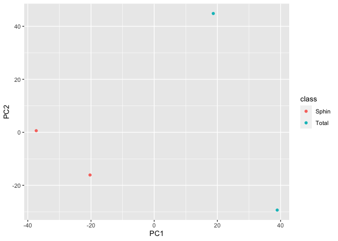
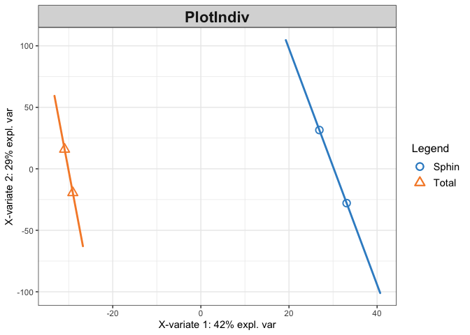

The Hitchhiker’s Guide to untargeted lipidomics analysis: Practical
guidelines
================
D. Smirnov, P. Mazin, M. Osetrova, E. Stekolshchikova, E. Khrameeva
8/18/2021

## Introduction

## Package import

Loading the packages required for analysis

``` r
library(xcms)
library(ggplot2)
library(DT)
library(IPO)
library(mixOmics)
```

## Data import

We will demonstrate the key concepts of LC-MS untargeted lipidomic
analysis on the example of human fibroblasts dataset (ST001691 study
from <https://www.metabolomicsworkbench.org/>). The raw files converted
into the .mzXML format can be downloaded in the current directory using
the following code:

``` r
#url <- "http://arcuda.skoltech.ru/~d.smirnov/sampledata.tar.gz"
#download.file(url, destfile = 'sampledata.tar.gz')
#untar('sampledata.tar.gz')
```

For convenience, raw MS files located in the `sampledata/` are organized
into the two subfolders according the treatment groups.

``` r
mzfiles <- list.files('sampledata/', recursive = TRUE, full.names = TRUE, pattern = '.mzXML')
group <- unlist(lapply(strsplit(mzfiles,"/"), function (x) x[[3]]))
pd <- data.frame(sample_name = sub(basename(mzfiles), pattern = ".mzXML", replacement = "", fixed = TRUE), 
                 sample_group = group, 
                 stringsAsFactors = FALSE)

knitr::kable(pd)
```

| sample\_name       | sample\_group |
|:-------------------|:--------------|
| Fibroblast\_Sphin1 | Sphin         |
| Fibroblast\_Sphin2 | Sphin         |
| Fibroblast\_Total1 | Total         |
| Fibroblast\_Total2 | Total         |

Now .mzXML files can be imported via `readMSData` function

``` r
raw_data <- readMSData(files = mzfiles, 
                       pdata = new("NAnnotatedDataFrame", pd), 
                       mode = "onDisk", 
                       msLevel = 1, 
                       verbose = T, 
                       centroided = T)
```

    ## Reading 584 spectra from file Fibroblast_Sphin1.mzXML

    ## Reading 584 spectra from file Fibroblast_Sphin2.mzXML

    ## Reading 584 spectra from file Fibroblast_Total1.mzXML

    ## Reading 584 spectra from file Fibroblast_Total2.mzXML

## Peak picking

Feature detection `CentWave` algorithm based on continuous wavelet
transformation allows to distinguish lipid peaks from background noise.
To perform peak calling we need to set up CentWave parameters first.

``` r
cwp <- CentWaveParam(peakwidth = c(9.5, 36),
                     ppm = 11.5,
                     noise = 0, 
                     snthresh = 10, 
                     mzdiff = -0.001, 
                     prefilter = c(3, 100), 
                     mzCenterFun = "wMean", 
                     integrate = 1, 
                     fitgauss = FALSE)
```

Once the parameters are set one can proceed to chromatographic peak
detection using `findChromPeaks` function.

``` r
xset <- findChromPeaks(raw_data, param = cwp)
```

## Peak alignment

``` r
arp <- ObiwarpParam(distFun = "cor_opt", 
                    binSize = 1, 
                    response = 1, 
                    gapInit = 0.32, 
                    gapExtend = 2.688, 
                    factorDiag = 2, 
                    factorGap = 1,
                    localAlignment = FALSE)
```

``` r
xset <- adjustRtime(xset, param = arp)
```

## Peak grouping

``` r
pdp <- PeakDensityParam(sampleGroups = xset$sample_group, 
                        bw = 0.879999999999999, 
                        binSize = 0.02412, 
                        minFraction = 0.000001, 
                        minSamples = 1, 
                        maxFeatures = 50)
```

``` r
xset <- groupChromPeaks(xset, param = pdp)
```

    ## Processing 123943 mz slices ... OK

## Selection of parameters for peak picking, alignment, and grouping

``` r
peakpickingParameters <- getDefaultXcmsSetStartingParams('centWave')
peakpickingParameters$min_peakwidth = c(0,10)
peakpickingParameters$max_peakwidth = c(10,30)
peakpickingParameters$ppm = c(0,10)
```

``` r
#resultPeakpicking <- optimizeXcmsSet(files = mzfiles, 
#                                     params = peakpickingParameters, 
#                                     nSlaves = 0, 
#                                     subdir = NULL)
```

## Imputation of missing values

``` r
xset <- fillChromPeaks(xset)
```

    ## Defining peak areas for filling-in .... OK
    ## Start integrating peak areas from original files

## Data export

``` r
pks <- chromPeaks(xset)
grs <- featureDefinitions(xset)
mtx <- featureValues(xset, method="maxint", value="into", filled=T) 

knitr::kable(head(mtx))
```

|        | Fibroblast\_Sphin1.mzXML | Fibroblast\_Sphin2.mzXML | Fibroblast\_Total1.mzXML | Fibroblast\_Total2.mzXML |
|:-------|-------------------------:|-------------------------:|-------------------------:|-------------------------:|
| FT0001 |               1256154.43 |                913245.81 |                       NA |                       NA |
| FT0002 |                 58801.24 |                 86856.81 |                861224.11 |                 33162.95 |
| FT0003 |                410858.05 |                134526.55 |                 35017.65 |                       NA |
| FT0004 |               9202572.22 |              11043406.80 |              12731575.77 |               2247813.75 |
| FT0005 |                 93077.08 |                166715.26 |                       NA |                       NA |
| FT0006 |                113533.52 |                 59536.56 |                       NA |                       NA |

## Filtering of peaks

Removing peaks with NaN

``` r
th <- 0.3
```

``` r
peaks.nas <- apply(mtx, 1, function (x) sum(is.na(x)))
mtx <- mtx[(peaks.nas/ncol(mtx)) < th, ]
```

## Normalization

## Downstream analysis

## Principal Component Analysis (PCA)

``` r
pca <- prcomp(t(na.omit(mtx)), center = TRUE, scale. = TRUE)
```

``` r
Y <- pd$sample_group 
```

``` r
pca.data <- data.frame(PC1 = pca$x[, 1], PC2 = pca$x[, 2], class = Y)
ggplot(data = pca.data, aes_string(x = "PC1", y = "PC2", color = "class")) + geom_point()
```

<!-- -->

## Partial Least-Squares Discriminant Analysis (PLS-DA)

``` r
X <- t(na.omit(mtx))
Y <- as.factor(Y)
plsda.model <- plsda(X, Y, ncomp = 2)
```

    ## Warning in internal_wrapper.mint(X = X, Y = Y.mat, ncomp = ncomp, scale = scale, : At least one study has less than 5 samples, mean centering might
    ##     not do as expected

``` r
plotIndiv(plsda.model, ind.names = FALSE, legend=TRUE, ellipse = TRUE)
```

    ## Warning: It is deprecated to specify `guide = FALSE` to remove a guide. Please
    ## use `guide = "none"` instead.

<!-- -->

``` r
plsda.contributions <- selectVar(plsda.model, comp = 1)$value
```

## Software used

``` r
sessionInfo()
```

    ## R version 4.0.3 (2020-10-10)
    ## Platform: x86_64-apple-darwin17.0 (64-bit)
    ## Running under: macOS Catalina 10.15.7
    ## 
    ## Matrix products: default
    ## BLAS:   /Library/Frameworks/R.framework/Versions/4.0/Resources/lib/libRblas.dylib
    ## LAPACK: /Library/Frameworks/R.framework/Versions/4.0/Resources/lib/libRlapack.dylib
    ## 
    ## locale:
    ## [1] ru_RU.UTF-8/ru_RU.UTF-8/ru_RU.UTF-8/C/ru_RU.UTF-8/ru_RU.UTF-8
    ## 
    ## attached base packages:
    ## [1] stats4    parallel  stats     graphics  grDevices utils     datasets 
    ## [8] methods   base     
    ## 
    ## other attached packages:
    ##  [1] mixOmics_6.14.1     lattice_0.20-44     MASS_7.3-54        
    ##  [4] IPO_1.16.0          CAMERA_1.46.0       rsm_2.10.2         
    ##  [7] DT_0.18             ggplot2_3.3.5       xcms_3.12.0        
    ## [10] MSnbase_2.16.1      ProtGenerics_1.22.0 S4Vectors_0.28.1   
    ## [13] mzR_2.24.1          Rcpp_1.0.7          BiocParallel_1.24.1
    ## [16] Biobase_2.50.0      BiocGenerics_0.36.1
    ## 
    ## loaded via a namespace (and not attached):
    ##   [1] colorspace_2.0-2            ellipsis_0.3.2             
    ##   [3] htmlTable_2.2.1             corpcor_1.6.9              
    ##   [5] XVector_0.30.0              GenomicRanges_1.42.0       
    ##   [7] base64enc_0.1-3             rstudioapi_0.13            
    ##   [9] farver_2.1.0                affyio_1.60.0              
    ##  [11] ggrepel_0.9.1               RSpectra_0.16-0            
    ##  [13] fansi_0.5.0                 codetools_0.2-18           
    ##  [15] splines_4.0.3               ncdf4_1.17                 
    ##  [17] doParallel_1.0.16           impute_1.64.0              
    ##  [19] robustbase_0.93-8           knitr_1.33                 
    ##  [21] Formula_1.2-4               cluster_2.1.2              
    ##  [23] vsn_3.58.0                  png_0.1-7                  
    ##  [25] graph_1.68.0                BiocManager_1.30.16        
    ##  [27] compiler_4.0.3              backports_1.2.1            
    ##  [29] assertthat_0.2.1            Matrix_1.3-4               
    ##  [31] limma_3.46.0                htmltools_0.5.1.1          
    ##  [33] tools_4.0.3                 igraph_1.2.6               
    ##  [35] gtable_0.3.0                glue_1.4.2                 
    ##  [37] GenomeInfoDbData_1.2.4      affy_1.68.0                
    ##  [39] reshape2_1.4.4              RANN_2.6.1                 
    ##  [41] dplyr_1.0.7                 MALDIquant_1.20            
    ##  [43] vctrs_0.3.8                 preprocessCore_1.52.1      
    ##  [45] iterators_1.0.13            xfun_0.25                  
    ##  [47] stringr_1.4.0               lifecycle_1.0.0            
    ##  [49] XML_3.99-0.6                DEoptimR_1.0-9             
    ##  [51] zlibbioc_1.36.0             scales_1.1.1               
    ##  [53] pcaMethods_1.82.0           MatrixGenerics_1.2.1       
    ##  [55] SummarizedExperiment_1.20.0 RBGL_1.66.0                
    ##  [57] MassSpecWavelet_1.56.0      RColorBrewer_1.1-2         
    ##  [59] yaml_2.2.1                  gridExtra_2.3              
    ##  [61] rpart_4.1-15                latticeExtra_0.6-29        
    ##  [63] stringi_1.7.3               highr_0.9                  
    ##  [65] foreach_1.5.1               checkmate_2.0.0            
    ##  [67] GenomeInfoDb_1.26.7         rlang_0.4.11               
    ##  [69] pkgconfig_2.0.3             matrixStats_0.60.0         
    ##  [71] bitops_1.0-7                mzID_1.28.0                
    ##  [73] evaluate_0.14               purrr_0.3.4                
    ##  [75] labeling_0.4.2              htmlwidgets_1.5.3          
    ##  [77] tidyselect_1.1.1            plyr_1.8.6                 
    ##  [79] magrittr_2.0.1              R6_2.5.0                   
    ##  [81] IRanges_2.24.1              generics_0.1.0             
    ##  [83] Hmisc_4.5-0                 DelayedArray_0.16.3        
    ##  [85] DBI_1.1.1                   pillar_1.6.2               
    ##  [87] foreign_0.8-81              withr_2.4.2                
    ##  [89] MsCoreUtils_1.2.0           survival_3.2-12            
    ##  [91] RCurl_1.98-1.3              nnet_7.3-16                
    ##  [93] tibble_3.1.3                crayon_1.4.1               
    ##  [95] rARPACK_0.11-0              utf8_1.2.2                 
    ##  [97] ellipse_0.4.2               rmarkdown_2.10             
    ##  [99] jpeg_0.1-9                  grid_4.0.3                 
    ## [101] data.table_1.14.0           digest_0.6.27              
    ## [103] tidyr_1.1.3                 munsell_0.5.0
