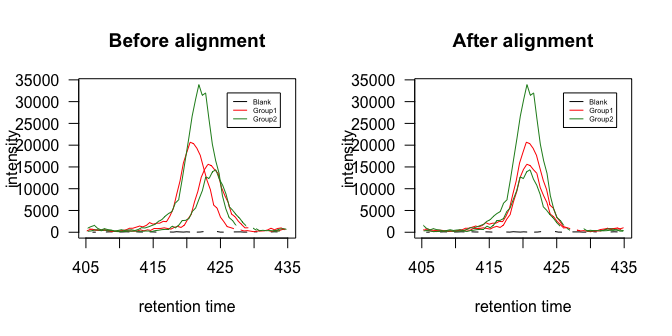
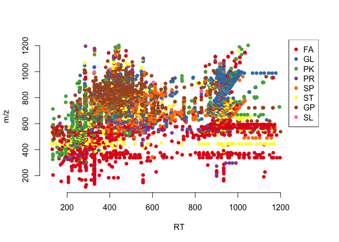
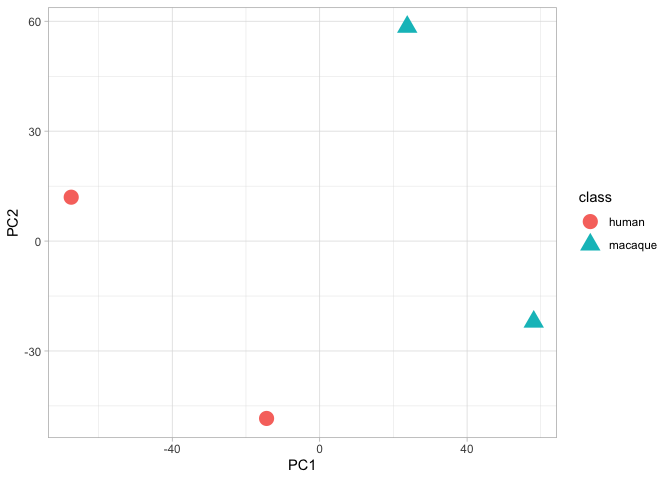

The Hitchhiker’s Guide to untargeted lipidomics analysis: Practical
guidelines
================
D. Smirnov, P. Mazin, M. Osetrova, E. Stekolshchikova, E. Khrameeva
8/18/2021

## Introduction

Here we present step-by-step guide to bioinformatic analysis of
untargeted LS-MS lipidomic data. This manual reproduces the key steps
described in the manuscript:

-   Data importing

-   Lipid signal quantification (peak peaking, peak alignment, peak
    grouping and abundance quantification)

-   Filtering and normalization

-   Visualization

## Package import

Loading the packages required for analysis

``` r
library(xcms)
library(ggplot2)
library(DT)
library(IPO)
library(mixOmics)
library(dplyr)
library(missForest)
library(reshape2)
library(gridExtra)
```

## Data import

We will demonstrate the key concepts of LC-MS untargeted lipidomic
analysis on the example of human and macaque lipidomic profiles from
Dorsolateral Prefrontal Cortex. Raw MS files from this project converted
into the .mzXML format can be downloaded into the current directory
using the following code:

``` r
#url <- "http://arcuda.skoltech.ru/~d.smirnov/sampledata.tar.gz"
#download.file(url, destfile = 'sampledata.tar.gz')
#untar('sampledata.tar.gz')
```

For convenience, raw MS files located in the `sampledata/` folder are
organized into two subfolders according to the species (2 files per
species + blank measurements). The code below will create a table with
sample metadata

``` r
mzfiles <- list.files('sampledata/', recursive = TRUE, full.names = TRUE, pattern = '.mzXML')
group <- unlist(lapply(strsplit(mzfiles,"/"), function (x) x[[3]]))
pd <- data.frame(sample_name = sub(basename(mzfiles), pattern = ".mzXML", replacement = "", fixed = TRUE), 
                 sample_group = group, 
                 stringsAsFactors = FALSE)

knitr::kable(pd)
```

| sample\_name   | sample\_group |
|:---------------|:--------------|
| Blank7\_B\_23  | blank         |
| MS299\_HB\_38  | human         |
| MS650\_HD\_346 | human         |
| MS122\_MA\_307 | macaque       |
| MS423\_MB\_628 | macaque       |

Now .mzXML files can be imported into `MSnExp` object via `readMSData`
function

``` r
raw_data <- readMSData(files = mzfiles, 
                       pdata = new("NAnnotatedDataFrame", pd), 
                       mode = "onDisk", 
                       msLevel = 1, 
                       verbose = T, 
                       centroided = T)
```

    ## Reading 2880 spectra from file Blank7_B_23.mzXML

    ## Reading 2881 spectra from file MS299_HB_38.mzXML

    ## Reading 2876 spectra from file MS650_HD_346.mzXML

    ## Reading 2874 spectra from file MS122_MA_307.mzXML

    ## Reading 2877 spectra from file MS423_MB_628.mzXML

## Peak picking

Feature detection `CentWave` algorithm based on continuous wavelet
transformation allows to distinguish lipid peaks from background noise.
To perform peak calling we need to set up CentWave parameters first

``` r
cwp <- CentWaveParam(peakwidth = c(9.5, 36),
                     ppm = 11.5,
                     noise = 0, 
                     snthresh = 10, 
                     mzdiff = -0.001, 
                     prefilter = c(3, 100), 
                     mzCenterFun = "wMean", 
                     integrate = 1, 
                     fitgauss = FALSE)
```

It’s highly recommended to specify `peakwidth` (minimum and maximum MS
peak width in RT dimension) and `ppm`(width of region of interest in the
m/z dimension) parameters based on ion chromatograms for internal
standards.

Once the parameters are set one can proceed to chromatographic peak
detection using `findChromPeaks` function.

``` r
xset <- findChromPeaks(raw_data, param = cwp)
```

## Peak alignment

Peak alignment procedure aims to eliminate retention times shifts
between identified chromatographic peaks from samples. We will use
OBI-warp algorithm implemented within `xcms` package to match peaks
between MS runs.

``` r
arp <- ObiwarpParam(distFun = "cor_opt", 
                    binSize = 1, 
                    response = 1, 
                    gapInit = 0.32, 
                    gapExtend = 2.688, 
                    factorDiag = 2, 
                    factorGap = 1,
                    localAlignment = FALSE)

xset <- adjustRtime(xset, param = arp)
```

    ## Sample number 3 used as center sample.

    ## Applying retention time adjustment to the identified chromatographic peaks ... OK

`ObiwarpParam` function creates an object with parameters for the
alignment and `adjustRtime` performs the peak matching.

An example of peaks before and after RT shift correction is shown below

``` r
group_colors <- c("black", "red", "forestgreen")
names(group_colors) <- unique(xset$sample_group)

par(mfrow=c(1,2),las=1)
chr <- chromatogram(xset, rt = c(405, 435), mz = c(797.58, 797.63), aggregationFun = "max", adjustedRtime = F)
chr.adj <- chromatogram(xset, rt = c(405, 435), mz = c(797.58, 797.63), aggregationFun = "max", adjustedRtime = T)
plot(chr, peakType = "none", col=group_colors[xset$sample_group], main = "Before alignment")
legend(427, 32000, legend=c("Blank", "Human", "Macaque"), col=group_colors, lty=1:1, cex=0.95)
plot(chr.adj, peakType = "none", col=group_colors[xset$sample_group], main = "After alignment")
legend(427, 32000, legend=c("Blank", "Human", "Macaque"), col=group_colors, lty=1:1, cex=0.95)
```

<!-- -->

## Peak grouping

Once retention time correction is done one can proceed to the
correspondence analysis of aligned peaks. The general idea of peak
grouping is to identify peaks from the same ion across samples and group
them together to form a lipid feature. In order to do this analysis, we
will use Peak density method that accessible in `xcms` via
`groupChromPeaks` function. `PeakDensityParam` object contains grouping
settings and is used as input for `groupChromPeaks`.

``` r
pdp <- PeakDensityParam(sampleGroups = xset$sample_group, 
                        bw = 0.879999999999999, 
                        binSize = 0.02412, 
                        minFraction = 0.000001, 
                        minSamples = 1, 
                        maxFeatures = 50)

xset <- groupChromPeaks(xset, param = pdp)
```

    ## Processing 90525 mz slices ... OK

## Selection of parameters for peak picking, alignment, and grouping

For simplicity and saving time, in the code sections above we provided
parameters optimized for untargeted lipidome LC-MS measurements on a
Reversed-Phase Bridged Ethyl Hybrid (BEH) C8 column reverse coupled to a
Vanguard precolumn, using a Waters Acquity UPLC system and a heated
electrospray ionization source in combination with a Bruker Impact II
QTOF (quadrupole-Time-of-Flight) mass spectrometer. To customize the
parameters for a particular LS-MS experiment we recommend optimizing
them via `IPO` package.

Please note that optimizing peak calling parameters with
`optimizeXcmsSet` function is a quite computationally intensive
operation. It may take hours or even days (depending on the number of
samples) before the optimization process ends!

To perform the optimization just uncomment the code below. It will
return the R script with optimized processing parameters.

``` r
#peakpickingParameters <- getDefaultXcmsSetStartingParams('centWave')
#peakpickingParameters$min_peakwidth = c(0,10)
#peakpickingParameters$max_peakwidth = c(10,30)
#peakpickingParameters$ppm = c(0,10)
```

``` r
#resultPeakpicking <- optimizeXcmsSet(files = mzfiles, 
#                                     params = peakpickingParameters, 
#                                     nSlaves = 0, 
#                                     subdir = NULL)

#optimizedXcmsSetObject <- resultPeakpicking$best_settings$xset

#retcorGroupParameters <- getDefaultRetGroupStartingParams()
#resultRetcorGroup <- optimizeRetGroup(xset = optimizedXcmsSetObject, 
#                                      params = retcorGroupParameters,
#                                      nSlaves = 0,
#                                      subdir = NULL)

#writeRScript(resultPeakpicking$best_settings$parameters, 
#             resultRetcorGroup$best_settings, 1)
```

## Imputation of missing values

Unfortunately, peak peaking algorithm may produces a sufficient numbers
of NAs for those samples in which it wasn’t able to identify MS peaks.
We will try to impute missing chromatographic peaks within samples using
`fillChromPeaks` function.

``` r
xset <- fillChromPeaks(xset)
```

    ## Defining peak areas for filling-in .... OK
    ## Start integrating peak areas from original files

Please note that `fillChromPeaks` can not impute all the gaps in MS
data. The remaining missing values will be further removed/imputed in
the section “Filtering of peaks” below.

## Data export

Now we can extract feature matrix from `xset` object

``` r
pks <- chromPeaks(xset)
grs <- featureDefinitions(xset)
mtx <- featureValues(xset, method="maxint", value="into", filled=T) 

knitr::kable(head(mtx))
```

|         | Blank7\_B\_23.mzXML | MS299\_HB\_38.mzXML | MS650\_HD\_346.mzXML | MS122\_MA\_307.mzXML | MS423\_MB\_628.mzXML |
|:--------|--------------------:|--------------------:|---------------------:|---------------------:|---------------------:|
| FT00001 |           1353.6443 |            992.3192 |             786.8389 |             858.8071 |            806.18414 |
| FT00002 |           3119.5129 |            724.5263 |            2068.3573 |             146.3082 |             56.23612 |
| FT00003 |          51652.7105 |          59957.6374 |           46196.7493 |           41635.2908 |          49026.81721 |
| FT00004 |            255.9576 |            737.5624 |            1122.6784 |            1180.6987 |           1649.92238 |
| FT00005 |           4420.6834 |           4915.5724 |            4860.1878 |            2665.9554 |           4412.18887 |
| FT00006 |             32.2304 |           3396.0094 |            1792.0359 |             942.3421 |           3048.21657 |

## Annotation

Annotation is arguably the most tricky part of untargeted LS-MS
analysis. Here we present a method to create annotation for lipid
features obtained in the previous steps.

``` r
source("src/rt-mz.annotator.R")
```

Prepare the reduced version of `grs` table with a new column consisting
of merged mz and rt values

``` r
grs <- as.data.frame(grs)
grs <- grs[rownames(mtx), ]
grs.short <- dplyr::select(grs, mzmed, rtmed)
grs.short$id <- paste(round(grs.short$mzmed, 3), round(grs.short$rtmed, 3), sep = '_')
grs.short <- grs.short[,c(3,1,2)]
colnames(grs.short) <- c('id', 'mz', 'rt')
knitr::kable(head(grs.short))
```

|         | id               |       mz |        rt |
|:--------|:-----------------|---------:|----------:|
| FT00001 | 113.133\_286.704 | 113.1329 | 286.70374 |
| FT00002 | 116.053\_258.141 | 116.0528 | 258.14100 |
| FT00003 | 121.028\_286.204 | 121.0283 | 286.20401 |
| FT00004 | 121.101\_328.29  | 121.1014 | 328.29016 |
| FT00005 | 122.032\_286.204 | 122.0317 | 286.20400 |
| FT00006 | 123.056\_35.377  | 123.0556 |  35.37667 |

`annotateByMass` function annotates lipid features by matching their
exact mass against m/z values of existing lipids from LIPID MAPS
database. Adducts can be defined by `ions` parameter, by default the
function uses H, Na, NH4,K,NH4 + acetonitrile. Default ppm threshold in
`annotateByMass` is 100, but it also can be changed with `ppm`
parameter.

``` r
ann <- annotateByMass(grs.short, db = LMDB)
dim(ann)
```

    ## [1] 215640     12

The function yields a table containing LM ID of annotated feature along
with formula, systematic name, corresponding ppm/ppmd and delta values.

``` r
grs.annotated <- filter(grs.short, id %in% unique(ann$id))
grs.annotated <- tibble::rownames_to_column(grs.annotated, "xcmsID")
grs.annotated <- full_join(grs.annotated[,c(1,2)], ann, by=c("id"="id"))
knitr::kable(head(grs.annotated))
```

| xcmsID  | id               |       mz |        rt | ion | LM\_ID       | EXACT\_MASS | FORMULA | SYSTEMATIC\_NAME                                                                                                                                                                                            | ABBREV |       ppm |     delta |       ppmd |
|:--------|:-----------------|---------:|----------:|:----|:-------------|------------:|:--------|:------------------------------------------------------------------------------------------------------------------------------------------------------------------------------------------------------------|:-------|----------:|----------:|-----------:|
| FT00001 | 113.133\_286.704 | 113.1329 | 286.70374 | H   | LMFA11000592 |    112.1252 | C8H16   | 3-methyl-1-heptene//cis-1,2-dimethylcyclohexane//trans-1,2-dimethylcyclohexane//1,4-dimethylcyclohexane//Ethylcyclohexane                                                                                   | \-     |  3.336934 | 0.0003775 |  -3.336934 |
| FT00003 | 121.028\_286.204 | 121.0283 | 286.20401 | Na  | LMFA01030099 |     98.0368 | C5H6O2  | 2,4-pentadienoic acid//penta-2,4-dienoic acid                                                                                                                                                               | FA 5:2 | 18.635676 | 0.0022554 | -18.635676 |
| FT00003 | 121.028\_286.204 | 121.0283 | 286.20401 | H   | LMFA01130006 |    120.0245 | C4H8O2S | 3-(methyl-sulfanyl)-propanoic acid                                                                                                                                                                          | \-     | 28.939494 | 0.0035026 |  28.939494 |
| FT00004 | 121.101\_328.29  | 121.1014 | 328.29016 | Na  | LMFA11000319 |     98.1095 | C7H14   | 1-Heptene//Methylcyclohexane//1,2-dimethylcyclopentane//Ethylcyclopentane                                                                                                                                   | \-     | 21.900800 | 0.0026522 | -21.900800 |
| FT00004 | 121.101\_328.29  | 121.1014 | 328.29016 | NH4 | LMFA01100034 |    103.0633 | C4H9NO2 | 2S-amino-butanoic acid//4-amino-butanoic acid//2R-amino-butanoic acid//2R-methyl-3-amino-propanoic acid//2S-methyl-3-amino-propanoic acid//2-amino-2-methyl-propanoic acid//3-amino-3-methyl-propionic acid | \-     | 35.072335 | 0.0042472 | -35.072335 |
| FT00006 | 123.056\_35.377  | 123.0556 |  35.37667 | K   | LMFA11000035 |     84.0939 | C6H12   | 2E-Hexene                                                                                                                                                                                                   | \-     | 11.744882 | 0.0014453 |  11.744882 |

Keep annotated features only

``` r
mtx <- mtx[unique(grs.annotated$xcmsID),]
```

Also one can try to perform annotation for specific lipid class only. We
will illustrate such approach using a custom TAG generator that creates
a table of triacylglycerols (TAG\_10:0 - TAG\_70:8) with corresponding
lipid formula and exact masses.

``` r
tags = generateTGL(10:70,0:8) # the generator is quite simple, some tags it mage are meaningless (like 10:8)
electron.mass = 0.00054858
knitr::kable(head(tags))
```

|          |   n |   k | FORMULA  | EXACT\_MASS | LM\_ID    |
|:---------|----:|----:|:---------|------------:|:----------|
| C13H22O6 |  10 |   0 | C13H22O6 |    274.1416 | TAG\_10:0 |
| C13H20O6 |  10 |   1 | C13H20O6 |    272.1260 | TAG\_10:1 |
| C13H18O6 |  10 |   2 | C13H18O6 |    270.1103 | TAG\_10:2 |
| C13H16O6 |  10 |   3 | C13H16O6 |    268.0947 | TAG\_10:3 |
| C13H14O6 |  10 |   4 | C13H14O6 |    266.0790 | TAG\_10:4 |
| C13H12O6 |  10 |   5 | C13H12O6 |    264.0634 | TAG\_10:5 |

We will use the same `annotateByMass` function as a before, but with
previously generated TAG table instead of full LIPIDMAPS database.

``` r
ann2 = annotateByMass(grs.short,
                      tags,
                      ions = c(NH4=calcExactMass('NH4')-electron.mass),
                      ppm=10)

knitr::kable(head(ann2))
```

|     | id               |       mz |        rt | ion | LM\_ID    | EXACT\_MASS | FORMULA  |      ppm |     delta |      ppmd |
|:----|:-----------------|---------:|----------:|:----|:----------|------------:|:---------|---------:|----------:|----------:|
| 0   | 290.161\_37.195  | 290.1612 |  37.19504 | NH4 | TAG\_10:1 |    272.1260 | C13H20O6 | 4.632649 | 0.0013442 | -4.632649 |
| 1   | 304.084\_60.23   | 304.0841 |  60.22953 | NH4 | TAG\_12:8 |    286.0477 | C15H10O6 | 8.201367 | 0.0024939 | -8.201367 |
| 2   | 318.193\_41.184  | 318.1925 |  41.18413 | NH4 | TAG\_12:1 |    300.1573 | C15H24O6 | 4.487987 | 0.0014280 | -4.487987 |
| 3   | 358.225\_50.211  | 358.2254 |  50.21149 | NH4 | TAG\_15:2 |    340.1886 | C18H28O6 | 8.342262 | 0.0029884 | -8.342262 |
| 4   | 366.192\_227.582 | 366.1916 | 227.58200 | NH4 | TAG\_16:5 |    348.1573 | C19H24O6 | 1.326931 | 0.0004859 | -1.326931 |
| 5   | 442.318\_200.285 | 442.3181 | 200.28549 | NH4 | TAG\_21:2 |    424.2825 | C24H40O6 | 4.064942 | 0.0017980 | -4.064942 |

## Filtering of peaks

We will perform feature filtering based on blank samples to retain all
features for which the median concentration ratio between biological
samples and blank samples is greater than 2.

``` r
med.MS <- apply(mtx, 1, function(x) log10(median(x[grep("MS",colnames(mtx),perl=T)], na.rm=T)))
med.blank <- apply(mtx, 1, function(x) log10(median(x[grep("Blank",colnames(mtx))], na.rm=T)))
filter.blank <- (med.MS - med.blank) > log10(2)
filter.blank[filter.blank==T] <- NA
filter.blank[is.na(filter.blank)] <- T
mtx <- mtx[filter.blank, c(2:5)]
```

The proportion of filtered features can be visualized using a
mean-difference plot:

``` r
plot((med.MS+med.blank)/2, 
     med.MS-med.blank, 
     pch=21, las=1, bg="gray",  
     col="dimgray", cex=1.2, lwd=0.4, xlab = "Sample Intensity", ylab = "Sample - Blank")

points((med.MS[filter.blank]+med.blank[filter.blank])/2,
       med.MS[filter.blank]-med.blank[filter.blank],
       pch=21, bg="#B20F25", col="dimgray", cex=1.2, lwd=0.4)

abline(h=log10(2),col="#B20F25")
```

<!-- -->

The code below removes all features that possess more than 30% of NA
across samples.

``` r
th <- 0.3
peaks.nas <- apply(mtx, 1, function (x) sum(is.na(x)))
mtx <- mtx[(peaks.nas/ncol(mtx)) < th, ]
```

To impute missing values not filled by `fillChromPeaks` and not removed
by filtering we will use an implementation of random forest algorithm
from `MissForest` package.

``` r
mtx.imp <- missForest(mtx)
```

    ##   missForest iteration 1 in progress...done!
    ##   missForest iteration 2 in progress...done!
    ##   missForest iteration 3 in progress...done!
    ##   missForest iteration 4 in progress...done!
    ##   missForest iteration 5 in progress...done!

``` r
mtx <- mtx.imp$ximp
```

## Normalization

In order to make samples comparable to each other we will utilize
sample-specific normalization by wet weight.

Change the column names first

``` r
colnames(mtx) <- unlist(strsplit(colnames(mtx), split = '.mzXML'))
```

Load the matrix of wet weights for our samples

``` r
wetw <- as.matrix(read.csv("POS.WETWEIGHT.csv", header=F, row.names=1))
```

    ## Warning in read.table(file = file, header = header, sep = sep, quote = quote, :
    ## incomplete final line found by readTableHeader on 'POS.WETWEIGHT.csv'

``` r
wetw <- log10(wetw)
knitr::kable(wetw)
```

|                |        V2 |
|:---------------|----------:|
| MS122\_MA\_307 | 0.9590414 |
| MS299\_HB\_38  | 1.0211893 |
| MS423\_MB\_628 | 1.1461280 |
| MS650\_HD\_346 | 1.1105897 |

Perform the normalization

``` r
wetw <- wetw[colnames(mtx), ]
mtx <- log10(mtx)
mtx.normalized <- t(apply(mtx, 1, function (x) x-wetw+mean(wetw)))
```

## Downstream analysis

Processed matrix with quantified lipid abundances can be used for
downstream analysis. We will apply two classical approaches (PCA and
PLS-DA) to analyze the sample-specific differences between human and
macaque lipid profiles.

### Principal Component Analysis (PCA)

PCA is multivariate technique that extremely useful for classification
purpose. The key idea of the method is to project original matrix of
lipid abundances into low dimensional space. To perform dimensionality
reduction PCA computes the reduced set of uncorrelated variables named
`Principal Components`. For a given matrix
,
where features are rows and samples are columns, principal component
vectors can be defined by finding eigenvectors of the following sample
covariance matrix :


where

is a centering matrix,
 represents an
identity matrix of size
.

To calculate principal components we will use base R function `prcomp`

``` r
pca <- prcomp(t(mtx.normalized), center = TRUE, scale. = TRUE)
```

To visualize relationships between samples in a new low dimensional
space we will plot PC1 and PC2 against each other.

``` r
Y <- pd$sample_group[2:5] 
pca.data <- data.frame(PC1 = pca$x[, 1], PC2 = pca$x[, 2], class = Y)
ggplot(data = pca.data, aes_string(x = "PC1", y = "PC2", color = "class", shape = "class")) + 
    geom_point(size = 5) +
    theme_light()
```

<!-- -->

### Partial Least-Squares Discriminant Analysis (PLS-DA)

While both PCA and PLS-DA achieve dimensionality reduction computing the
principal components, PLS-DA can be used rather for feature selection
than for classification purpose. Mathematically, PLS-DA principal
components can be obtained in a similar to PCA manner, as eigenvectors
of a matrix of covariances between
 and
:


where  and
 represent a centering
matrix and a total number of samples, respectively.

We will use the sparse version of the algorithm - sPLS-DA. First of all,
matrix of predictors and vector of responses should be defined

``` r
X <- t(mtx.normalized)
Y <- as.factor(Y)
```

Tune sPLS-DA parameters using Leave-One-Out cross validation

``` r
list.keepX <- seq(1, 100, 2)
tune.splsda <- tune.splsda(X, Y, ncomp = 2, validation = 'loo', folds = 4, 
                           progressBar = FALSE, dist = 'max.dist',
                           test.keepX = list.keepX, nrepeat = 1)
```

Run sPLS-DA with optimized parameters

``` r
splsda.model <- splsda(X, Y, ncomp = 2, keepX = tune.splsda$choice.keepX)
```

    ## Warning in internal_wrapper.mint(X = X, Y = Y.mat, ncomp = ncomp, scale = scale, : At least one study has less than 5 samples, mean centering might
    ##     not do as expected

``` r
plotIndiv(splsda.model, ind.names = FALSE, legend=TRUE, ellipse = TRUE)
```

    ## Warning: It is deprecated to specify `guide = FALSE` to remove a guide. Please
    ## use `guide = "none"` instead.

<!-- -->

A vector of feature contributions can be retrieved from the model in the
following way

``` r
plsda.contributions <- selectVar(splsda.model, comp = 1)$value
```

## Software used

``` r
sessionInfo()
```

    ## R version 4.0.3 (2020-10-10)
    ## Platform: x86_64-apple-darwin17.0 (64-bit)
    ## Running under: macOS Catalina 10.15.7
    ## 
    ## Matrix products: default
    ## BLAS:   /Library/Frameworks/R.framework/Versions/4.0/Resources/lib/libRblas.dylib
    ## LAPACK: /Library/Frameworks/R.framework/Versions/4.0/Resources/lib/libRlapack.dylib
    ## 
    ## locale:
    ## [1] ru_RU.UTF-8/ru_RU.UTF-8/ru_RU.UTF-8/C/ru_RU.UTF-8/ru_RU.UTF-8
    ## 
    ## attached base packages:
    ## [1] stats4    parallel  stats     graphics  grDevices utils     datasets 
    ## [8] methods   base     
    ## 
    ## other attached packages:
    ##  [1] gridExtra_2.3       reshape2_1.4.4      missForest_1.4     
    ##  [4] itertools_0.1-3     iterators_1.0.13    foreach_1.5.1      
    ##  [7] randomForest_4.6-14 dplyr_1.0.7         mixOmics_6.14.1    
    ## [10] lattice_0.20-44     MASS_7.3-54         IPO_1.16.0         
    ## [13] CAMERA_1.46.0       rsm_2.10.2          DT_0.18            
    ## [16] ggplot2_3.3.5       xcms_3.12.0         MSnbase_2.16.1     
    ## [19] ProtGenerics_1.22.0 S4Vectors_0.28.1    mzR_2.24.1         
    ## [22] Rcpp_1.0.7          BiocParallel_1.24.1 Biobase_2.50.0     
    ## [25] BiocGenerics_0.36.1
    ## 
    ## loaded via a namespace (and not attached):
    ##  [1] colorspace_2.0-2            ellipsis_0.3.2             
    ##  [3] htmlTable_2.2.1             corpcor_1.6.9              
    ##  [5] XVector_0.30.0              GenomicRanges_1.42.0       
    ##  [7] base64enc_0.1-3             rstudioapi_0.13            
    ##  [9] farver_2.1.0                affyio_1.60.0              
    ## [11] ggrepel_0.9.1               RSpectra_0.16-0            
    ## [13] fansi_0.5.0                 codetools_0.2-18           
    ## [15] splines_4.0.3               ncdf4_1.17                 
    ## [17] doParallel_1.0.16           impute_1.64.0              
    ## [19] robustbase_0.93-8           knitr_1.33                 
    ## [21] Formula_1.2-4               cluster_2.1.2              
    ## [23] vsn_3.58.0                  png_0.1-7                  
    ## [25] graph_1.68.0                BiocManager_1.30.16        
    ## [27] compiler_4.0.3              backports_1.2.1            
    ## [29] assertthat_0.2.1            Matrix_1.3-4               
    ## [31] limma_3.46.0                htmltools_0.5.1.1          
    ## [33] tools_4.0.3                 igraph_1.2.6               
    ## [35] gtable_0.3.0                glue_1.4.2                 
    ## [37] GenomeInfoDbData_1.2.4      affy_1.68.0                
    ## [39] RANN_2.6.1                  MALDIquant_1.20            
    ## [41] vctrs_0.3.8                 preprocessCore_1.52.1      
    ## [43] xfun_0.25                   stringr_1.4.0              
    ## [45] lifecycle_1.0.0             XML_3.99-0.7               
    ## [47] DEoptimR_1.0-9              zlibbioc_1.36.0            
    ## [49] scales_1.1.1                pcaMethods_1.82.0          
    ## [51] MatrixGenerics_1.2.1        SummarizedExperiment_1.20.0
    ## [53] RBGL_1.66.0                 MassSpecWavelet_1.56.0     
    ## [55] RColorBrewer_1.1-2          yaml_2.2.1                 
    ## [57] rpart_4.1-15                latticeExtra_0.6-29        
    ## [59] stringi_1.7.3               highr_0.9                  
    ## [61] checkmate_2.0.0             GenomeInfoDb_1.26.7        
    ## [63] rlang_0.4.11                pkgconfig_2.0.3            
    ## [65] matrixStats_0.60.1          bitops_1.0-7               
    ## [67] mzID_1.28.0                 evaluate_0.14              
    ## [69] purrr_0.3.4                 labeling_0.4.2             
    ## [71] htmlwidgets_1.5.3           tidyselect_1.1.1           
    ## [73] plyr_1.8.6                  magrittr_2.0.1             
    ## [75] R6_2.5.1                    IRanges_2.24.1             
    ## [77] generics_0.1.0              Hmisc_4.5-0                
    ## [79] DelayedArray_0.16.3         DBI_1.1.1                  
    ## [81] pillar_1.6.2                foreign_0.8-81             
    ## [83] withr_2.4.2                 MsCoreUtils_1.2.0          
    ## [85] survival_3.2-13             RCurl_1.98-1.4             
    ## [87] nnet_7.3-16                 tibble_3.1.3               
    ## [89] crayon_1.4.1                rARPACK_0.11-0             
    ## [91] utf8_1.2.2                  ellipse_0.4.2              
    ## [93] rmarkdown_2.10              jpeg_0.1-9                 
    ## [95] grid_4.0.3                  data.table_1.14.0          
    ## [97] digest_0.6.27               tidyr_1.1.3                
    ## [99] munsell_0.5.0
