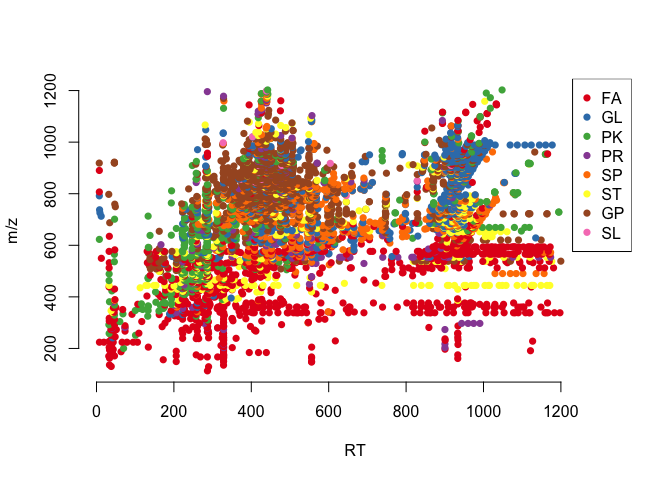
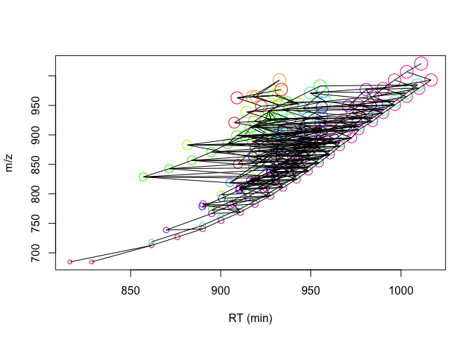

The Hitchhiker’s Guide to untargeted lipidomics analysis: Practical
guidelines
================
D. Smirnov, P. Mazin, M. Osetrova, E. Stekolshchikova, E. Khrameeva
8/18/2021

## Introduction

Here we present step-by-step guide to bioinformatic analysis of
untargeted LS-MS lipidomic data. This manual reproduces the key steps
described in the manuscript:

-   Data importing

-   Lipid signal quantification (peak peaking, peak alignment, peak
    grouping and abundance quantification)

-   Filtering and normalization

-   Visualization

## Package import

Loading the packages required for analysis

``` r
library(xcms)
library(ggplot2)
library(DT)
library(IPO)
library(mixOmics)
library(dplyr)
library(missForest)
library(reshape2)
library(gridExtra)
```

## Data import

We will demonstrate the key concepts of LC-MS untargeted lipidomic
analysis on the example of human and macaque lipidomic profiles from
Dorsolateral Prefrontal Cortex. Raw MS files (\~1.87 GB) from this
project converted into the .mzXML format can be downloaded into the
current directory using the following code:

``` r
#url <- "https://makarich.fbb.msu.ru/khrameeva/brainmap/sampledata.tar.gz"
#download.file(url, destfile = 'sampledata.tar.gz', method = "curl")
#untar('sampledata.tar.gz')
```

Raw MS files located in the `sampledata/` folder are organized into two
subfolders according to the species (2 files per species + blank
measurements). The code below will create a table with sample metadata

``` r
mzfiles <- list.files('sampledata/', recursive = TRUE, full.names = TRUE, pattern = '.mzXML')
group <- unlist(lapply(strsplit(mzfiles,"/"), function (x) x[[3]]))
pd <- data.frame(sample_name = sub(basename(mzfiles), pattern = ".mzXML", replacement = "", fixed = TRUE), 
                 sample_group = group, 
                 stringsAsFactors = FALSE)

knitr::kable(pd)
```

| sample\_name   | sample\_group |
|:---------------|:--------------|
| Blank7\_B\_23  | blank         |
| MS299\_HB\_38  | human         |
| MS650\_HD\_346 | human         |
| MS122\_MA\_307 | macaque       |
| MS423\_MB\_628 | macaque       |

Now .mzXML files can be imported into `MSnExp` object via `readMSData`
function

``` r
raw_data <- readMSData(files = mzfiles, 
                       pdata = new("NAnnotatedDataFrame", pd), 
                       mode = "onDisk", 
                       msLevel = 1, 
                       verbose = T, 
                       centroided = T)
```

    ## Reading 2880 spectra from file Blank7_B_23.mzXML

    ## Reading 2881 spectra from file MS299_HB_38.mzXML

    ## Reading 2876 spectra from file MS650_HD_346.mzXML

    ## Reading 2874 spectra from file MS122_MA_307.mzXML

    ## Reading 2877 spectra from file MS423_MB_628.mzXML

## Peak picking

Feature detection `CentWave` algorithm based on continuous wavelet
transformation allows to distinguish lipid peaks from background noise.
To perform peak calling we need to set up CentWave parameters first

``` r
cwp <- CentWaveParam(peakwidth = c(9.5, 36),
                     ppm = 11.5,
                     noise = 0, 
                     snthresh = 10, 
                     mzdiff = -0.001, 
                     prefilter = c(3, 100), 
                     mzCenterFun = "wMean", 
                     integrate = 1, 
                     fitgauss = FALSE)
```

It’s highly recommended to specify `peakwidth` (minimum and maximum MS
peak width in RT dimension) and `ppm`(width of region of interest in the
m/z dimension) parameters based on ion chromatograms for internal
standards.

Once the parameters are set one can proceed to chromatographic peak
detection using `findChromPeaks` function.

``` r
xset <- findChromPeaks(raw_data, param = cwp)
```

## Peak alignment

Peak alignment procedure aims to eliminate retention times shifts
between identified chromatographic peaks from samples. We will use
OBI-warp algorithm implemented within `xcms` package to match peaks
between MS runs.

``` r
arp <- ObiwarpParam(distFun = "cor_opt", 
                    binSize = 1, 
                    response = 1, 
                    gapInit = 0.32, 
                    gapExtend = 2.688, 
                    factorDiag = 2, 
                    factorGap = 1,
                    localAlignment = FALSE)

xset <- adjustRtime(xset, param = arp)
```

    ## Sample number 3 used as center sample.

    ## Applying retention time adjustment to the identified chromatographic peaks ... OK

`ObiwarpParam` function creates an object with parameters for the
alignment and `adjustRtime` performs the peak matching.

An example of peaks before and after RT shift correction is shown below

``` r
group_colors <- c("black", "red", "forestgreen")
names(group_colors) <- unique(xset$sample_group)

par(mfrow=c(1,2),las=1)
chr <- chromatogram(xset, rt = c(405, 435), mz = c(797.58, 797.63), aggregationFun = "max", adjustedRtime = F)
chr.adj <- chromatogram(xset, rt = c(405, 435), mz = c(797.58, 797.63), aggregationFun = "max", adjustedRtime = T)
plot(chr, peakType = "none", col=group_colors[xset$sample_group], main = "Before alignment")
legend(426, 32000, legend=c("Blank", "Human", "Macaque"), col=group_colors, lty=1:1, cex=0.45)
plot(chr.adj, peakType = "none", col=group_colors[xset$sample_group], main = "After alignment")
legend(426, 32000, legend=c("Blank", "Human", "Macaque"), col=group_colors, lty=1:1, cex=0.45)
```

<!-- -->

## Peak grouping

Once retention time correction is done one can proceed to the
correspondence analysis of aligned peaks. The general idea of peak
grouping is to identify peaks from the same ion across samples and group
them together to form a lipid feature. In order to do this analysis, we
will use Peak density method that accessible in `xcms` via
`groupChromPeaks` function. `PeakDensityParam` object contains grouping
settings and is used as input for `groupChromPeaks`.

``` r
pdp <- PeakDensityParam(sampleGroups = xset$sample_group, 
                        bw = 0.879999999999999, 
                        binSize = 0.02412, 
                        minFraction = 0.000001, 
                        minSamples = 1, 
                        maxFeatures = 50)

xset <- groupChromPeaks(xset, param = pdp)
```

    ## Processing 90525 mz slices ... OK

## Selection of parameters for peak picking, alignment, and grouping

For simplicity and saving time, in the code sections above we provided
parameters optimized for untargeted lipidome LC-MS measurements on a
Reversed-Phase Bridged Ethyl Hybrid (BEH) C8 column reverse coupled to a
Vanguard precolumn, using a Waters Acquity UPLC system and a heated
electrospray ionization source in combination with a Bruker Impact II
QTOF (quadrupole-Time-of-Flight) mass spectrometer. To customize the
parameters for a particular LS-MS experiment we recommend optimizing
them via `IPO` package.

Please note that optimizing peak calling parameters with
`optimizeXcmsSet` function is a quite computationally intensive
operation. It may take hours or even days (depending on the number of
samples) before the optimization process ends!

To perform the optimization just uncomment the code below. It will
return the R script with optimized processing parameters.

Set up default parameters for peak picking optimization procedure:

``` r
#peakpickingParameters <- getDefaultXcmsSetStartingParams('centWave')
#peakpickingParameters$min_peakwidth = c(0,10)
#peakpickingParameters$max_peakwidth = c(10,30)
#peakpickingParameters$ppm = c(0,10)
```

Optimize peak picking parameters:

``` r
#resultPeakpicking <- optimizeXcmsSet(files = mzfiles, 
#                                     params = peakpickingParameters, 
#                                     nSlaves = 0, 
#                                     subdir = NULL)

#optimizedXcmsSetObject <- resultPeakpicking$best_settings$xset
```

Optimize retention time correction and grouping parameters:

``` r
#retcorGroupParameters <- getDefaultRetGroupStartingParams()
#resultRetcorGroup <- optimizeRetGroup(xset = optimizedXcmsSetObject, 
#                                      params = retcorGroupParameters,
#                                      nSlaves = 0,
#                                      subdir = NULL)

#writeRScript(resultPeakpicking$best_settings$parameters, 
#             resultRetcorGroup$best_settings, 1)
```

## Imputation of missing values

Unfortunately, peak peaking algorithm may produces a sufficient numbers
of NAs for those samples in which it wasn’t able to identify MS peaks.
We will try to impute missing chromatographic peaks within samples using
`fillChromPeaks` function.

``` r
xset <- fillChromPeaks(xset)
```

    ## Defining peak areas for filling-in .... OK
    ## Start integrating peak areas from original files

Please note that `fillChromPeaks` may not impute all the gaps in MS
data. The remaining missing values will be further removed/imputed in
the section “Filtering of peaks” below.

## Data export

Now we can extract feature matrix from `xset` object

``` r
pks <- chromPeaks(xset)
grs <- featureDefinitions(xset)
mtx <- featureValues(xset, method="maxint", value="into", filled=T) 

knitr::kable(head(mtx))
```

|         | Blank7\_B\_23.mzXML | MS299\_HB\_38.mzXML | MS650\_HD\_346.mzXML | MS122\_MA\_307.mzXML | MS423\_MB\_628.mzXML |
|:--------|--------------------:|--------------------:|---------------------:|---------------------:|---------------------:|
| FT00001 |           1353.6443 |            992.3192 |             786.8389 |             858.8071 |            806.18414 |
| FT00002 |           3119.5129 |            724.5263 |            2068.3573 |             146.3082 |             56.23612 |
| FT00003 |          51652.7105 |          59957.6374 |           46196.7493 |           41635.2908 |          49026.81721 |
| FT00004 |            255.9576 |            737.5624 |            1122.6784 |            1180.6987 |           1649.92238 |
| FT00005 |           4420.6834 |           4915.5724 |            4860.1878 |            2665.9554 |           4412.18887 |
| FT00006 |             32.2304 |           3396.0094 |            1792.0359 |             942.3421 |           3048.21657 |

Change the column names of `mtx` matrix

``` r
colnames(mtx) <- unlist(strsplit(colnames(mtx), split = '.mzXML'))
```

To correctly normalize abundance matrix `mtx` further we will need the
information about internal standard used in the experiment. The code
below will extract peaks corresponding to TG(15:0-18:1-d7-15:0).

``` r
source("src/rt-mz.annotator.R") # load the annotator function
```

Generate TAG that corresponds to the standard:

``` r
std = generateTGL(15+18+15,1)
std$FORMULA = 'C51H89D7O6' #change 7 H to 7 D
std$EXACT_MASS = calcExactMass(std$FORMULA) # recalculate the exact mass using updated formula
knitr::kable(std)
```

|          |   n |   k | FORMULA    | EXACT\_MASS | LM\_ID    |
|:---------|----:|----:|:-----------|------------:|:----------|
| C51H96O6 |  48 |   1 | C51H89D7O6 |    811.7646 | TAG\_48:1 |

Using `annotateByMass` function we will find all the peaks in the data
that matched internal standard by exact mass value and filter them based
on the elution time. In this function adducts can be defined by `ions`
parameter, by default the function uses H, Na, NH4, K and aNH4. We will
specify ppm threshold for acceptable m/z deviation in `annotateByMass`
to 20.

``` r
std.ann = annotateByMass(data.frame(id=rownames(grs),rt=grs$rtmed,mz=grs$mzmed), std, ppm=20)
std.ann = std.ann[std.ann$rt > 600, ] # Although we don't know the exact RT value we know that TAGs elute after 10 minutes
knitr::kable(std.ann)
```

|     | id      |       rt |       mz | ion  | LM\_ID    | EXACT\_MASS | FORMULA    |      ppm |     delta |      ppmd |
|:----|:--------|---------:|---------:|:-----|:----------|------------:|:-----------|---------:|----------:|----------:|
| 1   | FT11076 | 935.0534 | 812.7639 | H    | TAG\_48:1 |    811.7646 | C51H89D7O6 | 9.856172 | 0.0080108 |  9.856172 |
| 01  | FT11602 | 928.0410 | 829.8016 | NH4  | TAG\_48:1 |    811.7646 | C51H89D7O6 | 3.813919 | 0.0031648 | -3.813919 |
| 11  | FT11737 | 927.5400 | 834.7573 | Na   | TAG\_48:1 |    811.7646 | C51H89D7O6 | 4.137053 | 0.0034534 | -4.137053 |
| 03  | FT12188 | 928.0410 | 850.7315 | K    | TAG\_48:1 |    811.7646 | C51H89D7O6 | 4.402539 | 0.0037454 | -4.402539 |
| 04  | FT12700 | 928.0410 | 870.8291 | aNH4 | TAG\_48:1 |    811.7646 | C51H89D7O6 | 4.700613 | 0.0040934 | -4.700613 |

H-adduct looks suspicious (high ppm, different rt), so we can exclude it
from analysis:

``` r
std.ann = std.ann[std.ann$ppm < 5, ]
```

Finally, compute the median abundances of peaks found within each
sample. Those will come in handy for normalization procedure.

``` r
div <- apply(mtx[std.ann$id, c(2:5)], 2, function (x) median(x, na.rm = T))
```

## Annotation

Annotation is arguably the most tricky part of untargeted LS-MS
analysis. Here we present a method to create annotation for lipid
features obtained in the previous steps.

To obtain the full annotation set we will again utilize `annotateByMass`
function, but this time m/z values of peaks will be matched to exact
masses of existing lipids from LIPID MAPS database.

``` r
ann <- annotateByMass(data.frame(id=rownames(grs),rt=grs$rtmed,mz=grs$mzmed), db = LMDB, ppm = 20)
knitr::kable(head(ann))
```

|       | id      |         rt |       mz | ion | LM\_ID       | EXACT\_MASS | FORMULA | SYSTEMATIC\_NAME                                                                                                                     | ABBREV  |       ppm |     delta |       ppmd |
|:------|:--------|-----------:|---------:|:----|:-------------|------------:|:--------|:-------------------------------------------------------------------------------------------------------------------------------------|:--------|----------:|----------:|-----------:|
| 0     | FT00001 | 286.703735 | 113.1329 | H   | LMFA11000592 |    112.1252 | C8H16   | 3-methyl-1-heptene//cis-1,2-dimethylcyclohexane//trans-1,2-dimethylcyclohexane//1,4-dimethylcyclohexane//Ethylcyclohexane            | \-      |  3.336934 | 0.0003775 |  -3.336934 |
| 02    | FT00003 | 286.204010 | 121.0283 | Na  | LMFA01030099 |     98.0368 | C5H6O2  | 2,4-pentadienoic acid//penta-2,4-dienoic acid                                                                                        | FA 5:2  | 18.635676 | 0.0022554 | -18.635676 |
| 03    | FT00006 |  35.376669 | 123.0556 | K   | LMFA11000035 |     84.0939 | C6H12   | 2E-Hexene                                                                                                                            | \-      | 11.744882 | 0.0014453 |  11.744882 |
| 1     | FT00012 |   5.270351 | 125.0961 | H   | LMFA06000034 |    124.0888 | C8H12O  | 2,4-octadienal//5,7-octadienal//2,4-Dimethyl-2E,4E-hexadienal//2E,7-Octadienal//2E,6E-Octadienal//2E,4Z-Octadienal//2E,6Z-Octadienal | FAL 8:2 |  0.435522 | 0.0000545 |  -0.435522 |
| 2     | FT00012 |   5.270351 | 125.0961 | H   | LMFA12000017 |    124.0888 | C8H12O  | 3E,5E-Octadien-2-one//6-Methyl-3E,5-heptadien-2-one                                                                                  | \-      |  0.435522 | 0.0000545 |  -0.435522 |
| 11002 | FT00012 |   5.270351 | 125.0961 | Na  | LMFA05000111 |    102.1045 | C6H14O  | 3-Methylpentan-1-ol//Hexan-1-ol//Hexan-3S-ol//Hexan-2-ol//3-methyl-3-Pentanol//4-Methyl-pentan-1-ol                                  | FOH 6:0 | 19.285398 | 0.0024125 | -19.285398 |

Here `ppmd` is calculated as


where  is a peak m/z
value,  is an exact
mass of known lipid from LIPID MAPS database and

represents the adduct mass.

Next we will explore the distribution of `ppmd` values from the
annotation table:

``` r
h = hist(ann$ppmd, 1000, main = 'ppmd distribution', xlab = 'ppmd')
mode = which.max(h$counts)
mode = h$breaks[mode]/2 + h$breaks[mode+1]/2
abline(v = mode, col = 'red')
```

<!-- -->
Most likely there is a m/z shift around -4 ppm (shown by red vertical
line), it also corresponds well with `ppmd` of the internal standard.

Display the value of m/z shift

``` r
mode
```

    ## [1] -3.925

Take only annotation within mode +- 10

``` r
ann = ann[ann$ppmd > (mode - 10) & ann$ppmd < (mode + 10), ]
```

Check annotation uniqueness

``` r
annotation.freq <- table(table(ann$id))
print(paste(annotation.freq[1], "peaks have unique annotation"))
```

    ## [1] "3590 peaks have unique annotation"

``` r
print(paste(annotation.freq[2], "peaks are annotated with two lipids"))
```

    ## [1] "2182 peaks are annotated with two lipids"

Add two columns with lipid categories and classes to `ann` table

``` r
ann$category = substr(ann$LM_ID,3,4)
ann$class = substr(ann$LM_ID,3,6)
```

Display the number of lipids annotated uniquely on category level

``` r
annc = unique(ann[,c('id','rt','mz','category')])
annc.freq <- table(table(annc$id))
print(paste(annc.freq[1], "lipids have unique annotation on category level"))
```

    ## [1] "5845 lipids have unique annotation on category level"

We will retain features with unique annotation to build rt-mz plot:

``` r
t = table(annc$id) # count the annotation variants for all features
annc = annc[annc$id %in% names(t)[t==1],] # filter out all features with multiply annotation names
cats = unique(annc$category) # get the list of lipid categories
cols = setNames(RColorBrewer::brewer.pal(length(cats),'Set1'),cats) # set color palette
annc <- annc[annc$rt > 7 & annc$rt < 1200, ] # specify the range of RT 
plot(annc$rt,annc$mz,pch=16,col=cols[annc$category],xlab='RT', ylab='m/z', xlim = c(7, 1330), bty='n')
legend('topright',pch=16,col=cols,legend=cats) 
```

<!-- -->

Print the number of lipids annotated uniquely on class level

``` r
annc <- unique(ann[,c('id','rt','mz','class')])
annc.freq <- table(table(annc$id))
print(paste(annc.freq[1], "lipids have unique annotation on class level"))
```

    ## [1] "4567 lipids have unique annotation on class level"

Keep annotated features only

``` r
mtx <- mtx[unique(ann$id),]
```

Also one can try to perform annotation for specific lipid class only. We
will illustrate such approach using a custom TAG generator that creates
a table of triacylglycerols (TAG(10:0) - TAG(70:8)) with corresponding
lipid formula and exact masses.

``` r
tags = generateTGL(10:70,0:8) 
electron.mass = 0.00054858
knitr::kable(head(tags))
```

|          |   n |   k | FORMULA  | EXACT\_MASS | LM\_ID    |
|:---------|----:|----:|:---------|------------:|:----------|
| C13H22O6 |  10 |   0 | C13H22O6 |    274.1416 | TAG\_10:0 |
| C13H20O6 |  10 |   1 | C13H20O6 |    272.1260 | TAG\_10:1 |
| C13H18O6 |  10 |   2 | C13H18O6 |    270.1103 | TAG\_10:2 |
| C13H16O6 |  10 |   3 | C13H16O6 |    268.0947 | TAG\_10:3 |
| C13H14O6 |  10 |   4 | C13H14O6 |    266.0790 | TAG\_10:4 |
| C13H12O6 |  10 |   5 | C13H12O6 |    264.0634 | TAG\_10:5 |

We will use the same `annotateByMass` function as a before, but with
previously generated TAG table instead of full LIPIDMAPS database.

``` r
ann2 = annotateByMass(data.frame(id=rownames(grs),rt=grs$rtmed,mz=grs$mzmed),
                      tags,
                      ions = c(NH4=calcExactMass('NH4') - electron.mass),
                      ppm=20)

knitr::kable(head(ann2))
```

|     | id      |        rt |       mz | ion | LM\_ID    | EXACT\_MASS | FORMULA  |       ppm |     delta |       ppmd |
|:----|:--------|----------:|---------:|:----|:----------|------------:|:---------|----------:|----------:|-----------:|
| 0   | FT01070 |  37.19504 | 290.1612 | NH4 | TAG\_10:1 |    272.1260 | C13H20O6 |  4.632649 | 0.0013442 |  -4.632649 |
| 1   | FT01208 |  60.22953 | 304.0841 | NH4 | TAG\_12:8 |    286.0477 | C15H10O6 |  8.201367 | 0.0024939 |  -8.201367 |
| 2   | FT01355 |  41.18413 | 318.1925 | NH4 | TAG\_12:1 |    300.1573 | C15H24O6 |  4.487987 | 0.0014280 |  -4.487987 |
| 3   | FT01815 |  50.21149 | 358.2254 | NH4 | TAG\_15:2 |    340.1886 | C18H28O6 |  8.342262 | 0.0029884 |  -8.342262 |
| 4   | FT01816 |  53.73159 | 358.2288 | NH4 | TAG\_15:2 |    340.1886 | C18H28O6 | 17.826423 | 0.0063858 | -17.826423 |
| 5   | FT01953 | 227.58200 | 366.1916 | NH4 | TAG\_16:5 |    348.1573 | C19H24O6 |  1.326931 | 0.0004859 |  -1.326931 |

`ann2` annotation table contains a number of peaks that have non-unique
annotation. We will plot the rt-m/z scatter plot and highlight the area
of correct TAGs by red rectangle

``` r
plot(ann2$rt,ann2$mz, xlab = 'RT', ylab = 'm/z')
rect(820, 700, 1050, 1000, border = 'red', col=NA)
```

<!-- -->

Since the plot above showed that there are additional peaks in obtained
TAG annotation table, we will try to exclude them using an approach
based on grid-like pattern in rt-mz coordinates (please see the
manuscript for the method description).

``` r
nets <- lookForNets(ann2,rt.win=c(1,30)) # by default rt.win is in mins, we will change it to secs
```

    ##  1 2 3 4 5 6 7 8 9 10 11 12 13 14 15 16 17 18 19 20 21 22 23 24 25 26 27 28 29 30 31 32 33 34 35 36 37 38 39 40 41 42 43 44 45 46 47 48 49 50 51 52 53 54 55 56 57 58 59 60 61 62 63 64 65 66 67 68 69 70 71 72 73 74 75 76 77 78 79 80 81 82 83 84 85 86 87 88 89 90 91 92 93 94 95 96 97 98 99 100 101 102 103 104 105 106 107 108 109 110 111 112 113 114 115 116 117 118 119 120 121 122 123 124 125 126 127 128 129 130 131 132 133 134 135 136 137 138 139 140 141 142 143 144 145 146 147 148 149 150 151 152 153 154 155 156 157 158 159 160 161 162 163 164 165 166 167 168 169 170 171 172 173 174 175 176 177 178 179 180 181 182 183 184 185 186 187 188 189 190 191 192 193 194 195 196 197 198 199 200 201 202 203 204 205 206 207 208 209 210 211 212 213 214 215 216 217 218 219 220 221 222 223 224 225 226 227 228 229 230 231 232 233 234 235 236 237 238 239 240 241 242 243 244 245 246 247 248 249 250 251 252 253 254 255 256 257 258 259 260 261 262 263 264 265 266 267 268 269 270 271 272 273 274 275 276 277 278 279 280 281 282 283 284 285 286 287 288 289 290 291 292 293 294 295 296 297 298 299 300 301 302 303 304 305 306 307 308 309 310 311 312 313 314 315 316 317 318 319 320 321 322 323 324 325 326 327 328 329 330 331 332 333 334 335 336 337 338 339 340 341 342 343 344 345 346 347 348 349 350 351 352 353 354 355 356 357 358 359 360 361 362 363 364 365 366 367 368 369 370 371 372 373 374 375 376 377 378 379 380 381 382 383 384 385 386 387 388 389 390 391 392 393 394 395 396 397 398 399 400 401 402 403 404 405 406 407 408 409 410 411 412 413 414 415 416 417 418 419 420 421 422 423 424 425 426 427 428 429 430 431 432 433 434 435 436 437 438 439 440 441 442 443 444 445 446 447 448 449 450 451 452 453 454 455 456 457 458 459 460 461 462 463 464 465 466 467 468 469 470 471 472 473 474 475 476 477 478 479 480 481 482 483 484 485 486 487 488 489 490 491 492 493 494 495 496 497 498 499 500 501 502 503 504 505 506 507 508 509 510 511 512 513 514 515 516 517 518 519 520 521 522 523 524 525 526 527 528 529 530 531 532 533 534 535 536 537 538 539 540 541 542 543 544 545 546 547 548 549 550 551 552 553 554 555 556 557 558 559 560 561 562 563 564 565 566 567 568 569 570 571 572 573 574 575 576 577 578 579 580 581 582 583 584 585 586 587 588 589 590 591 592 593 594 595 596 597 598 599 600 601 602 603 604 605 606 607 608 609 610 611 612 613 614 615 616 617 618 619 620 621 622 623 624 625 626 627 628 629 630 631 632 633 634 635 636 637 638 639 640 641 642 643 644 645 646 647 648

``` r
net.table <- sort(table(nets$start)) # count the number of features per net 
start <- names(net.table)[length(names(net.table))] # get id of the biggest net
tags = nets[!is.na(nets$start) & nets$start==as.numeric(start),] # select the biggest net
plotNet(tags)
```

<!-- -->
The net looks quite noisy, so we will plot it again, but with circle
size based on value of `ppmd` deviation of peaks

``` r
plot(tags$rt, tags$mz, cex = abs(tags$ppmd-mode)/6, xlab = 'RT', ylab = 'm/z')
```

<!-- -->

Filter out the peaks with high `ppmd` deviation

``` r
net <- plotNet(tags[abs(tags$ppmd-mode) < 5, ])
```

<!-- -->
The net looks better, but there are still some peaks that pretends to be
same lipid, so the filtering prosedure needs manual curation.

## Filtering of peaks

We will perform feature filtering based on blank samples to retain all
features for which the median concentration ratio between biological
samples and blank samples is greater than 2.

``` r
med.MS <- apply(mtx, 1, function(x) log10(median(x[grep("MS",colnames(mtx),perl=T)], na.rm=T)))
med.blank <- apply(mtx, 1, function(x) log10(median(x[grep("Blank",colnames(mtx))], na.rm=T)))
filter.blank <- (med.MS - med.blank) > log10(2)
filter.blank[filter.blank==T] <- NA
filter.blank[is.na(filter.blank)] <- T
mtx <- mtx[filter.blank, c(2:5)]
```

The proportion of filtered features can be visualized using a
mean-difference plot:

``` r
plot((med.MS+med.blank)/2, 
     med.MS-med.blank, 
     pch=21, las=1, bg="gray",  
     col="dimgray", cex=1.2, lwd=0.4, xlab = "Sample Intensity", ylab = "Sample - Blank")

points((med.MS[filter.blank]+med.blank[filter.blank])/2,
       med.MS[filter.blank]-med.blank[filter.blank],
       pch=21, bg="#B20F25", col="dimgray", cex=1.2, lwd=0.4)

abline(h=log10(2),col="#B20F25")
```

<!-- -->

The code below removes all features that possess more than 30% of NA
across samples.

``` r
th <- 0.3
peaks.nas <- apply(mtx, 1, function (x) sum(is.na(x)))
mtx <- mtx[(peaks.nas/ncol(mtx)) < th, ]
```

To impute missing values not filled by `fillChromPeaks` and not removed
by filtering we will use an implementation of random forest algorithm
from `MissForest` package.

``` r
mtx.imp <- missForest(mtx)
```

    ##   missForest iteration 1 in progress...done!
    ##   missForest iteration 2 in progress...done!
    ##   missForest iteration 3 in progress...done!
    ##   missForest iteration 4 in progress...done!

``` r
mtx <- mtx.imp$ximp
```

## Normalization

In order to make samples comparable to each other we will utilize
sample-specific normalization by wet weight and internal standard.

Load the matrix of wet weights for our samples

``` r
wetw <- as.matrix(read.csv("POS.WETWEIGHT.csv", header=F, row.names=1))
knitr::kable(wetw)
```

|                |   V2 |
|:---------------|-----:|
| MS122\_MA\_307 |  9.1 |
| MS299\_HB\_38  | 10.5 |
| MS423\_MB\_628 | 14.0 |
| MS650\_HD\_346 | 12.9 |

Perform the normalization

``` r
wetw <- wetw[colnames(mtx), ]
mtx.normalized <- t(apply(mtx, 1, function (x) x*mean(wetw)*mean(div)/(wetw*div)))
mtx.log <- log2(mtx.normalized)
```

## Downstream analysis

Processed matrix with quantified lipid abundances can be used for
downstream analysis. We will apply two classical multivariate approaches
(PCA and PLS-DA) as well as univariate statistical methods to analyze
the differences between human and macaque lipid profiles.

### Principal Component Analysis (PCA)

PCA is a multivariate technique that extremely useful for classification
purpose. The key idea of the method is to project original matrix of
lipid abundances into low dimensional space. To perform dimensionality
reduction PCA computes the reduced set of uncorrelated variables named
`Principal Components`. For a given matrix
,
where features are rows and samples are columns, principal component
vectors can be defined by finding eigenvectors of the following sample
covariance matrix :


where

is a centering matrix,
 represents an
identity matrix of size
.

To calculate principal components we will use base R function `prcomp`

``` r
pca <- prcomp(t(mtx.log), center = TRUE, scale. = TRUE)
```

To visualize relationships between samples in a new low dimensional
space we will plot PC1 and PC2 against each other.

``` r
Y <- pd$sample_group[2:5] 
pca.data <- data.frame(PC1 = pca$x[, 1], PC2 = pca$x[, 2], class = Y)
ggplot(data = pca.data, aes_string(x = "PC1", y = "PC2", color = "class", shape = "class")) + 
    geom_point(size = 5) +
    theme_light()
```

<!-- -->

### Partial Least-Squares Discriminant Analysis (PLS-DA)

While both PCA and PLS-DA achieve dimensionality reduction computing the
principal components, PLS-DA can be used rather for classification and
feature selection than for clustering purpose. Mathematically, PLS-DA
principal components can be obtained in a similar to PCA manner, as
eigenvectors of a matrix of covariances between
 and
:


where  and
 represent a centering
matrix and a total number of samples, respectively.

We will use the sparse version of the algorithm - sPLS-DA. First of all,
matrix of predictors and vector of responses should be defined

``` r
X <- t(mtx.normalized)
Y <- as.factor(Y)
```

Tune sPLS-DA parameters using Leave-One-Out cross validation

``` r
list.keepX <- seq(1, 100, 2)
tune.splsda <- tune.splsda(X, Y, ncomp = 2, validation = 'loo', folds = 4, 
                           progressBar = FALSE, dist = 'max.dist',
                           test.keepX = list.keepX, nrepeat = 1)
```

Run sPLS-DA with optimized parameters

``` r
splsda.model <- splsda(X, Y, ncomp = 2, keepX = tune.splsda$choice.keepX)
plotIndiv(splsda.model, ind.names = FALSE, legend=TRUE, ellipse = TRUE)
```

<!-- -->

A vector of feature contributions can be retrieved from the model in the
following way

``` r
plsda.contributions <- selectVar(splsda.model, comp = 1)$value
```

## Statistical analysis

Univariate methods (e.g. t-test, Wilcoxon rank sum test, ANOVA) are
especially useful for detecting differences in concentration between
samples on the level of single molecules.

As an illustrative example, we will apply Wilcoxon rank sum test (WRST)
to the task of comparing human and macaque lipid abundances. In contrast
to t-test, this test doesn’t assume that the data has a normal
distribution.

``` r
stats <- apply(mtx.normalized, 1, function (x) wilcox.test(x[1:2], x[3:4])$p.value)
```

Given the small sample size of groups studied (two samples per group)
the minimal raw p-value we can obtain with WRST is 0.33.

``` r
min(stats)
```

    ## [1] 0.3333333

The one more important step when dealing with statistical testing of
hundreds or thousands features is a multiple testing correction
procedure. Setting a significance level to 0.05 one can found a 5% of
features to be significant even they are not. So, if the 5000 lipids are
tested, 250 lipids could be significant by chance. To avoid having large
number of false positive results, raw p-value can be adjust using
multiply testing correction methods (e.g. Bonferroni, Holm or FDR
corrections).

``` r
p.val <- p.adjust(stats, method = 'fdr') 
```

The statistical testing often accompanied by `Fold Change` (FC)
calculation. FC shows the magnitude and direction of change in lipid
concentration between group studied.

``` r
lfc <- log2(rowMeans(mtx.normalized[,c(1,2)])) - log2(rowMeans(mtx.normalized[,c(3,4)]))
```

The code below creates a table with columns describing the mean
concentrations across samples and log2(Fold Change) values obtained
above. We will also specify the 2-fold FC cutoff for up- and
downregulated features.

``` r
mean.abundance <- (log2(rowMeans(mtx.normalized[,c(1,2)])) + log2(rowMeans(mtx.normalized[,c(3,4)])))/2 
ma.data <- as.data.frame(mean.abundance)
ma.data$lfc <- lfc
colnames(ma.data) <- c('MeanAbundance', 'Lfc')
ma.data$Sig <- 'NS'
ma.data$Sig[ma.data$Lfc > 1] <- 'Up'
ma.data$Sig[ma.data$Lfc < -1] <- 'Down'
```

Explore the number of up- and downregulated features:

``` r
table(ma.data$Sig)
```

    ## 
    ## Down   NS   Up 
    ## 1290 2456  500

Now the differences in lipid abundance between human and macaque groups
of sample can be visualize using MA plot, where x-axis represents
average abundance level and y-axis represents log2(Fold Change) values.

``` r
p <- ggplot(ma.data, aes(x = MeanAbundance, y = Lfc, color = Sig)) + 
  geom_point() + 
  geom_hline(yintercept = c(-1, 1), linetype = "dashed") +
  scale_colour_manual(values=c("#1465AC", "darkgray", "#B31B21"))+
  xlab('log2(Mean normalized abundance)') + ylab('log2(Fold Change)') +
  theme_light()

p
```

<!-- -->

## Software used

``` r
sessionInfo()
```

    ## R version 4.0.3 (2020-10-10)
    ## Platform: x86_64-apple-darwin17.0 (64-bit)
    ## Running under: macOS Catalina 10.15.7
    ## 
    ## Matrix products: default
    ## BLAS:   /Library/Frameworks/R.framework/Versions/4.0/Resources/lib/libRblas.dylib
    ## LAPACK: /Library/Frameworks/R.framework/Versions/4.0/Resources/lib/libRlapack.dylib
    ## 
    ## locale:
    ## [1] ru_RU.UTF-8/ru_RU.UTF-8/ru_RU.UTF-8/C/ru_RU.UTF-8/ru_RU.UTF-8
    ## 
    ## attached base packages:
    ## [1] stats4    parallel  stats     graphics  grDevices utils     datasets 
    ## [8] methods   base     
    ## 
    ## other attached packages:
    ##  [1] gridExtra_2.3       reshape2_1.4.4      missForest_1.4     
    ##  [4] itertools_0.1-3     iterators_1.0.13    foreach_1.5.1      
    ##  [7] randomForest_4.6-14 dplyr_1.0.7         mixOmics_6.14.1    
    ## [10] lattice_0.20-44     MASS_7.3-54         IPO_1.16.0         
    ## [13] CAMERA_1.46.0       rsm_2.10.2          DT_0.18            
    ## [16] ggplot2_3.3.5       xcms_3.12.0         MSnbase_2.16.1     
    ## [19] ProtGenerics_1.22.0 S4Vectors_0.28.1    mzR_2.24.1         
    ## [22] Rcpp_1.0.7          BiocParallel_1.24.1 Biobase_2.50.0     
    ## [25] BiocGenerics_0.36.1
    ## 
    ## loaded via a namespace (and not attached):
    ##  [1] colorspace_2.0-2            ellipsis_0.3.2             
    ##  [3] htmlTable_2.2.1             corpcor_1.6.9              
    ##  [5] XVector_0.30.0              GenomicRanges_1.42.0       
    ##  [7] base64enc_0.1-3             rstudioapi_0.13            
    ##  [9] farver_2.1.0                affyio_1.60.0              
    ## [11] ggrepel_0.9.1               RSpectra_0.16-0            
    ## [13] fansi_0.5.0                 codetools_0.2-18           
    ## [15] splines_4.0.3               ncdf4_1.17                 
    ## [17] doParallel_1.0.16           impute_1.64.0              
    ## [19] robustbase_0.93-8           knitr_1.33                 
    ## [21] Formula_1.2-4               cluster_2.1.2              
    ## [23] vsn_3.58.0                  png_0.1-7                  
    ## [25] graph_1.68.0                BiocManager_1.30.16        
    ## [27] compiler_4.0.3              backports_1.2.1            
    ## [29] assertthat_0.2.1            Matrix_1.3-4               
    ## [31] limma_3.46.0                htmltools_0.5.1.1          
    ## [33] tools_4.0.3                 igraph_1.2.6               
    ## [35] gtable_0.3.0                glue_1.4.2                 
    ## [37] GenomeInfoDbData_1.2.4      affy_1.68.0                
    ## [39] RANN_2.6.1                  MALDIquant_1.20            
    ## [41] vctrs_0.3.8                 preprocessCore_1.52.1      
    ## [43] xfun_0.25                   stringr_1.4.0              
    ## [45] lifecycle_1.0.0             XML_3.99-0.7               
    ## [47] DEoptimR_1.0-9              zlibbioc_1.36.0            
    ## [49] scales_1.1.1                pcaMethods_1.82.0          
    ## [51] MatrixGenerics_1.2.1        SummarizedExperiment_1.20.0
    ## [53] RBGL_1.66.0                 MassSpecWavelet_1.56.0     
    ## [55] RColorBrewer_1.1-2          yaml_2.2.1                 
    ## [57] rpart_4.1-15                latticeExtra_0.6-29        
    ## [59] stringi_1.7.3               highr_0.9                  
    ## [61] checkmate_2.0.0             GenomeInfoDb_1.26.7        
    ## [63] rlang_0.4.11                pkgconfig_2.0.3            
    ## [65] matrixStats_0.60.1          bitops_1.0-7               
    ## [67] mzID_1.28.0                 evaluate_0.14              
    ## [69] purrr_0.3.4                 labeling_0.4.2             
    ## [71] htmlwidgets_1.5.3           tidyselect_1.1.1           
    ## [73] plyr_1.8.6                  magrittr_2.0.1             
    ## [75] R6_2.5.1                    IRanges_2.24.1             
    ## [77] generics_0.1.0              Hmisc_4.5-0                
    ## [79] DelayedArray_0.16.3         DBI_1.1.1                  
    ## [81] pillar_1.6.2                foreign_0.8-81             
    ## [83] withr_2.4.2                 MsCoreUtils_1.2.0          
    ## [85] survival_3.2-13             RCurl_1.98-1.4             
    ## [87] nnet_7.3-16                 tibble_3.1.3               
    ## [89] crayon_1.4.1                rARPACK_0.11-0             
    ## [91] utf8_1.2.2                  ellipse_0.4.2              
    ## [93] rmarkdown_2.10              jpeg_0.1-9                 
    ## [95] grid_4.0.3                  data.table_1.14.0          
    ## [97] digest_0.6.27               tidyr_1.1.3                
    ## [99] munsell_0.5.0
