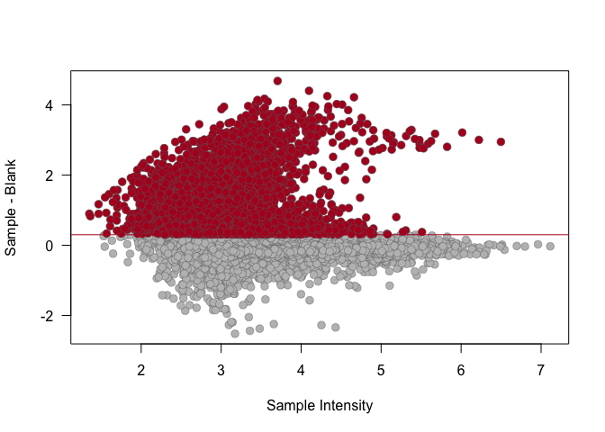

The Hitchhiker’s Guide to untargeted lipidomics analysis: Practical
guidelines
================
D. Smirnov, P. Mazin, M. Osetrova, E. Stekolshchikova, E. Khrameeva
8/18/2021

## Introduction

Here we present step-by-step guide to bioinformatic analysis of
untargeted LS-MS lipidomic data. This manual reproduces the key steps
described in the manuscript:

-   Data importing

-   Lipid signal quantification (peak peaking, peak alignment, peak
    grouping and abundance quantification)

-   Filtering and normalization

-   Visualization

## Package import

Loading the packages required for analysis

``` r
library(xcms)
library(ggplot2)
library(DT)
library(IPO)
library(mixOmics)
library(dplyr)
library(missForest)
library(reshape2)
library(gridExtra)
```

## Data import

We will demonstrate the key concepts of LC-MS untargeted lipidomic
analysis on the example of human fibroblasts dataset (ST001691 study
from <https://www.metabolomicsworkbench.org/>). Raw MS files from this
project converted into the .mzXML format can be downloaded into the
current directory using the following code:

``` r
#url <- "http://arcuda.skoltech.ru/~d.smirnov/sampledata.tar.gz"
#download.file(url, destfile = 'sampledata.tar.gz')
#untar('sampledata.tar.gz')
```

For convenience, raw MS files located in the `sampledata/` folder are
organized into two subfolders according to the treatment groups (two
files per group). The code below will create a table with sample
metadata

``` r
mzfiles <- list.files('sampledata/', recursive = TRUE, full.names = TRUE, pattern = '.mzXML')
group <- unlist(lapply(strsplit(mzfiles,"/"), function (x) x[[3]]))
pd <- data.frame(sample_name = sub(basename(mzfiles), pattern = ".mzXML", replacement = "", fixed = TRUE), 
                 sample_group = group, 
                 stringsAsFactors = FALSE)

knitr::kable(pd)
```

| sample\_name | sample\_group |
|:-------------|:--------------|
| Sphin1       | Sphin         |
| Sphin2       | Sphin         |
| Total1       | Total         |
| Total2       | Total         |

Now .mzXML files can be imported into `MSnExp` object via `readMSData`
function

``` r
raw_data <- readMSData(files = mzfiles, 
                       pdata = new("NAnnotatedDataFrame", pd), 
                       mode = "onDisk", 
                       msLevel = 1, 
                       verbose = T, 
                       centroided = T)
```

    ## Reading 584 spectra from file Sphin1.mzXML

    ## Reading 584 spectra from file Sphin2.mzXML

    ## Reading 584 spectra from file Total1.mzXML

    ## Reading 584 spectra from file Total2.mzXML

## Peak picking

Feature detection `CentWave` algorithm based on continuous wavelet
transformation allows to distinguish lipid peaks from background noise.
To perform peak calling we need to set up CentWave parameters first

``` r
cwp <- CentWaveParam(peakwidth = c(9.5, 36),
                     ppm = 11.5,
                     noise = 0, 
                     snthresh = 10, 
                     mzdiff = -0.001, 
                     prefilter = c(3, 100), 
                     mzCenterFun = "wMean", 
                     integrate = 1, 
                     fitgauss = FALSE)
```

It’s highly recommended to specify `peakwidth` (minimum and maximum MS
peak width in RT dimension) and `ppm`(width of region of interest in the
m/z dimension) parameters based on ion chromatograms for internal
standards.

Once the parameters are set one can proceed to chromatographic peak
detection using `findChromPeaks` function.

``` r
xset <- findChromPeaks(raw_data, param = cwp)
```

## Peak alignment

Peak alignment procedure aims to eliminate retention times shifts
between identified chromatographic peaks from samples. We will use
OBI-warp algorithm implemented within `xcms` package to match peaks
between MS runs.

``` r
arp <- ObiwarpParam(distFun = "cor_opt", 
                    binSize = 1, 
                    response = 1, 
                    gapInit = 0.32, 
                    gapExtend = 2.688, 
                    factorDiag = 2, 
                    factorGap = 1,
                    localAlignment = FALSE)

xset <- adjustRtime(xset, param = arp)
```

    ## Sample number 2 used as center sample.

    ## Applying retention time adjustment to the identified chromatographic peaks ... OK

`ObiwarpParam` function creates an object with parameters for the
alignment and `adjustRtime` performs the peak matching.

## Peak grouping

Once retention time correction is done one can proceed to the
correspondence analysis of aligned peaks. The general idea of peak
grouping is to identify peaks from the same ion across samples and group
them together to form a lipid feature. In order to do this analysis, we
will use Peak density method that accessible in `xcms` via
`groupChromPeaks` function. `PeakDensityParam` object contains grouping
settings and is used as input for `groupChromPeaks`.

``` r
pdp <- PeakDensityParam(sampleGroups = xset$sample_group, 
                        bw = 0.879999999999999, 
                        binSize = 0.02412, 
                        minFraction = 0.000001, 
                        minSamples = 1, 
                        maxFeatures = 50)

xset <- groupChromPeaks(xset, param = pdp)
```

    ## Processing 123943 mz slices ... OK

## Selection of parameters for peak picking, alignment, and grouping

For simplicity and saving time, in the code sections above we provided
parameters optimized for untargeted lipidome LC-MS measurements on a
Reversed-Phase Bridged Ethyl Hybrid (BEH) C8 column reverse coupled to a
Vanguard precolumn, using a Waters Acquity UPLC system and a heated
electrospray ionization source in combination with a Bruker Impact II
QTOF (quadrupole-Time-of-Flight) mass spectrometer. To customize the
parameters for a particular LS-MS experiment we recommend optimizing
them via `IPO` package.

Please note that optimizing peak calling parameters with
`optimizeXcmsSet` function is a quite computationally intensive
operation. It may take hours or even days (depending on the number of
samples) before the optimization process ends!

``` r
peakpickingParameters <- getDefaultXcmsSetStartingParams('centWave')
peakpickingParameters$min_peakwidth = c(0,10)
peakpickingParameters$max_peakwidth = c(10,30)
peakpickingParameters$ppm = c(0,10)
```

To perform the optimization just uncomment the code below. It will
return the R script with optimized processing parameters.

``` r
#resultPeakpicking <- optimizeXcmsSet(files = mzfiles, 
#                                     params = peakpickingParameters, 
#                                     nSlaves = 0, 
#                                     subdir = NULL)

#optimizedXcmsSetObject <- resultPeakpicking$best_settings$xset

#retcorGroupParameters <- getDefaultRetGroupStartingParams()
#resultRetcorGroup <- optimizeRetGroup(xset = optimizedXcmsSetObject, 
#                                      params = retcorGroupParameters,
#                                      nSlaves = 0,
#                                      subdir = NULL)

#writeRScript(resultPeakpicking$best_settings$parameters, 
#             resultRetcorGroup$best_settings, 1)
```

## Imputation of missing values

Unfortunately, peak peaking algorithm may produces a sufficient numbers
of NAs for those samples in which it wasn’t able to identify MS peaks.
We will try to impute missing chromatographic peaks within samples using
`fillChromPeaks` function.

``` r
xset <- fillChromPeaks(xset)
```

    ## Defining peak areas for filling-in .... OK
    ## Start integrating peak areas from original files

Please note that `fillChromPeaks` can not impute all the gaps in MS
data. The remaining missing values will be further removed/imputed in
the section “Filtering of peaks” below.

## Data export

Now we can extract feature matrix from `xset` object

``` r
pks <- chromPeaks(xset)
grs <- featureDefinitions(xset)
mtx <- featureValues(xset, method="maxint", value="into", filled=T) 

knitr::kable(head(mtx))
```

|        | Sphin1.mzXML | Sphin2.mzXML | Total1.mzXML | Total2.mzXML |
|:-------|-------------:|-------------:|-------------:|-------------:|
| FT0001 |   1256154.43 |    913245.81 |           NA |           NA |
| FT0002 |     58801.24 |     86856.81 |    861224.11 |     33162.95 |
| FT0003 |    410858.05 |    134526.55 |     35017.65 |           NA |
| FT0004 |   9202572.22 |  11043406.80 |  12731575.77 |   2247813.75 |
| FT0005 |     93077.08 |    166715.26 |           NA |           NA |
| FT0006 |    113533.52 |     59536.56 |           NA |           NA |

## Filtering of peaks

The code below removes all features that possess more than 30% of NA
across samples.

``` r
th <- 0.3
peaks.nas <- apply(mtx, 1, function (x) sum(is.na(x)))
mtx <- mtx[(peaks.nas/ncol(mtx)) < th, ]
```

To impute missing values not filled by `fillChromPeaks` and not removed
by filtering we will use an implementation of random forest algorithm
from `MissForest` package.

``` r
mtx.imp <- missForest(mtx)
```

    ##   missForest iteration 1 in progress...done!
    ##   missForest iteration 2 in progress...done!
    ##   missForest iteration 3 in progress...done!

``` r
mtx <- mtx.imp$ximp
```

## Annotation

Arguably, annotation is the most tricky part of untargeted LS-MS
analysis. Here we present

``` r
source("src/rt-mz.annotator.R")
```

``` r
grs <- as.data.frame(grs)
grs <- grs[rownames(mtx), ]
grs.short <- dplyr::select(grs, mzmed, rtmed)
grs.short$id <- paste(round(grs.short$mzmed, 3), round(grs.short$rtmed, 3), sep = '_')
grs.short <- grs.short[,c(3,1,2)]
colnames(grs.short) <- c('id', 'mz', 'rt')
knitr::kable(head(grs.short))
```

|        | id               |       mz |        rt |
|:-------|:-----------------|---------:|----------:|
| FT0002 | 200.128\_66.129  | 200.1278 |  66.12939 |
| FT0003 | 200.146\_181.864 | 200.1455 | 181.86352 |
| FT0004 | 200.165\_58.722  | 200.1646 |  58.72220 |
| FT0008 | 201.127\_48.033  | 201.1275 |  48.03308 |
| FT0011 | 201.149\_61.192  | 201.1486 |  61.19240 |
| FT0012 | 201.16\_108.1    | 201.1599 | 108.10000 |

``` r
ann <- annotateByMass(grs.short, db = LMDB)
```

``` r
knitr::kable(head(ann))
```

|       | id              |       mz |       rt | ion | LM\_ID            | EXACT\_MASS | FORMULA   | SYSTEMATIC\_NAME                                                 | ABBREV    |      ppm |     delta |     ppmd |
|:------|:----------------|---------:|---------:|:----|:------------------|------------:|:----------|:-----------------------------------------------------------------|:----------|---------:|----------:|---------:|
| 0     | 200.128\_66.129 | 200.1278 | 66.12939 | H   | FA0803\_C10H17NO3 |    199.1208 | C10H17NO3 | N-hexanoyl-homoserine lactone                                    | \-        | 1.293544 | 0.0002589 | 1.293544 |
| 01    | 200.128\_66.129 | 200.1278 | 66.12939 | NH4 | FA0103\_C10H14O3  |    182.0943 | C10H14O3  | 5-oxo-7-decynoic acid                                            | FA 10:3;O | 1.528393 | 0.0003059 | 1.528393 |
| 14206 | 200.128\_66.129 | 200.1278 | 66.12939 | NH4 | FA0106\_C10H14O3  |    182.0943 | C10H14O3  | 10-oxo-5,8-decadienoic acid                                      | FA 10:3;O | 1.528393 | 0.0003059 | 1.528393 |
| 21000 | 200.128\_66.129 | 200.1278 | 66.12939 | NH4 | FA0701\_C10H14O3  |    182.0943 | C10H14O3  | furan-2-ylmethyl 3-methylbutanoate//furan-2-ylmethyl pentanoate  | WE 10:3;O | 1.528393 | 0.0003059 | 1.528393 |
| 31000 | 200.128\_66.129 | 200.1278 | 66.12939 | NH4 | FA0704\_C10H14O3  |    182.0943 | C10H14O3  | 4R-hydroxy-2Z,5E-decadien-9R-olide                               | FA 10:3;O | 1.528393 | 0.0003059 | 1.528393 |
| 41000 | 200.128\_66.129 | 200.1278 | 66.12939 | NH4 | PR0102\_C10H14O3  |    182.0943 | C10H14O3  | -//(1R,5R)-1,8,8-trimethyl-2-oxabicyclo\[3.2.1\]octane-3,6-dione | \-        | 1.528393 | 0.0003059 | 1.528393 |

``` r
grs.annotated <- filter(grs.short, id %in% unique(ann$id))
mtx <- mtx[rownames(grs.annotated),]
```

## Normalization

We will use median normalization method to make samples comparable to
each other

``` r
mtx.normalized <- apply(mtx, 2, function(x) x/median(x))
```

``` r
mtx.normalized <- log10(mtx.normalized+1)
```

``` r
NormalizationPlot <- function(data, title){
    fill <- "#4271AE"
    line <- "#1F3552"
    data <- melt(data)
    colnames(data) <- c("Variable", "Samples", "Abundance")
    font.size <- 8
    ggplot(data,aes(x = Abundance, y = Samples)) + 
        geom_boxplot(fill = fill, colour = line, alpha = 0.7) + coord_flip() +
        ggtitle(title) + theme_light(base_size = 12) + ylab(NULL)
}
```

``` r
options(repr.plot.width=15, repr.plot.height=7)
p1 <- NormalizationPlot(log10(mtx), title = 'Before normalization')
p2 <- NormalizationPlot(mtx.normalized, title = 'After normalization')
grid.arrange(p1, p2, nrow = 1)
```

    ## Warning: Removed 254 rows containing non-finite values (stat_boxplot).

<!-- -->

## Downstream analysis

### Principal Component Analysis (PCA)

PCA projects original matrix of lipid abundances into low dimensional
space. For a given matrix
,
where samples are rows and samples are columns, principal component
vectors can be defined by finding eigenvectors of the following sample
covariance matrix :


where

is a centering matrix,
 represents an
identity matrix of size
.

To calculate principal components we will use base R function `prcomp`

``` r
pca <- prcomp(t(mtx.normalized), center = TRUE, scale. = TRUE)
```

To visualize relationships between samples in a new low dimensional
space we will plot PC1 and PC2 against each other.

``` r
Y <- pd$sample_group 
pca.data <- data.frame(PC1 = pca$x[, 1], PC2 = pca$x[, 2], class = Y)
ggplot(data = pca.data, aes_string(x = "PC1", y = "PC2", color = "class", shape = "class")) + 
    geom_point(size = 4) +
    theme_light()
```

<!-- -->

### Partial Least-Squares Discriminant Analysis (PLS-DA)

Mathematically, PLS-DA principal components can be obtained in a similar
to PCA manner, as eigenvectors of a matrix of covariances between
 and
:


where  and
 represent a centering
matrix and a total number of samples, respectively.

``` r
X <- t(na.omit(mtx))
Y <- as.factor(Y)
plsda.model <- plsda(X, Y, ncomp = 2)
```

    ## Warning in internal_wrapper.mint(X = X, Y = Y.mat, ncomp = ncomp, scale = scale, : At least one study has less than 5 samples, mean centering might
    ##     not do as expected

``` r
plotIndiv(plsda.model, ind.names = FALSE, legend=TRUE, ellipse = TRUE)
```

    ## Warning: It is deprecated to specify `guide = FALSE` to remove a guide. Please
    ## use `guide = "none"` instead.

<!-- -->

``` r
plsda.contributions <- selectVar(plsda.model, comp = 1)$value
```

## Software used

``` r
sessionInfo()
```

    ## R version 4.0.3 (2020-10-10)
    ## Platform: x86_64-apple-darwin17.0 (64-bit)
    ## Running under: macOS Catalina 10.15.7
    ## 
    ## Matrix products: default
    ## BLAS:   /Library/Frameworks/R.framework/Versions/4.0/Resources/lib/libRblas.dylib
    ## LAPACK: /Library/Frameworks/R.framework/Versions/4.0/Resources/lib/libRlapack.dylib
    ## 
    ## locale:
    ## [1] ru_RU.UTF-8/ru_RU.UTF-8/ru_RU.UTF-8/C/ru_RU.UTF-8/ru_RU.UTF-8
    ## 
    ## attached base packages:
    ## [1] stats4    parallel  stats     graphics  grDevices utils     datasets 
    ## [8] methods   base     
    ## 
    ## other attached packages:
    ##  [1] gridExtra_2.3       reshape2_1.4.4      missForest_1.4     
    ##  [4] itertools_0.1-3     iterators_1.0.13    foreach_1.5.1      
    ##  [7] randomForest_4.6-14 dplyr_1.0.7         mixOmics_6.14.1    
    ## [10] lattice_0.20-44     MASS_7.3-54         IPO_1.16.0         
    ## [13] CAMERA_1.46.0       rsm_2.10.2          DT_0.18            
    ## [16] ggplot2_3.3.5       xcms_3.12.0         MSnbase_2.16.1     
    ## [19] ProtGenerics_1.22.0 S4Vectors_0.28.1    mzR_2.24.1         
    ## [22] Rcpp_1.0.7          BiocParallel_1.24.1 Biobase_2.50.0     
    ## [25] BiocGenerics_0.36.1
    ## 
    ## loaded via a namespace (and not attached):
    ##  [1] colorspace_2.0-2            ellipsis_0.3.2             
    ##  [3] htmlTable_2.2.1             corpcor_1.6.9              
    ##  [5] XVector_0.30.0              GenomicRanges_1.42.0       
    ##  [7] base64enc_0.1-3             rstudioapi_0.13            
    ##  [9] farver_2.1.0                affyio_1.60.0              
    ## [11] ggrepel_0.9.1               RSpectra_0.16-0            
    ## [13] fansi_0.5.0                 codetools_0.2-18           
    ## [15] splines_4.0.3               ncdf4_1.17                 
    ## [17] doParallel_1.0.16           impute_1.64.0              
    ## [19] robustbase_0.93-8           knitr_1.33                 
    ## [21] Formula_1.2-4               cluster_2.1.2              
    ## [23] vsn_3.58.0                  png_0.1-7                  
    ## [25] graph_1.68.0                BiocManager_1.30.16        
    ## [27] compiler_4.0.3              backports_1.2.1            
    ## [29] assertthat_0.2.1            Matrix_1.3-4               
    ## [31] limma_3.46.0                htmltools_0.5.1.1          
    ## [33] tools_4.0.3                 igraph_1.2.6               
    ## [35] gtable_0.3.0                glue_1.4.2                 
    ## [37] GenomeInfoDbData_1.2.4      affy_1.68.0                
    ## [39] RANN_2.6.1                  MALDIquant_1.20            
    ## [41] vctrs_0.3.8                 preprocessCore_1.52.1      
    ## [43] xfun_0.25                   stringr_1.4.0              
    ## [45] lifecycle_1.0.0             XML_3.99-0.7               
    ## [47] DEoptimR_1.0-9              zlibbioc_1.36.0            
    ## [49] scales_1.1.1                pcaMethods_1.82.0          
    ## [51] MatrixGenerics_1.2.1        SummarizedExperiment_1.20.0
    ## [53] RBGL_1.66.0                 MassSpecWavelet_1.56.0     
    ## [55] RColorBrewer_1.1-2          yaml_2.2.1                 
    ## [57] rpart_4.1-15                latticeExtra_0.6-29        
    ## [59] stringi_1.7.3               highr_0.9                  
    ## [61] checkmate_2.0.0             GenomeInfoDb_1.26.7        
    ## [63] rlang_0.4.11                pkgconfig_2.0.3            
    ## [65] matrixStats_0.60.1          bitops_1.0-7               
    ## [67] mzID_1.28.0                 evaluate_0.14              
    ## [69] purrr_0.3.4                 labeling_0.4.2             
    ## [71] htmlwidgets_1.5.3           tidyselect_1.1.1           
    ## [73] plyr_1.8.6                  magrittr_2.0.1             
    ## [75] R6_2.5.1                    IRanges_2.24.1             
    ## [77] generics_0.1.0              Hmisc_4.5-0                
    ## [79] DelayedArray_0.16.3         DBI_1.1.1                  
    ## [81] pillar_1.6.2                foreign_0.8-81             
    ## [83] withr_2.4.2                 MsCoreUtils_1.2.0          
    ## [85] survival_3.2-13             RCurl_1.98-1.4             
    ## [87] nnet_7.3-16                 tibble_3.1.3               
    ## [89] crayon_1.4.1                rARPACK_0.11-0             
    ## [91] utf8_1.2.2                  ellipse_0.4.2              
    ## [93] rmarkdown_2.10              jpeg_0.1-9                 
    ## [95] grid_4.0.3                  data.table_1.14.0          
    ## [97] digest_0.6.27               tidyr_1.1.3                
    ## [99] munsell_0.5.0
